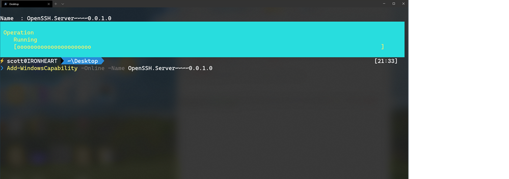

# How to SSH into a Windows 10 Machine from Linux OR Windows OR anywhere

I've been shushing all over the place lately. I [SSH into Linux from Windows using the built-in OpenSSH Client that Windows 10 has shipped for years](https://www.hanselman.com/blog/HowToUseWindows10sBuiltinOpenSSHToAutomaticallySSHIntoARemoteLinuxMachine.aspx) that you didn't know about. ;) You don't need Putty to SSH with Windows (unless it makes you happy, then putty on, my friend.)

### Adding OpenSSH Server to Windows

From an Administrative PowerShell I'll see what OpenSSH stuff I have enabled. I can also do this with by typing "Windows Features" from the Start Menu.

```
> Get-WindowsCapability -Online | ? Name -like 'OpenSSH*'  
  
Name  : OpenSSH.Client~~~~0.0.1.0  
State : Installed  
  
Name  : OpenSSH.Server~~~~0.0.1.0  
State : NotPresent
```

Looks like I have the OpenSSH client stuff but not the server. I can SSH from Windows, but not to.

I'll add it with a similar command with the super weirdo but apparently necessary version thing at the end:

```
Add-WindowsCapability -Online -Name OpenSSH.Server~~~~0.0.1.0
```

[](https://www.hanselman.com/blog/HowToMakeAPrettyPromptInWindowsTerminalWithPowerlineNerdFontsCascadiaCodeWSLAndOhmyposh.aspx)

### Starting SSHD on Windows as a Service

Once this has finished (and you can of course run this with OpenSSH.Client as well to get both sides if you hadn't) then you can start the SSH server (as a Windows Service) with this, then make sure it's running.

```
Start-Service sshd  
Get-Service sshd
```

Since it's a Windows Service you can see it as "OpenSSH SSH Server" in services.msc as well as set it to start automatically on Startup if you like. You can do that again, from PowerShell if you prefer

```
Set-Service -Name sshd -StartupType 'Automatic'
```

Remember that we SSH over port 22 so you'll have a firewall rule incoming on 22 at this point. It's up to you to be conscious of security. Maybe you only allow SSHing into your Windows machine with public keys (no passwords) or maybe you don't mind. Just be aware, it's on you, not me.

Now, from any Linux (or Windows) machine I can SSH into my Windows machine like a pro! Note I'm using the .local domain suffix to make sure I don't get a machine on my VPN (staying in my local subnet)

```
$ ssh scott@ironheart.local  
Microsoft Windows [Version 10.0.19041.113]  
(c) 2020 Microsoft Corporation. All rights reserved.  
  
scott@IRONHEART C:\Users\scott>pwsh  
PowerShell 7.0.0  
Copyright (c) Microsoft Corporation. All rights reserved.  
  
https://aka.ms/powershell  
Type 'help' to get help.  
  
Loading personal and system profiles took 1385ms.  
⚡ scott@IRONHEART>
```

Note that when I SSH'ed into Windows I got the default cmd.exe shell. Remember also that there's a [difference between a console, a terminal, and a shell!](https://www.hanselman.com/blog/WhatsTheDifferenceBetweenAConsoleATerminalAndAShell.aspx) I can ssh with any terminal into any machine and end up at any shell. In this case, the DEFAULT was cmd.exe, which is suboptimal.

### Configuring the default shell for OpenSSH in Windows

On my server (the Windows machine I'm SSHing into) I will set a registry key to [set the default shell](https://docs.microsoft.com/en-us/windows-server/administration/openssh/openssh_server_configuration?WT.mc_id=-blog-scottha). In this case, I'll use open source cross platform PowerShell Core. You can use whatever makes you happy.

```
New-ItemProperty -Path "HKLM:\SOFTWARE\OpenSSH" -Name DefaultShell -Value "C:\Program Files\PowerShell\7\pwsh.exe" -PropertyType String -Force
```

Now when I ssh into my Windows machine from elsewhere (even my iPad!) I get the shell I want:

```
$ ssh scott@ironheart.local  
PowerShell 7.0.0  
Copyright (c) Microsoft Corporation. All rights reserved.  
  
https://aka.ms/powershell  
Type 'help' to get help.  
  
Loading personal and system profiles took 1854ms.  
⚡ scott@IRONHEART>
```

Even better if I wanted to [add a menu item (profile) to my Windows Terminal with an entry](https://www.hanselman.com/blog/HowToUseWindows10sBuiltinOpenSSHToAutomaticallySSHIntoARemoteLinuxMachine.aspx) for my Windows Machine that would automatically log me into it from elsewhere using public keys, I could do that also!

Additionally, now that this is set up I can use WinSCP (available on the Window Store) as well as scp (Secure Copy) to transfer files.

Of course you can also use [WinRM or PowerShell Remoting over SSH](https://docs.microsoft.com/en-us/powershell/scripting/learn/remoting/ssh-remoting-in-powershell-core?view=powershell-7&WT.mc_id=-blog-scottha) but for my little internal network I've found this mechanism to be simple and clean. Now my shushing around is non-denominational!

---

**Sponsor:** Have you tried [developing in Rider](https://hnsl.mn/2vMQqdX) yet? This fast and feature-rich cross-platform IDE improves your code for .NET, ASP.NET, .NET Core, Xamarin, and Unity applications on Windows, Mac, and Linux.

#### About Scott

Scott Hanselman is a former professor, former Chief Architect in finance, now speaker, consultant, father, diabetic, and Microsoft employee. He is a failed stand-up comic, a cornrower, and a book author.

[About](http://hanselman.com/about)   [Newsletter](http://www.hanselman.com/newsletter)
