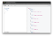
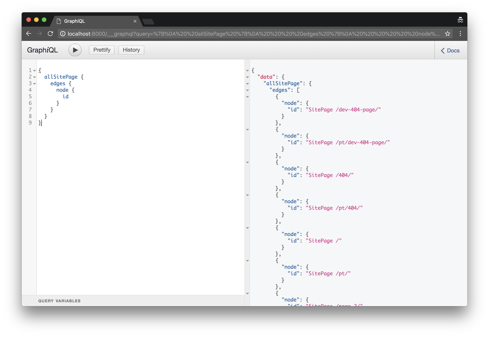

# i18n with Gatsby

Taking advantage of Gatsby nodes to add internationalisation to a Gatsby project.


Nowadays, the world is our audience. When building a global product for multiple markets, Internationalisation is essential and must be catered from the get-go. English might be a safe bet for most, but there’s undeniable power in serving people content in their native language.

Coming from a Middleman background we honestly were a bit puzzled on how scattered i18n support with Gatsby was: There are some issues at Github, [a plugin](https://github.com/angeloocana/gatsby-plugin-i18n) that [requires us to duplicate code](https://github.com/angeloocana/gatsby-plugin-i18n/issues/12) and a [semi-official blog post](https://www.gatsbyjs.org/blog/2017-10-17-building-i18n-with-gatsby/) with an approach that **doesn’t statically render the strings into the html**, which IMHO defeats the purpose of using a Static Site Generator. When you build, you’ll just get empty strings that get populated when the JS kicks in. Overall, adding i18n just wasn’t as smooth as it should be.

This quick article gives an alternate approach to i18n with Gatsby for those of us who need all the content to be statically rendered. It also provides two examples on how to use it: one with no external dependencies (except for gatsby source and transformer plugins) and one with [React-Intl](https://github.com/yahoo/react-intl).

---

# Creating pages for each locale

There’s one fundamental step to achieve static rendering: **duplicating each page for each locale.**

*In this example, we’ll assume that the default language doesn’t require language in the path (i.e. If we have English (default) and Portuguese, we’ll need* `/about` *and* `/pt/about`*).*

It’s always a good idea to centralize the locales definition, so create a locales file somewhere:

Then, in `gatsby-node.js` let’s create a page for each locale:

This example is using Gatsby’s V2. If you’re using v1 just use ‘boundActionCreators’ instead of ‘actions’

For each page, we’re basically just deleting it (so we can take over) and creating it again for each language **passing the locale to the page context**.

Now, if you go to `http://localhost:8000/___graphql` and query the site’s pages you’ll see a duplicate for each locale:





Honestly, that’s pretty much it. Now you can use the `pageContext` ‘s `locale` in any way you like. 🎉

---

# Example A — with [React-Intl](https://github.com/yahoo/react-intl)

React-Intl is a very powerful i18n package with cool helpers for date relatives, currencies and whatnot. It’s my go-to package for internationalisation so this example will make use of it.

Each page will receive the `pageContext` object. The main idea is to get the locale from that object and pass it to a `Layout` component that takes care of creating and feeding the Provider.

First, create some string files. In my case they’ll be `src/i18n/en.json`

```
{  
  "hello": "Hello world"  
}
```

and `src/i18n/pt.json`

```
{  
  "hello": "Olá mundo"  
}
```

Finally, the `Layout` Component:

All that’s left is to simply use it in the pages:

## What about links?

Sure, if we use Gatsby’s `Link` as-is, we’ll have some trouble navigating between pages. As the URL is our source-of-truth for the locale, if we simply link some page to `/about` we’ll always be directed to the English about.

We need to make a wrapper around `Link`, so we can still use `<Link to="/about">` as usual, without worrying about the current locale.

Luckily, React-Intl has a very convenient `injectIntl` HOC that provides us with the `intl` object (that, unsurprisingly, contains a `locale` key).

---

# Example B— with no external dependencies

Sometimes you don’t need React-Intl’s power (or don’t want to add yet another dependency bloating the project).

The bare and simplest way to load some strings would be something like

```
import React from 'react'import enMessages from '../data/index/en.json'  
import ptMessages from '../data/index/pt.json'const messages = {  
  en: enMessages,  
  pt: ptMessages  
}const IndexPage = ({ pathContext: { locale } }) => (  
  <div>  
    <h1>{messages[locale].hello}</h1>  
  </div>  
)export default IndexPage
```

But in this example we’ll use Gatsby’s data layer to query the content with *graphql*.

> Unfortunately, and even though I’m using Gatsby V2 in these examples, it appears that the new StaticQuery component [doesn’t support query variables](https://github.com/gatsbyjs/gatsby/blob/master/docs/docs/static-query.md#how-it-differs-from-page-query), so there’s a big drawback with this approach: **You’ll have to query everything in the pages and pass it down to components**.

Let’s assume we have a folder at `src/data`. There, we’ll organize the content per folder with JSON files inside (e.g. `src/data/index/en.json`).

First thing we need to do is to add two gatsby dependencies:

```
yarn add gatsby-source-filesystem gatsby-transformer-json
```

and add them to your plugin configuration in `gatsby-config.js`

```
plugins: [  
  // your plugins  
  'gatsby-transformer-json',  
  {  
    resolve: `gatsby-source-filesystem`,  
    options: {  
      name: `data`,  
      path: `${__dirname}/src/data/`  
    }  
  }  
]
```

Page’s context data is also available as query variables, so just use that to filter graphql’s results on the page query:

Now that we’re using Gatsby’s data layer, we can even take advantage of its powerful transformation features. We can, for instance, load different images per-language and still be able to use [gatsby-image](https://www.npmjs.com/package/gatsby-image):

You can also create a Layout component that accepts the locale (same as above) but then creates a React Context and exports its Consumer. Implementing a `LocalizedLink` with that would be trivial. Take a look at the repo in the end of the article for an example.

# Conclusion

Even though Gatsby doesn’t support i18n out-of-the-box, its powerful lifecycle APIs make it really easy to implement it (in less than 5 minutes).

All the examples here were quickly built for the purpose of the article and should be adapted to your project’s reality. Understanding Gatsby’s nodes and the process of duplicating pages for each locale is, after all, the fundamental of this approach.

---

Take a look at the repo with examples built using both approaches:  
<https://github.com/pbrandone/gatsby-i18n>
