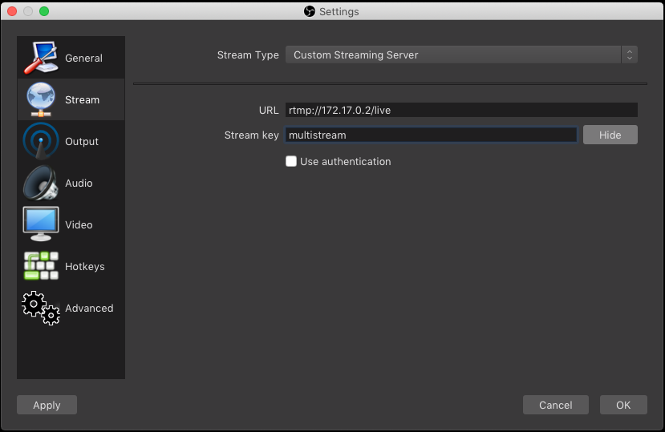
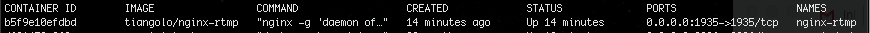
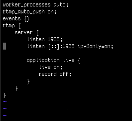

# Stream to multiple destinations with OBS

Published by [Saravana B](https://iamsaravana.com/author/saravana/) on November 1, 2018



OBS or Open Broadcaster Software is an open source software for video streaming & recording. OBS has many incredible features that any free software could possibly have, and supports all major streaming services such as Twitch, Mixer, DailyMotion, FaceBook and Youtube.

The only limitation with OBS is that it allows streaming only to one single service. You could either stream to Facebook or YouTube or DailyMotion, but not to more than one service simultaneously.

Doing some minor research over the internet, I found that this limitation could be resolved by setting up a personal RTMP server using nginx which could receive the stream from OBS and route the stream to multiple sources. The detailed guide is available on their [official forum](https://obsproject.com/forum/resources/how-to-set-up-your-own-private-rtmp-server-using-nginx.50/)

I myself tried this solution, and YES it works! I managed to stream a live video to Facebook and YouTube at the same time via OBS by setting the stream settings in OBS to my local RTMP server.

But this requires you to have an RTMP server setup and running on your local machine / a server. The solution I’m discussing here is “How to run the local nginx server in docker” and achieve the same. For this you need to install “nginx-rtmp” from [tiangolo](https://github.com/tiangolo/nginx-rtmp-docker) instead of “nginx” which has additional modules required for RTMP streaming support. I’m just compiling the solutions from [tiangolo](https://github.com/tiangolo/nginx-rtmp-docker) and the [OBS official forum](https://obsproject.com/forum/resources/how-to-set-up-your-own-private-rtmp-server-using-nginx.50/) and providing a simple step-by-step guide.

1. Pull the docker image

   ```
   docker pull tiangolo/nginx-rtmp
   ```
2. Run a container with this image

   ```
   docker run -d -p 1935:1935 --name nginx-rtmp tiangolo/nginx-rtmp
   ```
3. Setup OBS to stream to your custom RTMP server
   - Open OBS (Open Broadcaster Software) and go to the Stream Settings (Settings > Stream)
   - Select “Custom Streaming Server” for Stream Type
   - Enter the URL rtmp://<host\_ip>/live and replace the <host\_ip> with the IP Address of the container in which your container is running
     > Note: Use the following command from the ‘host’, to find the IP address of your docker container:

     ```
     docker inspect -f '{{range .NetworkSettings.Networks}}{{.IPAddress}}{{end}}' container_name_or_id
     ```
   - Enter the stream key (that can be anything) which you will use for client URL to connect to the specific stream
   - Refer the screenshot below.  
     I’m using URL: rtmp://172.17.0.2/live and Stream key: multistream

     
4. Streaming to multiple servicesYou can use “Network Stream” in VLC Player to stream the output from OBS or you can route the stream to external streaming services such as FaceBook, YouTube, Twitch, DailyMotion, etc…Setting up multiple routes to external streaming services require nginx configurations to be setup.  
   Follow these steps to update your nginx configuration:
   - Verify docker image name before you enter into the bash

     ```
     docker ps -a
     ```

     and you will see something like this:  
     
   - Login to the docker shell

     ```
     docker exec -it nginx-rtmp "bash"
     ```
   - You may need to install vim before you can edit any config file. Execute the following commands to install vim

     ```
     apt-get update

     apt-get install vim
     ```
   - Open the nginx.conf for editing

     ```
     vi /etc/nginx/nginx.conf
     ```

     The default nginx.conf would look something like this:

     
   - Use RTMP server settings to forward the stream to other services and channels. Add the following underneath the “record off;” line in the nginx.conf file

     ```
     push rtmp://<stream_service_url>/<stream_key>
     ```

     Update the “stream\_service\_url” and “stream\_key” accordingly.  
     Save and Exit.
   - Restart nginx service
