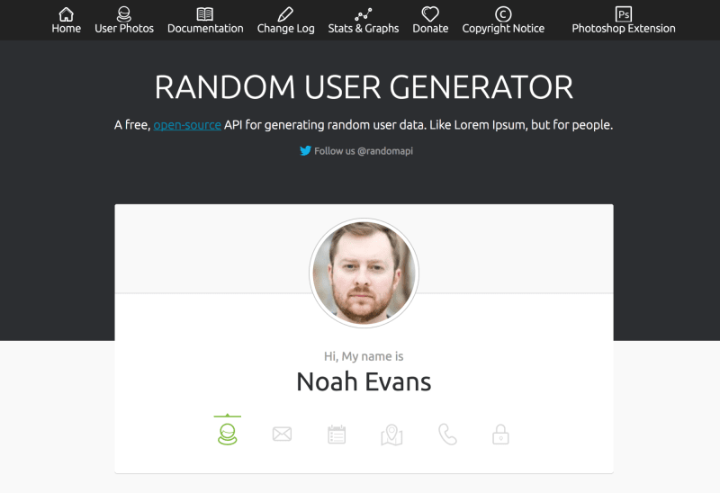
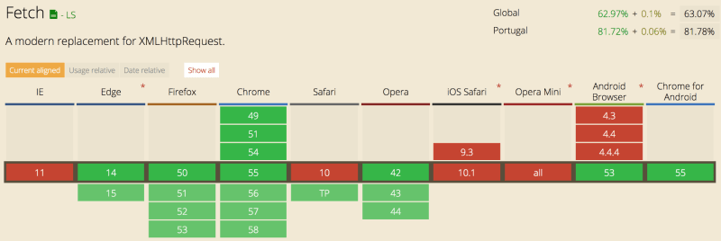

# How to Use the JavaScript Fetch API to Get Data

January 23, 2017
[53 Comments](https://scotch.io/tutorials/how-to-use-the-javascript-fetch-api-to-get-data#comments "Comments on this Article")

934,874 Views

Bookmark

We all remember the dreaded XMLHttpRequest we used back in the day to make requests, it involved some really messy code, it didn't give us promises and let's just be honest, it wasn't pretty JavaScript, right? Maybe if you were using jQuery, you used the cleaner syntax with `jQuery.ajax()`.

Well JavaScript has it's own built-in clean way now. Along comes the Fetch API a new standard to make server request jam-packed with promises and all those things we learned to love over the years.

## [How do we use the Fetch API?](https://scotch.io/tutorials/how-to-use-the-javascript-fetch-api-to-get-data#toc-how-do-we-use-the-fetch-api-)

In a very simple manner all you really do is call fetch with the URL you want, by default the Fetch API uses the GET method, so a very simple call would be like this:

```
fetch(url) // Call the fetch function passing the url of the API as a parameter
.then(function() {
    // Your code for handling the data you get from the API
})
.catch(function() {
    // This is where you run code if the server returns any errors
});
```

Looks pretty simple right? So let's starting using it...

# Using fetch to get data from an API

We are now going to build a simple GET request, in this case, I will use the [Random User API](https://randomuser.me/) and we will get 10 users and show them on the page using vanilla JavaScript.



Let's get started with the HTML, all we really need is a heading and an unordered list:

```
  <h1>Authors</h1>
  <ul id="authors"></ul>
```

The idea is to get all the data from the Random User API and display it in list items inside the author's list.

The first step is to actually set the URL we need and also the list we are gonna put the data in, so in the Javascript we write:

```
  const ul = document.getElementById('authors'); // Get the list where we will place our authors
  const url = 'https://randomuser.me/api/?results=10'; // Get 10 random users
```

I have set these to consts so you don't risk changing these in the future and these two are meant to be constants through all the project.
Now we get into actual Fetch API:

```
fetch(url)
  .then(function(data) {
    // Here you get the data to modify as you please
    })
  })
  .catch(function(error) {
    // If there is any error you will catch them here
  });
```

Let's review this code, shall we?
So first we are calling the Fetch API and passing it the URL we defined as a constant above and since no more parameters are set this is a simple GET request.
Then we get a response but the response we get is not JSON but an object with a series of methods we can use depending on what we want to do with the information, these methods include:

- **clone()** - As the method implies this method creates a clone of the response.
- **redirect()** - This method creates a new response but with a different URL.
- **arrayBuffer()** - In here we return a promise that resolves with an ArrayBuffer.
- **formData()** - Also returns a promise but one that resolves with FormData object.
- **blob()** - This is one resolves with a Blob.
- **text()** - In this case it resolves with a string.
- **json()** - Lastly we have the method to that resolves the promise with JSON.

Looking at all these methods the one we want is the JSON one because we want to handle our data as a JSON object so we add:

```
  fetch(url)
  .then((resp) => resp.json()) // Transform the data into json
  .then(function(data) {
    // Create and append the li's to the ul
    })
  })
```

Now let's get to the part we create the list items, for that, I created two helper functions at the top of my file just to make the code simpler down the line:

```
  function createNode(element) {
    return document.createElement(element); // Create the type of element you pass in the parameters
  }

  function append(parent, el) {
    return parent.appendChild(el); // Append the second parameter(element) to the first one
  }
```

All these functions do is append and create elements as you can see.
Once this is done we can move on to the resolution of our promise and add the code we need to append these list items to our unordered list:

```
then(function(data) {
    let authors = data.results; // Get the results
    return authors.map(function(author) { // Map through the results and for each run the code below
      let li = createNode('li'), //  Create the elements we need
          img = createNode('img'),
          span = createNode('span');
      img.src = author.picture.medium;  // Add the source of the image to be the src of the img element
      span.innerHTML = `${author.name.first}${author.name.last}`; // Make the HTML of our span to be the first and last name of our author
      append(li, img); // Append all our elements
      append(li, span);
      append(ul, li);
    })
  })
```

So first we define authors as the response we get from the request then we map over all the authors and for each we create a list item, a span, and an image.
In the image source, we place the picture of the user, the HTML of the span will be the first and last name interpolated and then all we need to do is append this to their rightful parents and voilá, our HTTP request in vanilla JavaScript is done and returning something to the HTML.


To handle our catch all I will do is console log the error as we get it but you can do whatever you want with the error such as append it to the HTML with the functions we created. This is the full code of our little request:

```
  function createNode(element) {
      return document.createElement(element);
  }

  function append(parent, el) {
    return parent.appendChild(el);
  }

  const ul = document.getElementById('authors');
  const url = 'https://randomuser.me/api/?results=10';
  fetch(url)
  .then((resp) => resp.json())
  .then(function(data) {
    let authors = data.results;
    return authors.map(function(author) {
      let li = createNode('li'),
          img = createNode('img'),
          span = createNode('span');
      img.src = author.picture.medium;
      span.innerHTML = `${author.name.first}${author.name.last}`;
      append(li, img);
      append(li, span);
      append(ul, li);
    })
  })
  .catch(function(error) {
    console.log(error);
  });
```

## [Handling more requests like POST](https://scotch.io/tutorials/how-to-use-the-javascript-fetch-api-to-get-data#toc-handling-more-requests-like-post)

So this is a GET request, the default one for the fetch function but of course we can do all other types of requests and also change the headers and off course send data, all we need for this is to set our object and pass it as the second argument of the fetch function:

```
const url = 'https://randomuser.me/api';
// The data we are going to send in our request
let data = {
    name: 'Sara'
}
// The parameters we are gonna pass to the fetch function
let fetchData = { 
    method: 'POST', 
    body: data,
    headers: new Headers()
}
fetch(url, fetchData)
.then(function() {
    // Handle response you get from the server
});
```

You can also define cache, mode and all those things you are used to defining in your POST requests.

To create our object and use the fetch function we also have another option and that is to use the request constructor to create our request object, so instead of defining the object in the function itself we do this:

```
const url = 'https://randomuser.me/api';
// The data we are going to send in our request
let data = {
    name: 'Sara'
}
// Create our request constructor with all the parameters we need
var request = new Request(url, {
    method: 'POST', 
    body: data, 
    headers: new Headers()
});

fetch(request)
.then(function() {
    // Handle response we get from the API
})
```

You can use the way you are most comfortable with to build your request object.

# Final Thoughts



While the Fetch API is not yet supported by all the browsers (currently Safari does not support it) it is the beautiful replacement for XMLHttpRequest we desperately needed in our life.
There are also polyfills if you really want to use it in more professional projects.

Like this article?
[Follow @NikkitaFTW on Twitter](https://twitter.com/NikkitaFTW "Follow @NikkitaFTW on Twitter")
