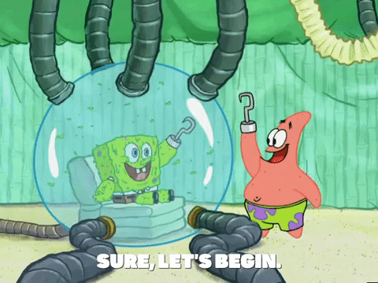

# Bad habits we get when coding and how to break them

Jul 10
・10 min read

Hi friends!

This post's idea was sparked with the discussion that Ben posted last month.

In this post, I'll tell you about some of the most common ones I've seen (and had) and some of the things we can do to replace them for other better and healthier ones.

This is by no means an exhaustive list of coding-related bad habits and since we'll be talking about that topic, I'll be making references from a book I finished last month. *Atomic Habits* by James Clear.

With that being said, are you ready?

[](https://i.giphy.com/media/l4FAYK1APRxBgz8bK/giphy.gif)

## The Habits

*So, what are some of those bad habits?*

- **Too much time spent sitting on our butts for a bunch of different activities** (working on the pc, browsing social media, watching videos, driving somewhere, eating breakfast/lunch/dinner, watching TV or Netflix, having a conversation on the couch, etc...)
- **Having a disorganized relationship with food** (i.e. sometimes eating well, sometimes eating too much or too little, sometimes forgetting to eat because we're too "busy" and when we reach for some snack is just artificial processed food that doesn't do good for our body on our brains.)
- **Lacking a defined work structure that works for ourselves** (leading to overspending time on the pc doing work-related activities, not taking breaks or time for hobbies, being with family/friends, getting burned out more often, "all work and no play makes Jack a dull boy")
- **Not having proper eye protection & not taking eye breaks regularly** (a perfect example of this is being coding from 5:30 pm onwards when the sun sets, the room turns dark and due to laziness we don't stand up to turn the lights on and remained sitting, looking at the pc with really poor lighting for more time until our eyes start getting pretty dry and we feel tired.)
- **Having a disorganized work environment** (this one is sneaky because it doesn't look like much at first until we have packets of food lying around, mounts of used papers, pens, markers, and stationery items scattered around the desk, dusty things stored away and such.   
  Bonus dirty points if the place we work in is *actually* our room and we have used clothes, shoes and stuff lying over the unmade bed)
- **Having a disregard for exercise, stretching or something similar** (this one is because we're not used to it or because it "takes too much time", "I don't have time to go to a gym", "I don't have weights or bands in my home", "I have too much work to do" and so on.)
- **When we're sitting doing work, having a bad or terrible posture in general** (which initially is okay but held for prolonged periods of time, *really* wreaks havoc in our overall health.)
- **Taking on too much work or saying 'yes' to too many things** (this one is probably the cause of many others I already described above)

These are, again just *some*, of the most common we develop in our lovely coding career and that we become more aware as time passes (and hopefully not because we already started to see the bad results they cause.)

## Quick story about how I got all of those

So for me, I started being glued to a screen even before I decided I wanted to do programming. Most of these were things that transferred over from my gaming days playing pc games and console emulators.

It certainly depends on the type of videogames that one usually plays. In my case, I preferred RPG's and RTS's over everything else, and these are not the most conducive to healthy habits.

So what started as one quest or one campaign could turn into hours upon hours of gameplay because "*I'm so close to finishing, I can't just stop playing right now*".

I remember very vividly once that I was trying for the first time the game Warhammer 40,000: Dawn of War II.

[](https://res.cloudinary.com/practicaldev/image/fetch/s--JPVWos26--/c_limit%2Cf_auto%2Cfl_progressive%2Cq_auto%2Cw_880/https://vignette.wikia.nocookie.net/es.warhammer40k/images/8/85/Warhammer-032-40-000-032-032-Dawn-032-of-032-War-032-II-1920x1080.jpg/revision/latest/scale-to-width-down/350%3Fcb%3D20110530212615)

It was a weekend, a Saturday. I woke up and ate a banana that my mom had left for me before going to work.

It was around 8:30 am that I sat down on the pc, excited, like a kid with a new toy because I had downloaded the game from Steam the day before (it was actually a demo).

What started as the intro then became the main quest and then the second and then a custom map and so on. And after being immersed in all of that, I casually glanced at the wall clock to see the hour, it was 5:30 pm. My mom would usually arrive 20 mins later.

In shock, I saved my progress, stood out of the chair, and went on to take off my pajamas and put on normal clothes.

I remember thinking "where did the whole day go? I just started a campaign and haven't done anything else today "

That whole modus operandi for doing things on the pc, whether video games or actual work, became pretty standard when I got into college and I had to do all the programming assignments and then the graded term projects.

So, in those cases...

- Too much time sitting on my butt? check ✅
- Having disparate times to eat? (or not even eating sometimes) check ✅
- Not having a work structure for homework and others? check ✅
- Not taking eye breaks regularly and being glued for hours? check ✅
- The disorganized environment? (wasn't the worst but still) check ✅
- Complete disregard for exercise? ("I'm a nerd I don't need it" ‍♂️) check ✅
- Being the king of slouching? check ✅

I'll probably stop counting here before I start getting *real* sad.

It also didn't help that when I was hanging out with my buddies (read that as playing videogames with my buddies) they all had several of those habits as well. So, hey we're friends! we even share the same bad habits!

The struggle was real and I knew those habits were bad (because I had my parents for years telling me so) but like I didn't have a clue how to improve them or doing something different. I knew that I had to be healthier but didn't know how so it was easier to do what I've always been doing.

## The battle against those bad ones

I started reading about different things that I could try and went on to experiment with those. It was then when I had a few glimpses of success, having a few times where I could get better results by changing some of those habits and feel healthier and being more productive as a result.

But the results were short-lived and it would take loads of conscious effort to put those habits in practice and I would get it right 2 or 3 times out of 10.

Besides, having a bunch of bad habits and pretending to change all of them in one go it's certainly a fool's errand.

It was all sunshine and rainbows the first days and maybe weeks and then life would happen. Being in a crunch trying to get all work done, I would revert back to my old habits and start suffering the consequences as a result of not paying attention.

I'm embarrassed to admit that this back & forth went on for several years, looking for different strategies and searching for the proverbial "magic pill" that would take care of the problem once and for all and would make the right thing automatic.

But after being freed from the tyranny of college deadlines and schedules, it was a time for me to experiment once again with all of this.

In this case, I knew that I had to be more strategic and as an engineer I would build systems that would take care of the burden of creating new habits with all the different aspects that such process entails.

It was at the point where I started to realize that is more time-efficient to learn from what others have already done instead of wasting time doing things in trial & error.

Now, the plan was clearer, to build systems based on the few small things that will give me the most victories. This time it was different and I had an action plan to execute and see what results would come.

## Breaking Bad (habits)

[Image source](https://codepen.io/TimPietrusky/pen/Bsegbl)

The first step in this process of change is self-assessment because there can be no real change without awareness first.   
Knowing what was my way of doing things, starting with a structure for work would be the first big win I could get to have other wins later on.

The idea was to start changing one habit and stick to it long enough until it becomes easier before starting the process again with a different one.

For that, there's something called [The Pomodoro Technique](https://66.media.tumblr.com/2063e3d81ee2c3867584115a3af8c562/tumblr_phz067HnDL1su40qeo1_1280.jpg) which basically says that you work for 25 minutes and take a 5 min break, then repeat that process 4 times and the last break you take is a longer one of 15 to 20 mins instead of 5.

Something like this:

```
  let workTime = 0;
  let breakTime = 0;

  while (workTime < 25) {
      keepWorking();
      workTime += 1;
  }

  while (breakTime < 5) {
     takeAnActualBreak(noScreensAllowed);
     breakTime += 1;
  }
```

After trying that for a repeated number of times, I found out that 25 mins is too short of a time frame to work on and eventually moved to a better one of 50-55 mins of work with a break of 8-10 mins.

This one has proved to be more effective and eventually, I found out about a [technique](https://zapier.com/blog/flowtime-technique/) that validated my assumptions.

With the work structure in place, some of the other bad habits became easier to break and replace (not having set times to eat and not taking eye breaks also the structure itself of when to stop working and do a different thing). Think of it as hitting several birds with just one stone.

Also, it pays to invest in some blue-light blocking glasses for when using screens, whether you actually need glasses or not. Because more often than not you're either watching your phone or laptop before going to bed and without proper protection it can [mess up your sleep](https://www.webmd.com/sleep-disorders/sleep-blue-light).

For the 'spent too much time sitting' part. I became hyper-aware of all the moments I was sitting for several activities and went to do the opposite of prefer to be standing as much as possible (when eating, in commutes to work, waiting in lines or other places, etc...)

Eventually I bought a standing desk that I can raise or lower depending on if I get tired of standing or sitting and adjust accordingly. The standing desk and a second monitor is truly a game changer in terms of productivity.

Also, the fact of being standing helps improve posture cuz you don't have a chair to spill yourself over. But definitely the single best thing to improve your posture overall is one thing, *exercise*.

This one is probably the hardest one for all of us, and is not because we're lazy or unmotivated but rather because we're going against our common human nature.

It all depends on when is easier for you to get some exercise going, if on the mornings or on the evenings. And instead of mustering a ton of willpower to get yourself to do it a couple of days and then drop it altogether, make it a part of your system.

If it gets included with the rest of the structure already defined (like you would exercise after you're done with work) it is more likely that you'll follow through with the exercise routine.

James Clear calls this *habit stacking*.

> "One of the best ways to build a new habit is to identify a current habit you do each day and then stack your new behavior on top."

You do the new habit *after* you finished doing the old one. The habit stacking formula is like this:

```
if (usualHabit.isFinished) {
   doNewHabit();
}
```

For instance, you could put on exercise clothes after you woke up and had a glass of water and then go for a morning jog. Or after finishing work at 5pm, turn off the pc and then put on exercise clothes and do a 10-min HIT session.

If you're thinking "all gyms are closed on my area". Don't you worry, no weights needed in this case. You can start doing body weight exercises (like pushups) and do the repetitions in a *reaaaally slow* way.

This will give you quite an effective workout without taking out an hour of your day. You can read more about that [here](https://www.webmd.com/men/features/want-more-strength-slow-down) and [here](https://www.alexfergus.com/blog/super-slow-high-intensity-training-is-15-minutes-of-strength-training-a-week-enough).

Now, I think you can see how stacking habits can be very effective, doing one thing makes another easier to do which in turn makes others look easier to do as well.

Just one habit might not make much difference but combined with the others it starts to add up to make you a much better and healthier person overall. As James says:

> "Habits are the compound interest of self-improvement"

Repeating an habit consistently enough makes it easier to do so you can free up capacity to start taking other in and practicing it until you can do it good enough to move on to others and then the positive cycle reinforces itself.

In the cases where you don't feel like doing it or when "life happens" just remember what are the things you have accomplished so far and what you can lose if you let the habit compounding become negative.

But most importantly, it's not about the habits themselves or the goals accomplished. It's about the person you're *becoming* when you're consistent with these better habits.

> "The most effective way to change your habits is to focus not on what you want to achieve, but on who you wish to become."

It's not an outward process, it's an inward one. You change your habits because you want to be a better person (that gets better results), not because you have something to prove to others or just for the sake of goals.

I'll leave you with another awesome quote out of the book.

> "Your identity emerges out of your habits. Every action is a vote for the type of person you wish to become."

---

Well, that's it for this week's post. Hope you find it useful and informative and most importantly have several ideas to start changing some of those bad habits of yours in order to become a better, healthier, and more productive developer.

Thanks for reading so far, I'll be back next week with another article. Until then, Stay Awesome my friend!

---

Photo by [Manan Chhabra](https://unsplash.com/@manancfc23) on [Unsplash](https://unsplash.com/s/photos/bad-habits)
