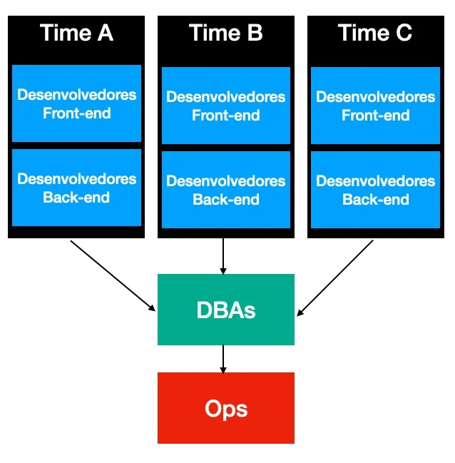
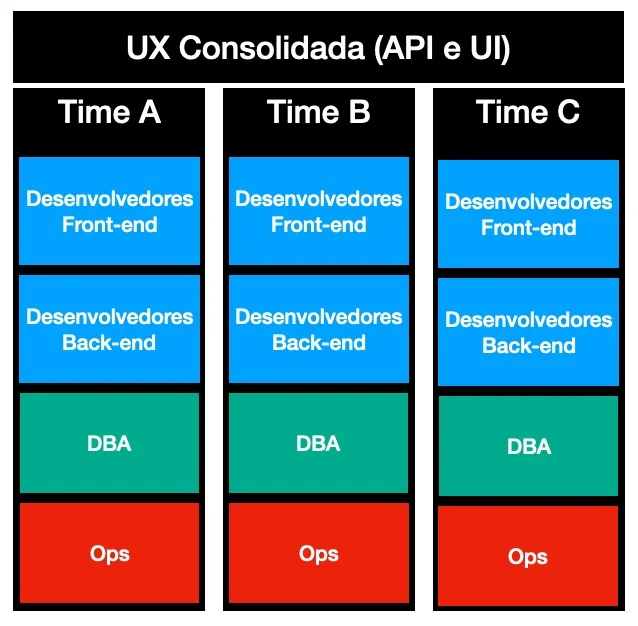

# Um exemplo prático da importância da lei de Conway

[0](https://www.eximia.co/pt/2020/07/06/um-exemplo-pratico-da-importancia-da-lei-de-conway/#comments)

[**Mesmo a arquitetura mais cuidadosa de um software sucumbirá frente ao eventual design descuidado dos times de uma organização que a implementará.**](https://twitter.com/intent/tweet?text=Mesmo%20a%20arquitetura%20mais%20cuidadosa%20de%20um%20software%20sucumbir%C3%A1%20frente%20ao%20eventual%20design%20descuidado%20dos%20times%20de%20uma%20organiza%C3%A7%C3%A3o%20que%20a%20implementar%C3%A1.&url=https://www.eximia.co/?p=4036&via=eximiaco) Afinal, como ensina a lei de Conway, com o tempo, a estrutura de um software tenderá a replicar a estrutura de comunicação da empresa que o desenvolve.

Já indicamos, no passado, a importância da lei de Conway para o planejamento tanto da arquitetura de um software quanto para a estruturação dos times da organização. Dessa vez, recorreremos a um exemplo mais concreto.

Considerando, por exemplo, uma empresa onde:

- há três times organizados por área de negócio (*squads*), agregando desenvolvedores Back-end e Front-end;
- há um único núcleo de profissionais, compartilhado e corporativo, para manter as estruturas de bancos de dados;
- há um único time para suportar a operação;

É possível prever que, com o tempo, qualquer solução desenvolvida:

- conterá três “contextos” com delimitação forte, onde, o código do Backend será “próprio” para atender o Frontend desenvolvido para ele, mas não será fácil de acessar externamente;
- tenderá a ter uma única base, compartilhada, acoplada e monolítica, que atenderá as demandas de todo o software da organização e será gargalo para evolução;
- terá *deploy* combinado, do tipo tudo ou nada, envolvendo as entregas de todos os times de organização.

Aliás, seguindo a teoria das restrições, podemos inferir, também, que o ritmo das entregas será determinado pelo time menos eficiente.

Veja

- [A força de uma corrente é sempre determinada pelo “elo” mais fraco.](https://www.eximia.co/pt/2019/11/29/a-forca-de-uma-corrente-e-sempre-determinada-pelo-seu-elo-mais-fraco/)

Também não se pode ignorar que se, além da estrutura de comunicação essencial, os times também tiverem conversas incentivadas em ferramentas de comunicação ou em ritos da organização, então crescem as chances de que se formem, também, pontos de acoplamento entre os componentes que esses times desenvolvem.

Veja

- [Comunicação “excessiva” dos times pode ser causa para o desenvolvimento de software ruim](https://www.eximia.co/pt/2020/06/29/comunicao-excessiva-dos-times-pode-ser-causa-para-o-desenvolvimento-de-software-ruim/)

Todas essas dificuldades são previsíveis, à luz da lei de Conway, e poderiam ser evitadas com o *design* cuidadoso da estrutura organizacional. Se a intenção é não ter uma base de dados monolítica, então é essencial diluir o “núcleo DBA” nas *squads*. Se a intenção é permitir *deploy* independente, então o “núcleo de operações” também precisa ser diluído. Finalmente, se for importante oferecer uma experiência consistente e consolidada no que é produzido na organização, externamente, então, é indispensável considerar uma equipe responsável por esse intento.

Importante, porém, destacar que qualquer “consolidação” também representa, em algum nível, acoplamento. Por isso, é importante ter claro o que se pretende oferecer “dentro e fora de casa”.

Veja

- [APIs internas e externas: um modelo de classificação para aumentar a eficácia e reduzir custos](https://www.eximiaco.tech/pt/2020/01/28/apis-internas-e-externas-um-modelo-de-classificacao-para-aumentar-a-eficacia-e-reduzir-custos/)

Antes de implementar uma arquitetura promissora, cabe ao CTO garantir que a estrutura dos times seja compatível.
