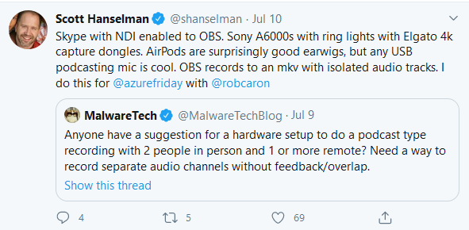

Skype with NDI enabled to OBS. Sony A6000s with ring lights with Elgato 4k capture dongles.

AirPods are surprisingly good earwigs, but any USB podcasting mic is cool. OBS records to an mkv with isolated audio tracks. I do this for

[@azurefriday](https://twitter.com/azurefriday)

with

[@robcaron](https://twitter.com/robcaron)
