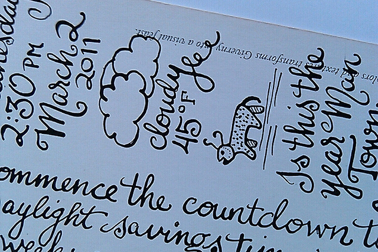

# Postcrossing Blog

News, updates, and all kinds of goodies and stories from the postal world!

## [Blog](https://www.postcrossing.com/blog) > 20 ideas of things to write on postcards!

Although quite small, the space on the back of a postcard can often seem intimidating, and some postcrossers struggle with what to write there… To help with this, here are 20 different ideas to fill your postcards! :)

1. Express what daily life is like where you’re sending the card from by describing what you did today, your routine, etc.
2. Write 5 curious facts about the place where the card is from.
3. Give local travelling tips from your area! What are the must-sees around you?
4. Include your favourite quote, perhaps in its original language (with translation!)
5. What was the last thing you cooked or ate? Include a recipe!
6. What do you have in common with the recipient of your card?
7. Recount a childhood memory, or something you’ve learned from your grandparents.
8. What makes you happy? If it makes you smile, there’s a good chance others will like to hear about it.
9. Share a local idiom or saying, in its original language, with translation of course!
10. Did you ever travel to the place where your card is going? Recall your best memory of that place.
11. What’s the weather like as you are writing your postcard? Draw the weather forecast in detail!
12. Share an interesting fact that you’ve learned, and which most people are not aware of.
13. Got an unusual hobby or collection? Do tell!
14. Did anything important happen in your country lately? Share an interesting news bit!
15. Tell the recipient about your favourite book, movie or band!
16. Draw a picture of your surroundings, or your favourite object in that room!
17. Write your favorite poem or…
18. …make up your own poem – [acrostic poems](http://en.wikipedia.org/wiki/Acrostic) or [haikus](http://en.wikipedia.org/wiki/Haiku) are short and enjoyable to write!
19. What are the local festivals or traditions from your area?
20. If you’re a student, what are you studying? What was the last thing you learned in school?

We hope that helps inspire some of you! Got some other tips? Please share them below!

Photo by [Dancing Lemur](http://www.flickr.com/photos/urbanrex/5492279135/in/photostream/), on Flickr.

Share on:

### 44 comments so far

Awesome ideas! :) I've shared many of these ideas :). I love to fill the card with awesome things. I receive many cards with nothing but a name on them.... but I love to read a lot on them.  
So please PostCrossers, share something.....

Posted by
[ArcticAngel](https://www.postcrossing.com/user/ArcticAngel)
on 5 Feb, 2013

Fantastic. I'm gonna print it out and hang above my table!

Posted by
[wildernesscat](https://www.postcrossing.com/user/wildernesscat)
on 5 Feb, 2013

It's nice as well that if the person who wrote the postcard asks a question, that the recipient answers it when they register the card!! Bit of interaction never hurt anyone!! :)

Posted by
[tinkx](https://www.postcrossing.com/user/tinkx)
on 5 Feb, 2013

Great ideas. I also write down what song I am litsening. :)

Posted by
[Sanijn](https://www.postcrossing.com/user/Sanijn)
on 5 Feb, 2013

I agree with Lower2! :) Always nice to get a reply. I sometimes even include little drawings Hehehehe. :)

Posted by
[moonlite\_forest](https://www.postcrossing.com/user/moonlite_forest)
on 5 Feb, 2013

- Use the similar/standard card stories with a variation. When I send a Moomin card, I can tell about our little museum called Moomin Valley and their own mailbox and special post mark that is hopefully clear and visible.  
- If you want to fill in the writing space more easily, decorate the card with stickers. Use BIG "font" when writing.

Posted by
[kiikari](https://www.postcrossing.com/user/kiikari)
on 5 Feb, 2013

honestly, i never have a porblem to find stuff to write on tmy cards.  
often i have to find a way to shorten the stuff i want to write

Posted by
[mse-home](https://www.postcrossing.com/user/mse-home)
on 5 Feb, 2013

There is never enough room on a postcard for all the things that I want to write !!!

Posted by
[Maggie05](https://www.postcrossing.com/user/Maggie05)
on 5 Feb, 2013

I always share some facts about my city and a bit about myself. I always ask people to write something in their own language to teach me something new. But the postcards are small, we need to choose, and that's the hard part! :)

Posted by
[katephilipa](https://www.postcrossing.com/user/katephilipa)
on 5 Feb, 2013

When I have some white space on a card that I am sending, I always doodle something, if it fits the receivers interests or just a flower or animal.  
I also like to receive cards that have a drawing on it. National symbols, random dancing fruit, animals, creatures, the sender in a cup of tea and so on.. I've received so many interesting postcards with funny and cheerful doodles on them and they always make me smile!

Posted by
[Nublu](https://www.postcrossing.com/user/Nublu)
on 5 Feb, 2013

I wish I could write like the person you depict in your above image. Such beautiful handwriting!

Posted by
[jjmedusa](https://www.postcrossing.com/user/jjmedusa)
on 5 Feb, 2013

I loved the 20 ideas to write about as sometimes I have writers block. I found printing it out difficult my computer did not really like me copying and pasting to an area where I could print it. It would be great if postcrossing made it easier to print out these blogs.

Posted by
[dartheather](https://www.postcrossing.com/user/dartheather)
on 5 Feb, 2013

When I'm sending a postcard I'm always troubled to find enough space to write.I make my handwriting so much smaller to write as much as possible! But the tips are perfect for the times I do have a little writersblock.!

Posted by
[NynkeK](https://www.postcrossing.com/user/NynkeK)
on 5 Feb, 2013

most user like many stamps on the cards and then sometimes i got a problem...where should i write my message ;)

Posted by
[FUZY8](https://www.postcrossing.com/user/FUZY8)
on 5 Feb, 2013

I usually write some words about postcard (I make it from my own photos), then two or three sentences in my native language and sometimes I draw a little picture:)

Posted by
[trimaliny](https://www.postcrossing.com/user/trimaliny)
on 5 Feb, 2013

A Postcard has many sides: frontside (the image), backside (message, stamps, address!), senderside (intention=choose of image+text+stamps+other emelments!), receiverside (interpretation of everything)  
So, message as part of the game, does not matter what, plays its role!

Posted by
[Luziaceleste](https://www.postcrossing.com/user/Luziaceleste)
on 5 Feb, 2013

Unless the Postcrosser I'm writing to requests something, I usually don't write very much. If a Postcrosser does not understand English well, I don't want to confuse him or her.

Posted by
[booboo\_babies](https://www.postcrossing.com/user/booboo_babies)
on 5 Feb, 2013

I usually print the message. My handwriting isn't great so I feel they can put the words in Google translate if they don't understand. I try to say something interesting but sometimes like dartheather says I get writers block. I don't like to repeat the same message all the time and if I do a few cards at a time, I need a list like this to give me ideas.

Posted by
[lyndac](https://www.postcrossing.com/user/lyndac)
on 5 Feb, 2013

I'm always listening to music when writing postcards, so I usually put what I'm currently listening to.

Posted by
[ChaelaMonstah](https://www.postcrossing.com/user/ChaelaMonstah)
on 5 Feb, 2013

Brava ! Well-written practical suggestions which all of us can use. As a native English speaker and an absolute "zero" in any other language, I would urge writers please do not apologize for your English because you are far more accomplished in a second language than many on this planet (including me). I regard each message as a rare gift.

Posted by
[hmthompson](https://www.postcrossing.com/user/hmthompson)
on 5 Feb, 2013

I usually tell about the postcard I am sending, or basics about myself. Also if the card is not full I often use stickers. :) If the person has special requests I try and honor those.

Posted by
[purplekiwi](https://www.postcrossing.com/user/purplekiwi)
on 5 Feb, 2013

Besides the 20 ideas- Write a little story about the place, person, animal on the card or write as if you were that person   
  
What are you doing at that moment? Write something random about yourself or your day.   
  
Tell a joke ;)

Posted by
[Bluma](https://www.postcrossing.com/user/Bluma)
on 6 Feb, 2013

I always put the date and maximum & minimum temperatures. Being in the Southern Hemisphere, and most cards going to the north, I hope they appreciate knowing it's 40°C here when they are covered in snow! Hehehe.  
I always start "G'day from South Australia" because G'day is such an Aussie thing.  
I have a rubber stamp that I bought for Postcrossing and Geocaching - it's my username written inside a kiwi (I was born in New Zealand).  
I use stickers - usually Aussie animals or NZ things - to ensure the address I've printed and glued on the card doesn't fall off.  
Finally, I use different coloured highlighters to emphasise all the features.  
Overall there's not a huge amount of room left to write much more than a quick note, but I hope the receiver appreciates the effort I put in to make it a bit unique. :D

Posted by
[Apty](https://www.postcrossing.com/user/Apty)
on 6 Feb, 2013

I try to answer questions that the receiver may have asked in his profile, or i write down the titel of my favourite book, or tell something about my day as I like those comments the most myself. If there is a big sport event going on (tennis, super bowl) i comment on that.   
Your list gives me a few new ideas I will certainly try!

Posted by
[racheltheemuts](https://www.postcrossing.com/user/racheltheemuts)
on 6 Feb, 2013

I look at the provile of the postcrossing user and so I have no problems to write messages on the postcard. I answer the questions or tell someting about my life...  
But your list with the ideas is great!

Posted by
[rosenbusch](https://www.postcrossing.com/user/rosenbusch)
on 6 Feb, 2013

Two ideas from my profile (hint for senders if they don't know what write on a card): what do you know about my country and what is your favourite soup? :))

Posted by
[wwwera](https://www.postcrossing.com/user/wwwera)
on 6 Feb, 2013

You left out the most important one: what is the card about? What does it show from the sender's country? That is what I love the most! It's a bit weird to look at a photo of something and know nothing about it...

Posted by
[InP](https://www.postcrossing.com/user/InP)
on 6 Feb, 2013

We never find it difficult to find something to write about, as long as the receiver tells a little bit about herself/himself in the profile. Only when we see a profile that is blank except for the map, this really blocks us. We have a section in our box of postcards that we call "no matter what" and we usually pick any random card from it and just write "Happy Postcrossing" or try to get an inspiration from the place where we are sending the card, but we always feel a little wasted about it.   
Maybe one of the "blank" profile people could share here what she or he would like to read about.

Posted by
[Drielandenpunt](https://www.postcrossing.com/user/Drielandenpunt)
on 6 Feb, 2013

Great ideas...sometimes I get stuck on what to write on certain theme cards...

Posted by
[zeroday](https://www.postcrossing.com/user/zeroday)
on 6 Feb, 2013

Sometimes i draw a small mandala on the card with fineliners. I ask people to tell me the GMT time of their country. When i registrate the card i imagine what the sender will be doing at that time. People from the west of Holland are starting the day and from the East are lying in their beds, :-)  
Lot's of the above ideas i allready use. But i like the ones about daily life the most.

Posted by
[elagipsy](https://www.postcrossing.com/user/elagipsy)
on 6 Feb, 2013

I list on my profile that I would like to hear what kind of work a person does or what they are studying if they are a student. That gives them something to write and it gives me an idea of what their interests are.

Posted by
[greatgma](https://www.postcrossing.com/user/greatgma)
on 7 Feb, 2013

If the user have a request to write ,I always write alot on the card. If not, i always tell : What is the card about? together with a quote. I have a list of quote and the same quote can appear in many cards ;) The quote that i going to write may be a simple quote or a difficult one depends on the user profile.

Posted by
[maccharedbean](https://www.postcrossing.com/user/maccharedbean)
on 7 Feb, 2013

nice ideas! much better than just receiving a card with an ID and "greetings"... I usually say something about the card or if the person shares some interests with me, I talk about them. Or I comment something really special about their profile. :)

Posted by
[Geminiscp](https://www.postcrossing.com/user/Geminiscp)
on 7 Feb, 2013

Sometimes I write cards in a cafe, or square or some such place and I discribe the atmosphere around me. But I also like writing at my desk, the cage with my breeding budgies right next to me and tiny little noises coming from the nesting box.  
Butusually there is enough to tell after reading someone's profile - or simply telling what one knows about someones country or what might be interesting from mine...

Posted by
[teamug](https://www.postcrossing.com/user/teamug)
on 7 Feb, 2013

Great ideas! Will try to write some of them on my card! :)

Posted by
[YiliLoh](https://www.postcrossing.com/user/YiliLoh)
on 8 Feb, 2013

I normally write about my favorite food since everyone has to eat or what I see outside my window...

Posted by
[de88ie](https://www.postcrossing.com/user/de88ie)
on 8 Feb, 2013

Great Ideas !!!

Posted by
[Leopold](https://www.postcrossing.com/user/Leopold)
on 8 Feb, 2013

How about just read recipient's profile info and answer the questions asked by the recipient? :)

Posted by
[Ankica](https://www.postcrossing.com/user/Ankica)
on 8 Feb, 2013

Someone wrote me a postcard with the little weather cloud and temperature on it!

Posted by
[Bashirsmomma](https://www.postcrossing.com/user/Bashirsmomma)
on 9 Feb, 2013

Sometimes I also draw the weather but always are my cards to small for what I want to write...

Posted by
[isagv](https://www.postcrossing.com/user/isagv)
on 10 Feb, 2013

Most people actually lists topics they want you to write about on their profile. I stick to their request because topics of conversation that thrill me can bore you to tears. For example I HATE when people write me about the weather...its pointless. I can go on weather.com and find out all that information. I want to learn about your culture. Things only a native would know. This is why I only do direct swaps anymore. On official cards no one follows my wishes. They won't write about one of the five topics I list and they never send me pretty cards from my favorites list. I never get back the level of care and effort I put out. I only send cards on favorite lists and write about interesting things. I wish people were less selfish and held themselves to the same standards they hold others.

Posted by
[zmey](https://www.postcrossing.com/user/zmey)
on 10 Feb, 2013

Thanks for bringing this up. During the last months I received more and more cards just saying 'hello' ....

Posted by
[iloveletters](https://www.postcrossing.com/user/iloveletters)
on 12 Feb, 2013

Thanks for the list, it helps!  
It is a lot easier to write more when the persons profile has plenty of information to identify with. When the profile is blank I am stumped!   
I always try & find a card that is listed in the receivers wish list, it is so annoying to get a card that you don't like. If they want it in an envelope I will make one from a local tourist info magazine, with interesting pictures etc.

Posted by
[Jacey](https://www.postcrossing.com/user/Jacey)
on 22 Feb, 2013

i usually tell about my city and myself, but about the others, it depends on my mood..  
  
-the song i was listening  
-i draw some little decoratings  
-a little secret about my life that nobody knows  
-some quotes

Posted by
[vaveyla](https://www.postcrossing.com/user/vaveyla)
on 4 Mar, 2013

↑ [Back to top](https://www.postcrossing.com/blog/2013/02/05/20-ideas-of-things-to-write-on-postcards#top) ↑

Comments are closed.
