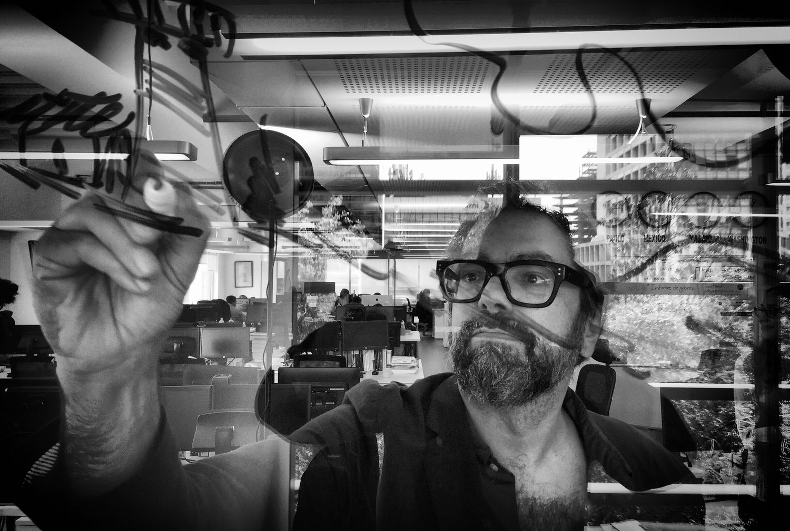
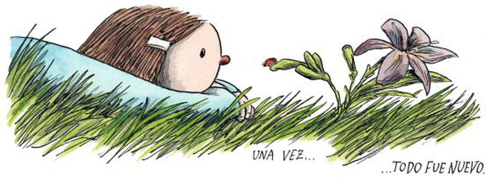
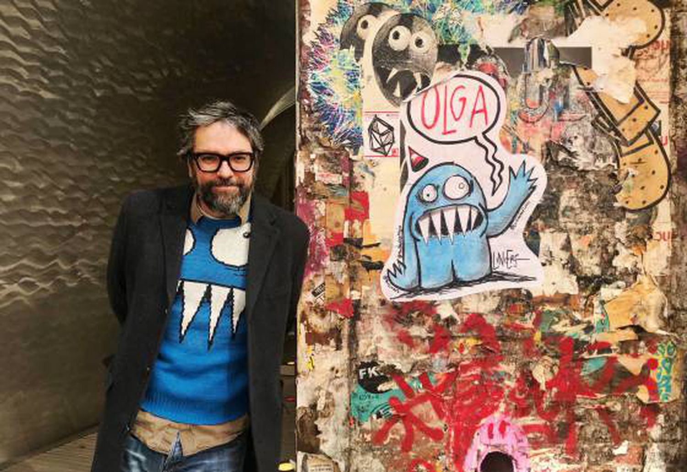

# Liniers: “Vamos nos lembrar de 2020 como o ano em que houve menos abraços no mundo”

## O cartunista argentino Ricardo Liniers conversa com o EL PAÍS sobre sua vida, o trabalho durante o confinamento e a perda de Quino

Liniers faz uma ilustração sobre uma janela de vidro na Ciudad de México, em 11 de novembro de 2018.Hector Guerrero

[**Ricardo Siri Liniers**](https://brasil.elpais.com/noticias/ricardo-liniers-siri/) (Buenos Aires, 1973), mais conhecido como Liniers, tem a virtude de se conectar, através do pequeno espaço de suas tiras, com milhões de pessoas que se divertem com seus pensamentos e ideias. O desenhista argentino é um sujeito de contrastes. Divertido e pessimista, também se entusiasma com as pequenas coisas que lhe arrancam um sorriso a cada dia. Durante a entrevista, transparece certa acidez quando as perguntas se tornam mais intensas, e acaba dando espaço às coisas pelas quais vale a pena seguir em frente.

Quando parece que tudo está para acabar, Liniers tira um ás da manga [e devolve um pouco de fé no mundo.](https://brasil.elpais.com/brasil/2015/07/03/cultura/1435940942_633543.html) Algo que soa muito complicado [nestes tempos de pandemia](https://brasil.elpais.com/brasil/2020-06-23/cem-dias-de-solidao-em-meio-a-pandemia.html). Talvez tenha passado a vida toda treinando para essa empreitada. Desde 2002, [em plena crise econômica e social argentina](https://brasil.elpais.com/internacional/2020-11-04/argentinos-olham-para-o-futuro-com-poucas-esperancas-mergulhados-em-sua-enesima-crise-economica.html), desenha a tira *Macanudo*. Quando todos os jornais publicavam notícias negativas, este pessimista-otimista saía em sua página de sempre dizendo que tudo estava bem. Extraordinário, surpreendente. Bacana ―o significado de *macanudo*.

Usa boné e grandes óculos escuros quadrados, que emolduram seus pequenos olhos sobre uma barba espessa. Fã dos Beatles e de *Star Wars*, soube que queria ser desenhista ainda criança, quando conheceu as tiras da [Mafalda](https://brasil.elpais.com/noticias/mafalda/), [do recém-falecido Quino](https://brasil.elpais.com/cultura/2020-09-30/morre-quino-criador-da-mafalda-e-o-mais-internacional-cartunista-da-lingua-espanhola.html). “Quino me ensinou a pensar”, diz do outro lado da tela durante uma fria manhã de Vermont, nos Estados Unidos. Como em muitas de suas histórias cheias de surpresa e engenhosidade, Liniers gosta de arrancar gargalhadas com suas palavras e suas piadas. “A verdade que este não é um mau lugar para passar a pandemia. Estou rodeado de árvores”, diz, sorridente. “Percebi que é o ano em que desenhei mais vezes os meus personagens na natureza. Como nos trancaram, a última coisa que quero desenhar são espaços fechados”, acrescenta.

Retrata-se a si mesmo como um coelho de óculos, e suas tiras se tornaram presença habitual nas [páginas do EL PAÍS Semanal](https://elpais.com/autor/ricardo-liniers-siri/). Enriqueta, o gato Fellini, Olga, os elfos, o misterioso homem de preto, os pinguins… Além de sua tira, Liniers desenvolveu outros projetos, como os títulos *Boa noite, planeta*, *Os sábados são como um grande balão vermelho* (ambos lançados no Brasil pela VR Editora) e *Cosas que te pasan si estás vivo* (inédito em português). Em 2020, participou do júri da II Bienal de Ilustração organizada pela Pictoline no México.

**Pergunta.** Seremos pessoas melhores depois da pandemia?

**Resposta.** Acho que já tivemos outras pandemias e que estarmos na segunda [onda] significa que não aprendemos muito. Continuamos tropeçando com a mesma pedra, um pouco maior. Em *Macanudo* sou muito otimista, na minha vida real sou um pouco mais sombrio. [Acho que vamos continuar iguais](https://brasil.elpais.com/buenavida/2020-04-23/mudaremos-tanto-por-dentro-apos-a-vida-de-confinamento.html).

**P.** O que dizem seus desenhos sobre como foi 2020?

**R.** A natureza pôs todos para pensarem no nosso quarto, como quando eu mando minhas filhas para o quarto delas pensarem no que fizeram, mas acho que vamos sair e vamos continuar nos comportando mal.

Liniers

**P.** Poderíamos qualificar como o ano em que sentimos saudades de viver fora de casa?

**R.** E o ano em que [houve matematicamente menos abraços no mundo](https://brasil.elpais.com/brasil/2020-06-02/abracos-virtuais-para-quebrar-a-solidao-dos-covidarios.html). Puseram como castigo para nós não nos tocarmos mais. O que faz com a psique passar um ano inteiro sem um gesto físico de carinho a não ser com a sua família? É um ano que vai nos deixar um trauma, assim como o [11 de Setembro](https://brasil.elpais.com/noticias/11-s/) nos deixou um trauma estranho, por causa do qual todo mundo tira os sapatos para entrar num avião, e embora não tenha nenhuma lógica você tira.

**P.** Então não voltaremos mais a nos abraçar igual?

**R.** Ou isso ou vamos nos abraçar muito mais. [Depois da pandemia anterior](https://brasil.elpais.com/sociedade/2020-03-16/em-1918-gripe-espanhola-espalhou-morte-e-panico-e-gerou-a-semente-do-sus.html), se dermos ouvidos ao Grande Gatsby e a Leonardo Di Caprio, os anos 20 foram muito divertidos: tudo era jazz, álcool clandestino e festa… Acho que os primeiros anos pós-pandemia serão muito divertidos.

**P.** Ouvi você dizer que as crises são positivas para criar e também para o humor.

**R.** Não acho que as crises sejam boas para nada nem para ninguém, mas é verdade que depois das grandes crises aparecem obras muito interessantes. Será um ano muito interessante para todas as obras que forem produzidas agora.

**P.** Falando em criar neste momento, o que vem primeiro: o texto ou o desenho?

**R.** É uma mistura de coisas. Depois que me levanto, desenho. Não sou a mesma pessoa o tempo todo, e com *Macanudo* trato de ser honesto. Desenho conforme acordo. Muitas vezes anoto ideias no celular, outras vezes tenho cadernos de esboços onde desenho ideias legais. Quando você tem uma tira diária, não pode desperdiçar ideias. Todas servem, então recomendo a quem estiver começando nisso que [trate de ficar amigo do fracasso](https://brasil.elpais.com/brasil/2018/01/03/cultura/1514978576_244946.html).

**P.** Nem todas as tiras serão boas...

**R.** Você precisa aceitar isso como parte do processo. Nem todas as tiras precisam ser boas, porque ninguém é bom no trabalho todos os dias. Você é médico e um dia está distraído e larga um instrumento dentro de um paciente…

**P.** Bom, há fracassos e fracassos, né?

**R.** Bom, há de fracassos a fracassos... Aqui, na ilustração, ninguém morre, mas tem dias em que você tem vergonha do seu trabalho e é lido por milhares de pessoas, e além do mais lhe dizem isso no Twitter. Você precisa ficar amigo do fracasso porque do outro lado encontra o que estava procurando. Ele me abriu a porta a personagens dos quais depois acabei gostando, como Olga, o amigo invisível do Martincito.

**P.** Como você recebeu a notícia da morte de [Quino](https://brasil.elpais.com/noticias/quino/)?

**R.** São essas perdas para as quais você vai se preparando emocionalmente em alguma parte do cérebro. Como quem espera que vai perder um avô, no dia em que acontece é como um balde de água fria. Tive a sorte de conhecer um dos meus heróis absolutos da infância. [Todos os desenhistas ficamos um pouco órfãos.](https://brasil.elpais.com/cultura/2020-09-30/quino-influenciou-a-todos-nos-na-america-latina.html)

**P.** O que recomendaria às novas gerações de ilustradores?

**R.** Que não leiam os comentários nas redes sociais. Qualquer disciplina criativa, para que realmente funcione, tem que parecer fácil. Você precisa trabalhar muitíssimo para que o que faz pareça ser o seu idioma, sua maneira de se expressar. Não é a mensagem, é como você conta.

**P.** A que se refere?

**R.** As mensagens já estão todas feitas. *All You Need Is Love* [”você só precisa de amor”], Jesus já havia dito 2.000 anos antes que Lennon. [O ponto é como Lennon disse para que fosse tão bom.](https://brasil.elpais.com/cultura/2020-12-08/dez-lampejos-sobre-john-lennon.html)

**P.** Você tem milhões de seguidores em suas redes sociais. Elas ajudam em seu trabalho ou são perigosas?

**R.** Nas redes sociais você encontra o que te critica e também o que te diz “você é um gênio”. Não tem que acreditar em nenhum dos dois lados. É preciso tomar cuidado porque [a polarização das redes] pode acabar em algo mais sombrio. Aqui nos Estados Unidos, você está vendo nos racistas que eram um bando de idiotas em cada povoado, que não sabiam como se relacionar com outros racistas, e agora se juntam às centenas de milhares em sites *on-line*.

Liniers com Olga, personagem de 'Macanudo'Tasha Muresan

**P.** Acha que isso fala de como [nos sentimos sós na sociedade](https://brasil.elpais.com/brasil/2020-08-09/joke-hermsen-o-desafio-diante-de-nos-e-transformar-nosso-isolamento-em-uma-solidao-compartilhada.html)?

**R.** Acho que a humanidade tem depressão e que isso tem a ver com a tristeza que gera ter tudo à mão. Quando eu era criança, tinha dois discos do Velvet Underground e sofria porque não tinha como conseguir os outros na Argentina. Agora temos toda a discografia no Spotify e isso não me deixou mais feliz. Estamos em sérios apuros, porque as futuras gerações não sabem se entediar. Qualquer pai sabe que [um filho não será mais feliz se ganhar tudo o que quiser.](https://brasil.elpais.com/sociedad/2020-12-22/criancas-superpresenteadas-desenvolvem-menos-a-imaginacao-e-a-tolerancia-a-frustracao.html)

**P.** Em que momento diria que está a ilustração na América Latina?

**R.** Acredito que o *boom* que ocorreu na literatura latino-americana você vai encontrá-lo nos quadrinhos e nas *graphic novels.* Acho que a qualidade dos desenhistas que há neste momento é superinteressante. Eu gostaria de estimular que se façam mais quadrinhos para crianças, porque é o leitor perfeito e uma porta de entrada para todos os livros, como aconteceu comigo.

P. Chegará um momento em que *Macanudo* acabará?

**R.** *Macanudo* é minha maneira de me psicanalisar, de pôr no papel as minhas angústias, meus medos, o que eu ache legal em um diário pessoal... Não sei se serei como [[Charles] Schulz](https://brasil.elpais.com/noticias/charles-schulz/) que desenhou o Snoopy por 50 anos e morreu no dia em que publicou sua última tira. Isso seria muito forte.

*Aviso aos leitores: o EL PAÍS mantém abertas as informações essenciais sobre o coronavírus durante a crise. Se você quer apoiar nosso jornalismo,* [*clique aqui para assinar.*](https://suscripciones.elpais.com/para-conhecer/)

[*Siga a cobertura em tempo real*](https://brasil.elpais.com/brasil/2020-03-22/ao-vivo-ultimas-noticias-sobre-o-coronavirus-no-brasil-e-no-mundo.html) *da crise da covid-19 e* [*acompanhe a evolução da pandemia no Brasil*](https://brasil.elpais.com/ciencia/2020-07-23/evolucao-dos-casos-de-coronavirus-no-brasil.html)*.* [*Assine nossa newsletter*](https://plus.elpais.com/newsletters/lnp/3/375/) *diária para receber as últimas notícias e análises no e-mail.*
