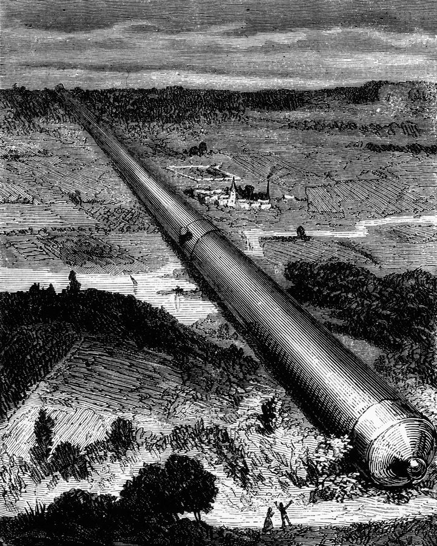
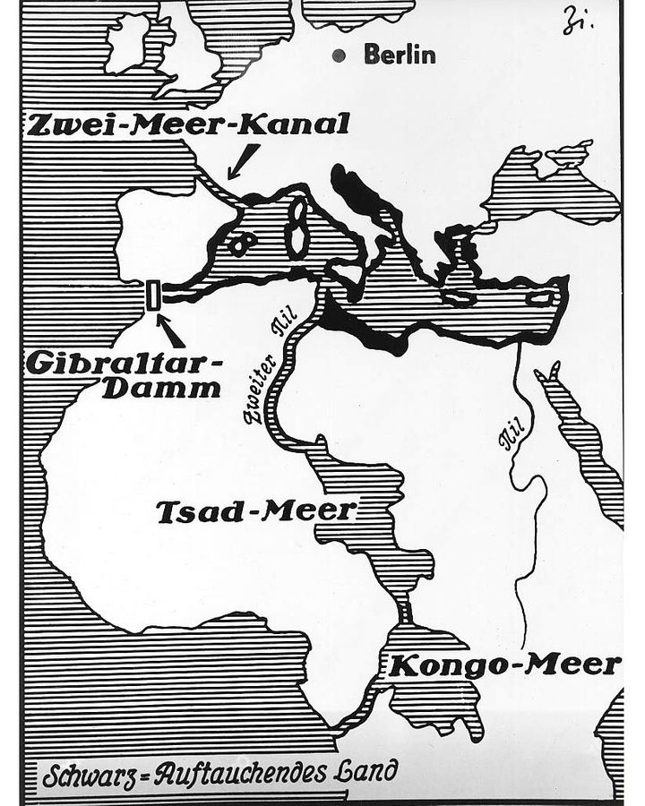
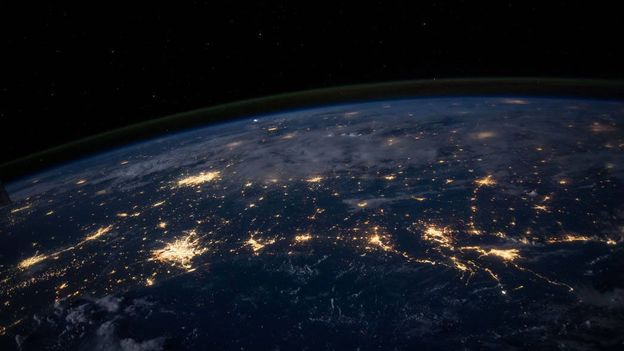
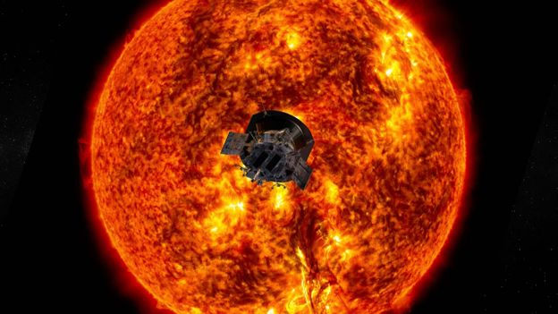

# The 'megascale' structures that humans could one day build

What are the biggest, boldest things that humanity could engineer? From planet lifters to space cannons, Anders Sandberg explores some of history's most ambitious visions – and why they're not as 'impossible' as they seem.

In 1603, a Jesuit priest invented a machine for lifting the entire planet with only ropes and gears.

Christoph Grienberger oversaw all mathematical works written by Jesuit authors, a role akin to an editor at a modern scientific journal. [He was modest and productive](https://swap.stanford.edu/20120821183318/http:/hotgates.stanford.edu/Eyes/modesty/index.htm), and could not resist solving problems. He reasoned that since a 1:10 gear could allow one person to lift 10 times as much as one unassisted, if one had 24 gears linked to a treadmill then one could lift the Earth… very slowly.

Like any modern academic who prizes theory above practice, he left out the pesky details: “I will not weave those ropes, or prescribe the material for the wheels or the place from which the machine shall be suspended: as these are other matters I leave them for others to find.”

You can see what [Grienberger's theoretical device looked like here](https://swap.stanford.edu/20120821192825/http:/hotgates.stanford.edu/Eyes/modesty/fig8_files/image001.jpg).

For as long as we have had mathematics, forward-thinking scholars like Grienberger have tried to imagine the far limits of engineering, even if the technology of the time was lacking. Over the centuries, they have dreamt of machines to lift the world, transform the surface of the Earth, or even reorganise the Universe. Such "megascale engineering"  – sometimes called macro-engineering – deals with ambitious projects that would reshape the planet or construct objects the size of worlds. What can these megascale dreams of the future tell us about human ingenuity and imagination?

*You may also like:*

The roots of megascale engineering can be traced back to the Ancient Greeks. Archimedes is famous for many things, but one enduring boast is: “Give me a place to stand and I can move the Earth!” He was thinking about levers: he knew that with a fixed pivot, a very long lever can exert tremendous force. Like Grienberger’s machine did for gears, his insight into these mechanics made it irresistible to speculate about problems of a magnitude far beyond anything practical.

Since then, every time a physical law was revealed as universal, the natural next step was to scale it up and explore the theoretical consequences. Isaac Newton realised the law describing Earth's gravity applied to both apples and the Moon. So, long before travelling to space became a reality, he pointed out that a powerful cannon could, in principle, be scaled up to propel a satellite into Earth orbit. The idea was later described in science-fiction, in the story [From the Earth to the Moon](https://www.google.co.uk/books/edition/From_the_Earth_to_the_Moon/sNVG4FUYr9wC?hl=en&gbpv=1&printsec=frontcover) in 1865.

The giant cannon used to launch the spacecraft "Columbiad" in Jules Verne's story of lunar exploration (Credit: Getty Images)

In the 20th Century, some groups in the US and elsewhere [made serious attempts](https://www.bbc.com/future/article/20160317-the-man-who-tried-to-make-a-supergun-for-saddam-hussein) to explore whether such a cannon could work. Those efforts failed, so Newton's musings might be easy to disregard as a mistaken forecast. But it's worth remembering that our current mode of space transport – the rocket – was once thought unlikely and fanciful too. In 1920, [the New York Times famously mocked](http://graphics8.nytimes.com/packages/pdf/arts/1920editorial-full.pdf) the proponents of the idea, implying that they lacked the physics education of a high-school student. (In 1969, the newspaper issued a light-hearted retraction a day after the Apollo 11 astronauts lifted off towards the Moon.)

Over the years, similar theoretical leaps of the imagination into space have led some to ask whether orbital elevators could be built. By hanging a very strong cable from a counterweight it is (just barely on Earth) physically possible to have a literal solar-powered elevator to space. By flinging spacecraft off the end of the cable they could be propelled to other bodies with a minimum of fuel. Elevators on the Moon or Mars look even more practical thanks to the lower gravity found there.

And scaling up our astronomical ambitions even further, others have speculated about whether future humans could terraform Mars to become habitable, or even construct a "Dyson sphere" of solar collectors around the Sun. In the very long run, we may want to perform modifications to make the Sun last longer, move the Earth into a wider orbit, or even move stars between galaxies. These projections are all far-fetched today, but mathematics and physics do not rule them out.

**Redesigning Earth**

Back on Earth, megascale engineering dreams have also inspired various blueprints for utopian schemes that involve altering the oceans and atmosphere on a grand scale.

In the 1920s and beyond, Herman Sörgel's [Atlantropa](https://en.wikipedia.org/wiki/Atlantropa) project dreamt of building a hydroelectric dam across the Strait of Gibraltar. The surface level of the Mediterranean Sea would be lowered by 200m (656ft), opening up new land for settlement. An extra dam across the Dardanelles to contain the Black Sea would supplement the first dam, then a dam between Sicily and Tunisia to further lower the inner Mediterranean, extending the Suez Canal with locks, and for good measure redirecting the Congo River to refill the basin around Lake Chad to irrigate the Sahara. Today ecological concerns would presumably rule out the whole endeavour even if it had political support, but if the will and the money had been there, it might well have been attempted.

Hermann Sörgel's Atlantropa project would have transformed Europe and Africa (Credit: Getty Images)

A modern descendant, more intended as a warning than a serious proposal (still, meticulously analysed), is [damming the North Sea](https://www.theguardian.com/environment/2020/feb/12/giant-dams-could-protect-millions-from-rising-north-sea) between Scotland, Norway, France and the UK to handle sea levels rising.

And between 1957-1977, Project Plowshare was a United States programme to develop nuclear explosive techniques for large-scale, peaceful construction purposes (a similar programme, Nuclear Explosions for the National Economy, existed in the Soviet Union). Ideas included using nuclear explosions to widen the Panama Canal, dig artificial harbours or roadcuts through mountain ranges, as well as stimulating underground gas or oil reservoirs. Perhaps unsurprisingly, interest in mildly radioactive infrastructure never truly caught on.

A megascale alteration to the planet that is, however, now seriously considered and studied is [geoengineering](https://royalsociety.org/topics-policy/publications/2009/geoengineering-climate/). This involves deliberate interventions in the climate system to reduce solar input (whether from whitening clouds with seawater, adding aerosols to the stratosphere, or putting a shade in space) or binding carbon dioxide (using crushed olivine, seeding algal blooms, or pumping it underground). It appears possible and may even become necessary, but solar input control is definitely a risky idea.

**Hubris for fun and humanity**

What is the motivation for this kind of thinking? It is not just that it is fun to play God on paper.

In many cases it is the logic of "more is better": if it is good to gain agricultural land, why not try to get as much as possible? If energy is valuable, just how much could we conceivably gather using known technology? It tells us important things about where the limits may be, and how much we could gain if we *really* wanted to. The aim is not to predict "how" or "when", it is more often about charting out whether the laws of the Universe prevent it. It can help us distinguish the impossible from the merely improbable.

Electricity grids, the internet, and interstate highways are enormous in scale, yet we take them for granted (Credit: Nasa)

Many megascale engineering projects are also, in their makers' eyes, strongly utopian visions. Sörgel believed Atlantropa would provide energy, arable land, and improved climate, but also help to bring together Europe and Africa. The Russian philosopher Nikolai Fedorov proposed weather control as a first step in his cosmist programme to peacefully unify mankind (later, space and immortality). The point is working together on a grand goal. It is not so much about lifting the world as lifting up humanity.

It is easy to laugh and regard these dreams as impractical utopianism or engineering hubris. Except that the Earth is encircled by a machine that transmits petabytes of data every second, stores exabytes, and that you are likely using right now (the internet). There is a machine larger than a football field moving faster than a rifle bullet orbiting overhead (a space station). And another machine in Europe is 27km (17 miles) in circumference and converts energy into exotic matter (the Large Hadron Collider). Imagine what Archimedes or Newton would have made of those.

In fact, we are living amid megascale structures we hardly notice. Some large-scale engineering of our environment is nearly invisible. The Netherlands, as well as the Fens of Lincolnshire, Cambridgeshire and Norfolk, are land reclaimed from the sea. The Amazonian rainforest is not as pristine as once thought: [it was farmed for millennia](https://royalsocietypublishing.org/doi/full/10.1098/rspb.2015.0813). The terraces of South East Asia and modern metropolitan cities are engineering that turns into landscapes. Sometimes with a grand plan, often not.

**When and why does it work?**

Experience with large projects typically show a mix of [cost overruns, pathologies of planning and bad project management](https://arxiv.org/ftp/arxiv/papers/1409/1409.0003.pdf). If we are so bad at it, how come *some* do succeed?

If we consider megascale engineering that has actually happened – the terracing of parts of South East Asia, the land reclamation of the Netherlands, the US Interstate Highway System, the internet – it consists of projects that can be implemented piecemeal, where work can cease and resume after learning experiences, and where the system is not dependent on every part functioning perfectly. They can be maintained, and it usually makes sense for the people involved to maintain their homes and servers.

Nasa’s Parker Solar Probe mission has travelled closer to the Sun than any human-made object before it (Credit: Nasa/Johns Hopkins APL)

This is very different from many of the grand but often brittle visions in the literature, created by single-minded individuals. Yet some megascale projects may be far more modular and practical than they first look. The issue is not the size scale but what forms of coordination are needed. Take the example mentioned earlier of building a Dyson sphere. It seems far off, but in a sense, we have started to englobe the Sun with solar collectors already by placing satellites in orbit around it. If we continue for a few million years there could be a Dyson sphere in place.

The grand top-down plans to lift the world to a better state are weaker than the bottom-up piecemeal solutions. Nevertheless, we need the visions to know what might one day be possible (“Sure, we cannot build elevators to space *yet… but one day!*”) and to think about the large directions we want to move towards – sustainability, space, prosperity, safety – in ambitious ways.

Hubristic utopias are perhaps better left on paper than built in the real world, yet we can also recognise that there are more ambitious ideas for improving things today than ever before in human history. We may not have the technology to carry worlds, but Archimedes might have been pleased to know that we have many more levers.

*Dr Anders Sandberg is a researcher at the Future of Humanity Institute at the University of Oxford, and tweets [@anderssandberg](https://www.twitter.com/anderssandberg).*

*--*

*Join one million Future fans by liking us on*[***Facebook***](https://www.facebook.com/BBCFuture/)*, or follow us on*[***Twitter***](https://twitter.com/BBC_Future)*or*[***Instagram***](https://www.instagram.com/bbcfuture_official/)*.*

*If you liked this story,*[***sign up for the weekly bbc.com features newsletter***](http://pages.emails.bbc.com/subscribe/?ocid=fut.bbc.email.we.email-signup)*, called "The Essential List". A handpicked selection of stories from BBC Future, Culture, Worklife, and Travel, delivered to your inbox every Friday.*
