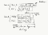
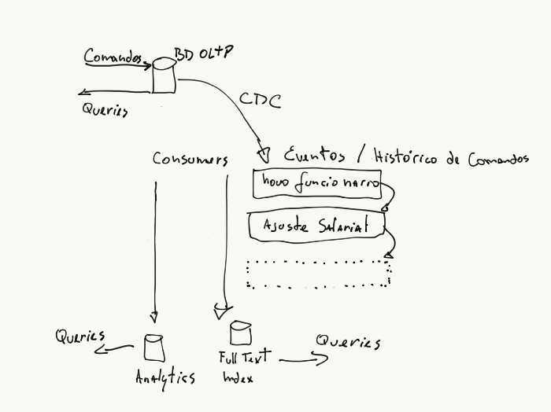
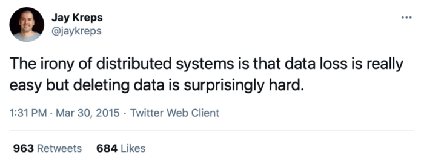
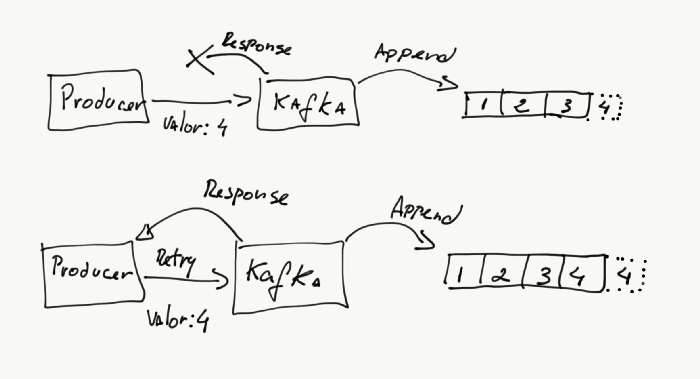
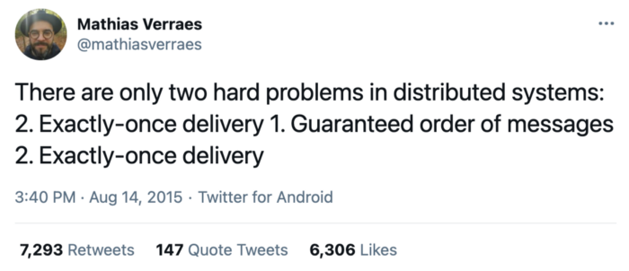
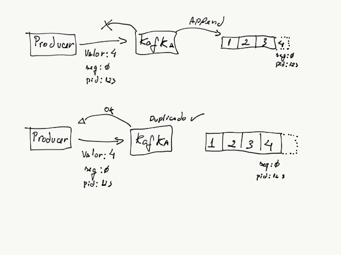

# Arquitetura de Dados com Event Streams

Parte da [série](https://brenocferreira.medium.com/designing-data-intensive-apps-um-resumo-a97e47c29372) sobre o resumo do [livro Designing Data Intensive Apps](https://amzn.to/2YaKEhB).

No ultimo capítulo vimos como funciona o Hadoop e HDFS, e como podemos usá-lo para processamento de dados com o framework Map Reduce. Vimos também que esse processamento desses dados é feito em batch, ou seja, processamos os arquivos que já foram salvos e não irão ser modificados. O processamento que fazemos em cima desses dados resulta em dados derivados e que podem ser recriados simplesmente rodando o processamento novamente.

Mas nem sempre esse tipo de processamento em batch é possível. Em determinados casos, não podemos esperar coletar todos os dados, salva-los em um cluster HDFS e só então processá-los para tirar alguma informação útil deles. Hoje é mais comum precisarmos processar os dados conforme eles vão sendo criados e ter mais agilidade na transformação de uma massa de dados em informação útil. É necessário o uso de algo conhecido como Stream Processing. Se no processamento em batch os dados são finitos e o processamento uma hora termina, em Stream Processing, os dados são teoricamente infinitos e o processamento é contínuo e “nunca” está completo.

# Transmitindo Event Streams

Existem algumas formas diferentes de pensar sobre eventos. Uma forma de pensar é como Envio de Mensagens (Message Passing) para comunicação entre processos. Um processo P1 de alguma forma envia uma mensagem (ou evento) para outro processo P2 que irá realizar alguma tarefa com os dados enviados.

Outra forma de pensar sobre eventos é quando os eventos deixam de ser meras mensagens entre processos e têm a ter um papel bem mais importante na arquitetura de dados de uma aplicação, passando a armazenar os dados em si. Os eventos guardam informações sobre as mudanças de estado de uma aplicação, são persistidos e para saber o estado atual de uma entidade, basta processar os eventos na ordem que ocorreram para saber "o que aconteceu". O exemplo clássico é o de uma posição financeira, em que os débitos e créditos em uma conta são os eventos, o processamento de balanço financeiro desses eventos apresenta a posição ou saldo atual da conta. Essa é a ideia de um padrão arquitetural conhecido como Event Sourcing (mais sobre isso adiante).

## Sistemas de mensageria

Sistemas distribuídos inevitavelmente irão ter que se comunicar. No post sobre [Encoding e Dataflow](https://brenocferreira.medium.com/encoding-e-dataflow-de4cb19a8607) mostramos como essa comunicação pode ocorrer de diferentes formas, como REST, RPC ou Message Passing. No caso de REST e RPC, essa comunicação ocorre de maneira direta, ou seja, um serviço envia uma mensagem e espera uma resposta. E como dissemos no post sobre os [problemas de sistemas distribuídos](https://brenocferreira.medium.com/os-problemas-de-sistemas-distribu%C3%ADdos-c5e00e3fb4d3), essa comunicação é propensa a diversos tipos de falha que devem ser levadas em consideração.

Um outro problema que pode existir com essa comunicação direta via endpoints REST ou RPC é quando um serviço recebe mais requisições do que ele é capaz de processar. Enquanto existe a opção de adicionar nós de processamento, a infraestrutura não é infinita.

Ou ainda, quando o serviço que processa as requisições cai, é aceitável perder informação? Pode ser que perder informação seja uma mera inconveniência para o usuário, mas também pode significar perder informação valiosa que cause prejuízos ao negócio.

Uma solução clássica para esses tipos de problema é adicionar um sistema de mensageria (ou *Message Broker*) que serve de buffer de comunicação entre serviços. Existem vários serviços desse tipo e a escolha vai depender do caso de uso que voce precisa. Os serviços costumam ter suporte a recursos diferentes e é preciso uma análise do que é necessário. Alguns pontos importantes que são importantes na análise de um message broker:

**Durabilidade**

Um dos maiores benefícios de se usar sistemas de mensageria ao invés de comunicação direta entre serviços é ter uma opção de armazenar mensagens para consumo posterior. Assim, caso um serviço falhe em responder, não há risco de perder uma mensagem e deixar de processar alguma informação. Isso pode ser bem importante em determinados casos.

Para isso, alguns serviços possuem diferentes tipos de armazenamento. Serviços como Redis armazenam seus dados em memória, logo, o acesso é bem rápido, contudo, há sempre a possibilidade de perda de dados. Já outros serviços de Message Queue suportam persistência das mensagens que são enviadas. As mensagens podem ser persistidas em disco, em um banco de dados, em arquivos de log, etc.. No final, caso o broker falhe, nenhuma mensagem é perdida. Isso deixa a performance um pouco mais lenta que serviços puramente em memória como o Redis, mas o risco de perda de informação é bem menor.

**Patterns de envio de mensagem**

Em sistemas de mensageria, existem alguns patterns de envio e recebimento de mensagens. Geralmente voce tem uma mensagem que é criada por um Producer e ela pode ser processada por um único serviço (geralmente chamado de *Consumer*) ou por vários.

Processar mensagens por vários consumers diferentes é comum em sistemas de *Publish-Subscribe (Pub-Sub)*, quando vários *Consumers* fazem o *Subscribe* em um tópico e processam mensagens conforme suas necessidades. Um exemplo seria, em um site de ecommerce, um Publisher publicar uma mensagem que um pedido foi confirmado, e diferentes *Consumers* (de pagamento, de entrega, analytics, etc.) processarem essa mensagem.

Quando o processamento deve ser feito por um único consumer, costumamos chamar esse pattern de Fila ou Message Queue. É possível pensar em Message Queue como um Pub-Sub onde há somente um consumer em um determinado tópico.

**Entrega de mensagens**

Ao contrário de banco de dados, que são otimizados para persistencia de dados de longo prazo, Message Brokers são sistemas otimizados para entrega rápida de mensagens. Quando uma mensagem é enviada aos consumers, os consumers geralmente notificam de volta o broker com uma confirmação de processamento, e em seguida a mensagem é apagada do broker.

Como vimos no post sobre [HDFS](https://brenocferreira.medium.com/dados-distribu%C3%ADdos-hadoop-file-system-hdfs-691e7699c2d5), um recurso chave de batch processing do Hadoop é a possibilidade de rodar um batch repetidas vezes, pois os arquivos são armazenados e o resultado de um processamento Map/Reduce é derivado desses dados e persistido separadamente. Com um message broker, é impossível para um consumer novo processar mensagens antigas, pois elas já foram apagadas e perdidas. O consumer novo só irá processar mensagens novas que chegarem no broker.

## Partitioned Append Logs

Por que não o broker persistir os eventos?

Message brokers tradicionais são otimizados para armazenar e distribuir mensagens de maneira muito eficiente, mas não para armazenamento de dados de longo prazo . Já os bancos de dados tradicionais são otimizados para armazenar dados à longo prazo, porém operações de escrita podem não ser tão eficientes (já que o banco tem que se preocupar com transações, atualização de índices, etc.).

Por que não tentar ter um sistema que seja bom nas duas coisas: escrita rápida e de longo prazo. Como vimos anteriormente em [Como Funciona o Storage de Banco de Dados](https://brenocferreira.medium.com/designing-data-intensive-apps-cap%C3%ADtulo-3-eeec8782ab22), uma maneira extremamente eficiente de escrever dados é um Append-Only Log, onde dados novos são sempre escritos no fim (appended) da estrutura de dados ou arquivo. Se um tópico é um Append Log, então, cada mensagem ou evento é simplesmente uma nova entrada ao fim do tópico. Para ler todas as mensagens armazenadas, basta fazer uma leitura sequencial do log. Para atingir escalabilidade além do que pode ser escrito em um disco, tópicos podem ser [particionados](https://medium.com/@breno_ferreira/dados-distribu%C3%ADdos-particionamento-sharding-6d6ddd50124a) e cada partição armazenada em um servidor diferente. Essa é a ideia de sistemas como por exemplo o Apache Kafka.

Tópicos particionados com Producers inserindo dados e consumers lendo num offset específico

Na imagem acima, podemos ver que as mensagens criadas pelos Producers são "appendadas" no fim do log, na partição apropriada. E os Consumers, podem ler todo o log da partição de um tópico, ou ler a partir de um determinado *offset*.

Desse jeito, conseguimos manter no log o histórico de mensagens enviadas e os consumers podem ler as mensagens em sequencia, a qualquer momento, já que as mensagens não são apagadas. Os consumers podem também ler as mensagens à partir de qualquer ponto do log, bastando saber o offset de onde partir e ler em sequência até a última mensagem.

## Banco de dados ou Apache Kafka? Por que não os dois?

Uma boa parte dessa série de posts foi dedicada a explicar como funcionam bancos de dados, relacionais ou não, e utilizando-os como ferramentas de Online Transaction Processing (OLTP). Afinal, essas ferramentas foram desenvolvidas e aperfeiçoadas por décadas para garantir durabilidade e controles muito bons de concorrência. Por que abandonar essas ferramentas que claramente resolvem bem um tipo de problema e adotar somente pelo hype uma ferramenta que existe a pouco tempo?

O fato é que não existe uma única ferramenta perfeita que irá satisfazer todos os requisitos de escrita, armazenamento, leitura e processamento de dados. Existem ferramentas diferentes para casos de uso diferentes. Bancos de dados OLTP são excelentes para escrita durável e com poderosas linguagens de consulta. Caches em memória são bons para tornar determinadas leituras mais rápidas. Bancos OLAP são bons para analytics. Índices Full-Text são bons para buscas, etc..

Porém um requisito bem comum quando esses tipos de ferramentas são usadas em conjunto é: os dados devem manter uma certa sincronia. Não adianta muito banco OLTP ter os dados mais atuais e o banco de analytics ou o índice de buscas ter somente os dados da semana passada. O ideal é que todas as fontes de dados estejam sempre atualizadas.

No post sobre [como funciona o storage de banco de dados](https://brenocferreira.medium.com/designing-data-intensive-apps-cap%C3%ADtulo-3-eeec8782ab22), vimos como que os bancos de dados costumam manter um log de operações de escrita, ou Write-Ahead Log, que inclusive é usado para na replicação de dados nos esquemas líder-seguidores. Quando usamos um sistema de banco de dados, muito raramente vamos precisar nos preocupar com esse log, pois ele acaba sendo um detalhe de implementação interna do banco.

Agora, se no banco de dados existe uma estrutura de append-log, e se o Apache Kafka, que também é um append-log, por que não usá-lo como um message broker para distribuir essas mudanças de dados entre sistemas diferentes? Esta é a ideia de uma arquitetura conhecida como Captura de Mudança de Dados (Change Data Capture ou CDC).

O banco de dados OLTP é a ferramenta mais otimizada par as operações mais comuns das aplicações e para armazenamento de dados de longo prazo. Já outros sistemas como analytics, data warehouse, índice full-text, etc., podem ser sistemas derivados do banco OLTP, e o Apache Kafka serve como o hub de distribuição de mudanças nos dados, transmitindo-as em tempo real, em Event Streams.

Arquitetura de Change Data Capture

A ferramenta [Debezium](https://debezium.io/) faz a leitura do Write-Ahead Log de bancos de dados como MySQL e se conecta ao Apache Kafka para escrever nos tópicos as mudanças conforme elas ocorrerem. Daí é possível ter diversos consumers que irão ler esses eventos, processá-los e salvar em outros sistemas como um banco OLAP, índice full-text, etc.

Existem outras ferramentas que implementam a mesma ideia do Debezium como o [LinkedIn Databus](https://github.com/linkedin/databus), e plataforma de [Connectors do Kafka](https://www.confluent.io/product/connectors/) possui outras ferramentas que fazem a mesma coisa.

## Event Sourcing

A ideia de ter eventos que representam mudança de estado em entidades da aplicação há bastante tempo é discutida na comunidade de Domain Driven Design com uma técnica chamada Event Sourcing. Se voce não sabe o que é Event Sourcing, o Elemar Jr. tem um video bem bacana sobre o assunto no seu canal do YouTube:

Dá pra perceber que, se um tópico do Kafka armazenar os eventos de mudança de dados de uma entidade no banco, é bem possível que um consumer processe esse tópico e consiga ter uma visão recente da entidade.

Event Sourcing com Change Data Capture

Uma possibilidade bem interessante de ter CQRS e Event Sourcing utilizando a técnica de Change Data Capture (CDC) com Apache Kafka é que, o banco de dados OLTP possui todos os benefícios já mencionados: controle de concorrência, transações e linguagem de consultas, que pode ser usado como o banco de Comandos e Querys do CQRS, e usando CDC com Apache Kafka é possível ter todo o histórico de comandos executados, e diferentes consumers podem ler os eventos e gerar dados consolidados para diferentes tipos de representações de uma entidade e diferentes tipos de queries, como foi dito anteriormente, com um índice full-text, analytics, etc..

Visão alto nivel de uma arquitetura CQRS e Event Sourcing com Change Data Capture

# Problemas comuns com Event Streams

## Deletar dados

Como vimos, os tópicos de um log append-only são imutáveis. Os producers podem somente inserir algum dado ao fim do log, e os consumers tem acesso somente de leitura sequencial. Essa restrição garante uma performance de escrita muito boa, que é uma das grandes vantagens do Kafka.

O problema é que, uma vez que uma mensagem é escrita no tópico, não é tão simples apagar essa informação. Deletar uma mensagem em um offset aleatório no meio do tópico não é uma operação suportada pelo Apache Kafka.

Hoje estamos vendo o início de leis e regulamentações sobre privacidade de dados, como a LGPD no Brasil e GDPR na Europa. e essas leis possuem artigos específicos sobre a necessidade de apagar dados dos usuários.

A ironia dos sistemas distribuídos é que perder dados é realmente fácil, mas apagar os dados é surpreendentemente difícil. <https://twitter.com/jaykreps/status/582580836425330688>

O Apache Kafka especificamente possui um mecanismo de [compactação de log](https://kafka.apache.org/documentation/#compaction), que "apaga" dados muito antigos do log e mantêm somente copias mais recentes de um dado em uma terminada chave. Isso permite que o log não cresca infinitamente. Registros marcados como removidos no tópico também podem ser apagados do log nesse processo de compactação. [Isso permite uma adequação melhor às leis](https://www.confluent.io/blog/handling-gdpr-log-forget/).

Mas como disse Jay Kreps no [tweet](https://twitter.com/jaykreps/status/582580836425330688) acima, quanto mais distribuídos estão os dados dos usuários, mais dificil é achar todas as cópias desses dados e apaga-las caso necessário.

## Tolerância a falhas

Já falamos bastante que em sistemas distribuídos, [falhas podem sempre ocorrer](https://brenocferreira.medium.com/os-problemas-de-sistemas-distribu%C3%ADdos-c5e00e3fb4d3). Em sistemas distribuídos, quando estamos tentando inserir algum dado em algum banco de dados ou em um log, e com os riscos de falha tanto no servidor, no cliente, ou na rede que liga os dois, é comum que em caso de algum erro, haja uma nova tentativa (Retry) na operação. Dependendo se fazemos essas novas tentativas, há alguns possíveis resultados em uma operação de criar um novo registro:

- **entrega no máximo uma vez (*at most once delivery*)**: em caso de falha, se não houver um retry na operação, arriscamos **perder os dados**
- **entrega no mínimo uma vez (*at least once delivery*)**: isso pode ocorrer quando, por exemplo, em uma falha de rede, a requisição do cliente chegou ao servidor, o dado foi inserido com sucesso, mas a resposta falhou em chegar ao cliente. No retry, o dado acaba sendo **duplicado**

Esses são os casos mais comuns, pois são as soluções mais fáceis.

Existem somente dois problemas difíceis em sistemas distribuídos: 2. Entrega exatamente uma vez 1. Ordem garantida das mensagens 2. Entrega exatamente uma vez <https://twitter.com/mathiasverraes/status/632260618599403520>

Em caso de falha ou do cliente ou do servidor, ou no caso de particionamento de rede, só há duas possibilidades: ou há um retry na operação, ou a mensagem é perdida. E com um retry, arriscamos duplicar a mensagem se não houver algum mecanismo que garanta que o dado não seja duplicado.

Exactly-once delivery é um problema extremamente dificil de resolver. O que podemos fazer é tentar evitar o problema de dados duplicados, tendo uma operação [idempotente](https://pt.wikipedia.org/wiki/Idempot%C3%AAncia). Ou seja, o cliente envia a mensagem de uma forma que o servidor consiga detectar que é uma mensagem duplicada e não reinserir o dado.

No Apache Kafka, é possível ter na prática um efeito que simula exactly once delivery com um um append idempotente. Para isso, o producer além dos dados da mensagem, envia também um sequence number em cada operação, e um producer id. Esses metadados adicionais são armazenados e em caso de um retry do producer, enviando o mesmo valor, sequence number e producer id, é possível detectar uma operação duplicada e enviar diretamente uma resposta ao producer confirmando a escrita.

No caso de um producer tentar escrever em diferentes tópicos ao mesmo tempo e ter uma tolerância a falhas, o Kafka têm a opção de transações com atomic commit em diferentes partições e tópicos. Recomendo ler o [post sobre transações](https://brenocferreira.medium.com/transa%C3%A7%C3%B5es-em-banco-de-dados-aead0cf8b620) para entender mais sobre como esses conceitos funcionam e [esse post](https://www.confluent.io/blog/exactly-once-semantics-are-possible-heres-how-apache-kafka-does-it/) explicando em mais detalhes como que idempotência e transações funcionam no Kafka.
