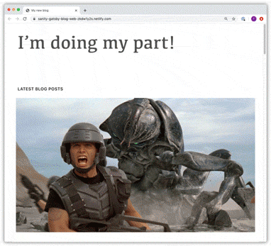
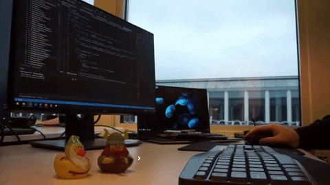

# Exploring the path of a new and unfamiliar codebase

Apr 7, 2020
・7 min read

About 2 months ago I changed jobs, I started working at DEV. As a senior developer, I’ve been through the process of finding my way through a new codebase a couple of times, and each time it seems to get a little easier and quicker. However, irrespective of skill level, there will always be an adjustment period, where I enjoy spending my time feeling around the codebase that I’ll be working with. Then, over time the code seems less daunting, I start making traction, I get more confident and then finally one day I feel like I’ve been working with this codebase all my life.

Doing it a couple of times has made me realise that there’s been some method to my madness; **there are some general guidelines and techniques that I follow to familiarise myself with a new codebase**. So this time, as I started working on the DEV codebase, I documented this method to my madness

So, where do we start?

## Let’s explore the production application

Before I join a new team, I usually do some basic research on their product. I tend to download and sign up for their application as part of my interview preparation. In some cases, like DEV, I’ve already been using their platform for a while and I’m familiar with it.

However, before tackling a new codebase **I still take some time to explore the parts of the interface that I don’t regularly use**. For example, with DEV, I familiarised myself with the different types of editors, I explored the filters, I looked through settings, I navigated to the sponsor pages. I want to know as much as possible, and I let myself just go on a journey of exploration.

**I also prefer getting a demo of the product from a team member if possible**. During these demos I usually find myself being alerted to parts of the system that I did not or would not stumble upon myself. Sometimes, it's the admin interface that I did not have access to as a user or perhaps a page that was tucked away and only gets used by a certain type of user.

An exploration of production also helps me to realise what the local setup of my environment should look and behave like.

## Now, we can clone the code and setup your environment

Next up, I clone the application (if I haven’t already).Thereafter, I briefly read through the documentation for setup instructions.

I feel no shame in saying that **when I get stuck on any errors (setup or otherwise), google and stack overflow are my best friends** . If that doesn’t work, I ask questions on my team chat, everyone on the team before me has set up the project so that means someone has most likely encountered the issue before. **Also, as I grew as a developer I learnt the balance between having to figure out the important things by myself vs asking for help**. A team is there to support and help each other, and it is beneficial to ask questions. Once I’ve figured out how to proceed, I always make sure to add my findings or anything that took me some time to figure out back to the documentation so that it helps the next person.

Once I’m all set up, I explore even further, this time within the codebase. I read through some code, navigate the file structures, take note of the packages and code styles that are used, and even just read some tests.

## Choose some bugs or simple tasks

Exploring is not enough, doing is key. **When we do, we end up solidifying our knowledge and we put the theories we have about the code into practice.**

Now, unless I’m working on a green fields project, every project has bugs - literally every single one . I like to pick up some of the bugs in the project. I do this because **I believe that fixing a part of a codebase allows me to get a much more detailed view into the system**. It also keeps me focussed on my end goal of getting this small piece of functionality working without the pressure of having to think about the aspects like UI and UX of a new feature. I don’t end up getting stuck in the details, because the details have already been implemented. In addition, there is very little uncertainty about the functionality because it was determined a long time ago. Removing all these other factors allows me to focus on what I need to - just the code. It also allows me to make progress and get more confident in the codebase.

Keeping the above in mind, **when choosing my first bugs, I try to stay away from complex, uncertain and not easily replicable ones that will cause me to feel overwhelmed and block on my traction.** In the open source world, like DEV, this is equivalent to the ‘good first issue’ tag. Once I’m past the exploration phase that’s when I like to challenge myself even further and take on the ones that hurt my brain

## Debugging and Solving the bug

Finally, **when I tackle the bug head on, there are a couple of techniques that I use**. These techniques are not unique to a new codebase, but they can be applied to any problem. Here are some:

First, I break up the problem into more manageable components, until they are small, less complex pieces. I then work through each piece as a task.

When debugging, I trace through the code in question from start to end (i.e. across the backend to the frontend) in order to find the point where the issue lies. I do the following:

- I use **loads of logs**! There's been times when I've added logs to every single function in a file to figure out it's path. Once I know the path then I’m easily able to figure out what may be going wrong. During this time, I’m learning about how the code works. The two things that I do diligently is I name my logs appropriately so as to not get lost in them and I also keep a note of the order of the logs (especially in javascript where things get performed asynchronously).
- When I’m stuck, I sometimes **comment out pieces of code**, just to see what the repercussions are and how or if the system explodes . Commenting out code usually indicates to me whether I’m looking in the right place. If I comment out code and the interface or feature still continues working, it means I’m clearly working in the wrong area of the codebase. I always keep in mind that I should not be afraid to try anything, it’s usually not possible to break an application in the development environment (at least I really hope so, or else we have bigger problems!!), and everything should be reversible. P.S, make sure that when you changing code on your development environment, you’re not mistakenly refreshing production wondering why your change is not working ‍♀️ Yes, this has happened to me numerous times!
- I use **debuggers to stop the execution of the code** in order to play with portions of the code that don’t make sense to me.

## That sounds cool, but, what if I’m still stuck?

If after debugging I find that I’m still stuck, I do some more research, try writing down the problem and maybe even rubber ducking, but at some point if all that doesn’t work then asking for a second pair of eyes on the problem becomes key.

**When we’re asking for help, it's important that we give colleagues as much information about the problem**. I usually start off by describing the problem to them, then explaining what I tried to do to solve it and what were the findings of it, and finally I ask direct questions on the portion of the code that isn’t making sense or that I need assistance with.

**Showing the work in progress also helps to give the other person perspective, as well as helps them to visually see what you’ve been working on to be able to assist.** It reduces the time wasted for them to have to try that which you’ve tried already. It is for this reason that [draft PR’s](https://github.blog/2019-02-14-introducing-draft-pull-requests/) have become really useful. Besides, it's better to get feedback earlier rather than later. Finally, if asynchronous feedback is not helping, don’t feel shy to ask someone in the team who's more knowledgeable on the topic to pair program just to get over the bump.

## During this process, what should I be mindful of?

- I believe that **changes should be made incrementally instead of in one ginormous pull request**. Testing often is essential too.
- Being conscious of the changes we make and adhering to the coding style ensures that we **have a consistent codebase**. It's important to feel confident to make improvements in the application, but when introducing new tools or technology that will affect other teams or the direction of the project we need to be sure to consult or give a heads up to everyone else (depending on the flexibility of the company).
- Irrespective of our skill level, we need to remember to **be empathetic and kind to the person who wrote the code before us**. Often I hear developers refer to the crap code that they inherited from the previous developer, but we need to keep in mind that we do not know the full context of the situation under which the code was written.
- Sometimes we’ll end up breaking things - **shit happens, acknowledge it, learn from it and move on!**

In conclusion, when one is not armed with techniques to approach a codebase, it can feel overwhelming and intimidating. However, as soon as there is a method to the madness it can easily metamorph those feelings to excitement and enjoyment instead. I hope that this does that for you :)!
