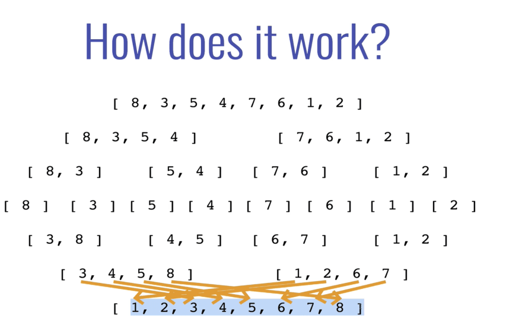

# DEV Community ‍‍

```
                   -Merge Sort: Introduction
                   -Merge Arrays: Implementation
```

### Merge Sort: Introduction

Merge sorting is a combination of merging and sorting, works by decomposing an array into smaller arrays, also known as a divide and conquer strategy. The process split up larger array into smaller sub arrays all the way down until get to 0 or 1 element, then building up a newly sorted array.

[](https://res.cloudinary.com/practicaldev/image/fetch/s--34J17wHs--/c_limit%2Cf_auto%2Cfl_progressive%2Cq_auto%2Cw_880/https://dev-to-uploads.s3.amazonaws.com/i/8bvvaj8buvhnjc5djmlx.png)

### Merge Arrays: Implementation

#### Merge Sort Example

```
function merge(arr1, arr2){
    let results = [];
    let i = 0;
    let j = 0;
    while(i < arr1.length && j < arr2.length){
        if(arr2[j] > arr1[i]){
            results.push(arr1[i]);
            i++;
        } else {
            results.push(arr2[j])
            j++;
        }
    }
    while(i < arr1.length) {
        results.push(arr1[i])
        i++;
    }
    while(j < arr2.length) {
        results.push(arr2[j])
        j++;
    }
    return results;
}
merge([100,200], [1,2,3,5,6])
```

#### Most merge sort implementation use recursion.

```
function merge(arr1, arr2){
    let results = [];
    let i = 0;
    let j = 0;
    while(i < arr1.length && j < arr2.length){
        if(arr2[j] > arr1[i]){
            results.push(arr1[i]);
            i++;
        } else {
            results.push(arr2[j])
            j++;
        }
    }
    while(i < arr1.length) {
        results.push(arr1[i])
        i++;
    }
    while(j < arr2.length) {
        results.push(arr2[j])
        j++;
    }
    return results;
}

//Recrusive Merge Sort
function mergeSort(arr){
    if(arr.length <= 1) return arr;
    let mid = Math.floor(arr.length/2);
    let left = mergeSort(arr.slice(0,mid));
    let right = mergeSort(arr.slice(mid));
    return merge(left, sright);
}

mergeSort([10,24,76,73])
```

## Discussion (1)


You still use arr functions instead of pure use like C / C ++ language, I tried to implement mergesort with Typescript on tsplayground like it doesn't really work.

[
Reply](https://dev.to/code_regina/merge-sort-1boo#/code_regina/merge-sort-1boo/comments/new/1bcco)
