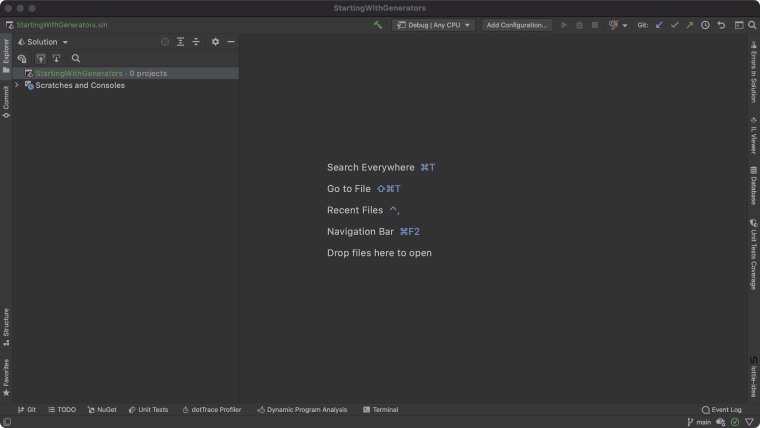
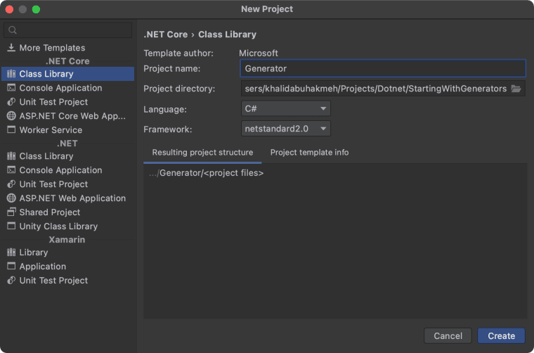
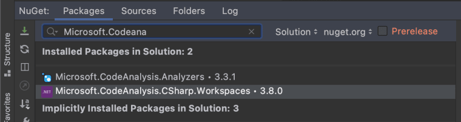
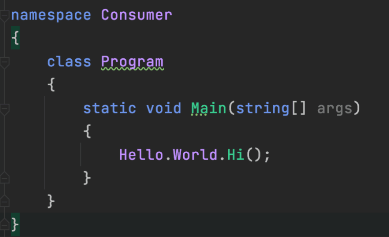
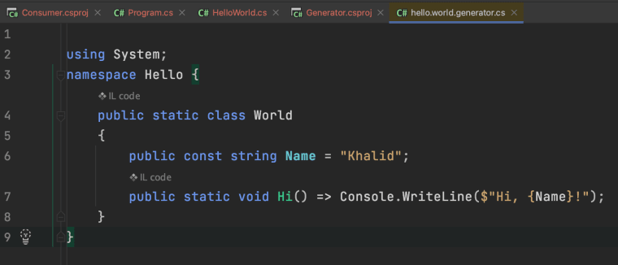

# .NET 5 Source Generators Jump Start


Photo by [Victor Rodriguez](https://unsplash.com/@vimarovi)

You may have heard about a new feature in [.NET 5 called **Source Generators**](https://devblogs.microsoft.com/dotnet/introducing-c-source-generators/). Developers can now generate dynamic code at compile time that .NET will weave into a consuming assembly. The possibilities are endless and will most likely have a profound impact on how we write applications and, ultimately, the performance we can expect from our apps.

That said, getting started with source generators can seem a bit opaque. In this post, we’ll start with nothing and go through creating a source generator ready solution.

## [Step 1. Empty Solution](https://khalidabuhakmeh.com/dotnet-5-source-generators-jump-start#step-1-empty-solution)

[First, we’ll need the .NET 5 SDK installed](https://dot.net/). Don’t proceed until you have the latest SDK. While we could start with an existing project, let’s start with an empty solution. Starting from scratch will help us understand the parts of a source generator-powered solution.



## [Step 2. Add Class Library](https://khalidabuhakmeh.com/dotnet-5-source-generators-jump-start#step-2-add-class-library)

We need to add a class library that will hold our source generators. While we could embed source generators into our main project, we should keep generators separate for reusability. The name of the project isn’t critical. In this case, we’ll just name the project `Generators`. We also need to ensure that the **target framework** of the project is `netstandard2.0`. Although .NET 5 introduces source generators, it doesn’t mean we can’t use them for apps with `netstandard2.0` compatibility. As long as the generator uses a syntax our target project can utilize.



## [Step 3. Add NuGet Packages To Generator Class Library](https://khalidabuhakmeh.com/dotnet-5-source-generators-jump-start#step-3-add-nuget-packages-to-generator-class-library)

Now that we have a class library let’s add a few NuGet Packages.

- `Microsoft.CodeAnalysis.Analyzers`
- `Microsoft.CodeAnalysis.CSharp.Workspaces`



We can make sure that we installed our dependencies correctly by looking at the `Generator.csproj` file.

```
<Project Sdk="Microsoft.NET.Sdk">

    <PropertyGroup>
        <TargetFramework>netstandard2.0</TargetFramework>
    </PropertyGroup>

    <ItemGroup>
        <PackageReference Include="Microsoft.CodeAnalysis.Analyzers" Version="3.3.1">
            <PrivateAssets>all</PrivateAssets>
            <IncludeAssets>runtime; build; native; contentfiles; analyzers; buildtransitive</IncludeAssets>
        </PackageReference>
        <PackageReference Include="Microsoft.CodeAnalysis.CSharp.Workspaces" Version="3.8.0">
            <PrivateAssets>all</PrivateAssets>
        </PackageReference>
    </ItemGroup>

</Project>
```

## [Step 4. Write a Generator](https://khalidabuhakmeh.com/dotnet-5-source-generators-jump-start#step-4-write-a-generator)

Let’s edit the `Class1.cs` file with an `ISourceGenerator` implementation. We have two methods that we need to implement: `Initialize` and `Execute`. We only need to implement `Execute` by adding some short C# code.

```
using System.Text;
using Microsoft.CodeAnalysis;
using Microsoft.CodeAnalysis.Text;

namespace Generator
{
    // ReSharper disable once UnusedType.Global
    [Generator]
    public class HelloWorld : ISourceGenerator
    {
        public void Initialize(GeneratorInitializationContext context)
        {
            // nothing happening
        }

        public void Execute(GeneratorExecutionContext context)
        {
            var code = @"
using System;
namespace Hello {
    public static class World 
    {
        public const string Name = ""Khalid"";
        public static void Hi() => Console.WriteLine($""Hi, {Name}!"");
    }
}";
            context.AddSource(
                "hello.world.generator",
                SourceText.From(code, Encoding.UTF8)
            );
        }
    }
}
```

Our project should compile now. Let’s move on to consuming our generator.

## [Step 5. Consumer App](https://khalidabuhakmeh.com/dotnet-5-source-generators-jump-start#step-5-consumer-app)

Let’s create a brand new `Console` application to consume our generator. After adding the project, we’ll need to install the `Microsoft.Net.Compilers.Toolset` NuGet package. This package will find source generators in referenced packages and projects.

Next, we’ll need to add a reference to our `Generator` project. We must add the `OutputItemType` and `ReferenceOutputAssembly` attributes to our project reference.

When complete, our `csproj` file should look something like the following.

```
<Project Sdk="Microsoft.NET.Sdk">

    <PropertyGroup>
        <OutputType>Exe</OutputType>
        <TargetFramework>net5.0</TargetFramework>
    </PropertyGroup>

    <ItemGroup>
      <ProjectReference Include="..\Generator\Generator.csproj" 
                        OutputItemType="Analyzer" 
                        ReferenceOutputAssembly="false" />
    </ItemGroup>

    <ItemGroup>
      <PackageReference Include="Microsoft.Net.Compilers.Toolset" Version="3.8.0">
        <PrivateAssets>all</PrivateAssets>
        <IncludeAssets>runtime; build; native; contentfiles; analyzers; buildtransitive</IncludeAssets>
      </PackageReference>
    </ItemGroup>

</Project>
```

## [Step 6. Use The Generated Code](https://khalidabuhakmeh.com/dotnet-5-source-generators-jump-start#step-6-use-the-generated-code)

It’s a good idea to build the solution at this point to ensure all is working correctly. Once we get a successful build, we can use our editor to reference our generated classes. Since our IDE adds generators as Roslyn analyzers, we also get code completion.

```
namespace Consumer
{
    class Program
    {
        static void Main(string[] args)
        {
            Hello.World.Hi();
        }
    }
}
```



We can see the generated code when we click on the `Hi` method using JetBrains Rider’s decompilation tool.



## [Step 7. Run It!](https://khalidabuhakmeh.com/dotnet-5-source-generators-jump-start#step-7-run-it)

Now that we set up our solution, we can run our console application. If all has gone accordingly, we will see the following output.

```
Hi, Khalid!
```

## [Conclusion](https://khalidabuhakmeh.com/dotnet-5-source-generators-jump-start#conclusion)

The purpose of this post was to get you up and running with source generators. Once a solution is ready and has the necessary packages, it’s a straightforward task to generate our code. Hopefully, you found this post helpful, and please leave a comment below on how you intend to use source generators.

If you need to see a working project, you can clone a [working sample at my GitHub repository](https://github.com/khalidabuhakmeh/source-generator-test).
