# Loop Optimizations in C# (and various other compilers)

This post comprises infographics showing various loop optimizations that happen in C# (dotnet) and other languages.

#### [LevelUp++](https://leveluppp.ghost.io/author/bartosz/)

9 Feb 2021
• 4 min read

This post comprises infographics showing various loop optimizations that happen in C# (dotnet).

I've also tested simple loops in GO and Rust, but they need more tests, and separate posts will be made for these compilers; Go and Rust's tests will be in the bonus section of this article.

**Warning**: Compilers improve with time. Therefore, most graphics will contain the compiler version.

Let's start with C# and two of its primary optimizations:

- Loop Cloning
- Loop Hoisting

### Loop Cloning:

Loop cloning is a very clever technique that will try to avoid array bounds checking when we loop on some unspecified range:

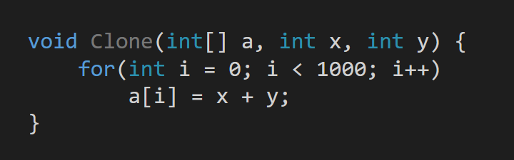

To solve this problem, the compiler will clone the loop, and slow and a fast path will get generated:

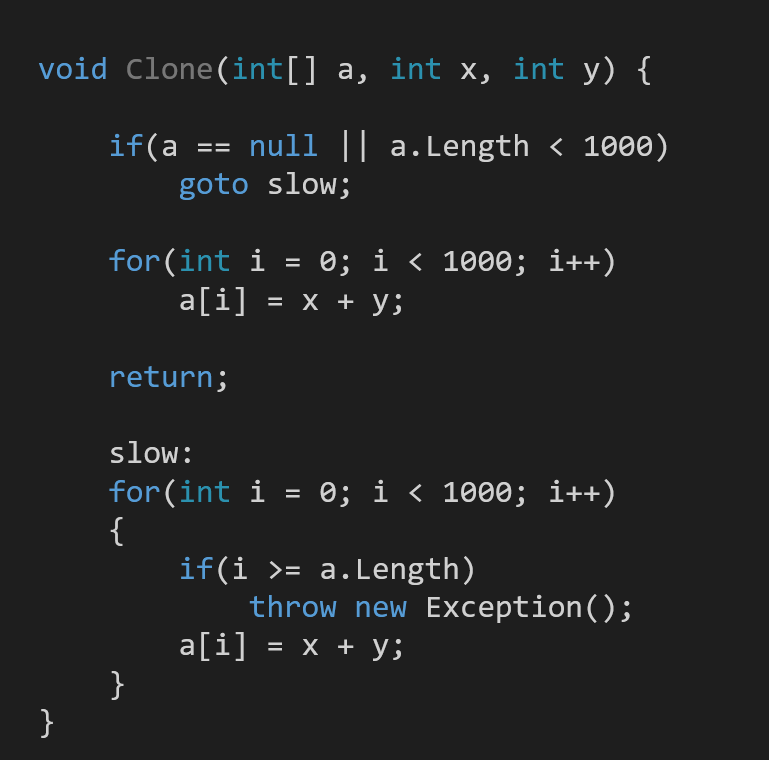

This allows us to get rid of all of the bounds checking in the fast path.

### Loop Hoisting:

Hoising will move expressions that can be computed once out of the loop into a temporary variable (register) and resue it.

So a loop:

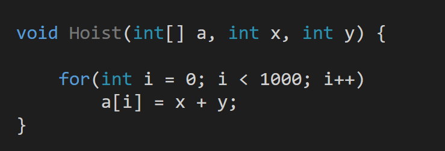

Will get converted to:

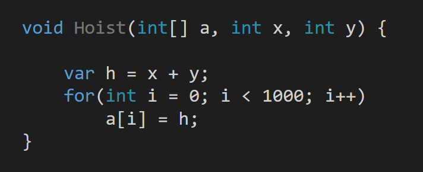

### C# Compound vs Non-Compund Assigment:

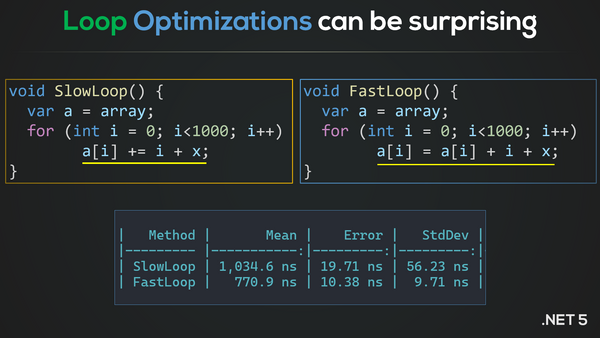

It turns out that compound assignment works differently than the non-compund one, and instead of using temp locals, it will instead emit a "dup" instruction in IL, which will duplicate the lvalue on the stack and prduce a pointer to this value.

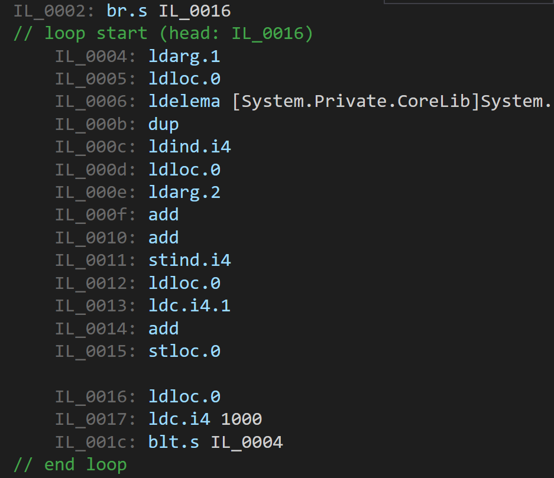

This confuses the JIT compiler, and no optimizations (loop cloning, computation hoisting) are happening in such a loop.

If we look at the non-compound version in IL, we shall see this:

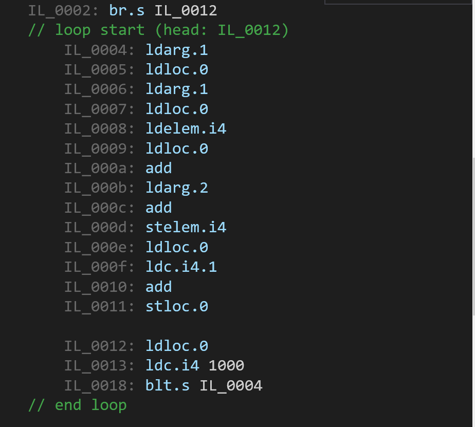

### C# Try-Catch Blocks:

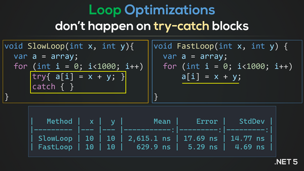

Loop optimizations such as cloning and hoisting will not happen in try-catch blocks.

Even if we have something that can be discarded in a try-catch block and meaningful computation after it, the loop will not be cloned.

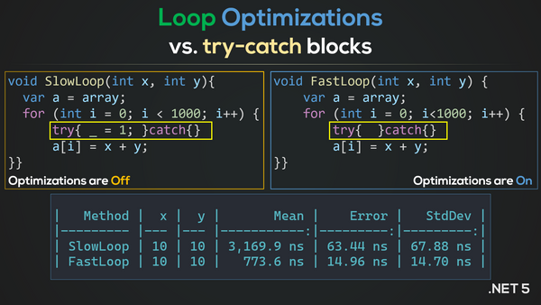

In this case, the empty try-catch will get removed, while the discard assignment will remain, and it will block loop cloning.

### C# Loop Optimizations are sensetive:

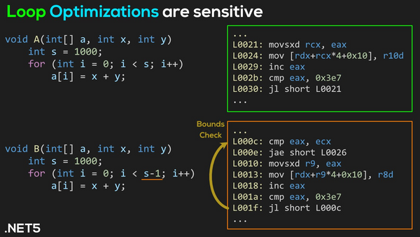

If our range is slightly more complicated (like a computation) in the loop condition,  loop cloning will not happen, and the compiler will emit bounds check on every iteration.

### C# Loop Optimizations are tricky on Span<T>:

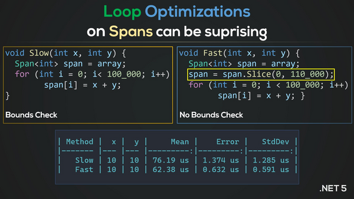

As you can see the compiler managed to figure out that the program will not crash in the fast case and removed all of the bounds checks. It's a good practice to create a slice and work on that slice since this will allow the compiler to make correct decisions.

### C# Prolog and Epilog:

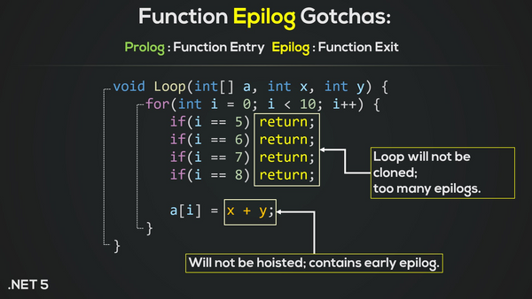

**Prolog** means creating a stack frame for the function and putting all of the necessary function arguments on the stack with a proper state.

On the other hand, **Epilog** means cleaning up the stack from all of the locals that were produces and destroying the function frame.

While it's difficult to translate what a prolog and Epilog mean in user code (since a return statement is not necessary, an epilog), if we have too many returns from a function in a loop, optimizations will be off.

### C# Loop Cloning Tips:

As you can tell by now, loop cloning in C# can be very stingy and picky, so you have to hit the pattern exactly for it to work. So here's an infographic showing most of the things that you have to get right:

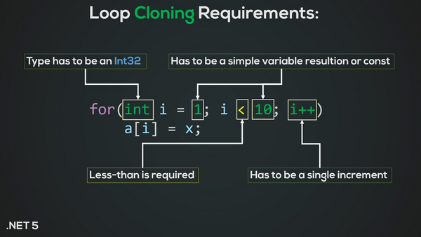

### [Bonus] GO Loop Optimizations:

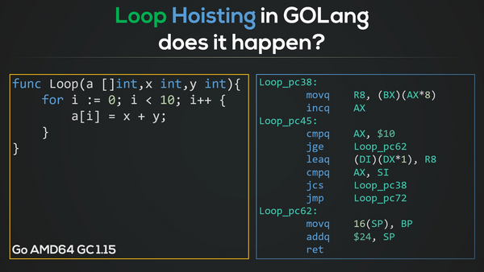

In my simple tests, I hardly saw any advanced optimizations applied in the GO compiler. I'm told that this is a part of the philosophy of everything being simple in GO, both at the language level and the compiler level.

### [Bonus] Rust Loop Optimizations:

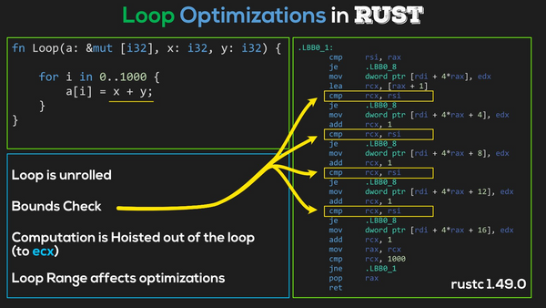

Rust produces tons of optimizations, and they are dependent on the range construction (and count). It will still emit bounds checks, but it will do loop unrolling, hoisting, and many more interesting tricks.

### [BONUS] Other Related (and Unrelated) Graphics:

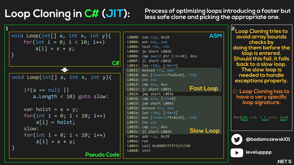

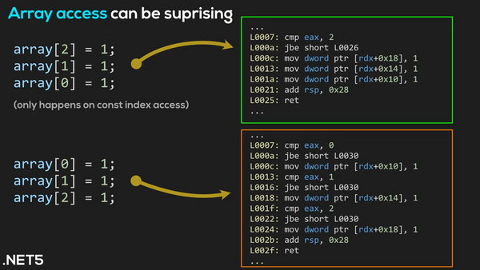

### The End

This content took a while to create, so if you like it, please consider buying me a coffee

### Subscribe to LevelUp++

Get the latest posts delivered right to your inbox
