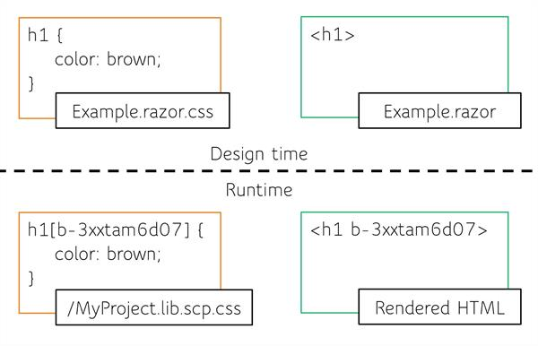
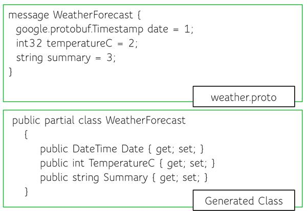
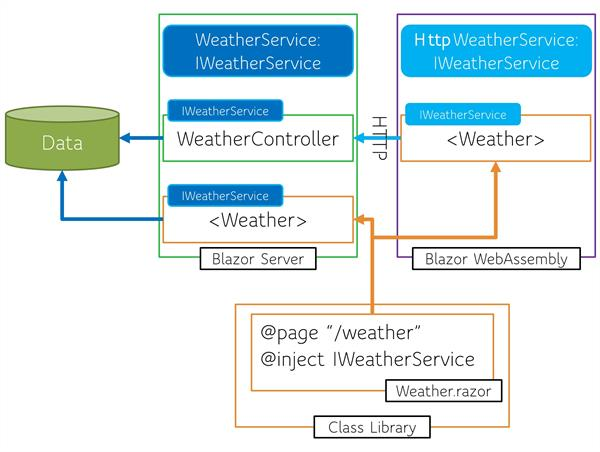

# 10 Blazor Features You Probably Didn't Know


As a relatively new framework, there's probably a lot you don't know about Blazor yet. Here are 10 great features about Blazor you should know.

By now you may have heard about Blazor, the new .NET web framework that runs on WebAssembly. It’s relatively new to the web development ecosystem and has come a long way in a short period of time. While Blazor has gained significant popularity in recent months, there are still many misconceptions about what Blazor is capable of. In this article we’ll explore some of the less obvious, but equally important (arguably more important) features of the Blazor framework.

## Blazor Can Do Anything HTML & CSS Can Do

One question that is often asked when approaching Blazor is regarding the use of some user interface framework, CSS library, or specific CSS feature. The answer is a resounding, YES. While Blazor uses Razor templates to create components, the result is HTML rendered in the browser. The HTML and CSS generated by Blazor is no different to the browser than any other HTML or CSS. This means all valid HTML and CSS is valid within a Blazor application. This means you can use all CSS features including media queries for responsive design, CSS custom properties (variables), and even pre-processors like Sass.

**Form Components**

Blazor has additional features to help with HTML generation such as built in Form and Input components. These are optional components that abstract away the common task of building a form with validation. Ultimately the components render standard HTML. These components can fully utilize standard HTML attributes like: class, id, and aria-.

**CSS Isolation**

Blazor has built in CSS isolation which helps avoid styling conflicts among components and libraries. CSS isolation is generated at build time. At this time Blazor appends a unique identifier to CSS selectors which match an HTML attribute in the markup rendered by the component.



This feature leverages CSS and HTML attributes which are all web standard technologies and understood natively by the browser. The result is CSS selectors with a high level of specificity which cannot be overridden by normal CSS cascading.

**Fun Fact**

[Telerik UI for Blazor](https://www.telerik.com/blazor-ui) was written from the ground up to take advantage of the Blazor framework's complete feature set. The component logic, templates, and APIs were written in C#, but Telerik UI for Blazor shares a common CSS library with its JavaScript based sibling, Kendo UI. Both Telerik UI for Blazor and Kendo UI are powered by a very intuitive Sass library and point-and-click [theme builder](http://themebuilder.telerik.com/).

## Blazor Can Do Anything JavaScript Can Do

Just because Blazor uses .NET and WebAssembly doesn’t mean that it is limited when working with the browser. The Blazor framework makes common tasks easy, such as working with the DOM (rendering components and HTML), fetching data over HTTP, and client-side routing. While Blazor is enabled by .NET and WebAssembly, it’s not restricted by it. Blazor also has full access to the browser’s JavaScript APIs through JavaScript interoperability (JS interop). A Blazor app can invoke JavaScript functions from .NET methods and .NET methods from JavaScript functions. JavaScript interop is used when the Blazor framework lacks an API or component for a desired feature, or when developers would like to utilize the JavaScript ecosystem.

**Blazor Can’t Do What JavaScript Cannot**

Web standards and browser capabilities have evolved to a feature rich and secure environment. Web standard technologies like WebAssembly not only enable Blazor but restrict it to the same criteria as JavaScript. Just because Blazor runs on .NET and WebAssembly does not grant it special abilities that reach outside of the browser’s (JavaScript’s) security sandbox. This means Blazor and .NET code can not read the registry, detect the currently logged in Windows user, or access Outlook accounts.

## Combining MVC + Blazor in the same project

[Is there an official way to use MVC and Blazor (client side) in the same project?](https://stackoverflow.com/questions/54630728/combining-mvc-blazor-in-the-same-project)

If you’re currently working on an ASP.NET Core MVC or Razor pages application, then you still can make use of Blazor. Since Blazor is part of ASP.NET Core it can integrate with existing applications quite nicely. This behavior can provide a [migration path to Blazor](https://www.telerik.com/blogs/migrating-mvc-to-blazor) or just add additional flexibility to your codebase. To make use of this feature you’ll use the “[component tag helper](https://docs.microsoft.com/en-us/aspnet/core/mvc/views/tag-helpers/built-in/component-tag-helper?view=aspnetcore-5.0)” to render the desired Razor Component (Blazor’s component model) in an MVC application.

```
<component type="typeof(MyComponent)" render-mode="ServerPrerendered" param-Name="Value" />
```

*This YouTube video discusses the component tag helper, and mixing MVC and Blazor.*

**Pre-Rendering and Authentication**

Not only can you use Blazor in an MVC or Razor pages application, but it’s part of the tech stack that enables Server Pre-rendering in Blazor as well as Microsoft Identity Authentication. When using either a Blazor Server, or Blazor WebAssembly application with pre-rendering enabled, the application will utilize cshtml pages to bootstrap the application. In a typical Blazor Server application a \_host.cshtml file initializes the Blazor client using a component tag helper as shown in the code sample below.

```
<component type="typeof(App)" render-mode="ServerPrerendered" />
```

In addition, Identity’s Authentication pages are written in cshtml and rendered on the server, even in a Blazor application.

## SignalR Without JavaScript

When Blazor was first released it was only possible to use SignalR through JavaScript libraries. This has changed and Blazor now has a NuGet package that enables SignalR without the need for JavaScript. The Microsoft.AspNetCore.SignalR.Client package is all you need to connect your Blazor application to a SignalR hub and the best part is you can do it all through C# code. With the SignalR HubConnection class a Blazor application can connect to a hub, send, and receive commands.

```
// Create a connection
hubConnection = new HubConnectionBuilder()
    .WithUrl(NavigationManager.ToAbsoluteUri("/chathub"))
    .Build();

// Start a connection
await hubConnection.StartAsync();
// Action taken when a command is received
hubConnection.On<string, string>("ReceiveMessage", (user, message) =>
{
    var encodedMsg = $"{user}: {message}";
    messages.Add(new Message { Text = encodedMsg });
});

// Invoke a hub command
Task Send() => hubConnection.SendAsync("SendMessage", userInput, messageInput);
```

With only a few lines of code it is possible to [create a real-time chat application using ASP.NET Core and Blazor WebAssembly](https://docs.microsoft.com/en-us/aspnet/core/tutorials/signalr-blazor-webassembly?view=aspnetcore-5.0&tabs=visual-studio).

## gRPC and Protobuf

.NET fully supports gRPC (Remote Procedure Call), a modern open source high performance RPC framework. With the release of .NET 5.0, both ASP.NET Core and Blazor received integrated support for gRPC. Support includes a library for creating a gRPC server in ASP.NET and a gRPC client in Blazor WebAssembly. gRPC applications communicate between client and service through a channel. Tooling will automatically generate .NET partial classes from protobuf files (.proto) which represent concrete clients and services. Partial classes are used so they can be easily extended by developers when needed.



A gRPC client is created using a channel, which represents a long-lived connection to a gRPC service. A channel is resolved through dependency injection using the GrpcChannel object.

```
@inject GrpcChannel Channel

<TelerikGrid Data="forecasts" AutoGenerateColumns="true"></TelerikGrid>

@code {
    private IList<WeatherForecast>? forecasts;

    protected override async Task OnInitializedAsync()
    {
        // Create a client for this channel
        var client = new WeatherForecasts.WeatherForecastsClient(Channel);

        // Call the WeatherService GetWeatherForecast method
        var emptyRequest = new Google.Protobuf.WellKnownTypes.Empty();
        var response = await client.GetWeatherForecastsAsync(emptyRequest);

        // Get the forecasts property
        forecasts = response.Forecasts;
    }
}
```

This new protocol allows developers to choose between RESTful JSON APIs, WebSockets with SignalR, or binary communication using gRPC. Using gRPC in a Blazor application is rather straightforward, just follow the steps in [**How to Add gRPC to Your Blazor App**](https://www.telerik.com/blogs/how-to-add-grpc-to-your-blazor-app)to get started.

## Razor Class Libraries: Routing and Services

Not only is it easy to share .NET code with Class Libraries, but it’s just as easy to share Razor Components and web assets with Razor Class Libraries. Razor Class Libraries (RCL) can include CSS, JavaScript, static files like images, and components. Components in a RCL may contain route directives and those routes are easily added to any Blazor application that wishes to consume them.

**Configuring Shared Routing**

In a Blazor application’s root component App.razor is where routing is configured by the Router component. The Router component has an optional AdditionalAssemblies parameter which is used to locate routes from other assemblies. Simply reference the Assembly and Blazor will locate any routes and add them to the application. Duplicate routes will cause a compiler error, so use with caution.

```
<Router
    AppAssembly="@typeof(Program).Assembly"
    AdditionalAssemblies="new[] { typeof(MyComponent).Assembly }">
    ...
</Router>
```

**Service Interfaces for Razor Class Libraries**

In addition to sharing routes, components in RCLs can also use interfaces to share services. Given the nature of Blazor, apps can run client-side in WebAssembly or on the server. The main difference between components running in WebAssembly vs. server side is how they obtain data. For WebAssembly the application will require an HTTP request to fetch its data, however a server application can interact with services directly without HTTP. Writing a component that is agnostic to the running context is as easy as using an interface. Using an interface gives a component the flexibility to share everything, while letting the executing application provide the implementation details for a data service.



In the figure above we can see a diagram of how two applications can use a shared component while delegating a data service though an interface.

## Lazy Loading .NET

Performance is a concern for any application and web application payload size receives a lot of scrutiny. In .NET 5.0 new infrastructure was added for Blazor to load libraries on demand. Loading assemblies on demand reduces the initial load time of the application by deferring the request for the resource until it is needed. While support is included in the Blazor framework, it isn’t enabled by default and Blazor must be instructed on when to load the resource. One benefit to the manual setup involved is that the specifications for loading the assembly are custom to the application’s needs.

**Configuring Lazy Loading**

A few steps are necessary to enable lazy loading in an application. First the assemblies that will be lazy loaded must be predefined in the application’s csproj configuration file. The BlazorWebAssemblyLazyLoad item type prevents the included assembly from being loaded when the application launches.

```
<ItemGroup>
  <BlazorWebAssemblyLazyLoad Include="LazyLoadMe.dll" />
</ItemGroup>
```

Next, the application requires a service to be registered for lazy loading assemblies. The LazyAssemblyLoader class is a framework-provided singleton service for loading assemblies. This service is registered through dependency injection so it can be injected into the root component of the application, App.razor.

```
services.AddScoped<LazyAssemblyLoader>();
```

Finally, in the application’s root component App.razor navigation is intercepted using the OnNavigateAsync. The OnNavigateAsync event is fired on every page navigation and can be used to lazy load assemblies based on route information. When the event is triggered the LazyAssemblyLoader’s LoadAssembliesAsync method the assemblies are fetched via a network call and loads assemblies into the runtime executing on WebAssembly in the browser.

```
@inject LazyAssemblyLoader assemblyLoader
<Router AppAssembly="@typeof(Program).Assembly" OnNavigateAsync="@OnNavigateAsync">
…
@code {
private async Task OnNavigateAsync(NavigationContext args)
    {
        try
        {
            if (args.Path.EndsWith("/lazy-assembly"))
            {
                var assemblies = await assemblyLoader.LoadAssembliesAsync(
                    new List<string>() { " LazyLoadMe.dll" });
                lazyLoadedAssemblies.AddRange(assemblies);
            }
        }
        catch (Exception ex)
        {
            ...
        }
    }
}
```

## Lazy Loading JavaScript

In .NET 5.0 Blazor received an update that makes JavaScript modules a first-class citizen. Along with JavaScript modules comes the ability to lazy load modules though the JavaScript interop, JSRuntime service. To take advantage of the dynamic loading capability of the JSRuntime the InvokeAsync<IJSObjectReference> method is used. The type, IJSObjectReference is used as the expected return type from the method is a reference to the loaded JavaScript module.

Below are the JavaScript interop (C#) and equivelent JavaScript code that would execute in the browser to dynamically load a module.

```
// C#
module = await JS.InvokeAsync<IJSObjectReference>("import", "./exampleJsInterop.js");
```

```
// JavaScript Code
let module = await import(modulePath)
```

Once the module is loaded its JavaScript functions can be called through its own InvokeAsync method.

```
// exampleJsInterop.js
export function showPrompt(message) {
    return prompt(message, 'Type anything here');
}
```

```
// Example.razor
@code
{
    IJSObjectReference module;
    string result;
    protected override async Task OnAfterRenderAsync(bool firstRender)
    {
        if (firstRender)
        {
            module = await JS.InvokeAsync<IJSObjectReference>(
                "import", "./exampleJsInterop.js");
        }
    }
        Task Prompt(string message)
        {
            result = await module.InvokeAsync<string>("showPrompt", message);
        }
    private async ValueTask IAsyncDisposable.DisposeAsync()
    {
        await module.DisposeAsync();
    }
```

When using JavaScript modules it is important to dispose of their resources after they are no longer needed. In the example above, the component uses the IAsyncDisposable interface to dispose of the module during the DesposeAsync lifecycle method.

## Use Preexisting .NET Libraries

There’s a good chance that existing .NET code runs in Blazor without any modification. Because Blazor is running standard .NET code, this means your application can use .NET dlls and NuGet packages that were written before Blazor was released. Libraries that support .NET Standard or .NET Core and do not target a specific platform APIs (ex: Xamarin or Desktop) will likely work in Blazor. Some libraries that make great examples include [Markdig](https://www.nuget.org/packages/Markdig/), a library for converting markdown strings to HTML, or [FluentValidation](https://www.nuget.org/packages/FluentValidation/) for creating application wide validation rules.

Now is a great time to experiment with code you already have in your personal library.

## Full Stack Testing and QA

Blazor is a new web application framework that promises to deliver native web client experiences without the need for writing JavaScript. Developers can comfortably build full stack web applications with the .NET framework and tools. Many highlight this .NET foundation as Blazor’s strength, however the story of Blazor testing may just be its biggest potential upside. In the article **[Blazor Stability Testing Tools for Bulletproof Applications](https://www.telerik.com/blogs/blazor-stability-testing-tools-for-bulletproof-applications)** you'll find the core concepts that make Blazor an ideal candidate for testing and the tools that support: Unit Testing, Integration Testing, and Automated System Testing.

## 5 Things Telerik UI for Blazor Can Do

### Even More!

Nearly 50 .NET articles (including this one) will be published in December as part of the awesome 2020 [C# Advent Calendar](https://www.csadvent.christmas/).
