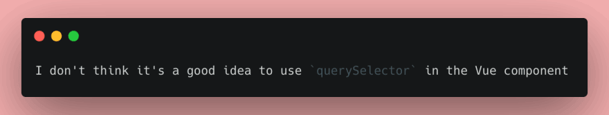
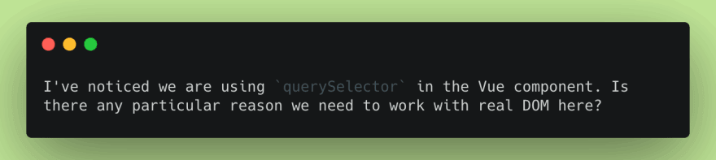

# Six tips to improve your code review skills

Mar 1
・3 min read

In my opinion, code review is one of the most effective tools for improving the code base and aligning your team's coding skills. But, as with any tool, it can be used in the wrong way: it can hurt people, it can lead to conflicts and it can slow down delivering new features. As one of GitLab's frontend maintainers and a maintainer of Vue.js documentation, I am reviewing pull/merge requests daily (and I've done lots of mistakes when I was learning to review code effectively!). In this article, I'll try to share a few techniques that helped me make my reviews better without giving up the quality of the code.

## Test the changes locally

Seriously, do it. Whenever you have a pull request to review, try to check out the branch and look at the changes. Not only this helps with [smoke testing](https://en.wikipedia.org/wiki/Smoke_testing_(software)) but it also makes you review deeper. Sometimes code changes look perfectly legit until you read an issue, test the implementation and realize that they are good on the \_ low-level\_ - but architecture could and should be improved.

## Ask questions, don't make statements

Whenever you see something that seems obviously bad to you and you are ready to type something like `This is a bad practice and we should not use it` - stop for a second. There are chances that your colleague is well aware he is doing something not perfectly, and they might have a good reason for it. Before making conclusions, try to ask some questions to understand the context.

Bad:

Better:

## Don't hesitate to praise

This one was extremely hard to learn for me. For some reason, I believed that making a code review is equal to catching all the possible mistakes. Because when someone is doing their job good (in this case, writing the code) good, they should do it by default, right?

No. Not right.

Praising is an important part of code review. As well as we should discourage bad practices in the code, we should *encourage good practices*. If you see something written nicely, state it openly. An important moment here is being honest and specific: don't praise if you don't see anything worth appraisal, and don't just say "good job!". "I like the way you structure your unit tests! It's very easy to follow" works better.

## Label your comments

This point I've learned from my colleague [Paul Slaughter](https://twitter.com/souldzin). The idea is to prefix a comment with a certain label, clearly stating the point of the comment:

**question**: I've noticed we are using `querySelector` here. Is there a reason why we need to access a real DOM?

**suggestion**: We could simplify this calculation by using a ternary operator here.

**nitpick**: When checking primitives, we could use `toBe` instead of `toEqual`.

This helps the code author to understand the reviewer's intention better and prevent misunderstandings. You can read more about this convention on the [Conventional Comments website](https://conventionalcomments.org/)

## Separate blocking from non-blocking

One more additional point about labeling comments is also clearly stating if your concern is blocking. Do we absolutely need to make this change before merging pull request to `master`? Or is it something minor that can be handled in the follow-up issue or ignored altogether as it's a matter of preference? I prefer to mark blocking comments as **issue** and non-blocking with **nitpick** but it's completely up to you how to express your point. Separating blocking comments from non-blocking helps with keeping the code clean while not sacrificing team performance during endless back-and-forth review rounds.

## Make an extra step

One more thing to improve the time-to-merge metric is making an extra effort as a reviewer to prevent additional rounds of review. Write explanatory comments - this will help the author to understand the need to change the code and will prevent additional questions. There is something that requires a really long explanation and needs multiple changes? Create a code patch and add it to your comment with a short description of what this patch is doing. This will speed up the process significantly.

Do you have your favorite code review suggestions? Share them in the comments and let's learn from each other!

## Discussion (1)

Subscribe

Love the idea about labeling your comments! I've made comments about code where my intention wasn't always clear, this might help. Thanks!

[
Reply](https://dev.to/n_tepluhina/six-tips-to-improve-your-code-review-skills-95a#/n_tepluhina/six-tips-to-improve-your-code-review-skills-95a/comments/new/1c27k)
