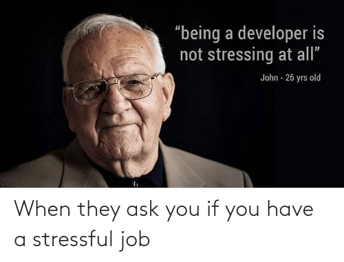

# Introduction

Stress is a natural reaction of our body when we face situations we can't cope with (for example, that one piece of code you can't figure out).

Unfortunately, it can be a little overwhelming at times, and if we don't do something about it, it can cause some severe health problems.

Due to stress, we can lose motivation, get anxious, not be able to fall аsleep, and also develop heart diseases.

If you don't want stress to take over your life, try to follow some of these steps!

# 1. Keep a positive mindset

It may sound totally cliche, but it is actually the most important and helpful thing to do.

There are some days when everything goes wrong, for example, when your code just doesn't work out, but you should not let that keep you down.  
Sometimes not everything will go exactly the way you want it to.

When you bump into something you can't figure out, instead of spending too much time stressing about it, take a little break to get your mind off it. Go out for some fresh air and then try again.

Don't stress about the little things, keep your consciousness clear, and keep your head up, even if everything seems to fall apart sometimes.

# 2. Move your body

> Your body is your temple. Keep it pure and clean for the soul to reside in. -B.K.S. Iyengar

Daily movement is essential to leading a healthy life. Exercise helps us relieve stress and keep our minds clear.

Tension builds up from sitting in one place for long periods of time so even getting up from your desk for a few minutes to walk around the room and stretch a little bit is super good for your body.

# 3. Have a good diet

People are often mistaken and associate the word diet with starving and restricting yourself from certain foods.

Having a healthy diet by eating a variety of foods that are good for your body so that you can get all the vitamins and minerals you need.   
There are also some nutrients, foods, and drinks which help reduce stress. Vitamin C and dark chocolate help lower the level of stress and anxiety, and chocolate also makes you feel happier! Chamomile and mint tea are also commonly used to relieve stress and induce calmness.

Moreover, I am sure you have heard this a lot, but drinking water is the solution to everything. Headaches are quite often caused by dehydration, so next time you start programming, make sure to get yourself a glass of water before that.

# 4. Spend less time on your phone

Our job requires spending a lot of time in front of a monitor, which can take quite a lot of your energy. So during your free time off your computer, try not to use your phone too much.

Instead of being on your phone, you can take up new hobbies. For example, try reading a book, start going out more often, or listen to music.

All of the things above are better for you than being on your phone. They help you relax and ease your mind.

Social media also can be stressful and distracting. There are many reasons why social media is harmful, so reducing the time you spend on it is an excellent idea. For example, try putting a daily limit on all of these apps, and I am sure that after a few days, you will already feel the difference.

# 5. Get enough rest and sleep

Sleeping is one of the best stress-reducers. Sleep helps us have a restored body, more concentration, a clearer mind, and helps us cope up with stress easily. When we are well-rested, we have more energy, and we are better at making decisions, solving problems, and learning and remembering new things is much easier.

However, sometimes the presence of stress makes falling asleep difficult or make us come in and out of sleep during the night. In these situations, chamomile and mint tea and the step below are beneficial.

# 6. Meditate

Meditation can help with stress, anxiety, and also lack of confidence. In the past, it was used for deepening the understanding of the sacred and mystical forces, but nowadays, it is mainly used for relaxation and reducing stress.

Practicing meditation helps us have a better focus on our thoughts so that we can understand them and find out what causes our anxiety and stress.

Besides, there different and engaging styles of meditations: mindfulness meditation, spiritual reflection, focused meditation, movement meditation, and mantra meditation. You just have to try and find out which one is the most helpful and suitable for you.

# 7. Go easy on yourself

Sometimes there are many things we want to achieve and succeed in that we put too much pressure on ourselves. We demand too much, and that causes stress and sometimes also a lack of confidence.

It is totally normal to make mistakes or not be able to do everything in one day. Learn from your mistakes, and do not be afraid to seek help. That does not mean you don't have potential or aren't good enough.

You can do anything you set your mind you. Work hard but also take time to enjoy what you are doing. Strive for success and yet be proud of how far you have gotten.

# Conclusion

Stress can make us feel lost or as if everything is going in the complete opposite direction, but there are many things and can help us overcome it.

These steps will not only help you feel better while coding but will also help you become a better programmer.

Leading a stress-free lifestyle will give you the opportunity to achieve your goals. And what better way to start a healthy lifestyle than to have an excellent start to the day? This post is just perfect for that, so you should check it out:  
[5 Morning Habits That Will Help You Be More Productive](https://devdojo.com/bobbyiliev/5-morning-habits-that-will-help-you-be-more-productive).
