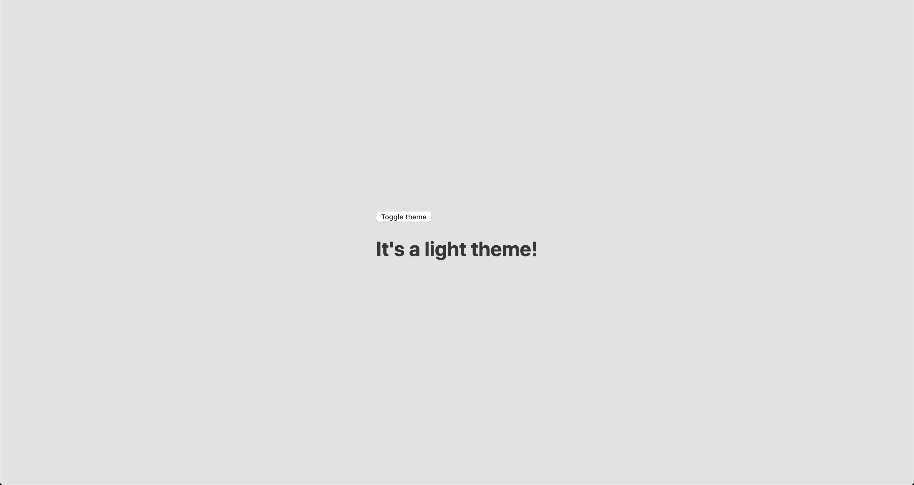
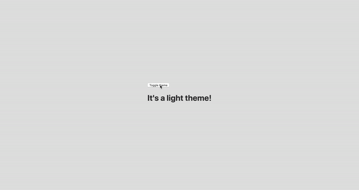

# A Dark Mode Toggle with React and ThemeProvider

I like when websites have a dark mode option. [Dark mode](https://css-tricks.com/dark-modes-with-css/) makes web pages easier for me to read and helps my eyes feel more relaxed. Many websites, including YouTube and Twitter, have implemented it already, and we’re starting to see it trickle onto many other sites as well.

In this tutorial, we’re going to build a toggle that allows users to switch between light and dark modes, using a `<ThemeProvider` wrapper from the [styled-components](https://www.styled-components.com/) library. We’ll create a `useDarkMode` custom hook, which supports the `prefers-color-scheme` media query to set the mode according to the user’s OS color scheme settings.

If that sounds hard, I promise it’s not! Let’s dig in and make it happen.

### Let’s set things up

We’ll use [create-react-app](https://create-react-app.dev/docs/getting-started) to initiate a new project:

```
npx create-react-app my-app
cd my-app
yarn start
```

Next, open a separate terminal window and install styled-components:

```
yarn add styled-components
```

Next thing to do is create two files. The first is `global.js`, which will contain our base styling, and the second is `theme.js`, which will include variables for our dark and light themes:

```
// theme.js
export const lightTheme = {
  body: '#E2E2E2',
  text: '#363537',
  toggleBorder: '#FFF',
  gradient: 'linear-gradient(#39598A, #79D7ED)',
}

export const darkTheme = {
  body: '#363537',
  text: '#FAFAFA',
  toggleBorder: '#6B8096',
  gradient: 'linear-gradient(#091236, #1E215D)',
}
```

Feel free to customize variables any way you want, because this code is used just for demonstration purposes.

```
// global.js
// Source: https://github.com/maximakymenko/react-day-night-toggle-app/blob/master/src/global.js#L23-L41

import { createGlobalStyle } from 'styled-components';

export const GlobalStyles = createGlobalStyle`
  *,
  *::after,
  *::before {
    box-sizing: border-box;
  }

  body {
    align-items: center;
    background: ${({ theme }) => theme.body};
    color: ${({ theme }) => theme.text};
    display: flex;
    flex-direction: column;
    justify-content: center;
    height: 100vh;
    margin: 0;
    padding: 0;
    font-family: BlinkMacSystemFont, -apple-system, 'Segoe UI', Roboto, Helvetica, Arial, sans-serif;
    transition: all 0.25s linear;
  }
```

Go to the App.js file. We’re going to delete everything in there and add the layout for our app. Here’s what I did:

```
import React from 'react';
import { ThemeProvider } from 'styled-components';
import { lightTheme, darkTheme } from './theme';
import { GlobalStyles } from './global';

function App() {
  return (
    <ThemeProvider theme={lightTheme}>
      <>
        <GlobalStyles />
        <button>Toggle theme</button>
        <h1>It's a light theme!</h1>
        <footer>
        </footer>
      </>
    </ThemeProvider>
  );
}

export default App;
```

This imports our light and dark themes. The `ThemeProvider` component also gets imported and is passed the light theme (`lightTheme`) styles inside. We also import `GlobalStyles` to tighten everything up in one place.

Here’s roughly what we have so far:



### Now, the toggling functionality

There is no magic switching between themes yet, so let’s implement toggling functionality. We are only going to need a couple lines of code to make it work.

First, import the `useState` hook from `react`:

```
// App.js
import React, { useState } from 'react';
```

Next, use the hook to create a local state which will keep track of the current theme and add a function to switch between themes on click:

```
// App.js
const [theme, setTheme] = useState('light');

// The function that toggles between themes
const toggleTheme = () => {
  // if the theme is not light, then set it to dark
  if (theme === 'light') {
    setTheme('dark');
  // otherwise, it should be light
  } else {
    setTheme('light');
  }
}
```

After that, all that’s left is to pass this function to our button element and conditionally change the theme. Take a look:

```
// App.js
import React, { useState } from 'react';
import { ThemeProvider } from 'styled-components';
import { lightTheme, darkTheme } from './theme';
import { GlobalStyles } from './global';

// The function that toggles between themes
function App() {
  const [theme, setTheme] = useState('light');
  const toggleTheme = () => {
    if (theme === 'light') {
      setTheme('dark');
    } else {
      setTheme('light');
    }
  }
  
  // Return the layout based on the current theme
  return (
    <ThemeProvider theme={theme === 'light' ? lightTheme : darkTheme}>
      <>
        <GlobalStyles />
        // Pass the toggle functionality to the button
        <button onClick={toggleTheme}>Toggle theme</button>
        <h1>It's a light theme!</h1>
        <footer>
        </footer>
      </>
    </ThemeProvider>
  );
}

export default App;
```



### How does it work?

```
// global.js
background: ${({ theme }) => theme.body};
color: ${({ theme }) => theme.text};
transition: all 0.25s linear;
```

Earlier in our `GlobalStyles`, we assigned `background` and `color` properties to values from the `theme` object, so now, every time we switch the toggle, values change depending on the `darkTheme` and `lightTheme` objects that we are passing to `ThemeProvider`. The `transition` property allows us to make this change a little more smoothly than working with keyframe animations.

### Now we need the toggle component

We’re generally done here because you now know how to create toggling functionality. However, we can always do better, so let’s improve the app by creating a custom `Toggle` component and make our switch functionality reusable. That’s one of the key benefits to making this in React, right?

We’ll keep everything inside one file for simplicity’s sake,, so let’s create a new one called `Toggle.js` and add the following:

```
// Toggle.js
import React from 'react'
import { func, string } from 'prop-types';
import styled from 'styled-components';
// Import a couple of SVG files we'll use in the design: https://www.flaticon.com
import { ReactComponent as MoonIcon } from 'icons/moon.svg';
import { ReactComponent as SunIcon } from 'icons/sun.svg';

const Toggle = ({ theme, toggleTheme }) => {
  const isLight = theme === 'light';
  return (
    <button onClick={toggleTheme} >
      <SunIcon />
      <MoonIcon />
    </button>
  );
};

Toggle.propTypes = {
  theme: string.isRequired,
  toggleTheme: func.isRequired,
}

export default Toggle;
```

You can download icons from [here](https://www.flaticon.com/free-icon/moon_2033921#term=moon&page=1&position=53) and [here](https://www.flaticon.com/free-icon/sun_1164954#term=sun&page=1&position=39). Also, if we want to use icons as components, remember about [importing them as React components](https://create-react-app.dev/docs/adding-images-fonts-and-files).

We passed two props inside: the `theme` will provide the current theme (light or dark) and `toggleTheme` function will be used to switch between them. Below we created an `isLight` variable, which will return a boolean value depending on our current theme. We’ll pass it later to our styled component.

We’ve also imported a `styled` function from styled-components, so let’s use it. Feel free to add this on top your file after the imports or create a dedicated file for that (e.g. Toggle.styled.js) like I have below. Again, this is purely for presentation purposes, so you can style your component as you see fit.

```
// Toggle.styled.js
const ToggleContainer = styled.button`
  background: ${({ theme }) => theme.gradient};
  border: 2px solid ${({ theme }) => theme.toggleBorder};
  border-radius: 30px;
  cursor: pointer;
  display: flex;
  font-size: 0.5rem;
  justify-content: space-between;
  margin: 0 auto;
  overflow: hidden;
  padding: 0.5rem;
  position: relative;
  width: 8rem;
  height: 4rem;

  svg {
    height: auto;
    width: 2.5rem;
    transition: all 0.3s linear;
    
    // sun icon
    &:first-child {
      transform: ${({ lightTheme }) => lightTheme ? 'translateY(0)' : 'translateY(100px)'};
    }
    
    // moon icon
    &:nth-child(2) {
      transform: ${({ lightTheme }) => lightTheme ? 'translateY(-100px)' : 'translateY(0)'};
    }
  }
`;
```

Importing icons as components allows us to directly change the styles of the SVG icons. We’re checking if the `lightTheme` is an active one, and if so, we move the appropriate icon out of the visible area — sort of like the moon going away when it’s daytime and vice versa.

Don’t forget to replace the button with the `ToggleContainer` component in Toggle.js, regardless of whether you’re styling in separate file or directly in Toggle.js. Be sure to pass the `isLight` variable to it to specify the current theme. I called the prop `lightTheme` so it would clearly reflect its purpose.

The last thing to do is import our component inside App.js and pass required props to it. Also, to add a bit more interactivity, I’ve passed condition to toggle between “light” and “dark” in the heading when the theme changes:

```
// App.js
<Toggle theme={theme} toggleTheme={toggleTheme} />
<h1>It's a {theme === 'light' ? 'light theme' : 'dark theme'}!</h1>
```

Don’t forget to credit the [flaticon.com](http://flaticon.com/) authors for the providing the icons.

```
// App.js
<span>Credits:</span>
<small><b>Sun</b> icon made by <a href="https://www.flaticon.com/authors/smalllikeart">smalllikeart</a> from <a href="https://www.flaticon.com">www.flaticon.com</a></small>
<small><b>Moon</b> icon made by <a href="https://www.freepik.com/home">Freepik</a> from <a href="https://www.flaticon.com">www.flaticon.com</a></small>
```

Now that’s better:

### The useDarkMode hook

While building an application, we should keep in mind that the app must be scalable, meaning, reusable, so we can use in it many places, or even different projects.

That is why it would be great if we move our toggle functionality to a separate place — so, why not to create a dedicated account hook for that?

Let’s create a new file called useDarkMode.js in the project `src` directory and move our logic into this file with some tweaks:

```
// useDarkMode.js
import { useEffect, useState } from 'react';

export const useDarkMode = () => {
  const [theme, setTheme] = useState('light');
  const toggleTheme = () => {
    if (theme === 'light') {
      window.localStorage.setItem('theme', 'dark')
      setTheme('dark')
    } else {
      window.localStorage.setItem('theme', 'light')
      setTheme('light')
    }
  };

  useEffect(() => {
    const localTheme = window.localStorage.getItem('theme');
    localTheme && setTheme(localTheme);
  }, []);

  return [theme, toggleTheme]
};
```

We’ve added a couple of things here. We want our theme to persist between sessions in the browser, so if someone has chosen a dark theme, that’s what they’ll get on the next visit to the app. That’s a huge UX improvement. For this reasons we use `localStorage`.

We’ve also implemented the `useEffect` hook to check on component mounting. If the user has previously selected a theme, we will pass it to our `setTheme` function. In the end, we will return our `theme`, which contains the chosen `theme` and `toggleTheme` function to switch between modes.

Now, let’s implement the `useDarkMode` hook. Go into App.js, import the newly created hook, destructure our `theme` and `toggleTheme` properties from the hook, and, put them where they belong:

```
// App.js
import React from 'react';
import { ThemeProvider } from 'styled-components';
import { useDarkMode } from './useDarkMode';
import { lightTheme, darkTheme } from './theme';
import { GlobalStyles } from './global';
import Toggle from './components/Toggle';

function App() {
  const [theme, toggleTheme] = useDarkMode();
  const themeMode = theme === 'light' ? lightTheme : darkTheme;

  return (
    <ThemeProvider theme={themeMode}>
      <>
        <GlobalStyles />
        <Toggle theme={theme} toggleTheme={toggleTheme} />
        <h1>It's a {theme === 'light' ? 'light theme' : 'dark theme'}!</h1>
        <footer>
          Credits:
          <small>Sun icon made by smalllikeart from www.flaticon.com</small>
          <small>Moon icon made by Freepik from www.flaticon.com</small>
        </footer>
      </>
    </ThemeProvider>
  );
}

export default App;
```

This *almost* works almost perfectly, but there is one small thing we can do to make our experience better. Switch to dark theme and reload the page. Do you see that the sun icon loads before the moon icon for a brief moment?

That happens because our `useState` hook initiates the `light` theme initially. After that, `useEffect` runs, checks `localStorage` and only then sets the `theme` to `dark`.

So far, I found two solutions. The first is to check if there is a value in `localStorage` in our `useState`:

```
// useDarkMode.js
const [theme, setTheme] = useState(window.localStorage.getItem('theme') || 'light');
```

However, I am not sure if it’s a good practice to do checks like that inside `useState`, so let me show you a second solution, that I’m using.

This one will be a bit more complicated. We will create another state and call it `componentMounted`. Then, inside the `useEffect` hook, where we check our `localTheme`, we’ll add an `else` statement, and if there is no `theme` in `localStorage`, we’ll add it. After that, we’ll set `setComponentMounted` to `true`. In the end, we add `componentMounted` to our return statement.

```
// useDarkMode.js
import { useEffect, useState } from 'react';

export const useDarkMode = () => {
  const [theme, setTheme] = useState('light');
  const [componentMounted, setComponentMounted] = useState(false);
  const toggleTheme = () => {
    if (theme === 'light') {
      window.localStorage.setItem('theme', 'dark');
      setTheme('dark');
    } else {
      window.localStorage.setItem('theme', 'light');
      setTheme('light');
    }
  };

  useEffect(() => {
    const localTheme = window.localStorage.getItem('theme');
    if (localTheme) {
      setTheme(localTheme);
    } else {
      setTheme('light')
      window.localStorage.setItem('theme', 'light')
    }
    setComponentMounted(true);
  }, []);
  
  return [theme, toggleTheme, componentMounted]
};
```

You might have noticed that we’ve got some pieces of code that are repeated. We always try to follow the [DRY](https://en.wikipedia.org/wiki/Don%27t_repeat_yourself) principle while writing the code, and right here we’ve got a chance to use it. We can create a separate function that will set our state and pass `theme` to the `localStorage`. I believe, that the best name for it will be `setTheme`, but we’ve already used it, so let’s call it `setMode`:

```
// useDarkMode.js
const setMode = mode => {
  window.localStorage.setItem('theme', mode)
  setTheme(mode)
};
```

With this function in place, we can refactor our useDarkMode.js a little:

```
// useDarkMode.js
import { useEffect, useState } from 'react';
export const useDarkMode = () => {
  const [theme, setTheme] = useState('light');
  const [componentMounted, setComponentMounted] = useState(false);

  const setMode = mode => {
    window.localStorage.setItem('theme', mode)
    setTheme(mode)
  };

  const toggleTheme = () => {
    if (theme === 'light') {
      setMode('dark');
    } else {
      setMode('light');
    }
  };

  useEffect(() => {
    const localTheme = window.localStorage.getItem('theme');
    if (localTheme) {
      setTheme(localTheme);
    } else {
      setMode('light');
    }
    setComponentMounted(true);
  }, []);

  return [theme, toggleTheme, componentMounted]
};
```

We’ve only changed code a little, but it looks so much better and is easier to read and understand!

### Did the component mount?

Getting back to `componentMounted` property. We will use it to check if our component has mounted because this is what happens in `useEffect` hook.

If it hasn’t happened yet, we will render an empty div:

```
// App.js
if (!componentMounted) {
  return <div />
};
```

Here is how complete code for the App.js:

```
// App.js
import React from 'react';
import { ThemeProvider } from 'styled-components';
import { useDarkMode } from './useDarkMode';
import { lightTheme, darkTheme } from './theme';
import { GlobalStyles } from './global';
import Toggle from './components/Toggle';

function App() {
  const [theme, toggleTheme, componentMounted] = useDarkMode();

  const themeMode = theme === 'light' ? lightTheme : darkTheme;

  if (!componentMounted) {
    return <div />
  };

  return (
    <ThemeProvider theme={themeMode}>
      <>
        <GlobalStyles />
        <Toggle theme={theme} toggleTheme={toggleTheme} />
        <h1>It's a {theme === 'light' ? 'light theme' : 'dark theme'}!</h1>
        <footer>
          <span>Credits:</span>
          <small><b>Sun</b> icon made by <a href="https://www.flaticon.com/authors/smalllikeart">smalllikeart</a> from <a href="https://www.flaticon.com">www.flaticon.com</a></small>
          <small><b>Moon</b> icon made by <a href="https://www.freepik.com/home">Freepik</a> from <a href="https://www.flaticon.com">www.flaticon.com</a></small>
        </footer>
      </>
    </ThemeProvider>
  );
}

export default App;
```

### Using the user’s preferred color scheme

This part is not required, but it will let you achieve even better user experience. This media feature is used to detect if the user has requested the page to use a light or dark color theme based on the settings in their OS. For example, if a user’s default color scheme on a phone or laptop is set to dark, your website will change its color scheme accordingly to it. It’s worth noting that this media query is still a work in progress and is included in the [Media Queries Level 5 specification](https://drafts.csswg.org/mediaqueries-5/#descdef-media-prefers-color-scheme), which is in Editor’s Draft.

This browser support data is from [Caniuse](https://caniuse.com/#feat=prefers-color-scheme), which has more detail. A number indicates that browser supports the feature at that version and up.

#### Desktop

| Chrome | Firefox | IE | Edge | Safari |
| --- | --- | --- | --- | --- |
| 76 | 67 | No | 79 | 12.1 |

#### Mobile / Tablet

| Android Chrome | Android Firefox | Android | iOS Safari |
| --- | --- | --- | --- |
| 92 | 90 | 92 | 13.0-13.1 |

The implementation is pretty straightforward. Because we’re working with a media query, we need to check if the browser supports it in the `useEffect` hook and set appropriate theme. To do that, we’ll use `window.matchMedia` to check if it exists and whether dark mode is supported. We also need to remember about the `localTheme` because, if it’s available, we don’t want to overwrite it with the dark value unless, of course, the value is set to light.

If all checks are passed, we will set the dark theme.

```
// useDarkMode.js
useEffect(() => {
if (
  window.matchMedia &&
  window.matchMedia('(prefers-color-scheme: dark)').matches && 
  !localTheme
) {
  setTheme('dark')
  }
})
```

As mentioned before, we need to remember about the existence of `localTheme` — that’s why we need to implement our previous logic where we’ve checked for it.

Here’s what we had from before:

```
// useDarkMode.js
useEffect(() => {
const localTheme = window.localStorage.getItem('theme');
  if (localTheme) {
    setTheme(localTheme);
  } else {
    setMode('light');
  }
})
```

Let’s mix it up. I’ve replaced the if and else statements with ternary operators to make things a little more readable as well:

```
// useDarkMode.js
useEffect(() => {
const localTheme = window.localStorage.getItem('theme');
window.matchMedia && window.matchMedia('(prefers-color-scheme: dark)').matches && !localTheme ?
  setMode('dark') :
  localTheme ?
    setTheme(localTheme) :
    setMode('light');})
})
```

Here’s the userDarkMode.js file with the complete code:

```
// useDarkMode.js
import { useEffect, useState } from 'react';

export const useDarkMode = () => {
  const [theme, setTheme] = useState('light');
  const [componentMounted, setComponentMounted] = useState(false);
  const setMode = mode => {
    window.localStorage.setItem('theme', mode)
    setTheme(mode)
  };

  const toggleTheme = () => {
    if (theme === 'light') {
      setMode('dark')
    } else {
      setMode('light')
    }
  };

  useEffect(() => {
    const localTheme = window.localStorage.getItem('theme');
    window.matchMedia && window.matchMedia('(prefers-color-scheme: dark)').matches && !localTheme ?
      setMode('dark') :
      localTheme ?
        setTheme(localTheme) :
        setMode('light');
    setComponentMounted(true);
  }, []);

  return [theme, toggleTheme, componentMounted]
};
```

Give it a try! It changes the mode, persists the theme in `localStorage`, and also sets the default theme accordingly to the OS color scheme if it’s available.

---

Congratulations, my friend! Great job! If you have any questions about implementation, feel free to [send me a message](https://twitter.com/maks_akymenko)!
