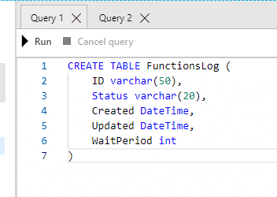
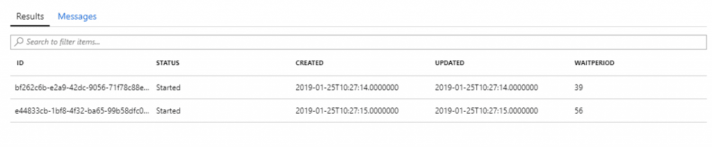
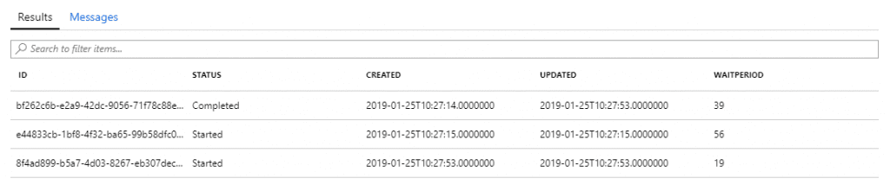
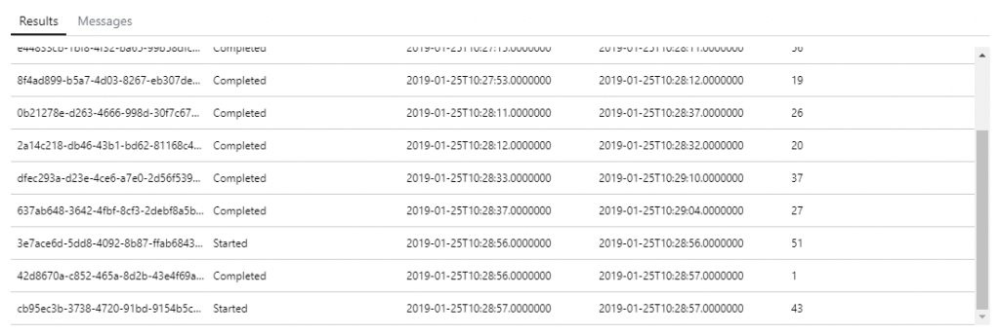
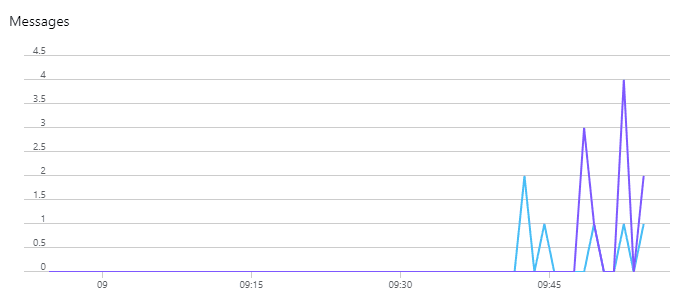

# Throttling Calls to Azure Functions from Azure Service Bus

[Home](https://ballardchalmers.com/) / Throttling Calls to Azure Functions from Azure Service Bus

Azure Functions / Azure Service Bus Time to read: 5 minutes By Kevin McDonnell, Senior Technical Architect

One of the real benefits of using Azure for Serverless work is not having to think about scaling for the most part, but there are times when you want to ensure that your costs do not become too high. For example, function calls may be running reports against a SQL Database and too many calls could cause the performance to peak and require the database to be scaled up when, in reality, you are happier for the reports just to take a little longer to run. So how would you go about doing that?

## The Good News

While you could build lots of complex logic into your function to add sleeps and pauses, which would require extensive testing and validation to make sure that messages did not become lost, there is something built into the Trigger for the Azure Function from Service Bus. This is set in [your functions hosts.json file](https://docs.microsoft.com/en-gb/azure/azure-functions/functions-host-json-v1) as a property under the [Service Bus section](https://docs.microsoft.com/en-gb/azure/azure-functions/functions-host-json-v1#servicebus). Setting the maxConcurrentCalls will limit the number of concurrent functions that are run. So, if you only want two instances running at any one time, set the value to two.

## But Does it Work?

The short answer is yes. However, it is always good to test things for yourself which is what I did. I set up a Function to be triggered from a queue that would write to an Azure SQL database table called FunctionsLog.



At the start of the function, add an entry with a Guid sent in the message and set the status to Started. After a random wait period between 1 and 60 seconds, it would update the entry to say Completed with the updated date set.

```
using Microsoft.Azure.WebJobs;
using Microsoft.Azure.WebJobs.Host;
using Microsoft.ServiceBus.Messaging;
using System.Data.SqlClient;
using System.Text;
using System;

namespace BallardChalmers.BackgroundFunctions
{
    public static class BallardChalmersBackgroundTaskCreated
    {
        [FunctionName("BallardChalmersBackgroundTaskCreated")]
        public static void 
Run([ServiceBusTrigger("BallardChalmersBackgroundTaskCreated", AccessRights.Send, Connection = "ServiceBusConnection")]string queueMessage, TraceWriter log)
        {
            log.Info($"Service_TaskManager task added to queue with ID: {queueMessage}");
            try
            {
                string connectionString = System.Configuration.ConfigurationManager.AppSettings["SQLConnectionString"]; ;
                using (SqlConnection connection = new SqlConnection(connectionString))
                {
                    // Create wait period between 1 and 60 seconds
                    System.Random random = new System.Random();
                    int waitPeriod = random.Next(1, 60);

                    log.Info($"Wait period: {waitPeriod.ToString()}");
                    connection.Open();

                    StringBuilder sb = new StringBuilder();
                    sb.Append("INSERT FunctionsLog ");
                    sb.Append("SELECT '" + queueMessage + "','Started','" + DateTime.Now.ToString() + "','" + DateTime.Now.ToString() + "'," + waitPeriod.ToString());
                    String sql = sb.ToString();

                    log.Info($"Insert command: {sql}");
                    using (SqlCommand command = new SqlCommand(sql, connection))
                    {
                        command.ExecuteNonQuery();
                    }
                    log.Info($"Inserted to FunctionsLog");       

                    System.Threading.Thread.Sleep(1000 * waitPeriod);
                    log.Info($"Wait completed");

                    sb = new StringBuilder();
                    sb.Append("UPDATE FunctionsLog ");
                    sb.Append("SET [Status]='Completed', Updated='" + DateTime.Now.ToString() + "'");
                    sb.Append("WHERE ID='" + queueMessage + "'");
                    sql = sb.ToString();
                    log.Info($"Update command: {sql}");
                    using (SqlCommand command = new SqlCommand(sql, connection))
                    {
                        command.ExecuteNonQuery();
                    }
                    log.Info($"Updated to FunctionsLog");
                }
            }
            catch (SqlException e)
            {
                log.Error($"Error writing to database: {e.Message + ":::" + e.StackTrace}");
            }

        }
    }
}
```

I then added a short test which would create 10 messages one after the other and sat back to see what would happen in the table.

```
using System;
using System.Configuration;
using System.Text;
using System.Threading;
using System.Threading.Tasks;
using Microsoft.Azure.ServiceBus;
using Microsoft.VisualStudio.TestTools.UnitTesting;

namespace BallardChalmers.BackgroundFunctions.Test
{
    [TestClass]
    public class CreateMessageOnQueueTests
    {
        private string _serviceBusConnectionString;
        private string _serviceBusQueue;

        [TestInitialize]
        public void Setup()
        {
            _serviceBusConnectionString = ConfigurationManager.AppSettings["ServiceBusConnection"];
            _serviceBusQueue = ConfigurationManager.AppSettings["queueName"];
        }

        [TestMethod]
        public async Task CreateBackgroundTaskMultipleMessageTest()
        {
            IQueueClient queueClient = new QueueClient(_serviceBusConnectionString, _serviceBusQueue);
            int messageCount = 10;
            try
            {
                for (int messageIndex = 0; messageIndex < messageCount; messageIndex++)
                {
                    // Create a new message to send to the queue.
                    string messageBody = Guid.NewGuid().ToString();
                    var message = new Message(Encoding.UTF8.GetBytes(messageBody));

                    // Write the body of the message to the console.
                    Console.WriteLine($"Sending message: {messageBody}");

                    // Send the message to the queue.
                    await queueClient.SendAsync(message);
                }
            }
            catch (Exception exception)
            {
                Console.WriteLine($"{DateTime.Now} :: Exception: {exception.Message}");
            }
            await queueClient.CloseAsync();
        }

        [TestMethod]
        public async Task CreateBackgroundTaskMessageTest()
        {
            IQueueClient queueClient = new QueueClient(_serviceBusConnectionString, _serviceBusQueue);

            try
            {
                // Create a new message to send to the queue.
                string messageBody = Guid.NewGuid().ToString();
                var message = new Message(Encoding.UTF8.GetBytes(messageBody));

                // Write the body of the message to the console.
                Console.WriteLine($"Sending message: {messageBody}");

                // Send the message to the queue.
                await queueClient.SendAsync(message);
            }
            catch (Exception exception)
            {
                Console.WriteLine($"{DateTime.Now} :: Exception: {exception.Message}");
            }

            await queueClient.CloseAsync();
        }
    }
}
```

Running the test, I saw two entries come in as Started, but no more initially.



After about 40 seconds, I ran again and saw one completed and two in started.



And it carried on well, with only ever two in Started status.



From the Service Bus area in the Azure Portal, I could also see the 10 messages logged.



\*The eagle eyed among you may notice that the purple line showing outgoing messages has just 9 but unfortunately, I took the screenshot at just the wrong time…

## Summary

To wrap up, what I thought may turn out to be a painful process requiring a lot of testing, turned out to be a simple case of setting a setting for the function. If you have different levels of priority then you could handle this with multiple queues and then either post straight to those queues depending on priority or writing to a single queue and pulling messages to another queue with a function based on the priority held in the message.

---

### Ballard Chalmers

We specialise in Custom Software Development and Integration for enterprise applications on the Microsoft Platform.

Search

Categories

Categories



### HAVE YOU SEEN OUR NEWSLETTER?

[Subscribe Now](https://eepurl.com/gkfUaD)

Get in Touch

Name \*

Company

Email \*

Telephone \*

Message \*

How did you hear about us? \*

Consent \*

- I consent to Ballard Chalmers collecting my name and contact details\*

- [
  Twitter](https://ballardchalmers.com/2019/02/07/throttling-calls-azure-functions-service-bus/#)
- [
  Facebook](https://ballardchalmers.com/2019/02/07/throttling-calls-azure-functions-service-bus/#)
- [
  LinkedIn](https://ballardchalmers.com/2019/02/07/throttling-calls-azure-functions-service-bus/#)
- [
  Email](https://ballardchalmers.com/2019/02/07/throttling-calls-azure-functions-service-bus/#)

Post Terms: [serverless](https://ballardchalmers.com/tag/serverless/) |  [Service Bus](https://ballardchalmers.com/tag/service-bus/)

#### About the Author

[](https://ballardchalmers.com/author/bctech/ "Visit Author Page")

### [BC Technical Team](https://ballardchalmers.com/author/bctech/ "Visit Author Page")

Our technical team contribute with blogs from their respective specialities, be that Azure, SQL, BizTalk, SharePoint, Xamarin and more. From the lead architect to developers and testers, each person provides content straight from their experience.

[Previous Post](https://ballardchalmers.com/2019/01/25/diagnosing-azure-cosmos-db-high-resource-unit-spikes/)

[Next Post](https://ballardchalmers.com/2019/02/22/language-understanding-real-world-customer-care/)
