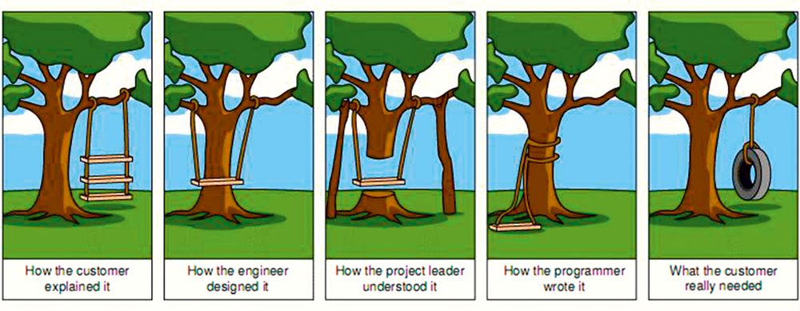

The Hardest thing about Engineering is Requirements | by Jay | Mar, 2022 | Dev Genius

<https://blog.devgenius.io/the-hardest-thing-about-engineering-is-requirements-28a6a70c4db4>

One of the hardest things about being a software architect is gathering requirements. You can work with the greatest team of rockstar…
