# Clean Architecture With .NET 6 Using Entity Framework

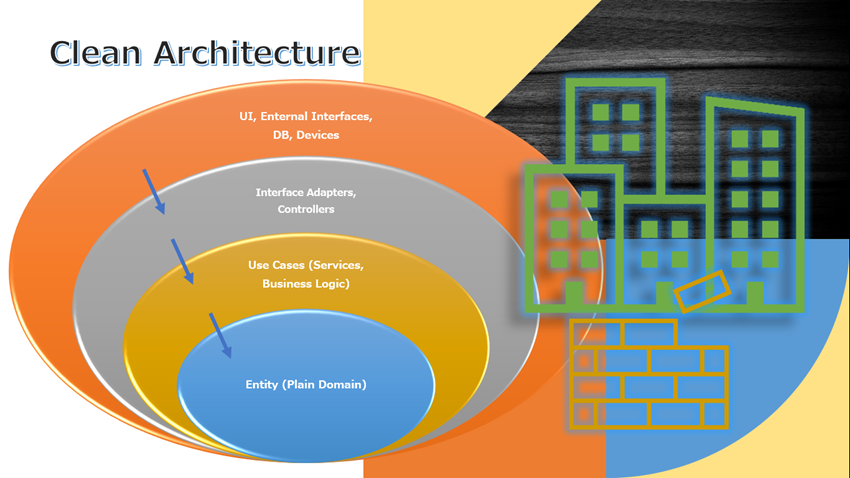

This article is a continuation of my previous article, [Clean Architecture with .NET 6](https://rijsat.com/2022/03/14/clean-architecture-with-net-6/). In the previous article, I have elaborated about clean architecture, principles, and design considerations. Furthermore, I have created a complete clean architecture solution with .NET 6 and ASP.NET Web API.

Please check [the article](https://rijsat.com/2022/03/14/clean-architecture-with-net-6/).

To know about clean architecture please check [this article](https://rijsat.com/2022/02/01/what-is-clean-architecture/ "this article") where I have elucidated following points.

- What is clean Architecture
- Basic Principles of Clean Architecture
- Clean Architecture Diagram
- Layers of Clean Architecture
- Design Sample

Furthermore, I have designed a [clean architecture solution with .NET 6 and ASP.NET Core Web API](https://rijsat.com/2022/03/14/clean-architecture-with-net-6/ "clean architecture solution with .NET 6 and ASP.NET Core Web API").

- Design Clean Architecture with .NET 6
- ASP.NET core Web API using Clean Architecture

The scope of this article is to implement Entity Framework in Clean Architecture with .NET 6 and ASP.NET core Web API.

- Implement Entity Framework in Clean Architecture Solution with .NET 6
- Implement a Business Case
- Design ASP.NET Core Web API with CRUD operation

Recap from [this article](https://rijsat.com/2022/03/14/clean-architecture-with-net-6/ "this article").

We have created a clean architecture solution as shown with .NET 6.

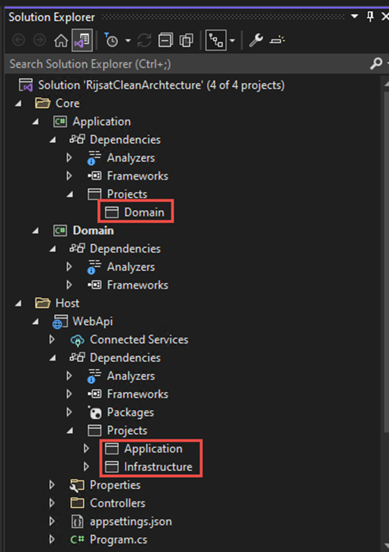

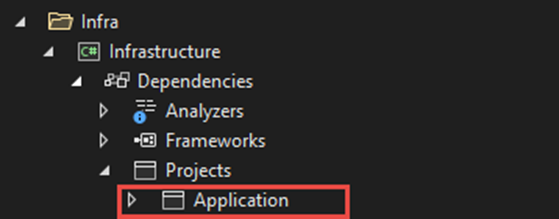

- There will be not any reference to Domain Library
- Application: Add reference of Domain project
- Infrastructure: Add reference of application project
- WebApi: Add reference of application and Infrastructure projects

Let’s implement a business case.

We will create an Application Setting where we can store some application variables and configurations like SMTP details, Application data, and so on.

Entity is at the center of the clean architecture, therefore; we will start with entity creation. We create an entity *AppSetting* in the domain library as shown.

Let’s add a base entity with Id properties under the common folder as shown.

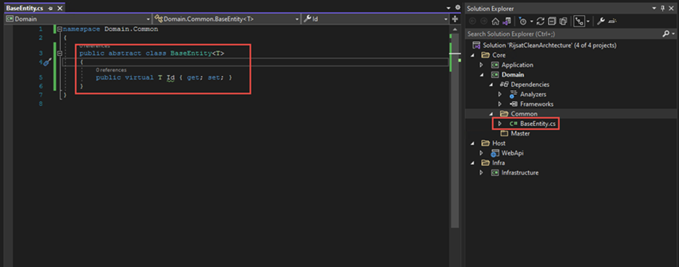

We keep all the common properties in this **BaseEntity Abstract Class.**The reason is to reuse that in every entity.

***BaseEntity.cs***

```
namespace Domain.Common
{
    public abstract class BaseEntity<T>
    {
        public virtual T Id { get; set; }
    }
}
```

You can include some other properties as well, however, for simplicity, I am only keeping Id.

Using T type will give the option to make Id dynamic. For instance, we may keep Id as int, bigInt or Guid based on table requirements.

Now, we will create an **AppSetting**entity in the Master folder. It is recommended to group the entity based on use cases and keep it under the relevant folder.

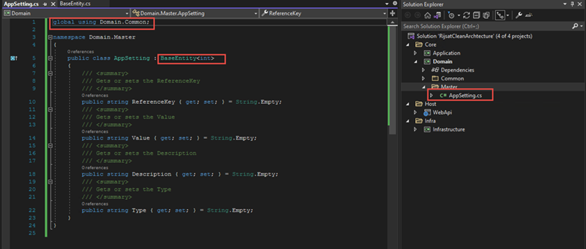

***AppSetting.cs***

```
global using Domain.Common;

namespace Domain.Master
{
    public class AppSetting : BaseEntity<int>
    {
        /// <summary>
        /// Gets or sets the ReferenceKey
        /// </summary>
        public string ReferenceKey { get; set; } = String.Empty;
        /// <summary>
        /// Gets or sets the Value
        /// </summary>
        public string Value { get; set; } = String.Empty;
        /// <summary>
        /// Gets or sets the Description
        /// </summary>
        public string Description { get; set; } = String.Empty;
        /// <summary>
        /// Gets or sets the Type
        /// </summary>
        public string Type { get; set; } = String.Empty;
    }
}
```

Here, we have inherited the base entity, therefore, we don’t need to add Id property and, we have declared int type of Id.

Additionally, I have used **global using** which is a feature**of .NET 6** so that I don’t need to add a reference of the base entity in other entities.

Let’s navigate to the application library. This library contains all the business logic like services, interfaces, domain validations, error handling, etc. To limit the scope of this write-up, I will add an interface for application context and a service only under this application library.

## Implementing Entity Framework in Clean Architecture

Let’s implement an entity framework in our solution. I will be using an entity framework with MS SQL server. We need to add the following packages to the respective libraries and projects.

Packages for **Application Library**.

> Microsoft.EntityFramework.Core
>
> Microsoft.Extensions.DependencyInjection.Abstractions
>
> Newtonsoft.Json

*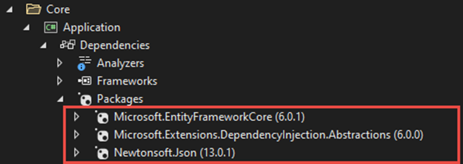*

Packages for **Infrastructure** Library.

> Microsoft.EntityFrameworkCore.Design
>
> Microsoft.EntityFrameworkCore.SqlServer
>
> Microsoft.EntityFrameworkCore.Tools
>
> Microsoft.Extensions.DependencyInjection.Abstractions

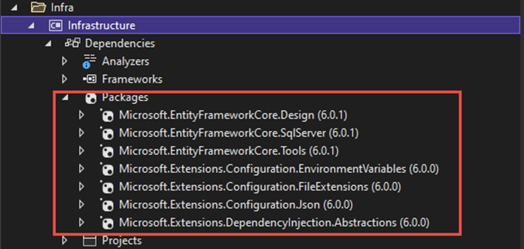

Packages For **Web API**

> Microsoft.EntityFrameworkCore.Design

*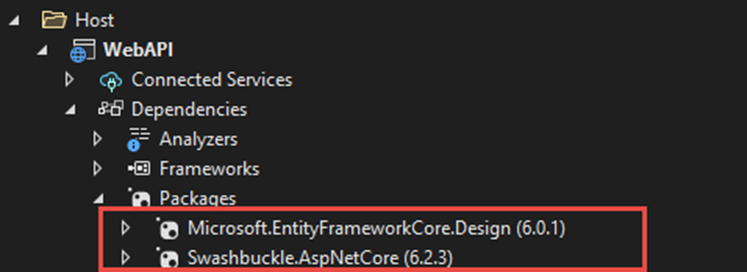*

We can install these packages in respective projects either using command or from GUI as shown below.

```
Install-Package Microsoft.EntityFramework.Core -ProjectName Application
```

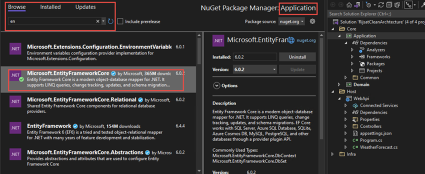

Likewise, we can install other packages.

We will proceed by creating an Interface for the Application context in Application project under common folder as given below.

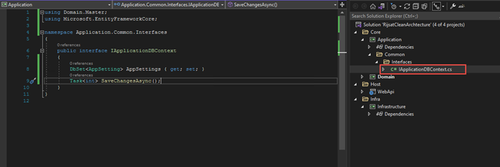

***IApplicationDBContext.cs***

```
using Domain.Master;
using Microsoft.EntityFrameworkCore;

namespace Application.Common.Interfaces
{
    public interface IApplicationDBContext
    {
        DbSet<AppSetting> AppSettings { get; set; }
        Task<int> SaveChangesAsync();
    }
}
```

As per clean architecture principle, we will add an interface for application context in the Business logic (Application) core part however, we will implement it into Infrastructure based on database because we want to keep external agents outside of core logic. Let’s proceed by creating an application context, which will be an implementation of the above interface.

Here again, we will organize the project as shown and create an Application Context Class.

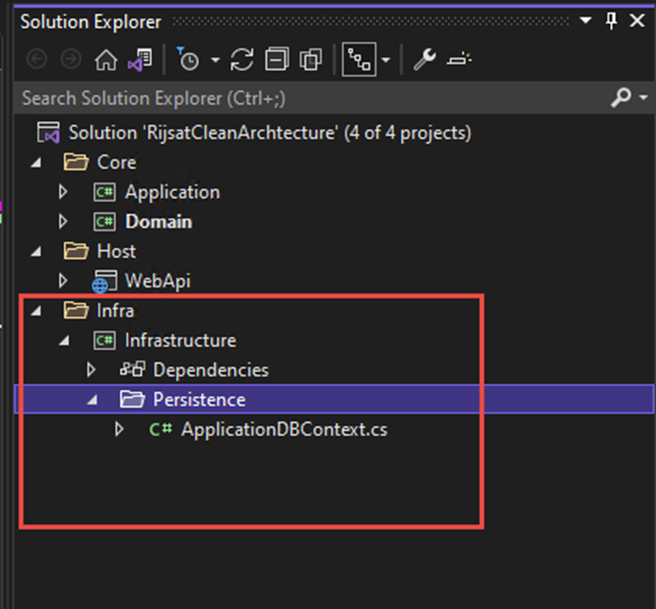

We will create a class *AppicationDBContext* under the persistence folder and inherit *DBContext* and *IApplicationDBContext* as demonstrated below.

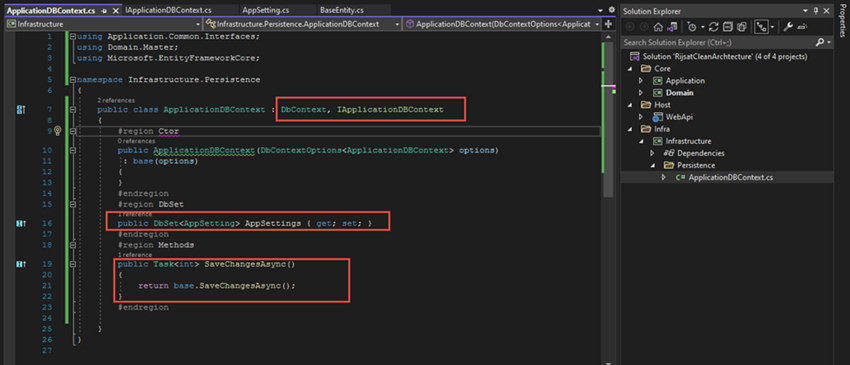

We can implement *IApplicationDBContext*interface by adding *DbSet*of *AppSetting*and *SaveChangesAsync*.

***ApplicationDBContext.cs***

```
using Application.Common.Interfaces;
using Domain.Master;
using Microsoft.EntityFrameworkCore;

namespace Infrastructure.Persistence
{
    public class ApplicationDBContext : DbContext, IApplicationDBContext
    {
        #region Ctor
        public ApplicationDBContext(DbContextOptions<ApplicationDBContext> options)
         : base(options)
        {
        }
        #endregion
        #region DbSet
        public DbSet<AppSetting> AppSettings { get; set; }
        #endregion
        #region Methods
        public Task<int> SaveChangesAsync()
        {
            return base.SaveChangesAsync();
        }
        #endregion

    }
}
```

Now we will add a dependency injection class in the Infrastructure library as shown.

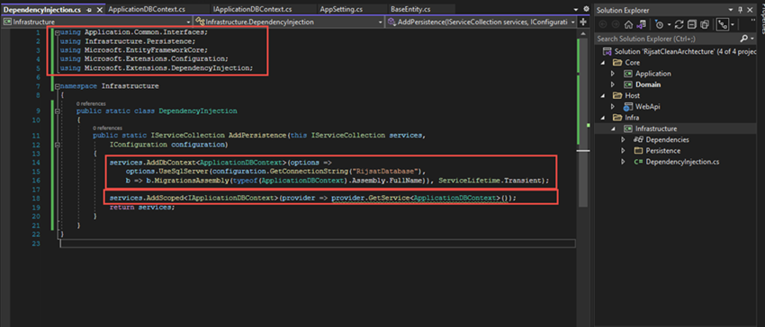

Let me explain the class in more details.

```
services.AddDbContext<ApplicationDBContext>(options =>
                options.UseSqlServer(configuration.GetConnectionString("RijsatDatabase"),
                b => b.MigrationsAssembly(typeof(ApplicationDBContext).Assembly.FullName)), ServiceLifetime.Transient);
```

We add above for proving connection string, and we are using MSSQL Server. We are getting this value using *ICongifuration*because we will insert the connection string into *AppSetting.cs* of the Web API host.

```
services.AddScoped<IApplicationDBContext>(provider => provider.GetService<ApplicationDBContext>());
```

This is the provider of *IApplicationDBContext*into *ApplicationDBContext.cs* i.e., dependency injection.

***DependencyInjection.cs***

```
using Application.Common.Interfaces;
using Infrastructure.Persistence;
using Microsoft.EntityFrameworkCore;
using Microsoft.Extensions.Configuration;
using Microsoft.Extensions.DependencyInjection;

namespace Infrastructure
{
    public static class DependencyInjection
    {
        public static IServiceCollection AddPersistence(this IServiceCollection services,
            IConfiguration configuration)
        {
            services.AddDbContext<ApplicationDBContext>(options =>
                options.UseSqlServer(configuration.GetConnectionString("RijsatDatabase"),
                b => b.MigrationsAssembly(typeof(ApplicationDBContext).Assembly.FullName)), ServiceLifetime.Transient);

            services.AddScoped<IApplicationDBContext>(provider => provider.GetService<ApplicationDBContext>());
            return services;
        }
    }
}
```

We need to add the connection string into *AppSetting.json* of Web API host project as given below.

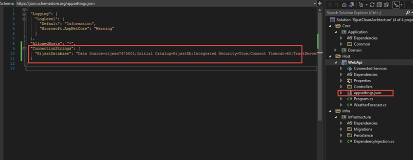

Provide the connection string as per your database.

```
"ConnectionStrings": {
    "RijsatDatabase": "Data Source=rijwan7475001;Initial Catalog=RijsatDb;Integrated Security=True;Connect Timeout=60;TrustServerCertificate=True"
  }
```

Additionally, we have to make an entry of dependency injection into service call of ***program.cs*** (start up) file as shown.

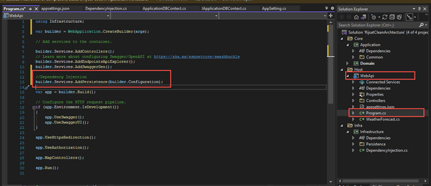

We will make the entry of service under *IServiceCollection*before app builder.

```
//Dependency Injection
builder.Services.AddPersistence(builder.Configuration);
```

We are ready with Entity framework implementation in Clean Architecture with .NET 6.

Let’s run migration command in package manager console.

```
Add-Migration "DB Initialize"
```

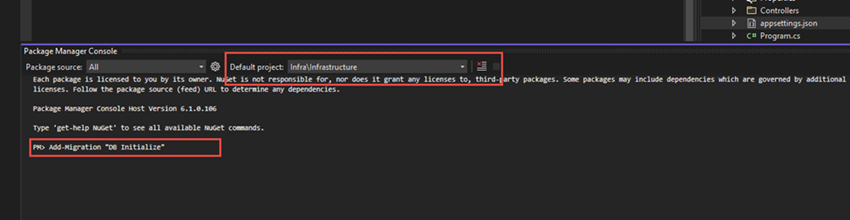

Make sure, we have selected the **Infrastructure project as default** and **Web API as startup project**.

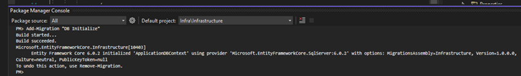

```
Update-Database
```

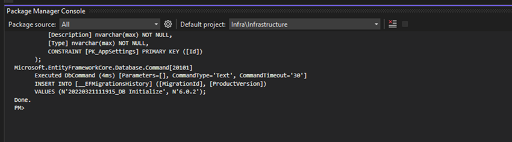

We have successfully implemented an Entity framework in our solution. The database is created as expected.

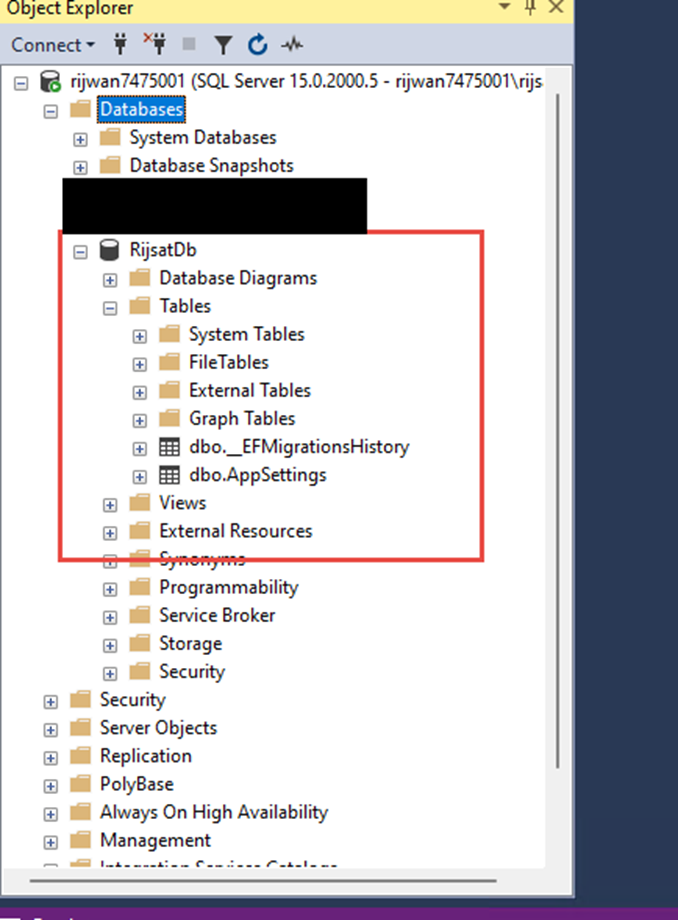

In this article, we have successfully implemented an entity framework in Clean Architecture with .NET 6 and ASP.NET core Web API.

In the next article, we will do a complete CRUD operation, build web APIs and test with swagger.

## Conclusion

In this article, I have demonstrated step by step how to implement an entity framework in clean architecture with .NET 6 and ASP.Net core web API. Furthermore, I have created a model and created a database using EF database migration command. In the next article, I will demonstrate a CRUD operation using entity framework in Clean Architecture with .NET 6.
