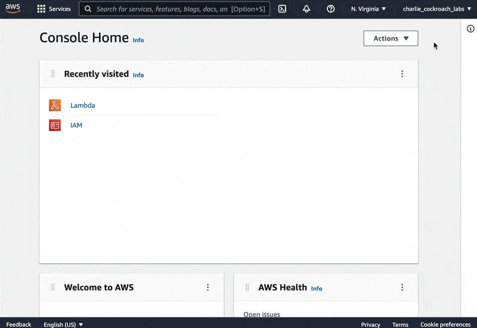
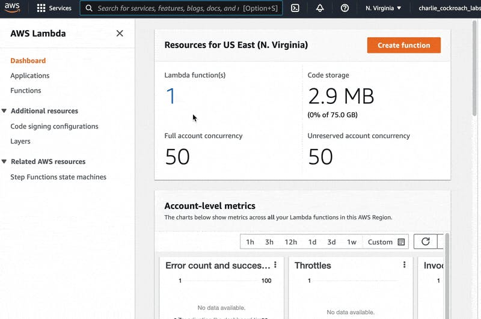
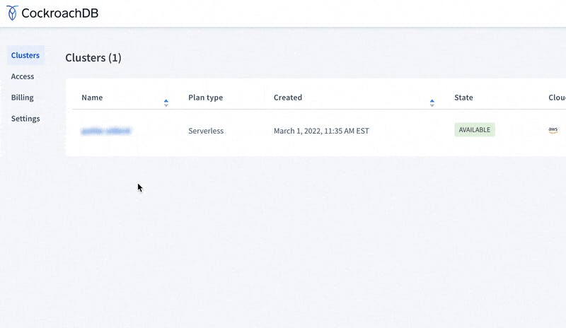

# How to Create a Lambda Function with Python and CockroachDB Serverless


Do you love thinking about servers?

Most developers don’t. That’s why serverless platforms such as AWS Lambda, which lets you run functions in the cloud without having to think about servers, have become so popular.

Running your code in the cloud doesn’t truly free you from thinking about servers unless you’re also using a serverless database, though. Amazon itself offers a serverless database called Amazon Aurora Serverless, but what if you prefer [the advantages that CockroachDB offers](https://www.cockroachlabs.com/compare/amazon-aurora-vs-cockroachdb/), or simply want to avoid vendor lock-in with your database in case you choose to migrate to a different cloud in the future?

In this tutorial, we’ll walk through how to create and deploy an AWS Lambda function that uses Python and connects to a CockroachDB Serverless database. This tutorial does not assume you have any previous experience with CockroachDB Serverless or AWS Lambda, but some familiarity with Python and with using the command line are required. (If you *do* have previous experience with Lambda and/or CockroachDB Serverless, [a quicker version of this tutorial](https://www.cockroachlabs.com/docs/stable/deploy-lambda-function.html?filters=python) is also available in our docs, as is [a version of the same thing using Node.js](https://www.cockroachlabs.com/docs/stable/deploy-lambda-function.html) instead of Python).

Before we get going, let’s take a quick look at the function we’ll be setting up on AWS Lambda to understand what we’re trying to do.

## Understanding Our Python AWS Lambda Functioncockroach-section-link.png

For the purposes of this tutorial, we’ve already written the Python function, which is [accessible on Github here](https://github.com/cockroachlabs/examples-aws-lambda/tree/main/python). It contains a few different files. `init_db.py` is the Python code that’ll actually run on AWS Lambda, and the other files are supporting files such as `requirements.txt`, which will ensure that Lambda installs the correct version of the [psycopg2](https://www.psycopg.org/) driver our function requires to run.

If we [take a look at the code](https://github.com/cockroachlabs/examples-aws-lambda/blob/main/python/init_db.py), we’ll see that there are two functions in `init_db.py`: `create_accounts()` and `lambda_handler()`.

The first, `create_accounts()`, connects to a CockroachDB Serverless database, creates an `accounts` table with two columns, `id` and `balance`. It then creates `n` accounts by generating UUIDs for the `id` value of each row and a randomized six-digit integer for the `balance` value. Note that it takes two arguments, `p` and `n`. `p` is the connection pool and database connection, `n` is the number of accounts the function will generate.

(Needless to say, no real banking application would add accounts and generate balances at *random*, but the purpose of this tutorial is just to demonstrate how we can get a CockroachDB-connected function up and running on AWS Lambda. If we wanted our Lambda function to do something different, `create_accounts()` is the main function we’d want to change or replace.)

The second function in `init_db.py`, `lambda_handler()`, creates a connection pool and helps Lambda connect with the CockroachDB Serverless database. It also *calls* the `create_accounts()` function and provides its two arguments (the connection pool and `5`, the number of accounts to create), so if we wanted to change the functionality of `create_accounts()` we’d have to be sure to change this part of `lambda_handler()`, too.

Now that we understand what our Lambda function will do, let’s begin the process of getting it created and deployed on AWS Lambda.

## Step 1: Create an AWS accountcockroach-section-link.png

The first step is to create an AWS account, if you don’t already have one. Visit [the main AWS page](https://aws.amazon.com/), click the orange “Create an AWS Account” button, and walk through the steps.

Note that a credit or debit card will be required to sign up for AWS. This doesn’t mean that you’ll actually have to pay anything – many AWS services have a free tier, and what we’re doing in this tutorial doesn’t require much storage or use a lot of compute, so it’ll be free. However, if you’re concerned about *potential* costs, AWS does allow you to set budget limits after you’ve created your account.

Once we’ve set up the AWS account, let’s log in and note down the Amazon Account ID, as we’ll need it later. This can be found by clicking on the account username on the right side of the top menu bar from any page in the [AWS console](https://console.aws.amazon.com/console/home).



## Step 2: Create an AWS IAM usercockroach-section-link.png

Once we’ve created an AWS account, we’ll need to create an [IAM](https://aws.amazon.com/iam/) user within it. The user associated with the account we created in step one is called an AWS account root user, but now we need to create a regular user account in AWS’s IAM system that has administrator-level permissions.

There are [several different ways to create an IAM user](https://docs.aws.amazon.com/IAM/latest/UserGuide/id_users_create.html), but to do it via the AWS console, we’ll need to [navigate to the IAM dashboard](https://console.aws.amazon.com/iam/), choose “Users” from the menu on the left, and then hit “Add User.”

From there, create a user using whatever username you choose, select the “Access key - programmatic access” credential type, and attach the “AdministratorAccess” AWS policy.

**Be sure to save the Access Key ID and Secret Access Key provided when you create the user!** These will be required later to authenticate when we’re configuring the AWS CLI.

## Step 3: Install the AWS CLIcockroach-section-link.png

The next step is to download the AWS CLI so we can work with AWS using the command line. To do that, visit [the AWS CLI page](https://aws.amazon.com/cli/) and download the relevant version for your OS.

(Technically this step isn’t required to create a Lambda function, as the AWS console allows you to create functions using the web UI. However, we’ll be using the command line for this tutorial.)

## Step 4: Create a CockroachDB Serverless clustercockroach-section-link.png

Now it’s time to create a CockroachDB Cloud account (if you don’t already have one) and spin up a new Serverless cluster. We’ll provide written directions below, but here’s a video that walks through the CockroachDB Serverless setup process (for the purposes of this tutorial, stop at the 3 minute mark):

To create an account, [sign up](https://cockroachlabs.cloud/) (no credit card is required). Once we’ve signed up, we can log in and select the button for “Create Cluster” on [the clusters page](https://cockroachlabs.cloud/clusters).

On the next screen, we’ll select “Serverless” and choose our options.

- **Cloud provider**: Although we’re creating an AWS Lambda function, your CockroachDB Serverless cluster does not *need* to be on AWS, although you may see the best performance results from locating both CockroachDB and your AWS Lambda function in the same AWS region.
- **Regions**: Any option will work, but for best performance we’ll want to ensure whatever option you choose here is geographically close to your AWS region.
- **Spend limit**: Keep the default setting of $0.
- **Cluster name**: Keep the default setting, or adjust if you prefer.

Once we’ve made our choices, we’ll hit the “Create Cluster” button. A new CockroachDB Serverless cluster will spin up in just a few seconds, and a window called “Connection Info” will open.

Click the “Connection String” tab and copy the connection string somewhere secure, as we’ll be using it later. It will look something like this, except that `<name>`, `<password>`, etc. will be replaced with the information specific to your cluster :

```
postgresql://<name>:<password>@free-tier14.<cloud-region>.cockroachlabs.cloud:26257/defaultdb?sslmode=verify-full&options=--cluster%3D<cluster-name>
```

Once we’ve got our connection string saved, we can close the “Connection Info” window.

## Step 5: Clone the Python Functioncockroach-section-link.png

Next, open up the command line and clone the Github repo of our [sample Python code](https://github.com/cockroachlabs/examples-aws-lambda):

```
git clone https://github.com/cockroachlabs/examples-aws-lambda
```

This will create a folder called `examples-aws-lambda` in the working directory, which includes the code for both our Python and Node.js samples.

Navigate to the Python subdirectory:

```
cd examples-aws-lambda/python
```

## Step 6: Create the Deployment Packagecockroach-section-link.png

Technically, this is an optional step – if we run `ls`, we will see that this folder already contains a deployment package (`deployment-package.zip`). However, let’s walk through the steps of creating a new deployment package using our code.

First, we need to download and install `psycopg2-binary`. Note that we’re installing the version compiled for Linux (this is required by AWS), and that we’re creating a new directory called `my-package` for the files:

```
python3 -m pip install --only-binary :all: --platform manylinux1_x86_64  --target ./my-package -r requirements.txt
```

Next, we need to compress all of the project files into a single zip file. We’ll start by compressing the files we just downloaded into `my-package`. We’ll navigate to that directory:

```
cd my-package
```

Then, we’ll use `zip` to zip those files into a file called `my-deployment-package.zip`, which we’ll store in the `python` directory we just came from. Note the `.` at the end of the command here, which tells zip to compress all of the files in the working directory (`my-package`):

```
zip -r ../my-deployment-package.zip .
```

Now, we’ll navigate back to the `python` directory…

```
cd ..
```

… and use `zip`’s `-g` (grow) option to add `init_db.py` and `root.crt` to the `my-deployment-package.zip` file we just created.

```
zip -g my-deployment-package.zip init_db.py root.crt
```

Our deployment package is now ready to go, so the next step is to configure AWS.

## Step 7: Configure AWScockroach-section-link.png

Run the following command and then follow the prompts to configure AWS:

```
aws configure
```

We will authenticate as the user we created in [step 2](https://www.cockroachlabs.com/blog/aws-lambda-function-python-cockroachdb-serverless/#step-2-create-an-aws-iam-user), *not* the root user. We will be prompted for four inputs:

- **Access Key ID**: Insert the Access Key ID generated in [step 2](https://www.cockroachlabs.com/blog/aws-lambda-function-python-cockroachdb-serverless/#step-2-create-an-aws-iam-user).
- **Secret Access Key**: Insert the Secret Access Key generated in [step 2](https://www.cockroachlabs.com/blog/aws-lambda-function-python-cockroachdb-serverless/#step-2-create-an-aws-iam-user).
- **Default region name**: Input your preferred AWS region, such as `us-east-1`. (Ideally, this is the same region as your CockroachDB deployment).
- **Default output format**: Output is formatted in `json` by default, so if we leave this blank, we’ll get output in JSON format. Other available output formats are [listed in the AWS docs](https://docs.aws.amazon.com/cli/latest/userguide/cli-configure-quickstart.html), but for our purposes here, JSON is fine.

Next, we’ll need to create an execution role for our Lambda function. This grants the function permissions to access AWS resources:

```
aws iam create-role --role-name lambda-ex --assume-role-policy-document '{"Version": "2012-10-17","Statement": [{ "Effect": "Allow", "Principal": {"Service": "lambda.amazonaws.com"}, "Action": "sts:AssumeRole"}]}'
```

We also need to attach the `AWSLambdaBasicExecutionRole` policy to the role. This allows the Lambda function to access the basic suite of AWS services it needs. (There are other policies we could attach if our function relied on other AWS resources such as a DynamoDB database, but in this case we only need the “Basic” level of permissions).

```
aws iam attach-role-policy --role-name lambda-ex --policy-arn arn:aws:iam::aws:policy/service-role/AWSLambdaBasicExecutionRole
```

Now, all that’s left to do is deploy our function and test it!

## Step 8: Deploy the Function to AWS Lambdacockroach-section-link.png

To deploy the function to lambda, we’ll navigate to the deployment package directory and use a `create-function` command to deploy:

```
aws lambda create-function 
    --function-name init-crdb 
    --region <region>  
    --zip-file fileb://deployment-package.zip 
    --handler init_db.lambda_handler 
    --runtime python3.9 
    --role arn:aws:iam::<account-id>:role/lambda-ex 
    --environment "Variables={DATABASE_URL=<connection-string>,PGSSLROOTCERT=./root.crt}"
```

Note that three elements of the command above must be replaced with your specific information:

- `<region>` must be replaced with your AWS region, i.e. `us-east-1`.
- `<account-id>` must be replaced with your AWS Account ID (the one we saved during [step 1](https://www.cockroachlabs.com/blog/aws-lambda-function-python-cockroachdb-serverless/#step-1-create-an-aws-account); found by clicking on your account name on the right side of the top navigation bar from any [AWS Console](https://console.aws.amazon.com/) page).
- `<connection-string>` must be replaced with the CockroachDB connection string you saved as part of [step 4](https://www.cockroachlabs.com/blog/aws-lambda-function-python-cockroachdb-serverless/#step-4-create-a-cockroachdb-serverless-cluster)

Note, also, that while everything else can be input directly, the `--environment` variable must be a string literal.

When we run the final command, AWS will create a new Lambda function function with the name `init-crdb`. If we open a browser and look at the [AWS Lambda console](https://console.aws.amazon.com/lambda/) we can click on the number under “Lambda function(s)” and then click on “init-crdb” on the next page to see that all of our code has been uploaded to Lambda.

If we click over to the “Configurations” tab and look at “Environment Variables” in the left-side navigation bar, we can also see that our two environment variables, `DATABASE_URL` and `PGSSLROOTCERT` are correctly stored there.



## Step 9: Invoke the Functioncockroach-section-link.png

Now that we’ve got everything set up, let’s invoke the function to make sure everything works as expected. From [our review of the function’s code](https://www.cockroachlabs.com/blog/aws-lambda-function-python-cockroachdb-serverless/#understanding-our-python-aws-lambda-function), we know that if it works correctly, calling our function will add five accounts with UUIDs and randomized account values to our database.

We can invoke the function and log the results like so:

```
aws lambda invoke --function-name init-crdb out --log-type Tail 
    --query 'LogResult' --output text |  base64 -d
```

Running that code should generate output similar to this:

```
START RequestId: b8126db0-ffeb-4f62-8ac9-f592518c7f8c Version: $LATEST
[INFO]	2022-03-02T21:06:21.311Z	b8126db0-ffeb-4f62-8ac9-f592518c7f8c	Created new account with balance 421740.
[INFO]	2022-03-02T21:06:21.314Z	b8126db0-ffeb-4f62-8ac9-f592518c7f8c	Created new account with balance 957949.
[INFO]	2022-03-02T21:06:21.318Z	b8126db0-ffeb-4f62-8ac9-f592518c7f8c	Created new account with balance 333464.
[INFO]	2022-03-02T21:06:21.322Z	b8126db0-ffeb-4f62-8ac9-f592518c7f8c	Created new account with balance 879226.
[INFO]	2022-03-02T21:06:21.325Z	b8126db0-ffeb-4f62-8ac9-f592518c7f8c	Created new account with balance 490512.
[INFO]	2022-03-02T21:06:21.330Z	b8126db0-ffeb-4f62-8ac9-f592518c7f8c	Database initialized.
END RequestId: b8126db0-ffeb-4f62-8ac9-f592518c7f8c
REPORT RequestId: b8126db0-ffeb-4f62-8ac9-f592518c7f8c	Duration: 806.48 ms	Billed Duration: 807 ms	Memory Size: 128 MB	Max Memory Used: 47 MB	Init Duration: 163.85 ms
```

As we can see, the function is working as expected: five new accounts with randomized balances have been created and added to the database.

If we wanted to, we could further confirm this by [looking up our CockroachDB Serverless cluster](https://cockroachlabs.cloud/clusters), clicking on it, clicking “Databases”, and then clicking “defaultdb,” where we’ll be able to see that the accounts table has indeed been created.



### (Optional) Use the CockroachDB SQL shell to view the results

While we’ve already confirmed that our function *created* the `accounts` table, we can also inspect the contents of the table using the CockroachDB SQL shell.

To do this, we’ll need to start by installing the CockroachDB client:

```
curl https://binaries.cockroachdb.com/cockroach-v21.2.5.darwin-10.9-amd64.tgz | tar -xz; sudo cp -i cockroach-v21.2.5.darwin-10.9-amd64/cockroach /usr/local/bin/
```

Once that’s finished installing, we can connect using the following command. Note that you need to replace the connection string after `--url` in the code below with the connection spring specific to your CockroachDB cluster, the one we saved as part of [Step 4](https://www.cockroachlabs.com/blog/aws-lambda-function-python-cockroachdb-serverless/#step-4-create-a-cockroachdb-serverless-cluster):

```
cockroach sql --url "postgresql://<name>:<password>@free-tier14.<cloud-region>.cockroachlabs.cloud:26257/defaultdb?sslmode=verify-full&options=--cluster%3D<cluster-name>"
```

That command connects us to the cluster and launches the SQL shell. From there, we can write and run SQL queries against any database on the cluster. By default, it will connect us to `defaultdb`, which is also the database where our function created the table, so we can see the contents of the accounts table by running a simple `SELECT` statement:

```
SELECT * FROM accounts;
```

```
                   id                  | balance
---------------------------------------+----------
  038bcf6a-0d04-44f4-abf2-ebaac4092e60 |  957949
  3c71272f-de7c-49d4-b1c1-420248481f3b |  333464
  900c78e9-740c-4e50-bd7f-367009a33432 |  421740
  a21bda06-9180-4fcc-85e8-2d3f1cedea18 |  879226
  ea9ccd45-d12b-44cf-9462-6b65478e7430 |  490512
(5 rows)

Time: 41ms total (execution 3ms / network 38ms)
```

Here, we see that the accounts were indeed added to the database, and the IDs and account balance values are identical to what we saw in the output log when we invoked our Lambda function. We have fully confirmed that both our serverless function and our serverless database are functioning as expected.

We’ve got our function up and running on AWS Lambda, but of course, that’s really just the tip of the iceberg. On the application side, we’ll probably want to change our code to do something a bit more useful than simply generating randomized accounts and values.

On the AWS Lambda side of things, we’ll want to set up a trigger that’ll invoke our function automatically (based on an event, for example) rather than having to do it manually via the command line. The [AWS Lambda documentation on invoking functions](https://docs.aws.amazon.com/lambda/latest/dg/lambda-invocation.html) is a good place to start.
