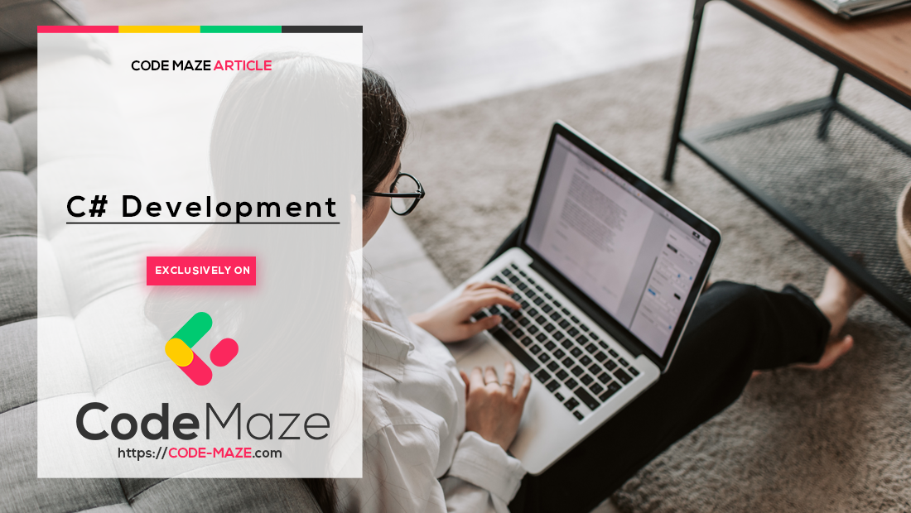

Introduction to Unit Testing With NUnit in C# - Code Maze

<https://code-maze.com/csharp-nunit-unit-testing/>

In this article, we are going to talk about the NUnit testing framework that we can use to write tests in our C# applications.
