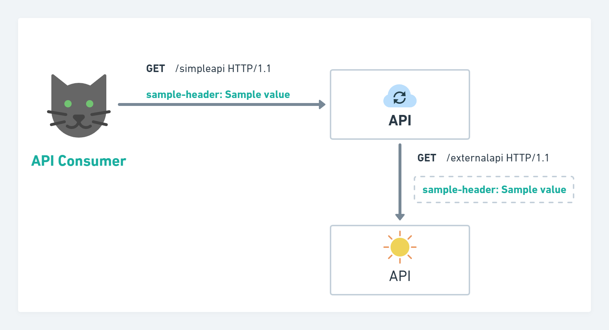
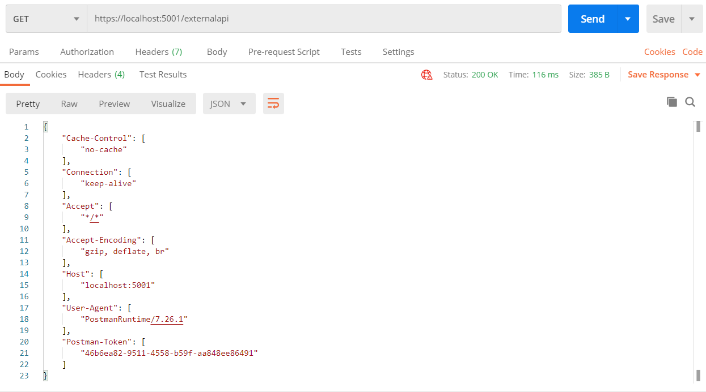
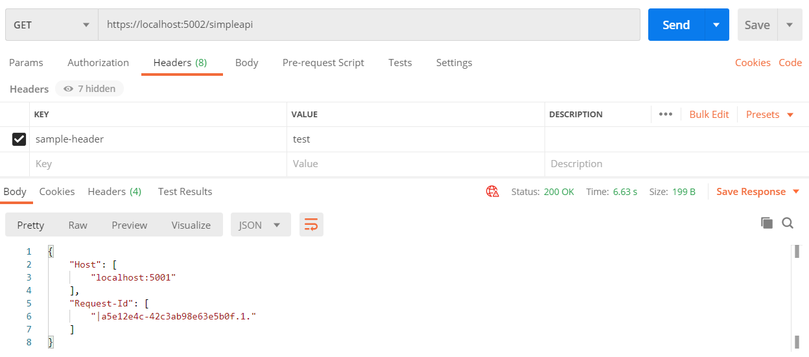
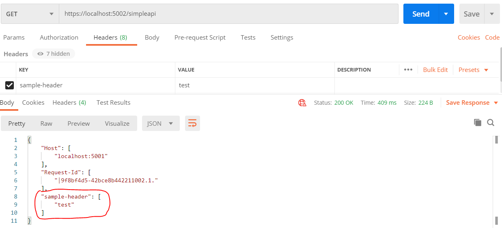

# Header propagation using ASP.NET Core

25 July 2020
• 5 min read

Imagine that you have *REST API* that calls external *REST API*. And you have to propagate requested *HTTP* headers to external *API*. The simplest solution could be just read headers from `Request.Headers` and add it to following `HttpRequestMessage` external *API* request headers collection `request.Content.Headers`. That`s correct . But do we need to write this code by our self? No, because *[Microsoft](https://www.nuget.org/packages/Microsoft.AspNetCore.HeaderPropagation)* already thought about this kind of scenario and created the library `Microsoft.AspNetCore.HeaderPropagation` to solve this task.



Header propagation to external API.

In the following steps, I will try to build a simple example illustrated in the diagram. The example consists of two *Web API* projects which illustrate the basic functionality of the library for *HTTP* header propagation.

## Build steps:

- Install prerequisite tools
- Create two *Web API* projects
- Add and configure `Microsoft.AspNetCore.HeaderPropagation` library
- Run and test

## Prerequisites

Tools you have to install before create this example project:

## Create two Web API projects

Create a new **.NET Core Web API** projects by using the **Windows** command prompt.

### Create *External API* project

```
dotnet new webapi -n ExternalApi
```

Command to create new empty web api application

Open newly created application using **Visual Studio Code** by `File -> Open Folder`.

External *API* will have one *GET* method which for demonstration purpose returns all headers they receive in a request. That allows us to make sure that the propagated header reached the destination.

Create a new controller `ExternalApiController.cs` in the `Controllers` directory and copy the following code.

```
using Microsoft.AspNetCore.Http;
using Microsoft.AspNetCore.Mvc;
using Microsoft.Extensions.Logging;

namespace ExternalApi.Controllers
{
    [ApiController]
    [Route("[controller]")]
    public class ExternalApiController : ControllerBase
    {
        private readonly ILogger<SimpleApiController> _logger;

        public ExternalApiController(
        	ILogger<ExternalApiController> logger)
        {
            _logger = logger;
        }

        [HttpGet]
        public IHeaderDictionary Get()
        {
        	// Return all headers API received.
            return Request.Headers;
        }
    }
}
```

ExternalApiController.cs code.

Try to run your application and do *GET* request <https://localhost:5001/externalapi> using *Postman*. You have to see something similar in the response body.



Call external *API* from *Postman*

Try to add in *Headers* section new custom header `sample-header` and make sure that request returns all headers.

### Create *Simple API* project

```
dotnet new webapi -n SimpleApi
```

Command to create new empty web api application

Open newly created application using **Visual Studio Code** by `File -> Open Folder`.

Simple *API* will have one *GET* method which calls external *API* and returns response received from external *API*. That will show us what headers are propagated to external *API*.

Create new controller `SimpleApiController.cs` in the `Controllers` directory and copy the following code.

```
using System.Net.Http;
using System.Threading.Tasks;
using Microsoft.AspNetCore.Mvc;
using Microsoft.Extensions.Logging;

namespace SimpleApi.Controllers
{
    [ApiController]
    [Route("[controller]")]
    public class SimpleApiController : ControllerBase
    {
        private readonly IHttpClientFactory _clientFactory;
        private readonly ILogger<SimpleApiController> _logger;

        public SimpleApiController(
            IHttpClientFactory clientFactory,
            ILogger<SimpleApiController> logger
            )
        {
            _clientFactory = clientFactory;
            _logger = logger;
        }

        [HttpGet]
        public async Task<IActionResult> Get()
        {
            var client = _clientFactory.CreateClient("externalapi-client");

            var apiResponse =  await client.GetAsync("/externalapi");
            var apiResponseContent = await apiResponse.Content.ReadAsStringAsync();

            return Content(apiResponseContent, "application/json");
        }
    }
}
```

SimpleApiController.cs code

Change `Startup.cs` to register external *API* client.

```
public void ConfigureServices(IServiceCollection services)
{
    services.AddHttpClient("sampleapi-client", options => options.BaseAddress = new Uri("https://localhost:5001"))
    
    services.AddControllers();
}
```

We need to change the default application running *Url*. Because by default it runs on port 5001 and multiple applications can`t be run at the same port simultaneously. Find file `launchSettings.json` in `Properties` directory and change `applicationUrl` property to different port numbers.

```
{
 ...
 "profiles": {
   "SimpleApi": {
      "commandName": "Project",
      "launchBrowser": true,
      "launchUrl": "simpleapi",
      "applicationUrl": "https://localhost:5002;http://localhost:5003",
      "environmentVariables": {
         "ASPNETCORE_ENVIRONMENT": "Development"
      }
    }
  }
}
```

Try to run your application and do *GET* request <https://localhost:5002/simpleapi> using *Postman*. You have to see something similar in the response body.



Call external API from simple API.

We made sure that out of the box our custom header `sample-header` was not propagated to the external *API* call. In the following steps we will solve it.

## Add and configure header propagation library

Before we add to our *SimpleApi* project library stop that project and add `Microsoft.AspNetCore.HeaderPropagation` library by executing the following command using the **Windows** command prompt.

```
dotnet add SimpleApi.csproj package Microsoft.AspNetCore.HeaderPropagation --version 3.1.6
```

Install *[Microsoft.AspNetCore.HeaderPropagation *NuGet*](https://www.nuget.org/packages/Microsoft.AspNetCore.HeaderPropagation/3.1.6)* package

Change `Startup.cs` to enable *HeaderPropagation*feature for our client.

```
public void ConfigureServices(IServiceCollection services)
{
   // Define all headers you would like to propogate
   services.AddHeaderPropagation(options => options.Headers.Add("sample-header"));

   services
      .AddHttpClient("externalapi-client", options => options.BaseAddress = new Uri("https://localhost:5001"))
      // Define DelegatingHandler which handles before sending request to external Api
      .AddHeaderPropagation();

   services.AddControllers();
}

public void Configure(IApplicationBuilder app, IWebHostEnvironment env)
{
   if (env.IsDevelopment())
   {
      app.UseDeveloperExceptionPage();
   }

   // Add header propagation middleware
   app.UseHeaderPropagation();

   ...
```

Enable and configure *Header propagation.*

What is important to point out that in method `ConfigureServices` there are two parts. The first part is to define all headers you would like to propagate and second assign a handler to `HttpClient` that have to use headers propagation feature.

When I first found this library it didn`t work for me , because I skipped the first part in `ConfigureServices` method. And when my request comes to `HeaderPropagationMessageHandler` they didn`t found any headers in the collection. This causes that my custom header didn`t propagate to external *API.* After debugging this library ⚙️ I understood how it works and configure all parts correctly.

## Run and test

Now it`s time to run our *Simple API* project and rerun *GET* request in *Postman* . Check before that you have defined custom header. After executing request you will see that header will propagate to our external *API*. And that`s amazing!



Call external API from simple API with header propagation.

When this library is valuable? For example, you have a *[SPA](https://en.wikipedia.org/wiki/Single-page_application#:~:text=A%20single%2Dpage%20application%20(SPA,browser%20loading%20entire%20new%20pages.)*application and authorization token is on client-side. When you call back-end *API* request include authorization header. It is a real scenario when from back-end you call external *API* and you have to pass authorization token with the request. This library can help you with this and you will have less custom code and decrease the complexity of your solution! Awesome !

Happy header propagating!️

****************[eof]****************
