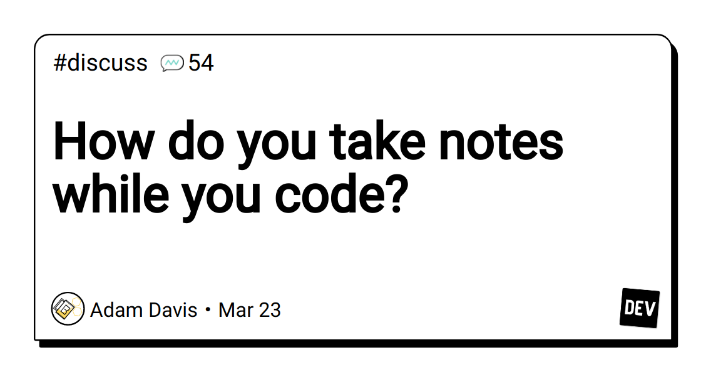

How do you take notes while you code? - DEV Community

<https://dev.to/brewinstallbuzzwords/how-do-you-take-notes-while-you-code-5844>

Do you like to take notes when you're writing code? Do you organize them in some way, or do you only...
