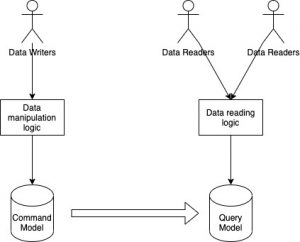

Architecture Pattern | Kislay Verma

<https://kislayverma.com/tag/architecture-pattern/>

Kislay Verma Blog Newsletter Patreon About Search Architecture Pattern Architecture Patterns: Caching (Part-2) Kislay Verma · Posted on February 19, 2022 March 1, 2022 Twitter Email LinkedIn Reddit Share Architecture Patterns: Caching (Part-1) Kislay Verma · Posted on February 19, 2022 February 19, 2022 Architecture Pattern: CQRS Kislay Verma · Posted on March 11, 2021 February 19, 2022 Architecture Pattern: Orchestration via Workflows Kislay Verma · Posted on December 13, 2020 February 19, 2022 Platform Nuts & Bolts : Extendable Data Models
