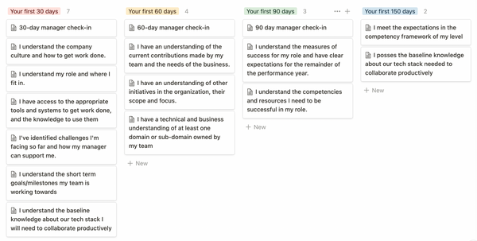

[Leadership Garden](https://leadership.garden/)

[management](https://leadership.garden/tag/management/) / [coaching](https://leadership.garden/tag/coaching/) / [hiring](https://leadership.garden/tag/hiring/)

# The Ultimate Guide to Onboarding Software Engineers

24.Mar.2022 .
14 min read .
Written by [Csaba Okrona](https://leadership.garden/author/csaba/)

1. [Why is onboarding hard?](https://leadership.garden/onboarding-engineers/#why-is-onboarding-hard)
   1. [It’s a combination of known unknowns and unknown unknowns for the new hire](https://leadership.garden/onboarding-engineers/#it%E2%80%99s-a-combination-of-known-unknowns-and-unknown-unknowns-for-the-new-hire)
   2. [It’s emotional](https://leadership.garden/onboarding-engineers/#it%E2%80%99s-emotional)
   3. [It’s expectation management](https://leadership.garden/onboarding-engineers/#it%E2%80%99s-expectation-management)
2. [Onboarding happens on multiple levels and in multiple areas](https://leadership.garden/onboarding-engineers/#onboarding-happens-on-multiple-levels-and-in-multiple-areas)
   1. [Onboarding in the team](https://leadership.garden/onboarding-engineers/#onboarding-in-the-team)
   2. [Onboarding in the wider organization](https://leadership.garden/onboarding-engineers/#onboarding-in-the-wider-organization)
   3. [Onboarding in the culture](https://leadership.garden/onboarding-engineers/#onboarding-in-the-culture)
3. [Tips to make onboarding easier](https://leadership.garden/onboarding-engineers/#tips-to-make-onboarding-easier)
4. [A 13-Step Onboarding Framework](https://leadership.garden/onboarding-engineers/#a-13-step-onboarding-framework)
   1. [The 30 Days Milestone](https://leadership.garden/onboarding-engineers/#the-30-days-milestone)
      1. [I understand my role and where I fit in.](https://leadership.garden/onboarding-engineers/#i-understand-my-role-and-where-i-fit-in)
      2. [I have access to the appropriate tools and systems to get work done, and the knowledge to use them](https://leadership.garden/onboarding-engineers/#i-have-access-to-the-appropriate-tools-and-systems-to-get-work-done-and-the-knowledge-to-use-them)
      3. [I've identified challenges I'm facing so far and how my manager can support me.](https://leadership.garden/onboarding-engineers/#ive-identified-challenges-im-facing-so-far-and-how-my-manager-can-support-me)
      4. [I understand the short term goals/milestones my team is working towards](https://leadership.garden/onboarding-engineers/#i-understand-the-short-term-goalsmilestones-my-team-is-working-towards)
      5. [I understand the baseline knowledge about our tech stack I will need to collaborate productively](https://leadership.garden/onboarding-engineers/#i-understand-the-baseline-knowledge-about-our-tech-stack-i-will-need-to-collaborate-productively)
   2. [The 60 Days Milestone](https://leadership.garden/onboarding-engineers/#the-60-days-milestone)
      1. [I have an understanding of the current contributions made by my team and the needs of the business.](https://leadership.garden/onboarding-engineers/#i-have-an-understanding-of-the-current-contributions-made-by-my-team-and-the-needs-of-the-business)
      2. [I have an understanding of other initiatives in the organization, their scope and focus.](https://leadership.garden/onboarding-engineers/#i-have-an-understanding-of-other-initiatives-in-the-organization-their-scope-and-focus)
      3. [I have a technical and business understanding of at least one domain or sub-domain owned by my team](https://leadership.garden/onboarding-engineers/#i-have-a-technical-and-business-understanding-of-at-least-one-domain-or-sub-domain-owned-by-my-team)
   3. [The 90 Days Milestone](https://leadership.garden/onboarding-engineers/#the-90-days-milestone)
      1. [I understand the measures of success for my role and have clear expectations for the remainder of the performance year.](https://leadership.garden/onboarding-engineers/#i-understand-the-measures-of-success-for-my-role-and-have-clear-expectations-for-the-remainder-of-the-performance-year)
      2. [I understand the competencies and resources I need to be successful in my role.](https://leadership.garden/onboarding-engineers/#i-understand-the-competencies-and-resources-i-need-to-be-successful-in-my-role)
   4. [The 150 Days Milestone a.k.a the finish line](https://leadership.garden/onboarding-engineers/#the-150-days-milestone-aka-the-finish-line)
      1. [I meet the expectations in the competency framework of my level](https://leadership.garden/onboarding-engineers/#i-meet-the-expectations-in-the-competency-framework-of-my-level)

It’s Monday. You’re back at work after a nice weekend, feeling excited as the new engineer is joining your team today! She arrives, gets her laptop and first coffee, you have a nice chat about the weekend, then the question hits you: “So, what’s my first task?”. You don’t really have an answer to this - it’ll take time for her to be able to actually deliver tasks, there’s so much to learn for that, the stack, coding standards, that quirky legacy codebase, the flaky tests, the deployment system, how you do code reviews, wait, then there’s the release train, too... sigh! It’s fine, you think, she’ll figure it out, right? Right? “Well, wait for the engineers to arrive and they’ll figure something out” - you answer, then you excuse yourself, a meeting is starting in 5 minutes and you need to be there.

A week passes and you have your first check-in with her. She seems... nervous and confused. She doesn’t feel she’s learned much and she feels very insecure. She must be unfit for the role, eventually, as she clearly should be delivering tickets by this time, right? It’s only a matter of time to get fired in the probation period. These are some of the thoughts going through her mind. Or, if she’s experienced, she might think “What a crap place. It was a mistake signing that contract. Well at least I can leave within 2 weeks”.

If you’re in a bigger or more mature company, there’s a good chance HR figured out at least some of the onboarding. They typically enroll new hires in a training program or orientation to help them get acquainted with the company, its departments, policies, and the basic outline of the position. As important as it is, this doesn’t include engineering onboarding, team-level rules of the game, architecture, coding standards, etc. - that needs to happen within the function.

As an engineering manager, I had messed this up more times than I’m comfortable admitting. I didn’t provide a structure, subject matter, and mental support to new joiners which resulted in a very bumpy ride for some of them. There was one engineer leaving clearly because of this.

Even companies that solved the hiring side of “hypergrowth” get bitten by the lack of proper onboarding.

**Candidate experience doesn’t stop at signing the contract.**

---

\* \* \*

## Why is onboarding hard?

### It’s a combination of *known unknowns* and *unknown unknowns* for the new hire

As a new joiner, it's tons of learning, and that is never trivial. Just like with most types of learning, there are things you already know in the domain (e.g. you are proficient with a programming language), there are things you know you need to learn yet (e.g. you’ve heard about HTTP/3 but you know nothing about it practically), and then there are things you don’t even know you miss (e.g. the team you just joined uses this weird legacy message queue solution you never heard of).

If you’re structured enough you can gradually learn your known unknowns, but there’s no way to understand what *else* you need to pick up unless somebody tells you. The problem is, it’s mostly known knowns or known unknowns for the rest of the team, so it might feel ‘trivial’ to them (”well of course we use event sourcing, we’ve always done that!”).

This is one of the reasons why structure helps. If there’s a list or mind map of things to know, one can navigate.

### It’s emotional

Being a new joiner is usually a high-stakes situation. You’ve given up a previous, maybe comfortable job, you know you can be let go quickly in your probation period, and there are tons of unknowns in the equation at this moment.

Will you get to stay?

Can you learn *all this*?

Will you like it here?

Will they like you?

Are you performing well? What is expected of you exactly at this stage?

Then there’s “onboarding fatigue” - the feeling that all you do is learn things. This can be especially bad if you’re coming from a job where you performed really well - the gap is just too great.

As a manager or an onboarding buddy, you can help tremendously by setting clear (and realistic!) expectations and being moral support. Telling the new joiner repeatedly “you can do it”, “take your time”, “we’ve all been there” might sound like nothing to you, but might mean peace of mind to them.

### It’s expectation management

There are multiple stakeholders in this situation. The rest of the company might expect you to deliver the new shiny project fast. Your PM might expect the team to move faster since you just got a new engineer. Your other engineers might feel the new team member is slowing them down.

You need to acknowledge one important fact and align on this with your stakeholders: a new hire will cause the team to take a velocity dip before getting faster. Onboarding takes time and effort. It’s an investment. Ideally, you know all this way before the new joiner arrives. Ideally, you agreed on all this when you decided to hire. Ideally, you don’t even need to tell this to them as it’s part of your culture. If not, it’s never too late to have these talks.

In a later section of this post, I'll show you a simple 30-60-90-150 day framework for this.

## Subscribe

A hand-curated newsletter for **leaders and managers** in tech.

Ideal for busy people such as Tech Leads, Engineering Managers, VPs of Engineering, CTOs and more.

I won't send you spam - pinky swear! Unsubscribe at any time. ❤️

---

\* \* \*

## Onboarding happens on multiple levels and in multiple areas

Finding your way around in onboarding-land is not easy

Onboarding is not a single thing. It happens in multiple parallel tracks which require different strategies. This makes onboarding even harder as participants (the new joiner and their manager) need to juggle focus and time invested.

### Onboarding in the team

The first and most immediate scope is the team. This context is where work gets done and where most of the time is spent. Onboarding here already happens in multiple areas, for example:

**Making connections** - getting to know the team members, dynamics, how to talk to whom, who to talk about what, pet peeves, preferences, moods, roles.

**All the unwritten rules** nobody tells you but you slowly discover

**Roles and responsibilities** in the team (who does what, what can you expect from certain people). Here, doing an [ARCI](https://en.wikipedia.org/wiki/Responsibility_assignment_matrix) exercise together with the whole team can be super helpful. Or just walk the new joiner through the one you already documented if it's up to date.

**Workflows and processes**, and the way the team does agile(ish).

**The team's role and purpose** in the organization and in the product(s).

Learning the ropes of the **tech stack(s)** involved. There's a great article called [Development cold start](https://medium.com/codex/development-cold-start-dad87e7836d1) which describes the importance of good tech onboarding. Hint: it's more than documentation, though good documentation is key. Pair programming also helps. So do walkthrough and overview sessions (of architecture, development processes, and codebases) led by experienced engineers already well-versed on the stack.

Learning to work with your **manager.** Understanding their role (can be quite different from company to company), personality, interactions, and expectations.

### Onboarding in the wider organization

Getting to know the **team’s stakeholders** and the usual interactions with them.

Joining the **communities of practice**, e.g. chapters or guilds.

Joining **cross-team work** (on the group/tribe or on the organization level).

Understanding **other departments**: their role and interactions with them. Sales, support, customer success, marketing, legal, copywriters, and people ops (HR) come to mind. You might or might not have direct interactions with some of these departments.

### Onboarding in the culture

This is the hardest to define of all. There’s a natural, organic way, just by spending time - it happens regardless of what you do. That said, parts of it can and should be communicated and discussed. Your company might have a well-documented culture, which is a nice place to be, but most companies don't have anything like that. Sometimes it's just a "list of values" like "we are brave", "we care about our customers" etc. - but what does this mean in practice? What decisions does this affect in what way and what are some past examples of that?

Be sure to talk about culture regularly and ask for feedback from the new joiner. Ask them what surprised them the most? What felt nice, what was easy to align with? What's missing? Can they bring examples? How were these things at their previous workplaces? What can you learn from them?

Beware that onboarding in the culture also happens on the subconscious level. The new joiner might feel that something's off but might not be able to exactly pinpoint what. Be empathetic and understanding.

## Tips to make onboarding easier

**Assign an onboarding buddy** to your new joiner! Having a go-to person instead of just asking the whole team makes a huge difference. I still remember how big of help my onboarding buddies were in the past - not only about subject matter expertise but even more importantly, being the first people with whom I had a personal connection at the new job. According to the [Harvard Business Review](https://hbr.org/2019/06/every-new-employee-needs-an-onboarding-buddy), onboarding buddies can clarify organizational context, improve productivity, and enhance employee satisfaction.

**Provide opportunities for feedback and questions.** Don't wait for feedback, ask for it, regularly! Your new hires will feel heard and cared for, and fresh pairs of eyes will provide you with really valuable insights and ideas. Plus, when misunderstandings and uncertainties are cleared up quickly, this can prevent bigger issues down the line.

**Provide regular feedback**. On the flip side, new hires will need frequent feedback to feel safe in their onboarding and understand if they are doing things right. This is both important for their self-confidence, lower their stress levels and make sure they are indeed in the right direction. Please note that positive feedback, the acknowledgment should also be a part of this (hopefully you're already doing this with your existing employees!).

**Involve stakeholders from all levels of the organization**. You're not alone in onboarding your new joiner and you shouldn't be! One of the most important things you can do for them is to help them build out their network in the company, by actively connecting them with people. It will give hires a bigger picture of company culture, structure, and operations, too.

Remember my words on "Development cold start" a few sections before? **Make sure tech onboarding is as smooth as it can get**.

**Understand that everyone has their own way of learning**. Don't "wing it" by applying your theories on how *you* would onboard best! Talk to the new joiner and understand their preferred ways. Do they want to get their hands dirty ASAP? Do they prefer diving into documentation first? Do they enjoy pairing?

**Coach mentors and onboarding buddies**. This is your best bet in scaling onboarding - by investing in the people doing it.

**Set onboarding goals and milestones but be generous with timing**. Structure and a plan are a must (more on that below) but don't expect everyone to go through all of it at the same speed. Even in the same level of seniority, there'll be differences.

**Be there for your new hire**. Even if you have the best onboarding buddy and mentor for your new joiner, you also need to be there for them. You, as their manager, ultimately own their onboarding and you are accountable for it. Be the encouraging, friendly voice for them.

**Onboarding starts before the new hire’s first day**. By preparing ahead of time, you make the employee feel valued because you’ve already invested time in them before they officially started. You also avoid wasting people’s time by having a plan for what the first few weeks look like.

**Provide checklists for the manager, the onboarding buddy, and the new hire.** All the other available onboarding resources are less helpful if the new joiner has to search for them on their own. The manager, the onboarding buddy, and the new teammate should have their own checklists to help them complete necessary tasks before and after the new hire joins. These checklists typically include - among other things - getting access to critical tools, adding the new joiner to communication channels, and the list of first introductions.

**Create a single "welcome" document for the new hire**. Even with a good structure in onboarding, there'll be multiple lists and other materials the new joiner will need to periodically refer to. Create a single source of truth that links to these resources and gives a birds-eye overview of the onboarding journey.

---

\* \* \*

# A 13-Step Onboarding Framework

Plan your first months of onboarding

Finally, here's a high-level framework you can tweak and use. It's divided into check-in milestones, one for checking in after 30 days, one after 60 days, then 90, and then 150. These are totally arbitrary numbers, but in my experience work pretty well in most cases.

For all milestones, you'll find a set of "statements" with an explanation and a high-level overview of the "stage" to give you a sense of what it is about. You can use your [one-on-one sessions](https://leadership.garden/the-basics-of-one-on-ones/) with your new joiner or set up separate check-in sessions to signify their importance.

I phrased it from the viewpoint of the new hire, so you can copy-paste and share it with them.

---

\* \* \*

## The 30 Days Milestone

30 days in your new job

At 30 days, the aim is to add clarity around general and role-related expectations, as well as develop a regular cadence for check-in discussions with your manager. You won't necessarily have all of the tasks done in each list, but you should be able to speak to them if needed.

The goal is not for this to be a performance review, but an opportunity to see how you're tracking and if your manager can provide more support or direction that would be helpful in your development journey.

The prompts provided on each statement should serve as a topic of discussion at each of your 30 / 60 / 90 day check-ins, so come prepared to discuss how you feel you're tracking on each one.

**Statement: I understand the company culture and how to get work done.**

For your discussion around this, think about what you've observed about the culture and the way it works during your first 30 days.

**Questions to help get you started:**

- What about the company culture makes it easy for you to work?
- What about the culture presents a challenge to getting work done?
- What sorts of things can you do to improve the way others work?
- How are the company values showing up in the work you've done so far?

### I understand my role and where I fit in.

Ask your manager about any role descriptions, competencies, or growth profiles available for your role.

**Take some time to speak with your manager and your team to better understand:**

- The core skills required for your role
- The scope of your role
- How your team contributes to company goals

### I have access to the appropriate tools and systems to get work done, and the knowledge to use them

Make sure you have the right tools and knowledge to use them.

- What are some tools you would like to understand how to use better?
- Are there any tools your team is using where you have been unable to find the support you need to get up to speed?
- How about our observability tools?

### I've identified challenges I'm facing so far and how my manager can support me.

Getting started at a new company can be challenging at times. You might run into some friction with getting to know people, understanding the tools and processes, or wrapping your head around a host of new products and information.

Take some notes on this to reflect on any initial challenges you've uncovered during your first 30 days, and bring these with you to your check-in with your manager.

Remember, this is not a time where you need to feel bad for hitting a wall or not knowing something, but an opportunity for your manager to support you.

### I understand the short term goals/milestones my team is working towards

After getting some onboarding work done, which can sometimes be more targeted at getting you familiarized with the tools and technologies your team works with, you've also had the chance to work and participate in defining the next stories to be worked on by the team, and how do they fit into the team's roadmap.

Overall, you have at least a 2 sprint long understanding of what the team is working towards.

### I understand the baseline knowledge about our tech stack I will need to collaborate productively

Your community of practice or your team should have a guide available, go through it and make a plan to successfully study all content.

Note that this is not about being proficient in the stack, but having a good overview of it at this stage.

---

\* \* \*

## The 60 Days Milestone

60 days in your new job

You've reached 60 days (well done!), and should have already been through your 30 day check-in with your manager. You're starting to get up to speed, meeting more people, and really starting to dig into the work you and your team are doing.

The statements below provide additional prompts for your 60-day check-in. Read and take notes on each of them, if helpful, and come prepared to discuss each of the topics with your manager.

### I have an understanding of the current contributions made by my team and the needs of the business.

By this point, you should have a solid understanding of the annual strategy, and how your team is adding to it. Another element of this is how close you are staying in touch with the needs of your stakeholders.

**Questions to consider:**

- Who would you identify as your team's stakeholders?
- How would you summarize what you've learned so far from stakeholder meetings?
- How comfortable are you explaining company goals?
- How well do you understand how your team's work contributes to the company-level goals?

### I have an understanding of other initiatives in the organization, their scope and focus.

In your first month, you were focusing on getting yourself settled and understanding your role. By your 60 day check-in, you should have broadened your scope of understanding to other teams.

**Questions for discussion:**

- What other teams are you working with closely?
- Do you understand the full scope of their work, or only as it relates to your team?
- Which teams have you not connected with?
- How might you build stronger relationships?

### I have a technical and business understanding of at least one domain or sub-domain owned by my team

In your second month, you should have had explored and delivered tasks enough to understand part of the codebase and the impact of a domain or sub-domain owned by your team.

**Questions for discussion:**

- What parts of the code I'm struggling the most with?
- Have you identified something that can be improved?
- Do you feel you are able to bring others on board in that specific domain or sub-domain?

---

\* \* \*

## The 90 Days Milestone

90 days in your new job

At this point, you're likely feeling truly in the thick of things. Maybe you've delivered a few projects already, or perhaps you've spent most of your time observing and taking it all in. Regardless, the behaviors you've been building over the past 90 days are preparing you for this moment: where you take control of your personal and professional growth.

While there are a couple of elements here outside the topic of growth, the main focus is taking your development to the next level.

### I understand the measures of success for my role and have clear expectations for the remainder of the performance year.

*Your manager should drive this conversation, but we'd like to encourage you to bring your own questions as well.*

**Some points to discuss:**

- How does my role tie into the overall company strategy?
- What would you need to see from me in order for you to assign me a 'Great Year' performance in the next performance review? What about an 'Exceptional Year?'

### I understand the competencies and resources I need to be successful in my role.

Review the competencies associated with your role with your manager. Again, this is one of many future conversations you should be having on this topic, so it's beneficial to build this behavior early.

**When reviewing, ask yourself:**

- Are these competencies clear?
- Am I involving the right people?
- Do I currently have the resources available to meet my development goals?
- Are there opportunities to regularly apply these skills in my role? If not, how can I seek out opportunities to do so?

---

\* \* \*

## The 150 Days Milestone a.k.a the finish line

150 days in your new job

### I meet the expectations in the competency framework of my level

You've arrived. What a journey! By now you mostly know all you need to perform well in your role and you're confident you can learn the rest.

**UPDATE**: [Here's a nice Hacker News thread](https://news.ycombinator.com/item?id=30810786) with lots of interesting perspectives

## Subscribe

A hand-curated newsletter for **leaders and managers** in tech.

Ideal for busy people such as Tech Leads, Engineering Managers, VPs of Engineering, CTOs and more.

I won't send you spam - pinky swear! Unsubscribe at any time. ❤️

- 
- 
- 
- 
- 
- [![](data:image/svg+xml,%3csvg xmlns='http://www.w3.org/2000/svg' class='icon__cnt js-evernote-checked' width='0' height='0' data-evernote-id='801'%3e%3cpath d='M24 30.2c0 .2.1.5.1.8 0 1.4-.5 2.6-1.5 3.6l-2 2c-1 1-2.2 1.5-3.6 1.5-2.8 0-5.1-2.3-5.1-5.1 0-1.4.5-2.6 1.5-3.6l2-2c1-1 2.2-1.5 3.6-1.5.3 0 .5 0 .8.1l1.5-1.5c-.7-.3-1.5-.4-2.3-.4-1.9 0-3.6.7-4.9 2l-2 2c-1.3 1.3-2 3-2 4.9 0 3.8 3.1 6.9 6.9 6.9 1.9 0 3.6-.7 4.9-2l2-2c1.3-1.3 2-3 2-4.9 0-.8-.1-1.6-.4-2.3L24 30.2z' data-evernote-id='417' class='js-evernote-checked'%3e%3c/path%3e%3cpath d='M33 10.1c-1.9 0-3.6.7-4.9 2l-2 2c-1.3 1.3-2 3-2 4.9 0 .8.1 1.6.4 2.3l1.5-1.5c0-.2-.1-.5-.1-.8 0-1.4.5-2.6 1.5-3.6l2-2c1-1 2.2-1.5 3.6-1.5 2.8 0 5.1 2.3 5.1 5.1 0 1.4-.5 2.6-1.5 3.6l-2 2c-1 1-2.2 1.5-3.6 1.5-.3 0-.5 0-.8-.1l-1.5 1.5c.7.3 1.5.4 2.3.4 1.9 0 3.6-.7 4.9-2l2-2c1.3-1.3 2-3 2-4.9 0-3.8-3.1-6.9-6.9-6.9z' data-evernote-id='418' class='js-evernote-checked'%3e%3c/path%3e%3cpath d='M20 31c-.3 0-.5-.1-.7-.3-.4-.4-.4-1 0-1.4l10-10c.4-.4 1-.4 1.4 0s.4 1 0 1.4l-10 10c-.2.2-.4.3-.7.3z' data-evernote-id='419' class='js-evernote-checked'%3e%3c/path%3e%3c/svg%3e)](https://leadership.garden/onboarding-engineers/# "Copy link")

---

---

### You Might Be Interested In

19.Jan.2022

. [coaching](https://leadership.garden/tag/coaching/)

## [A One-On-One Document Template You’ll Actually Use](https://leadership.garden/one-on-one-doc-template/)

[[anexo ausente]](https://leadership.garden/goal-setting/)

02.Jul.2020

. [coaching](https://leadership.garden/tag/coaching/)

## [The 101 of effective goal setting](https://leadership.garden/goal-setting/)

19.May.2020

. [coaching](https://leadership.garden/tag/coaching/)

## [Thoughts On Giving Feedback](https://leadership.garden/thoughts-on-feedback/)

Tags

- [burnout](https://leadership.garden/tag/burnout/)
- [career](https://leadership.garden/tag/career/)
- [coaching](https://leadership.garden/tag/coaching/)
- [communication](https://leadership.garden/tag/communication/)
- [feedback](https://leadership.garden/tag/feedback/)
- [goals](https://leadership.garden/tag/goals/)
- [growth](https://leadership.garden/tag/growth/)
- [hiring](https://leadership.garden/tag/hiring/)
- [interview](https://leadership.garden/tag/interview/)
- [kindness](https://leadership.garden/tag/kindness/)
- [management](https://leadership.garden/tag/management/)
- [mindset](https://leadership.garden/tag/mindset/)
- [one-on-one](https://leadership.garden/tag/one-on-one/)
- [performance](https://leadership.garden/tag/performance/)
- [product](https://leadership.garden/tag/product/)
- [team](https://leadership.garden/tag/team/)
- [tech-debt](https://leadership.garden/tag/tech-debt/)

Navigation

- [Home](https://leadership.garden/)
- [About](https://leadership.garden/about/)
- [RSS](https://leadership.garden/rss/)
- [Newsletter](https://newsletter.leadership.garden/)
- [Twitter](https://twitter.com/ochronus)

## ✨ Subscribe ✨

A hand-curated newsletter for **leaders and managers** in tech.

Ideal for busy people such as Tech Leads, Engineering Managers, VPs of Engineering, CTOs and more.

***No ads, ever.***

I won't send you spam - pinky swear! Unsubscribe at any time. ❤️

© 2022 Leadership Garden

- 
- 
