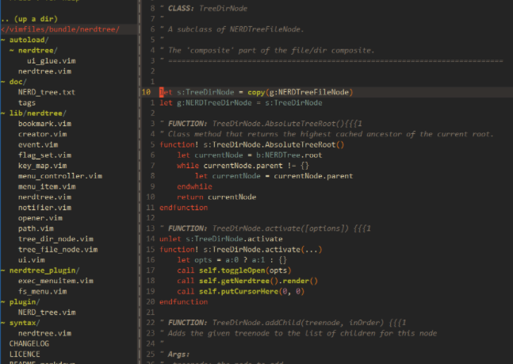
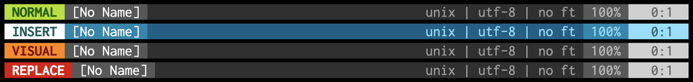
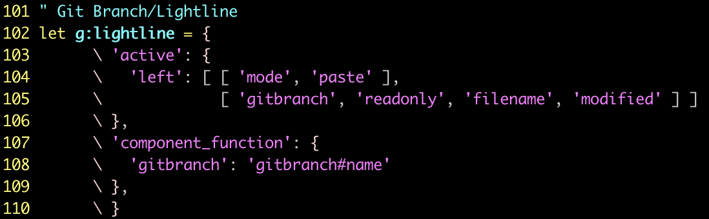
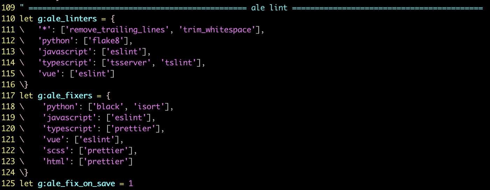
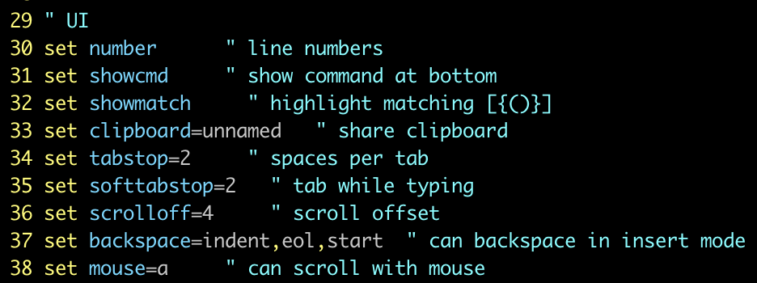
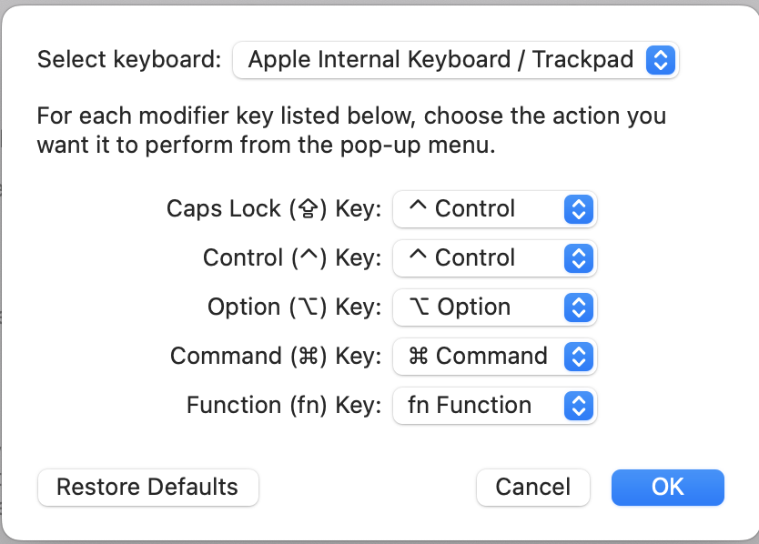

# Level Up Your Vim Experience

## New to Vim? Here’s my recommended plugins and setup

Photo by [James Harrison](https://unsplash.com/@jstrippa?utm_source=medium&utm_medium=referral) on [Unsplash](https://unsplash.com/?utm_source=medium&utm_medium=referral)

In my last [article](https://medium.com/@taylork26/why-i-chose-to-learn-vim-5bf430b1bc9), I told you about why I chose to learn Vim and my Vim experience thus far. Here I’ll walk you through my personal Vim environment and what makes it so great.

## The Setup

1. Download Vim (I used [Homebrew](https://formulae.brew.sh/formula/vim) — `brew install vim`)
2. Download [Vundle](https://github.com/VundleVim/Vundle.vim) — this is what you’ll use to manage your plugins
3. Follow the instructions on Vundle’s README to copy and paste the starter code into your `~/.vimrc` file

> Want more practice in Vim? **Edit your dotfiles using Vim.** I used to edit my dotfiles in Text Edit — can you imagine?! Why not go directly from your command line into the file? Type `vim ~/.vimrc` in your terminal prompt — the file opens directly in your Vim environment ready to edit. And now I’ve given you another reason to learn Vim and an easy way to practice!

## `~/.vimrc`

Your `~/.vimrc` file is where all your Vim configurations will live. This is where you’ll add your plugins, key-mapping, and setup. Once you have the starter code from Vundle, you can begin to customize this file to your needs.

# Notable Plugins and Features

## [NERDTree](https://github.com/preservim/nerdtree)

NERDTree example from their [README](https://github.com/preservim/nerdtree)

NERDTree displays all your files on the left of your editor, not unlike the file display in Visual Studio Code. Use it to easily navigate to and quickly open files to read or edit. For example — I split my editor and have the code I’m editing on the left and my testing file on the right (TDD — a topic for another time). **Vim shortcut —** `^W V` **splits your editor.**

## [Lightline](https://github.com/itchyny/lightline.vim)

Example of the status bar using Lightline from their [README](https://github.com/itchyny/lightline.vim)

Lightline inserts a status bar at the bottom of your editor. There are several themes to choose from depending on your color preference. This plugin allows you to easily see which mode you are currently operating in. There’s nothing more frustrating than thinking you’re in `NORMAL` mode and typing commands directly into your code because you were actually in `INSERT` mode. Save yourself the headache.

## [vim-gitbranch](https://github.com/itchyny/vim-gitbranch)

My Lightline/Gitbranch setup in `~/.vimrc`

Leverage your Lightline plugin — this plugin works in conjunction with Lightline and displays your current working branch in your status bar. It is especially helpful when you frequently switch branches and lose track of your current working branch.

## [ALE (Asynchronous Lint Engine)](https://github.com/dense-analysis/ale)

My Ale Configuration in ~/.vimrc

Your one-stop-shop for linting, syntax checking, and semantic error alerting while you edit your files. In other words, lint as you type. You can set up both linters and fixers. It’s customizable based on language and has several other features I haven’t even explored yet.

## [You Complete Me](https://github.com/ycm-core/YouCompleteMe)

From their GitHub, “YouCompleteMe is a fast, as-you-type, fuzzy-search code completion, comprehension and refactoring engine for [Vim](https://www.vim.org/).” This plugin will upgrade your efficiency like mad. The install requires some configuring, but follow along carefully with their README and you’ll be set up in no time.

## UI Configuration

My UI Configuration in /.vimrc

There are several ways to customize your Vim UI. For example, `set number` displays your line numbers. These are just a few examples — I encourage you to flex your [Google Fu](https://en.wiktionary.org/wiki/Google-fu#:~:text=Google%2Dfu%20(uncountable),useful%20information%20on%20the%20Internet.) as you personalize your Vim environment.

> This is by no means an exhausted list of Vim Plugins. Take what works for you, and use this as an opportunity for a little fun and exploration.

## Helpful Commands for Plugins:

1. Add the Plugin line to your `~/.vimrc` file (it should look similar to the example below)

Example Plugin line in ~/.vimrc

1. To install plugins — launch `vim` and run `:PluginInstall`
2. To remove plugins — remove the line from your `~/.vimrc` file, launch `vim`, and run `:PluginClean`

## A Key Mapping Game Changer

> I’ll leave you with this last little trick taught to me recently…

If you’re using a Mac keyboard, the bottom left four keys are a little out of the way when your fingers are positioned nicely where they’re *supposed* to be if you paid attention in typing class. Call back to [Mavis Beacon](https://en.wikipedia.org/wiki/Mavis_Beacon_Teaches_Typing) — anyone else take a class like this in grade school?

Coding in Vim is all about efficiency. We use the `Control` key quite frequently. Reaching your pinky down towards the `Control` button is not very efficient and takes your fingers out of line with the home keys.

When is the last time you used your `Caps Lock`? Upon the rare occurrence when I need to type several words in all-caps, I tend to hold down the `Shift` button and let it ride. The `Caps Lock` key could be put to much better use, don’t you think?

Enter — keyboard mapping. We will map our `Caps Lock` key to perform the action of our `Control` key instead.

## Try it Out

1. Open System Preferences
2. Navigate to Keyboard
3. Click on Modifier Keys
4. You’ll see a pop up with a list of keys and the action they perform when you click them
5. Change your `Caps Lock` key to `Control`
6. Bam — now every time you hold down `Caps Lock`, you’ll trigger the `Control` action

Note: Option to leave the `Control` key as it is so that both keys are now effectively `Control` keys. If you would still like to have access to `Caps Lock`, I recommend mapping your `Control` to `Caps Lock` instead.

**This article only scratches the surface of all you can do in Vim — and I’m just a beginner :) let your curiosity explore what else is possible!**
