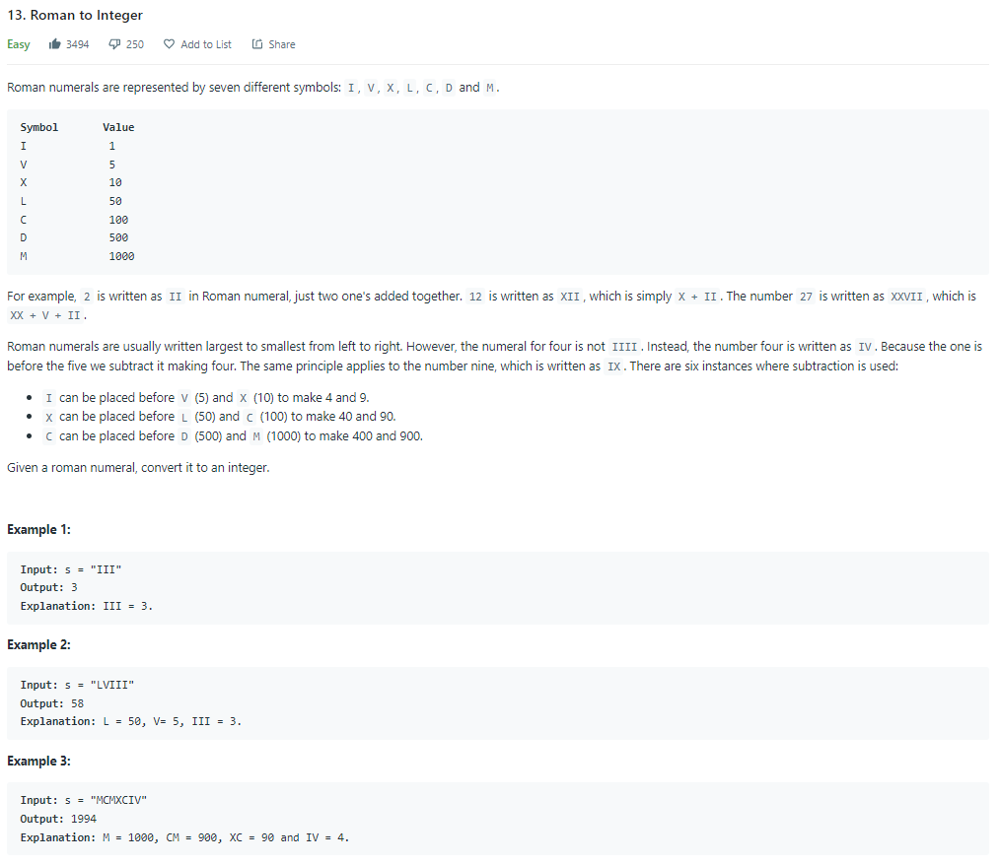
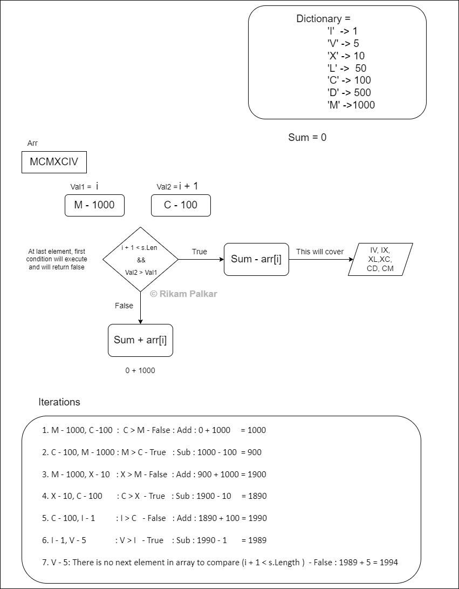
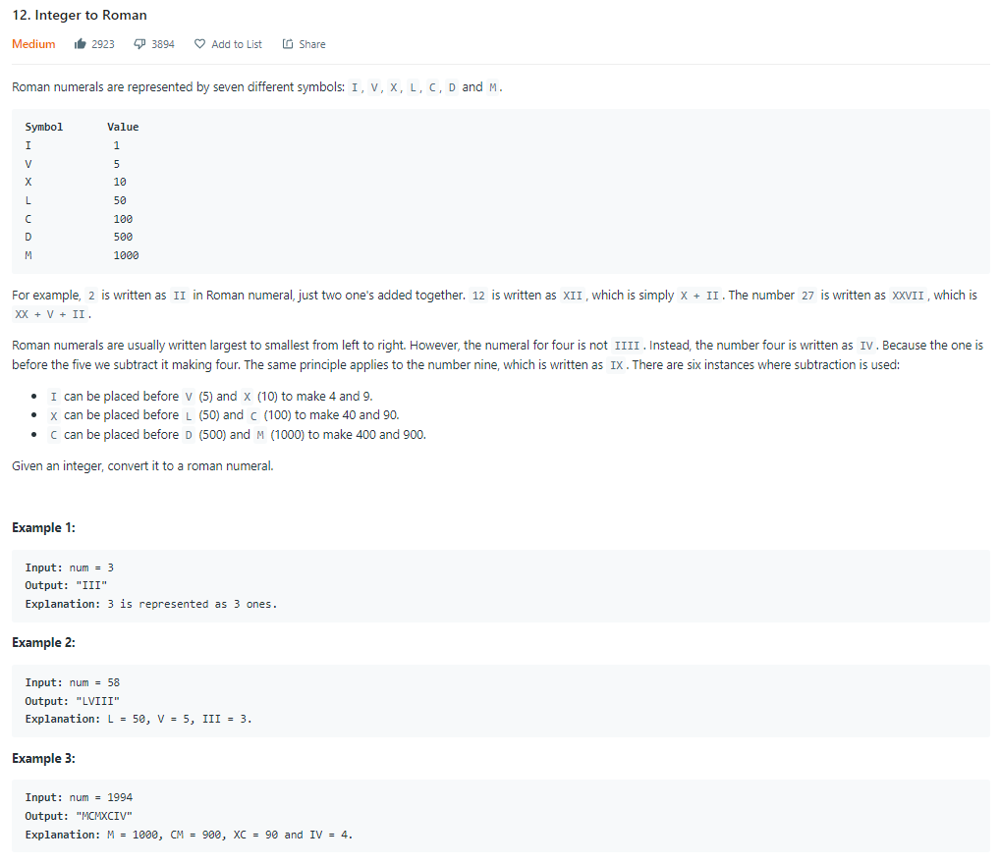
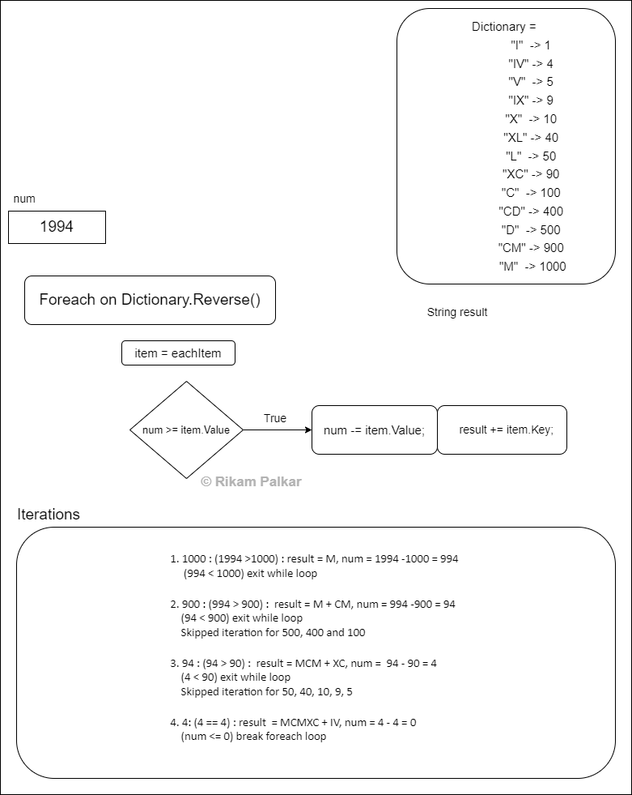

# Roman To Numbers To Roman in C#

Besides its very confusing title, I got a bucket full of baffling code ❤ just for you all good chaps out there!

So fasten your seatbelt, and get ready for this bumpy ride.

We got 2 items on the menu today, Leetcode’s problem number [12. Integer to Roman](https://leetcode.com/problems/integer-to-roman/) and [13. Roman to Integer](https://leetcode.com/problems/roman-to-integer/).

Good news for problem #12, I’ve cooked 2 approaches, considering it would take time to digest them let us park the problem #12 aside for a while and begin with cute little problem number 13.

# 13. Roman To Integer

This problem is pretty straightforward. You take the roman number as input parameters and you have to return its respective integer number.

Before we jump into logic, I highly recommend you guys to read the problem in detail [here](https://leetcode.com/problems/roman-to-integer/). If you are too lazy to go through the link, here is the snapshot of a problem straight outta leetcode.

Snapshot of Leetcode’s Roman to Integer

While I was solving this problem there was one test case that failed multiple times. That means I should probably start with an easy one right? Please who are we kidding, I decided to take that ferocious number for an example which is `“MCMXCIV”` converts back to `1994` in numbers.

# The Logic

So we need a data structure to store the roman number with its respective integer number. Such as for `‘I’` we need `1`, for `‘V’` we would map `5`.

Let’s make best use of the **Dictionary**, shall we?

Here all we gotta do is either **subtraction** or **addition**. ***That’s it!***

- For example, if input string is `“III”` then we add `1+1+1 = 3`
- If string is `“IV”` then we would compare for current roman element `“I”` to its next roman element `“V”`. If the next element’s numeric value is greater than the current element’s value, we would subtract else we add. That went right above your little brain, ain’t it? Here is an example which is ease on eyes.
- `I = 1`, `V = 5`: Here `V > I` so we subtract, `1 — 5 = -4` then for the last element `“V”` just add its respective value `“5”`to the equation `-4 + 5 = 4` which is your final answer.

That’s all. That’s your whole and soul logic.

Now for our example `1994`, I have created a flow chart, with the flow chart you’ll get a slight idea how our logic is going to work with every iteration.

N**ote:** While comparing the next element we would encounter an `Array IndexOutofBoundsException` when we reach the last element. That is because we have exhausted the array length. for last `i-th` element we won’t have `i+1` element. So we need to take care of that validation as well. More work GREAT!

- In above example of `“IV”` when a pointer reaches `“V”` we would simply add the value of `“V”` and exit the loop. I know this would be confusing. That is exactly why I have created this beautiful flowchart.

Flowchart & Iterations for Roman To Numbers.

Once you understand the logic through flowchart the actual code is pretty straight forward.

**Listing 1: RomanToNumber.cs; Time complexity of O(n ), Space complexity of O(n)**

# 12. Integer To Roman

In a previous problem, we saw how to convert Roman numbers To Numeric values, in this problem we will do exactly the opposite.   
This is [**leetcode’s problem #12**](https://leetcode.com/problems/integer-to-roman/) with difficulty level set to **medium**. What we did last time is to compare current and next roman characters and perform basic addition and subtraction.  
This problem is almost similar with little extra space. What do I mean by extra space? Well let’s see.

Here is a snapshot of a problem,

Snapshot of Leetcode’s Roman to Integer

# The Logic

There are 2 approaches to the solution. First one with O(n\*m) complexity and second one with O(n). Let’s see both.

# First Approach

The data structure we need for this problem is a **Dictionary**. Because we need to store Key-Value pairs **AGAIN!** Earlier I mentioned we need extra space, we need that extra space to handle these 6 conditions, `IV, IX, XL, XC, CD, CM`. We can either use if-else statements or switch cases to handle these conditions or simply add these values in the data structure as a part of the dictionary.

For logic, all we have to do is to loop through the dictionary in **reverse order** from large to small numbers. **Tip: You can also store dictionary values in reverse order**, here just for demonstration I am using the **Reverse()** method of dictionary.

For each item in the dictionary we need to compare the number and shrink the number with every iteration. Didn’t understand, right? I knew it. Let’s debug this with an example.

let’s take `“350”` as input,

- We will start traversing the dictionary in reverse order.
- Compare `“350”` with each value of the dictionary until we find a value which is less than `“350”`. That will take us to `“100”`. From there we will start shrinking the number `“350”` till `“350”` becomes less than the next value in the dictionary.
- That will take 3 rounds of `“100”`, i.e. `100 * 3 = “CCC”`, Now we are left with `“50”` for which we traverse further down till we find `“50”` and now we shrink `“50”`.
- Concatenate `50 = “L”` to the result. So our final result would be `“CCCL”`
- We’ll check if the `number is <= 0` if yes then break the loop and return the result.

To understand the flow of execution, refer to this flowchart below. For an example we are using the same hideous number `1994`. You will learn how we are updating numbers with each iteration.

Flowchart & Iterations for Numbers To Roman.

Once you understand the logic, code is pretty straight forward as always.

**Listing 2: Approach1.cs, Time complexity of O(n \* m), Space complexity of O(n)**

Note: This solution is suggested because here you don’t have to manually map keys with their values as we are using a dictionary. But here we have **time complexity of O(n \* m)**, with **space complexity of O(n)**.  
We can scale this solution to O(n) but the tradeoff would be to expand the space complexity. Let’s do that, for which we need 2 arrays one to hold roman letters and another for numbers.

# Second approach

**Listing 3: Approach 2, Time complexity of O(n), Space complexity of O(n + m)**

In this solution we have optimized the code with time complexity of O(n), but now space complexity is O(n+m).

It’s up to you to choose your own adventure w.r.t. approach.

What I feel is, the second approach could lead to user error. I can easily mismatch elements in either of the arrays while typing. So I will have to keep track of key and value pairs to ensure each key is representing its own value. For the scope of this problem it’s okay as input is limited but if in future input is expanded then it could create a problem.

But that’s the discussion for another day. Till then have a good one.

Photo by [Christina @ wocintechchat.com](https://unsplash.com/@wocintechchat?utm_source=medium&utm_medium=referral) on [Unsplash](https://unsplash.com/?utm_source=medium&utm_medium=referral)

Cheers

Rikam.

[## Rikam Palkar - Software Engineer - CygNet - Weatherford | LinkedIn

### Making a world a better place by writing scalable code. I never discovered my passion for coding in college, nor in…

www.linkedin.com](https://www.linkedin.com/in/rikampalkar/)
