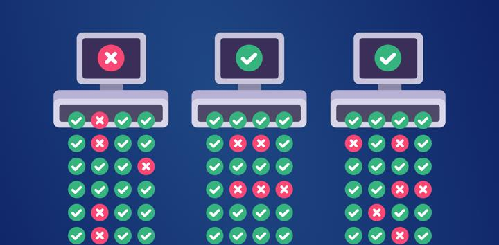

Executando Testes em Paralelo - LuizDeAguiar

<https://luizdeaguiar.com.br/pt/2022/03/24/executando-testes-em-paralelo/>

Tutorial para configurar um projeto python de automação web para executar testes em paralelo utilizando o plugin pytest-xdist.
