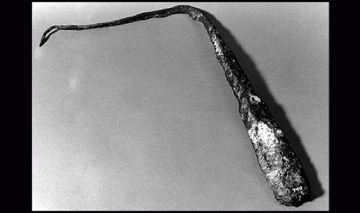

**[Que descobertas científicas mudaram o mundo?](https://pt.quora.com/Que-descobertas-cient%C3%ADficas-mudaram-o-mundo)**

Isaac Asimov argumentou que a única descoberta científica realmente importante foi feita em 1752, quando Benjamin Franklin publicou seu artigo que mostrava que o relâmpago era um fenômeno elétrico.

Isso, como dizem, mudou tudo. Antes disso, as descobertas científicas eram importantes apenas para outros cientistas. Eles não tinham nenhum relacionamento real com as pessoas como um todo. Claro, a igreja poderia objetar quando Galileu publicou seu trabalho sobre um universo heliocêntrico, mas isso não impressionou o público como um todo.

Mas a descoberta de Franklin levou a um uso muito prático

Este é um dos “para-raios” de Franklin. Era um dispositivo que, veja só, impedia que os relâmpagos atingissem prédios.

Espalhou-se como…. oh, eu não sei… relâmpago talvez? Dentro de uma década, apenas as igrejas não os usavam porque, você sabe, eles achavam que a iluminação era uma retribuição divina e específica de Deus. No entanto, depois que um raio atingiu uma igreja onde a pólvora estava sendo armazenada (porque, você sabe, Deus GOSTA de igrejas), até eles começaram a adotar as coisas malditas.

A ideia de que a ciência poderia resolver problemas práticos começou com o para-raios e, em pouco tempo, esse estranho fenômeno chamado “eletricidade” acabou tendo todos os tipos de usos:
