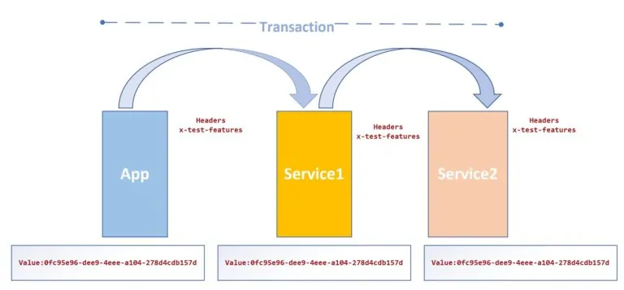
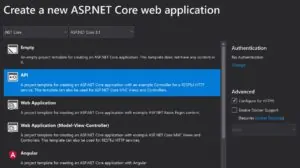
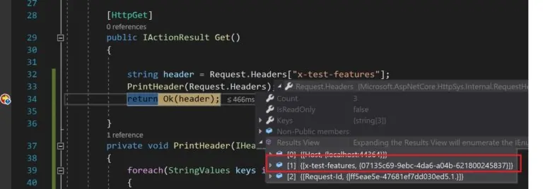

# Distributed Tracing using Header Propagation Middleware in ASP.NET Core

In this article, we will see how to use the header propagation feature in ASP.NET Core. Distributed tracing is an important feature for any API development. Today in this article, we will learn how to perform Tracing using Header Propagation Middleware.

Header propagation is an ASP.NET Core middleware and is available as **NuGet** packages to pass HTTP headers from the one request to the outgoing HTTP Client requests as needed.

## Distributed Tracing and Logging

For API development, It’s always been a requirement for distributed tracing which is generally implemented by propagating generic headers or custom headers from one request to another request.

So you could have multiple use cases to propagate the headers like,

- *Propagate headers ‘as is’ to the outgoing request if the header is present.*
- *OR generate ‘new’ headers conditionally.*
- *Perform distributed tracing*
- *Pass secured token or custom details*

ASP.NET Core now allows you to centralize this header propagation logic using the middleware concept and more importantly, this behavior can be controlled per request or client request basis as needed.

Propagation middleware can be used with

## Getting Started

Let’s create ASP.NET Core 3.1 or .NET Core 5,

Please install below NuGet packages,

PM> Install-Package Microsoft.AspNetCore.HeaderPropagation -Version 3.1.1

Let’s define our headers below.

Here I am demonstrating the headers ” **x-test-features**“.

This header is assumed to be available on a server with value.

So If we see the ‘**x-test-features**‘ header then we propagate it to outgoing calls.

If we don’t see it exist then we generate a new value conditionally.

**Example**: I have used ***guid*** to associate a unique ID assigned to this header.

Let’s take a look at the simple scenario to get started.

Please update the **ConfigureServices()** method as below,

|  |  |
| --- | --- |
| 1  2  3  4  5 | `services.AddHeaderPropagation(options =>`  `{`  `// forward the 'x-test-features' if present.`  `options.Headers.Add(``"x-test-features"``);`  `});` |

If the header doesn’t exist, below lets you create a new header,

|  |  |
| --- | --- |
| 1  2  3  4  5  6 | `// Generate a new x-test-features if not present.`  `options.Headers.Add(``"x-test-features"``, context =>`  `{`  `return``new` `StringValues(Guid.NewGuid().ToString());`  `});` |

We shall be propagating all the headers **‘as is**‘ using **ConfigureServices**() method.

[Named HTTPClient client](https://thecodebuzz.com/create-named-httpclient-ihttpclientfactory-asp-net-core/) uses all headers propagated to the outgoing requests.

|  |  |
| --- | --- |
| 1  2 | `services.AddHttpClient(``"AccountClient"``)`  `.AddHeaderPropagation();` |

Above we are defining AddHeaderPropagation() as global i.e all headers will be propagated as is.

You need to initialize the HeaderPropagationValues.Headers property.

To do the same please register the header propagation middleware by adding **app.UseHeaderPropagation()** in the ‘**Configure**(…)’ method.

Also please update **Configure** method for middleware as below,

|  |  |
| --- | --- |
| 1  2  3  4  5  6  7  8  9  10  11  12  13  14  15 | `public``void` `Configure(IApplicationBuilder app, IWebHostEnvironment env)`  `{`  `if` `(env.IsDevelopment())`  `{`  `app.UseDeveloperExceptionPage();`  `}`  `app.UseHttpsRedirection();`  `app.UseHeaderPropagation();`  `app.UseRouting();`  `app.UseAuthorization();`  `app.UseEndpoints(endpoints =>`  `{`  `endpoints.MapControllers();`  `});`  `}` |

Here we are assuming that if we do not specify the header, the server will generate a new value.

|  |  |
| --- | --- |
| 1  2  3  4  5  6  7  8  9  10  11  12  13  14  15  16 | `[HttpGet]`  `[Route(``"get"``)]`  `public``async` `Task<IActionResult> OnGet()`  `{`  `var` `uri =` `new` `Uri(``"https://localhost:44371/api/account/get"``);`  `var` `client = _clientFactory.CreateClient(``"AccountClient"``);`  `var` `response =` `await` `client.GetAsync(uri);`  `if` `(response.IsSuccessStatusCode)`  `{`  `return` `Ok(response.Content.ReadAsStreamAsync().Result);`  `}`  `else`  `{`  `return` `StatusCode(500,` `"Something Went Wrong! Error Occured"``);`  `}`  `}` |

Once the client call invokes the receivers get the call with request headers filled with the same headers and their values which were propagated.

> Header propagation can only be used within the context of an HTTP request.

As we could see propagated headers are pass to outbound requests easily.

Please note that every receiver has a choice to propagate the headers to the next outgoing request.

For any receiver, If you don’t specify register middleware with required headers you don’t pass it to outgoing call.

## Add B3-headers to an inbound request and response

If you need to propagate Zipkin B3 headers, please see below,

|  |  |
| --- | --- |
| 1  2  3  4  5  6  7  8 | `services.AddHeaderPropagation(options =>`  `{`  `options.Headers.Add(``"x-b3-traceid"``);`  `options.Headers.Add(``"x-b3-spanid"``);`  `options.Headers.Add(``"x-b3-parentspanid"``);`  `});` |

## Add Correlation ID to inbound request and response

Correlation id if needed can be propagated as below,

|  |  |
| --- | --- |
| 1  2  3  4 | `services.AddHeaderPropagation(options =>`  `{`  `options.Headers.Add(``"X-Correlation-Id"``);`  `});` |

That’s all! Happy Coding!

Do you have any better suggestions or comments if any? Please sound off your comments below.

***References***:

## Summary

***HeaderPropagation*** middleware lets you propagate the headers from one request to another request with ease. It can also be very helpful for you to track distributed transactions that require the ability to pass certain identifiers to track the end-to-end transaction.

---

Please ***bookmark*** this page and ***share*** this article with your friends. Please [***Subscribe***](https://thecodebuzz.com/subscription/) to the blog to get a notification on freshly published best practices of software design and development.

---

Growing by Sharing
