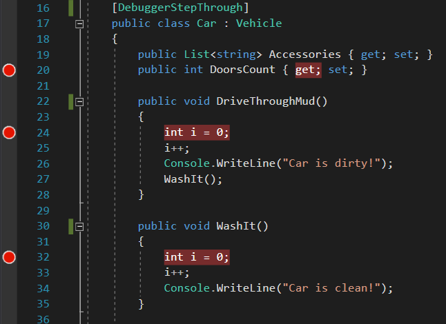
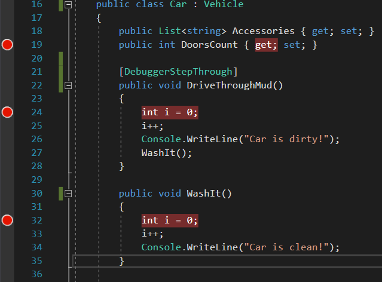
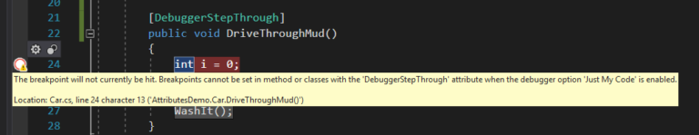
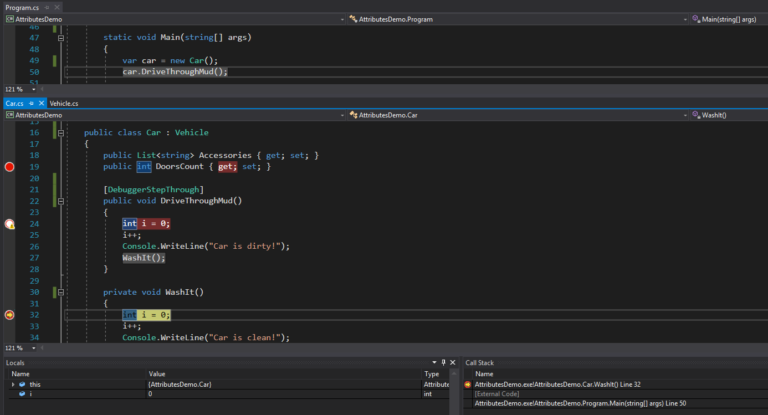
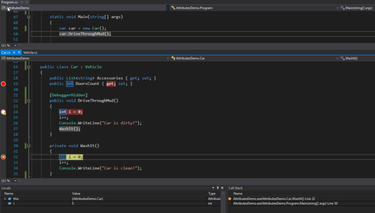

# [DebuggerStepThrough]

Like the name of this attribute suggests, code decorated with *DebuggerStepThrough* will be executed but not debugged. Even when you set a breakpoint inside the code block.  
You can apply this attribute on:  
– Class  
– Struct  
– Constructor  
– Method  
Sooo… Now a little puzzle for you ?. Which of the breakpoint visible on the below screen will be hit?

[](http://agirlamonggeeks.azurewebsites.net/2017/12/12/c-attributes-you-should-know-2-debuggerstepthrough-and-debuggerhidden/debuggerstepthrough_1/)

  
.  
.  
.  
Yep! None of them ?.

Another riddle – what about the below breakpoints? Which one **will not** be hit?

[](http://agirlamonggeeks.azurewebsites.net/2017/12/12/c-attributes-you-should-know-2-debuggerstepthrough-and-debuggerhidden/debuggerstepthrough_2/)

  
.  
.  
.  
.  
You are right, the one in line 24. I know, that was ridiculously easy :P.

But in fact, ‘non-hitable’ breakpoint are always in debugging mode marked with some ‘exclamation mark’ ico, like in the screen below.

[](http://agirlamonggeeks.azurewebsites.net/2017/12/12/c-attributes-you-should-know-2-debuggerstepthrough-and-debuggerhidden/debuggerstepthrough_3/)

  
As you can see in the yellow message box (screen above), there is one exception in our never-hit-breakpoint rule.  
When [JMC](https://msdn.microsoft.com/pl-pl/library/dn457346(v=vs.110).aspx) is enabled, the breakpoint will be hit, no matter if method/class etc. has *[DebuggerStepThrough]* attribute or not.

### [DebuggerHidden]

The second hero of debugging is very similar to the *DebuggerStepThrough*. Simply speaking – it holds programmers back from debugging the code.  
Below is the list of members we can apply *[DebuggerHidden]* on:  
– Contructor  
– Method  
– Property

At first glance, you will not see any differences but in the next paragraph I want to show you the two of them ?.

### [*DebuggerStepThrough*] vs [DebuggerHidden]

First of all – you cannot decorate a class or a struct with *DebuggerHidden* attribute. So we will use it very preciously, exactly on the method we don’t want to be debugged.  
Secondly, code decorated with ***DebuggerStepThrough*** will be shown in the ***Call Stack*** window as ***‘external code***’. When we replace *DebuggerStepThrough* with *DebuggerHidden*, the same code will not be shown in the *Call Stack* window at all! Let’s look at the example.

We already know the class [*Car*](http://agirlamonggeeks.azurewebsites.net/2017/12/04/c-attributes-you-should-know-1-debuggertypeproxy/). So below I create an object of this class and then call its’ method *DriveThroughMud()*. Inside of the method we call another *Car’s* method – *WashIt()*.  
The aim is to disable debugging *DriveThroughMud()* method.

```
var car = new Car()
{
   Model = "Fiat",
   Price = 1000000,
   ProductionYear = 2001,
   DoorsCount = 3,
   Accessories = new List<string>() { "Airbags"},
   Owners = new List<string>()
   {
      "John Smith",
      "Ben Kovalsky"
   }
};
car.DriveThroughMud();
```

Car.cs:

```
//…
//This method shouldn’t be debugged!
public void DriveThroughMud()
{
   //Some logic here…
   Console.WriteLine("Car is dirty!");
   WashIt();
}

private void WashIt()
{
   //Some logic here…
   Console.WriteLine("Car is clean!");
}
```

Below is the example what the *Call Stack* window will show us if we apply *DebuggerStepThrough* on *DriveThroughMud()* method.

[](http://agirlamonggeeks.azurewebsites.net/2017/12/12/c-attributes-you-should-know-2-debuggerstepthrough-and-debuggerhidden/debuggerstepthrough_4/)

And what happens when we apply *DebuggerHidden* attribute on the same method? Well, the *Call Stack* will not show us any information about the the caller.

[](http://agirlamonggeeks.azurewebsites.net/2017/12/12/c-attributes-you-should-know-2-debuggerstepthrough-and-debuggerhidden/debuggerstepthrough_5/)

### Summary

I hope I showed you the sweetness of another two c# attributes. Enabling programmer hiding the code from debugging is not something you thought attributes are made for, am I right ?

At the end of this blog post, let me add a side note – personally, I prefer *DebuggerStepThrough* :). Mostly because of the info shown in the *Call Stack*  window but also because sometimes I want to exclude from debugging the whole class, not only particular method. And that’s something that cannot be approached with *DebuggerHidden*.

Featured image by [unsplash-logoRoman Kraft](https://unsplash.com/@romankraft?utm_medium=referral&utm_campaign=photographer-credit&utm_content=creditBadge "Download free do whatever you want high-resolution photos from Roman Kraft")
