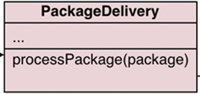
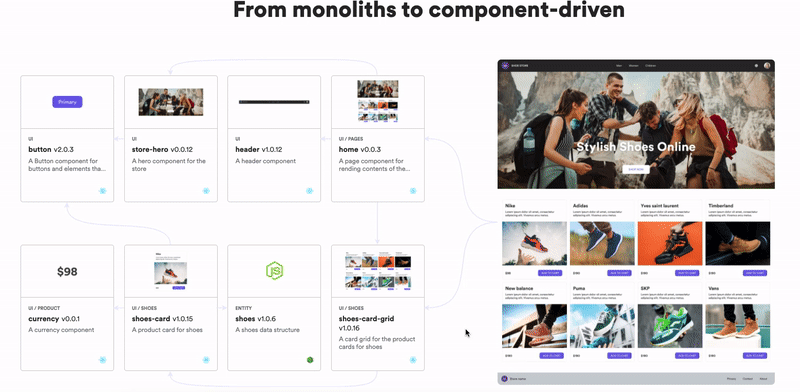

# 3 Design Patterns Every Developer Should Learn

Design patterns are high-level answers to problems that we as software engineers encounter frequently. ***It isn’t code — I repeat, IT IS NOT CODE.*** It’s akin to explaining how to approach these issues and come up with a solution.


I got 99 problems but design patterns aren’t 1

One of the most common things I’ve found is that people who graduate in computer science or another IT-related field where design patterns were taught — *but never sufficiently trained to use them either —* forget about them or find them of no use in their software development career.

They are, nonetheless, core abilities that all developers should have, mainly because as your software development career progresses, you will be expected to recognize patterns and utilize them to construct microservices/ systems/solutions.

## There Are Several Reasons Why Design Pattern Will Be Beneficial To You.

Simply put, design patterns are used to make the task easier.

***— For instance,*** *when writing a program, the primary rule of an object is that all attributes must be private and cannot be accessed by other classes. So, how can we make our code more readable and adaptable? You can utilize the Creational Design Pattern to clean up your code.*

***— Another reason*** *is that design patterns establish a* ***shared vocabulary*** *that you and your colleagues may use to communicate more effectively. You can remark, "Oh, just use a Singleton for it, though," and everyone will comprehend your advice. If you already know the pattern and its name, there’s no need to explain what being a singleton is.*

I have researched many design patterns, and I’ve used some of them in personal and work projects.

So, in this piece, I’ll share my ***top three design pattern recommendations,*** all of which are simple to learn and use in your work/personal projects.

So, get a cup of coffee and enjoy reading!

# 1. Strategy Design Pattern


He probably needs a design pattern!

This is my favourite design pattern of all time.

This pattern enables you to switch between techniques for a specific task at runtime without the client knowing it. Rather than implementing a single method directly, the code is given runtime instructions that tell it which of the group of algorithms to run.

The “***Open-Closed design principle*,**” which argues that base code should be open for extension but closed for modification, was one of the vital principles I learned about in my fourth year of university (which I’m sure many of you have heard of).

One way to achieve the open-closed principle is to use the strategy pattern.



When numerous algorithms for a given strategy (interface) are required, this pattern comes in handy. This pattern’s implementation necessitates four elements, including the client:

> — Client -> This is the place when the context is used.
>
> — Context -> the situation in which an algorithm is chosen at runtime.
>
> — interface -> strategy
>
> — Algorithms -> real-world applications

***Let’s have a look at an example.***

Assume you’ve created an app for a business that allows you to mail packages to nearby clients. The app’s first edition included bike delivery, which proved to be a huge hit. Delivery by bike is no longer a flimsy alternative when your company expands across the city.

*The business has now requested that you create a function that allows package delivery by car. That was just the start.*

You were later instructed to add rail and, later still, air. The PackageDelivery class grows in size and gets more challenging to manage as new algorithms are added. Any minor flaw in the class can jeopardize the functional code, necessitating re-testing of the entire app, even if the problem was only with one of the algorithms.

As a result, the strategy pattern comes to the rescue, stating that these algorithms should be separated into independent classes called strategies. So, you won’t have to change the main course the next time you wish to add a ship as an option.

***The pseudocode below shows how the main class employs these tactics to transmit packages in various ways.***

# 2. Singleton Design Pattern

***There is only one instance of a class.***

The singleton pattern is used when only one instance of a class is required. The primary motive for limiting the instantiation of a class is to maintain control over shared resources such as databases, stores, and files. With this technique, we construct a class instance and give that instance global access.

For anything launched with an API key, I’ve used a singleton as the source of configuration settings for a client-side web app, as well as for holding data in memory in a client-side web application using flux.

Because singletons do not need a state, they are used to implement comparators. Because we are just constructing a single model, we can conserve memory.

***To give you an idea, here’s a JavaScript snippet of code I wrote as an example:***

***It’s amusing to note that it will be an aha!***

Many of us and many of you may have been limiting the instantiation of a class to one for various reasons and have only now realized that it was a design pattern all along!

# 3. Observer Design Pattern


Examples include: Netflix subscription, email notifications, news alerts.

**I’ll give you a bird’s-eye view of this pattern!**

The one-to-many relationship between the numerous objects is the basis for this design pattern. It enables you to set up a subscription mechanism that permits other entities to be alerted of each occurrence on the entity to which you are subscribed

Kafka, RabbitMQ, Amazon SNS, and NATS are some real-world examples of pub/sub systems that implement the publisher/subscriber pattern (a variant of the Observer!).

***The following are some examples of this pattern:***

**—***In the world of web development, particularly with React, you’ve heard of Redux for managing your application’s state. Redux is the implementation of the Observer pattern.When you attach an action to update the state in the store, components listening to the change will adjust their representations accordingly.*

***—*** *If code were contributed to a remote repository, a CI environment would monitor it for changes and execute a build.*

***—*** *The event-driven procedural programming is used to mimic the Observer design pattern. Like other design patterns, this pattern allows us to define loosely linked systems. We can develop maintainable and modular software using this technique. We can also achieve obvious segmentation between distinct actors in an event-driven system.*

# Is using design patterns always a good idea?


Although the design patterns are widely acknowledged to provide considerable advantages. When it is overused, however, it has undesirable side effects.

Therefore, developers should consider whether using design patterns is efficient and appropriate for the project, and look for alternative solutions and compare them to design patterns. Nonetheless, every software engineer should know about design patterns, their many forms, and the most popular ones.

> *I’m not sure what’s wrong with people: they don’t learn by comprehending; they learn by rote or something else.” Their understanding is so weak! — Feynman, Richard P.*

I’ve met with many engineers at various tech events and online, and I usually bring up the topic of design patterns when we’re talking about software development.

I’ve noticed that some engineers who memorize design patterns believe they’ve mastered some mystical spell that they can now cast wherever. Recognizing design patterns is not the same as simply knowing their names.

This is why it’s crucial to understand any design pattern’s inherent constraints and tradeoffs before adopting it.

# Design Patterns’ Beginnings!

If you’re curious about the origins of design patterns, this section is for you. So keep reading!

Architect Christopher Alexander pioneered the idea of design patterns, which he discussed in his book ***“The Timeless Way of Building.”*** If you want to know what’s going on, I recommend reading it straight from the source. It was followed by “***A Pattern Language,”*** an excellent guide to how patterns should be designed. Please don’t take my word for it; look it up for yourself.

These ideas picked up steam over the next few years. **In 1994, the Crew of Four** (*Erich Gamma, Richard Helm, Ralph Johnson, and John Vlissides*), a group of software engineering researchers, published Design Patterns: ***Elements of Reusable Object-Oriented Software***, which is still on several software engineer’s bookshelves.

This book is widely regarded as the *“public debut”* of design patterns in the software development community, and it has influenced the progress of design patterns ever since.

# Conclusions

I hope you found my post on three of the most common design patterns to be helpful. There are far more patterns used in software development, and the book Design patterns: “***elements of reusable object-oriented software”*** have illustrations and descriptions.

You may now be ecstatic and wish to share your newfound information.

I want to point out that this is only 3–4 pages of text, compared to 406 pages for “***Dive Into Design Patterns***” and “***Head First Design Patterns.***” It’s a safe chance that I haven’t addressed everything or that I misinterpreted some points.

```
This reminds me that I need to go back and read “The Timeless Way of Building.”
```

Rather than taking my word for it, read above mentioned books and tell me what you think I’m missing.

Cheers!

Follow me on [Medium](https://medium.com/@noor882) and [LinkedIn](https://www.linkedin.com/in/noorahmed11/) to remain up to date on new articles I’ll be writing!.

# Build composable web applications

Don’t build web monoliths. Use [**Bit**](https://bit.dev/) to create and compose decoupled software components — in your favorite frameworks like React or Node. Build scalable and modular applications with a powerful and enjoyable dev experience.

Bring your team to [**Bit Cloud**](https://bit.cloud/) to host and collaborate on components together, and speed up, scale, and standardize development as a team. Try **composable frontends** with a **Design System** or **Micro Frontends**, or explore the **composable backend** with **serverside components**.

[**Give it a try →**](https://bit.dev/)



## Learn More

[## How We Build Micro Frontends

### Building micro-frontends to speed up and scale our web development process.

blog.bitsrc.io](https://blog.bitsrc.io/how-we-build-micro-front-ends-d3eeeac0acfc)

[## How we Build a Component Design System

### Building a design system with components to standardize and scale our UI development process.

blog.bitsrc.io](https://blog.bitsrc.io/how-we-build-our-design-system-15713a1f1833)

[## The Composable Enterprise: A Guide

### To deliver in 2022, the modern enterprise must become composable.

blog.bitsrc.io](https://blog.bitsrc.io/the-composable-enterprise-a-guide-609443ae1282)

[## How to build a composable blog

### Creating a blog from scratch requires quite a lot. There are a number of moving parts that come together to create a…

bit.cloud](https://bit.cloud/blog/how-to-build-a-composable-blog-l1jkl9f4)

[## Extendable UI Components

### I was recently tasked with building a user-card component for the bit.cloud platform. I was also tasked with building…

bit.cloud](https://bit.cloud/blog/extendable-uis-how-to-build-better-uis-for-developers-l1jkl1pc)
