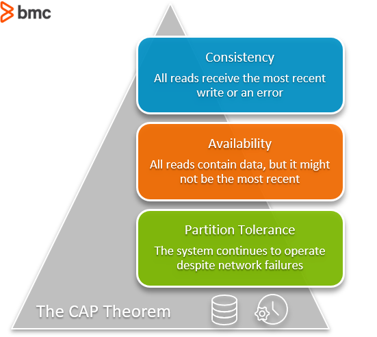

# CAP Theorem for Databases: Consistency, Availability & Partition Tolerance

December 9, 2020

4 minute read

  [Jonathan Johnson](https://www.bmc.com/blogs/author/jonathan-johnson/)

The CAP theorem is a belief from theoretical computer science about [distributed data stores](https://en.wikipedia.org/wiki/Distributed_data_store) that claims, in the event of a network failure on a distributed database, it is possible to provide either consistency or availability—but not both.

Let’s take a look.

## What is the CAP theorem?

The CAP Theorem is comprised of three components (hence its name) as they relate to distributed data stores:

- **Consistency.** All reads receive the most recent write or an error.
- **Availability.** All reads contain data, but it might not be the most recent.
- **Partition tolerance.** The system continues to operate despite network failures (ie; dropped partitions, slow network connections, or unavailable network connections between nodes.)

In normal operations, your data store provides all three functions. But the CAP theorem maintains that when a distributed database experiences a network failure, you can provide either consistency or availability.

It’s a tradeoff. All other times, all three can be provided. But, in the event of a [network failure](https://www.bmc.com/blogs/mtbf-vs-mtff-vs-mttr-whats-difference/), a choice must be made.

In the theorem, [partition tolerance is a must](https://codahale.com/you-cant-sacrifice-partition-tolerance/). The assumption is that the system operates on a distributed data store so the system, by nature, operates with network partitions. Network failures will happen, so to offer any kind of reliable service, partition tolerance is necessary—the P of CAP.

That leaves a decision between the other two, C and A. When a network failure happens, one can choose to guarantee consistency or availability:

- High consistency comes at the cost of lower availability.
- High availability comes at the cost of lower consistency.

Consistency in CAP is different than that of [ACID](https://www.bmc.com/blogs/acid-atomic-consistent-isolated-durable/). Consistency in CAP means having the most up-to-date information. (ACID refers to a different database event. In ACID, consistency means any new transaction to the database won’t corrupt the database.)

## User queries: consistent or available?

The moment in question is the user query. We assume that a user makes a query to a database, and the networked database is to return a value.

Whichever value is returned from the database depends on our choice to provide consistency or availability. Here’s how this choice could play out:

- On a query, we can respond to the user with the **current value on the server**, offering a highly available service. If we do this, there is no guarantee that the value is the most recent value submitted to the database. It is possible a recent write could be stuck in transit somewhere.
- If we want to guarantee high consistency, then we have to **wait for the new write** or return an error to the query. Thus, we sacrifice availability to ensure the data returned by the query is consistent.

## Choosing system needs

To some, the choice between consistency and availability is really a matter of philosophical discussion that’s rarely made in practice. The reliability of these distributed systems is pretty good. That said, problems do happen. AWS [experienced a big outage](https://www.theverge.com/2020/11/25/21719396/amazon-web-services-aws-outage-down-internet) just before Thanksgiving 2020.

Where the theory says you can have only two of three components, professionals say that’s not always the case. [Eric Brewer, computer scientist and initial positor of the CAP theorem,](https://www.infoq.com/articles/cap-twelve-years-later-how-the-rules-have-changed/) cleared up some confusion around the theorem, generalizing it from a hard either/or statement to one depending on the system’s need. He said:

*“The modern CAP goal should be to maximize combinations of consistency and availability that make sense for the specific application. Such an approach incorporates plans for operation during a partition and for recovery afterward, thus helping designers think about CAP beyond its historically perceived limitations.”*

Choosing consistency and availability comes when choosing which database type to go with, such as [SQL vs NoSQL](https://www.bmc.com/blogs/sql-vs-nosql/). NoSQL databases can be classified based on whether they support high availability or high consistency.

### NoSQL

NoSQL databases do not require a schema, and don’t enforce relations between tables. All its documents are JSON documents, which are complete entities one can readily read and understand. They are widely recognized for:

- Ease-of-use
- Scalable performance
- Strong resilience
- Wide availability

Examples of NoSQL databases include:

- Cloud Firestore
- Firebase Real-time DB
- [MongoDB](https://www.bmc.com/blogs/mongodb-overview-getting-started-with-mongodb/)
- MarkLogic
- Couchbase
- CloudDB
- [Amazon DynamoDB](https://www.bmc.com/blogs/amazon-dynamodb/)

### Consistency in databases

Consistent databases should be used when the value of the information returned needs to be accurate.

Financial data is a good example. When a user logs in to their banking institution, they do not want to see an error that no data is returned, or that the value is higher or lower than it actually is. Banking apps should return the exact value of a user’s account information. In this case, banks would rely on consistent databases.

Examples of a consistent database include:

- Bank account balances
- Text messages

Database options for consistency:

- MongoDB
- Redis
- HBase

### Availability in databases

Availability databases should be used when the service is more important than the information.

An example of having a highly available database can be seen in e-commerce businesses. Online stores want to make their store and the functions of the shopping cart available 24/7 so shoppers can make purchases exactly when they need.

Database options for availability:

- [Cassandra](https://www.bmc.com/blogs/apache-cassandra-introduction/)
- DynamoDB
- Cosmos DB

Some database options, like Cosmos and Cassandra, allow a user to turn a knob on which guarantee they prefer—consistency or availability.

## Related reading

### Turn Data into Decisions using Application Workflow Orchestration

Support business transformation and create competitive advantages.  
 [Download now › ›](https://www.bmc.com/forms/application-workflow-orchestration-control-m-whitepaper.html)

These postings are my own and do not necessarily represent BMC's position, strategies, or opinion.

See an error or have a suggestion? Please let us know by emailing [blogs@bmc.com](https://www.bmc.com/blogs/cap-theorem/mailto:blogs@bmc.com).
