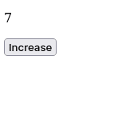
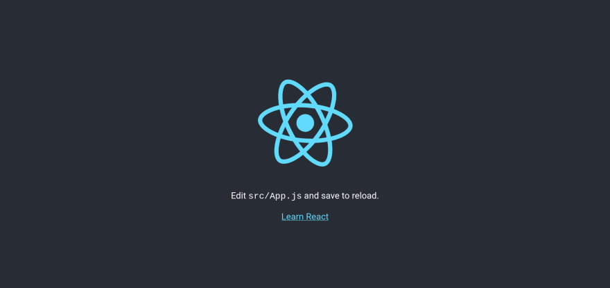
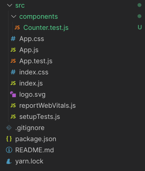
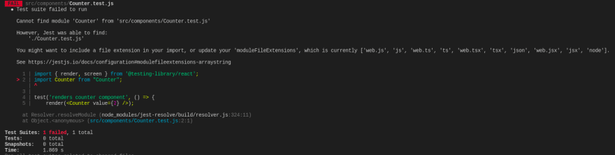
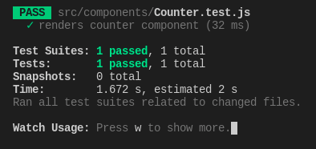
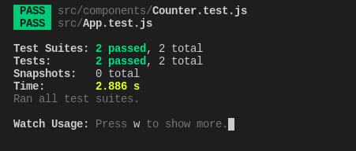

# Introduction to Test-Driven-Development in React for Beginners

The first rule of Test-Driven-Development (TDD) is to write a test before coding the feature. It sounds more intuitive when doing some backend work, to be honest, but does it work when doing some frontend, particularly in React.

In this article, we'll explore TDD in React with a simple component.

## The feature

In this article, we'll reproduce the following component. A simple -- and very ugly -- counter.

[](https://res.cloudinary.com/practicaldev/image/fetch/s--qGs829jy--/c_limit%2Cf_auto%2Cfl_progressive%2Cq_auto%2Cw_880/https://cdn.hashnode.com/res/hashnode/image/upload/v1649580419187/th6JdqjpA.png)  
Well, it'll do the work for what we want to understand here because we are focusing more on the functionalities than the aesthetic.

## Setup the project

First of all, create a simple React project.

```
yarn create react-app react-test-driven-development
```

Once the project is created, make sure everything works by running the project.

```
cd react-test-driven-development
yarn start
```

And you'll have something similar running at [http://localhost:3000](http://localhost:3000/).

[](https://res.cloudinary.com/practicaldev/image/fetch/s--oCwdrGFE--/c_limit%2Cf_auto%2Cfl_progressive%2Cq_auto%2Cw_880/https://cdn.hashnode.com/res/hashnode/image/upload/v1649575625302/8wYFebD1Y.png)

## Writing the Counter feature

Create a new directory in the `src` directory called `components`. This directory will contain the components we'll be writing. And inside the new directory, create a file called `Counter.test.js`. As stated earlier when doing TDD, we write tests before coding the feature.   
It helps establish a better architecture for the feature because you are forced to really think about what you are going to code and test.

[](https://res.cloudinary.com/practicaldev/image/fetch/s--zAIdSkY9--/c_limit%2Cf_auto%2Cfl_progressive%2Cq_auto%2Cw_880/https://cdn.hashnode.com/res/hashnode/image/upload/v1649575727411/qBFtdWY2c.png)

### Description of the Counter component

The ideal component takes a prop called `value`. This value is then shown on the screen in a

tag.

Great! Let's write the test first.

### Writing the test

Inside the `Counter.test.js` add the following content.

```
import { render, screen } from '@testing-library/react';
import Counter from "Counter";
```

We start by importing the needed tools to write the test. Don't worry about the second line, we haven't created the `Counter` component yet. The goal of TDD is to make sure the test fails first before writing the feature.

With this, we can now write the first test.

```
test('renders counter component', () => {
    render(<Counter value={2} />);
    const counterElement = screen.getByTestId("counter-test");
});
```

Here, we render the `Counter` component in the DOM and we retrieve the element. There will be two things to test here:

- Is the component rendered?
- Is the Counter showing exactly 2 as the value?

```
test('renders counter component', () => {
    render(<Counter value={2} />);
    const counterElement = screen.getByTestId("counter-test");

    // Testing that the counter element is rendered
    expect(counterElement).toBeInTheDocument();

    // Testing that the counter element has the correct value
    expect(counterElement).toHaveTextContent("2");
});
```

Great! Now in the command line, run the following command to run the tests.

```
yarn test
```

The command will fail naturally.

[](https://res.cloudinary.com/practicaldev/image/fetch/s--5Y7PLBcn--/c_limit%2Cf_auto%2Cfl_progressive%2Cq_auto%2Cw_880/https://cdn.hashnode.com/res/hashnode/image/upload/v1649576640662/nWm_eFccr.png)

Great! Let's move on and write the component.

### Writing the component

Inside the component directory, create a new file called `Counter.jsx`. And inside this file add the following content.

```
import React from "react";

// This is the component we are testing

function Counter(props) {

    const { value } = props;
    return (
        <p data-testid="counter-test">
            {value}
        </p>
    );
}

export default Counter;
```

Now run the tests again and everything should be green.

[](https://res.cloudinary.com/practicaldev/image/fetch/s--4G7ZA5Ib--/c_limit%2Cf_auto%2Cfl_progressive%2Cq_auto%2Cw_880/https://cdn.hashnode.com/res/hashnode/image/upload/v1649577792532/OsusMsewl.png)

Nice! Nice! We've done a great job. The next step is to add this component to the `App.js` and with a `button` to trigger a state change. And we'll also go TDD for this.

> You may have an issue with a similar error in the terminal after running the tests.

```
    Warning: ReactDOM.render is no longer supported in React 18...
```

Check this answer on [StackOverflow](https://stackoverflow.com/questions/71685441/react-testing-library-gives-console-error-for-reactdom-render-in-react-18/71716003#71716003) to see how to resolve it.

## Writing the full Counter feature

In this case, we are now adding a button to modify the value in `Counter.jsx`. As we are going to write directly the code in `App.js`, let's write the test first in the `App.test.js` file.

### Requirements

The requirements of this feature are:

- Click on a Button to increase the shown value by 1

Pretty simple right? Let's write the test first.

### Writing the test

The `testing-library` provides tools we can use to trigger actions on a Button. Very nice!

Let's start by importing the needed tools. As we are going to trigger a click event on the screen ( clicking the button ) to increase the value in the counter, the tests functions will be asynchronous.

```
import { render, screen } from '@testing-library/react';
import App from './App';
import userEvent from "@testing-library/user-event";
```

The `UserEvent` is a tool that simulates a user triggering actions such as clicking, typing, and much more. And here's the test.

```
import { render, screen } from '@testing-library/react';
import App from './App';
import userEvent from "@testing-library/user-event";

describe('Render the counter with Button', () => {
  render(<App />);

  it("render counter", async () => {
    const appElement = screen.getByTestId('app-test');
    expect(appElement).toBeInTheDocument();

    // Testing that the counter element has the correct default value
    const counterElement = screen.getByTestId('counter-test');
    expect(counterElement).toHaveTextContent('0');

    // Retrieving the button element
    const buttonElement = screen.getByTestId('button-counter-test');
    expect(buttonElement).toBeInTheDocument();

    // Triggering the click event on the button

    await userEvent.click(buttonElement);

    // Testing that the counter element has the correct value
    expect(counterElement).toHaveTextContent('1');
  })
});
```

Great! The tests will fail normally. Let's write the feature.

### Writing the full counter feature

Inside the `App.js` file, add the following content.

```
import React from "react";
import Counter from "./components/Counter";

function App() {

  const [count, setCount] = React.useState(0);

  return (
    <div data-testid="app-test">
      <Counter value={count} />
      <button data-testid="button-counter-test" onClick={() => setCount(count + 1)}>Increase</button>
    </div>
  );
}

export default App;
```

We are using React.useState to manage to track and modify the state.   
After that, run all the tests again. And it should be green.

[](https://res.cloudinary.com/practicaldev/image/fetch/s--03flw3S3--/c_limit%2Cf_auto%2Cfl_progressive%2Cq_auto%2Cw_880/https://cdn.hashnode.com/res/hashnode/image/upload/v1649579837087/7HDdgAbE6.png)

And congratulations! We've just done some React using TDD. In the next article, we'll dive deeper into TDD but with Redux and thunk. We are going to set up a full testing environment independent of a remote backend.

Pretty interesting, right? Well, if you want to get informed about it, I am starting a newsletter. If I pass 10 subscribers, I am kick-starting it weekly.  
You can subscribe [here](https://www.getrevue.co/profile/koladev32).

*Article posted using [bloggu.io](https://bloggu.io/). Try it for free.*
