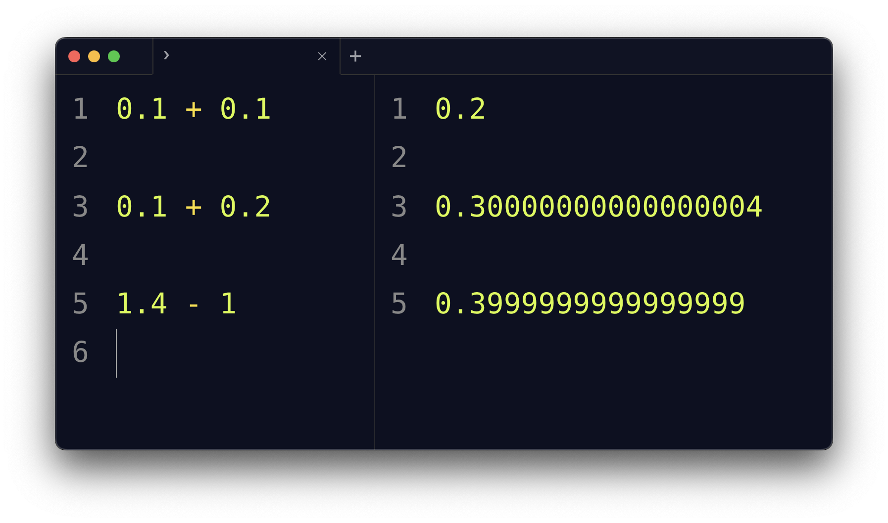

# How to fix decimals arithmetic in JavaScript

## Find out how to fix decimals arithmetic in JavaScript

Published Apr 25 2022

If you try to do the sum of two decimal numbers in JavaScript you might have a surprise.

`0.1 + 0.1` is, as you expect, `0.2`

But sometimes you have some unexpected result.

Like for `0.1 + 0.2`.

The result is not `0.3` as you’d expect, but it’s `0.30000000000000004`.

Or `1.4 - 1`, the result is `0.3999999999999999`



I’m sure your question is: WHY?

First, this is not unique to JavaScript. It’s the same for every programming language.

The reason is due to the fact computers store data as binary, `0` or `1`.

Any value is represented in the [binary numeric system](https://flaviocopes.com/binary-number-system/), as a power of two.

1 is 1 \* 2^0

10 is 1 \* 2^1 + 0 \* 2^0

Not every decimal number can be represented perfectly in this binary format, because some numbers are repeating numbers in binary. Try to [convert 0.1 from decimal to binary](https://flaviocopes.com/converting-decimal-to-binary/).

Long story short, we’d need infinite precision to represent 0.1, and while computers can approximate that well, when we do calculations we lose some data since we need to “cut” somewhere, and this leads to those unexpected results you see above.

You can use libraries like [decimal.js](https://mikemcl.github.io/decimal.js/), [bignumber.js](https://github.com/MikeMcl/bignumber.js/) or [big.js](https://github.com/MikeMcl/big.js).

You can also use a “trick” like this.

You decide to cut decimals after 2 positions, for example, and multiply the number by 100 to remove the decimal part.

Then you divide by 100 after you’ve done the sum:

```
0.1 + 0.2 //0.30000000000000004

(0.1.toFixed(2) * 100 + 0.2.toFixed(2) * 100) / 100 //0.3
```

Use `10000` instead of `100` to keep 4 decimal positions.

More abstracted:

```
const sum = (a, b, positions) => {
  const factor = Math.pow(10, positions)
  return (a.toFixed(positions) * factor + b.toFixed(positions) * factor) / factor
}

sum(0.1, 0.2, 4) //0.3
```

Download my free
[JavaScript Beginner's Handbook](https://flaviocopes.com/page/javascript-handbook/)!
