# Table of Contents

- What is CRUD?
- Understanding CRUD Principles
- How to Make a To-Do App using CRUD Operations

## What is CRUD?


CRUD stands for -

- C: Create
- R: Read
- U: Update
- D: Delete

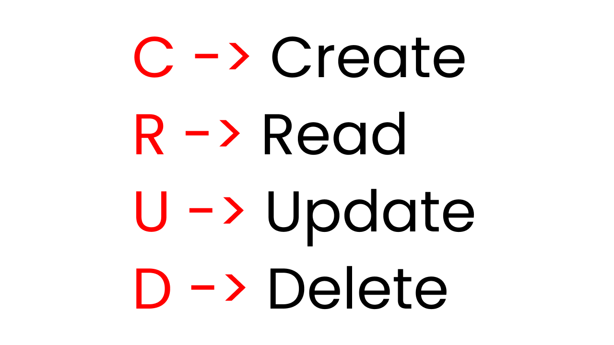

CRUD is a type of mechanism that allows you to create data, read data, edit it, and delete those data. In our case, we're gonna make a Todo app, so we will have 4 options to create tasks, read tasks, update tasks, or delete tasks.

## Understanding CRUD Principles

Before starting the tutorial, first, let's understand the CRUD principles. For that, let's create a very very simple Social Media Application.

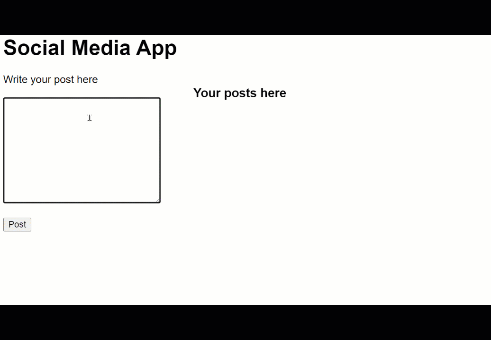

## Setup


For this project, we will be following these steps below:

- Create 3 files named index.html, style.css, and main.js
- Link the JavaScript and CSS file to index.html
- Start your live server

### HTML

Inside the body tag, create a div with a class name `.container`. There, we will have 2 sections, `.left` and `.right`

```
<body>
  <h1>Social Media App</h1>
  <div class="container">

    <div class="left"></div>
    <div class="right"></div>

  </div>
</body>
```

On the left side, we will create our posts. On the right side, we can see, update, and delete our posts. Now, create a form inside the .left div tag

```
<div class="left">
  <form id="form">
    <label for="post"> Write your post here</label>
    <br><br>
    <textarea name="post" id="input" cols="30" rows="10"></textarea>
    <br> <br>
    <div id="msg"></div>
    <button type="submit">Post</button>
  </form>
</div>
```

Write this code inside the HTML so that we can display our post on the right side

```
<div class="right">
  <h3>Your posts here</h3>
  <div id="posts"></div>
</div>
```

Next, we'll insert the font-awesome CDN inside the head tag to use its fonts in our project

```
<link rel="stylesheet" href="https://cdnjs.cloudflare.com/ajax/libs/font-awesome/5.15.4/css/all.min.css" />
```

Now, we're gonna make some sample posts with delete and edit icons. Write this code inside the div with the id #posts:

```
<div id="posts">
  <div>
    <p>Hello world post 1</p>
    <span class="options">
      <i class="fas fa-edit"></i>
      <i class="fas fa-trash-alt"></i>
    </span>
  </div>

  <div >
    <p>Hello world post 2</p>
    <span class="options">
      <i class="fas fa-edit"></i>
      <i class="fas fa-trash-alt"></i>
    </span>
  </div>
</div>
```

The result so far looks like this:

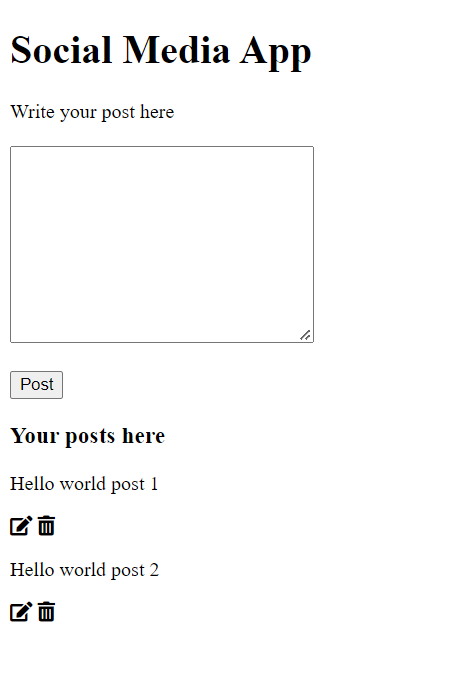

### CSS


Let's keep it simple. Write these styles inside your stylesheet:

```
body {
  font-family: sans-serif;
  margin: 0 50px;
}

.container {
  display: flex;
  gap: 50px;
}

#posts {
  width: 400px;
}

i {
  cursor: pointer;
}
```

Now, write these styles for the post div and option icons:

```
#posts div {
  display: flex;
  align-items: center;
  justify-content: space-between;
}

.options {
  display: flex;
  gap: 25px;
}

#msg {
  color: red;
}
```

The results so far look like this:

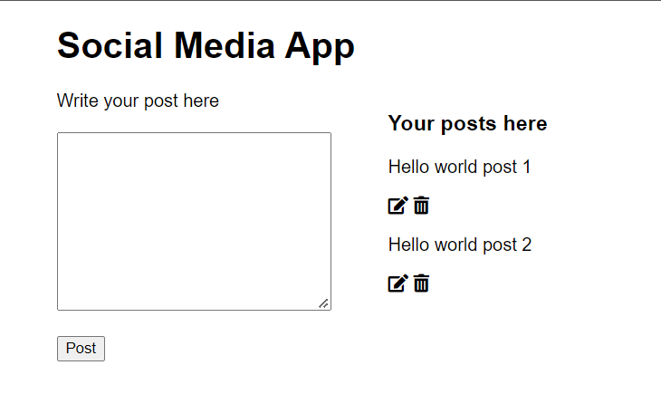

### JavaScript Part

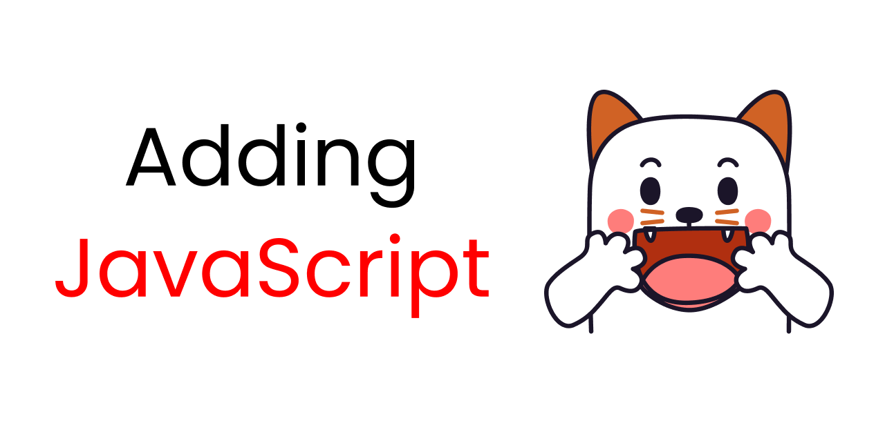

According to this flow chart, we will go forward with the project. Don't worry, I'll explain everything along the way.

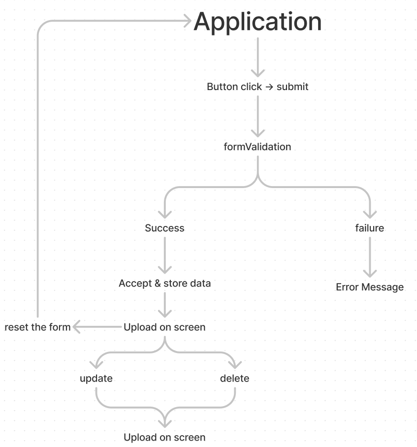

#### Form Validation

First, let's target all the ID selectors from the HTML in JavaScript. Like this:

```
let form = document.getElementById("form");
let input = document.getElementById("input");
let msg = document.getElementById("msg");
let posts = document.getElementById("posts");
```

Then, build a submit event listener for the form so that it can prevent the default behaviour of our App. At the same time, we will create a function named `formValidation`.

```
form.addEventListener("submit", (e) => {
  e.preventDefault();
  console.log("button clicked");

  formValidation();
});

let formValidation = () => {};
```

Now, we're gonna make an if else statement inside our `formValidation` function. This will help us prevent users from submitting blank input fields.

```
let formValidation = () => {
  if (input.value === "") {
    msg.innerHTML = "Post cannot be blank";
    console.log("failure");
  } else {
    console.log("successs");
    msg.innerHTML = "";
  }
};
```

Here's the result so far:

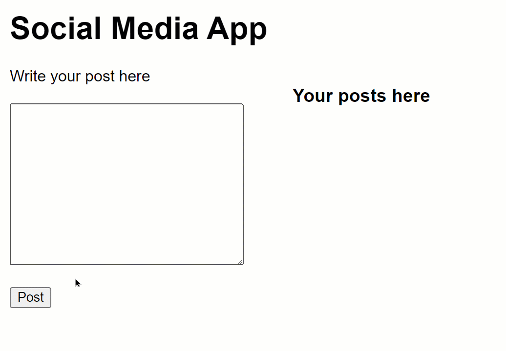

As you can see, a message will also show up if the user tries to submit the form blank.

#### How to accept data from input fields

Whatever data we get from the input fields, we will store them in an object. Let's create an object named `data`. And, create a function named `acceptData`:

```
let data = {};

let acceptData = () => {};
```

The main idea is that, using the function, we collect data from the inputs and store them in our object named `data`. Now let's finish building our `acceptData` function.

```
let acceptData = () => {
  data["text"] = input.value;
  console.log(data);
};
```

Also, we need the `acceptData` function to work when the user clicks the submit button. For that, we will fire this function in the else statement of our `formValidation` function.

```
let formValidation = () => {
  if (input.value === "") {
    // Other codes are here
  } else {
    // Other codes are here
    acceptData();
  }
};
```

When we input data and submit the form, on the console we can see an object holding our user's input values. Like this:

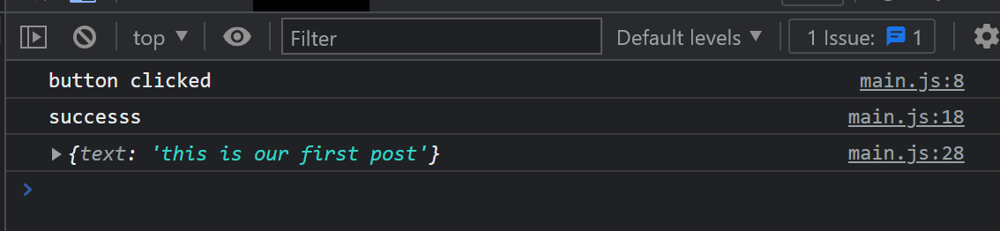

#### How to create posts using JavaScript template literals

In order to post our input data on the right side, we need to create a div element and append it to the posts div. First, let's create a function and write these lines:

```
let createPost = () => {
  posts.innerHTML += ``;
};
```

The backticks are template literals. It will work as a template for us. Here, we need 3 things: a parent div, the input itself, and the options div which carries the edit and delete icons. Let's finish our function

```
let createPost = () => {
  posts.innerHTML += `
  <div>
    <p>${data.text}</p>
    <span class="options">
      <i onClick="editPost(this)" class="fas fa-edit"></i>
      <i onClick="deletePost(this)" class="fas fa-trash-alt"></i>
    </span>
  </div>
  `;
  input.value = "";
};
```

In our `acceptdata` function, we will fire our `createPost` function. Like this:

```
let acceptData = () => {
  // Other codes are here

  createPost();
};
```

The result so far:


So far so good guys, we're almost done with project 1.


#### How to delete a post

In order to delete a post, first of all, let's create a function inside our javascript file:

```
let deletePost = (e) => {};
```

Next up, we fire this `deletePost` function inside all of our delete icons using an onClick attribute. You'll write these lines in HTML and on the template literal.

```
<i onClick="deletePost(this)" class="fas fa-trash-alt"></i>
```

The `this` keyword will refer to the element that fired the event. in our case, the `this` refers to the delete button.

Look carefully, the parent of the delete button is the span with class name options. The parent of the span is the div. So, we write `parentElement` twice so that we can jump from the delete icon to the div and target it directly to remove it.

Let's finish our function.

```
let deletePost = (e) => {
  e.parentElement.parentElement.remove();
};
```

The result so far:


#### How to edit a post

In order to edit a post, first of all, let's create a function inside our JavaScript file:

```
let editPost = (e) => {};
```

Next up, we fire this `editPost` function inside all of our edit icons using an onClick attribute. You'll write these lines in HTML and on the template literal.

```
<i onClick="editPost(this)" class="fas fa-edit"></i>
```

The `this` keyword will refer to the element that fired the event. In our case, the `this` refers to the edit button.

Look carefully, the parent of the edit button is the span with class name options. The parent of the span is the div. So, we write `parentElement` twice so that we can jump from the edit icon to the div and target it directly to remove it.

Then, whatever data is inside the post, we bring it back on the input field to edit it.

Let's finish our function.

```
let editPost = (e) => {
  input.value = e.parentElement.previousElementSibling.innerHTML;
  e.parentElement.parentElement.remove();
};
```

The result so far:

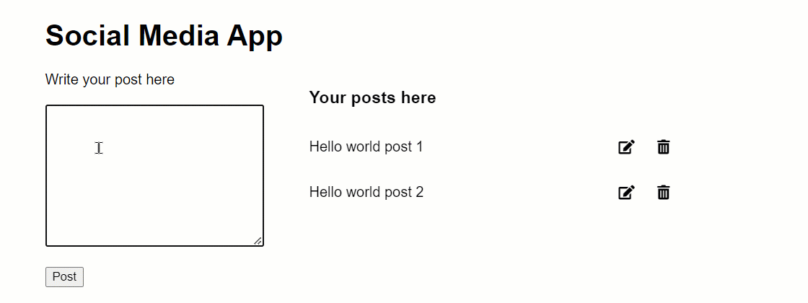

## Take a Break!


Congratulations everyone for completing project 1. Now, take a small break!

# How to Make a To-Do App using CRUD Operations


Let's start making project 2, which is a To-Do App.

## Project Setup


For this project, we will be following these steps below:

- Create 3 files named index.html, style.css, and main.js
- Link the JavaScript and CSS files to index.html
- Start our live server

### HTML

Write this starter code inside the HTML file:

```
<div class="app">
  <h4 class="mb-3">TODO App</h4>

  <div id="addNew" data-bs-toggle="modal" data-bs-target="#form">
    <span>Add New Task</span>
    <i class="fas fa-plus"></i>
  </div>
</div>
```

The div with an id `addNew` is the button that will open the modal. The span will be displayed on the button. The `i` is the icon from font-awesome.

We're going to use bootstrap to make our modal. We'll use the modal to add new tasks. For that, add the bootstrap CDN link inside the head tag.

```
<link
  href="https://cdn.jsdelivr.net/npm/bootstrap@5.1.3/dist/css/bootstrap.min.css"
  rel="stylesheet"
  integrity="sha384-1BmE4kWBq78iYhFldvKuhfTAU6auU8tT94WrHftjDbrCEXSU1oBoqyl2QvZ6jIW3"
  crossorigin="anonymous"
/>

<script
  src="https://cdn.jsdelivr.net/npm/bootstrap@5.1.3/dist/js/bootstrap.bundle.min.js"
  integrity="sha384-ka7Sk0Gln4gmtz2MlQnikT1wXgYsOg+OMhuP+IlRH9sENBO0LRn5q+8nbTov4+1p"
  crossorigin="anonymous"
></script>
```

To see the created tasks, we'll use a div with an id tasks, inside the div with the classname app.

```
<h5 class="text-center my-3">Tasks</h5>

<div id="tasks"></div>
```

Insert the font-awesome CDN inside the head tag to use fonts in our project

```
<link rel="stylesheet" href="https://cdnjs.cloudflare.com/ajax/libs/font-awesome/5.15.4/css/all.min.css" />
```

Copy and paste the code below which are from the bootstrap modal. It carries a form with 3 input fields and a submit button. If you want then you can search Bootstrap's website by writing 'modal' in the search bar.

```
<!-- Modal -->
<form
  class="modal fade"
  id="form"
  tabindex="-1"
  aria-labelledby="exampleModalLabel"
  aria-hidden="true"
>
  <div class="modal-dialog">
    <div class="modal-content">
      <div class="modal-header">
        <h5 class="modal-title" id="exampleModalLabel">Add New Task</h5>
        <button
          type="button"
          class="btn-close"
          data-bs-dismiss="modal"
          aria-label="Close"
        ></button>
      </div>
      <div class="modal-body">
        <p>Task Title</p>
        <input type="text" class="form-control" name="" id="textInput" />
        <div id="msg"></div>
        <br />
        <p>Due Date</p>
        <input type="date" class="form-control" name="" id="dateInput" />
        <br />
        <p>Description</p>
        <textarea
          name=""
          class="form-control"
          id="textarea"
          cols="30"
          rows="5"
        ></textarea>
      </div>
      <div class="modal-footer">
        <button type="button" class="btn btn-secondary" data-bs-dismiss="modal">
          Close
        </button>
        <button type="submit" id="add" class="btn btn-primary">Add</button>
      </div>
    </div>
  </div>
</form>
```

The result so far:

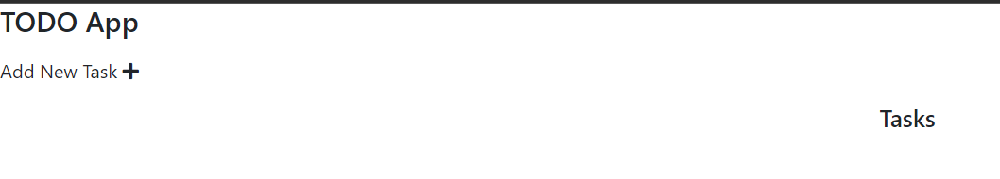

We're done with the HTML file setup. Let's start the CSS.

### CSS

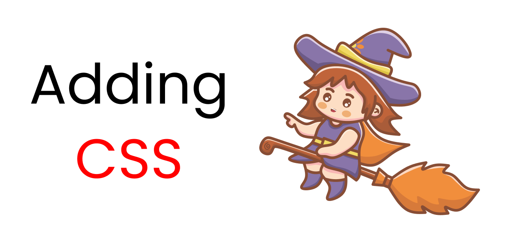

Add these styles in the body so that we can keep our app at the exact center of the screen.

```
body {
  font-family: sans-serif;
  margin: 0 50px;
  background-color: #e5e5e5;
  overflow: hidden;
  display: flex;
  justify-content: center;
  align-items: center;
  height: 100vh;
}
```

Let's style the div with the classname app.

```
.app {
  background-color: #fff;
  width: 300px;
  height: 500px;
  border: 5px solid #abcea1;
  border-radius: 8px;
  padding: 15px;
}
```

The result so far:

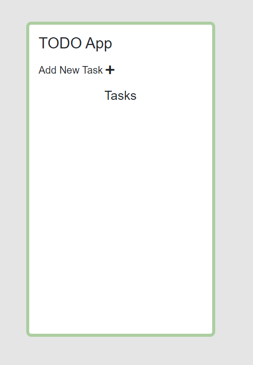

Now, let's style the button with the id `addNew`.

```
#addNew {
  display: flex;
  justify-content: space-between;
  align-items: center;
  background-color: rgba(171, 206, 161, 0.35);
  padding: 5px 10px;
  border-radius: 5px;
  cursor: pointer;
}
.fa-plus {
  background-color: #abcea1;
  padding: 3px;
  border-radius: 3px;
}
```

The result so far:

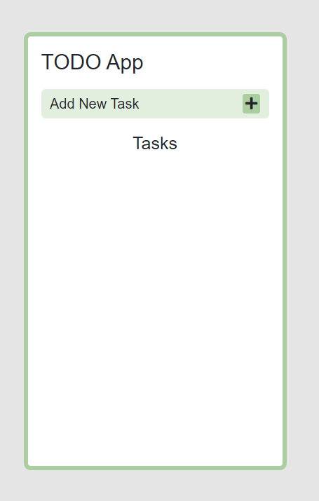

If you click on the button, the modal pops up like this:

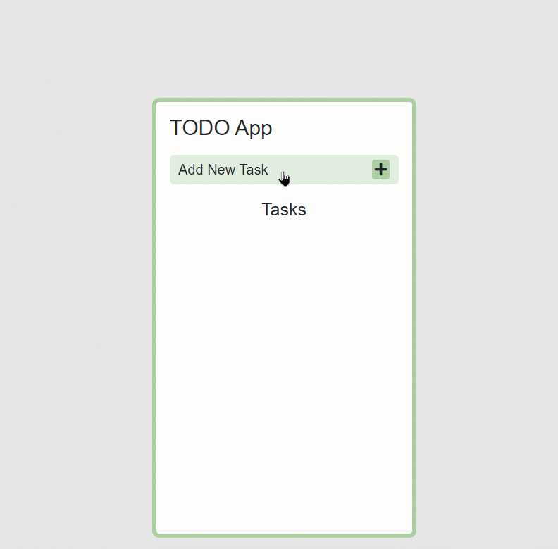

### Add the JS

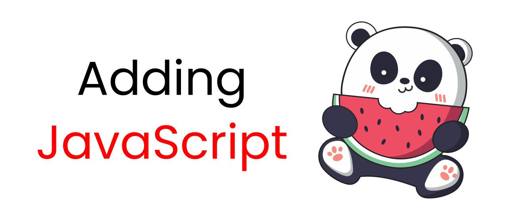

In the JavaScript file, first of all, select all the selectors from the HTML that we need to use.

```
let form = document.getElementById("form");
let textInput = document.getElementById("textInput");
let dateInput = document.getElementById("dateInput");
let textarea = document.getElementById("textarea");
let msg = document.getElementById("msg");
let tasks = document.getElementById("tasks");
let add = document.getElementById("add");
```

#### Form Validations

We cannot let a user submit blank input fields. So, we need to validate the input fields.

```
form.addEventListener("submit", (e) => {
  e.preventDefault();
  formValidation();
});

let formValidation = () => {
  if (textInput.value === "") {
    console.log("failure");
    msg.innerHTML = "Task cannot be blank";
  } else {
    console.log("success");
    msg.innerHTML = "";
  }
};
```

Also, add this line inside the CSS:

```
#msg {
  color: red;
}
```

The result so far:

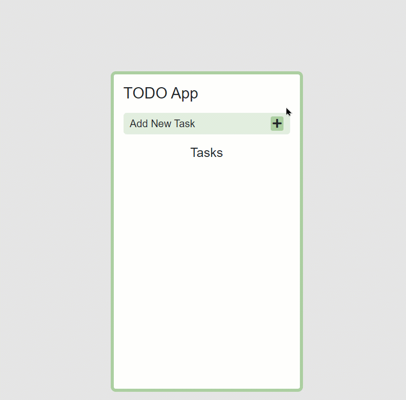

As you can see, the validation is working. The JavaScript code doesn't let the user submit blank input fields, otherwise you're gonna see an error message.

#### How to collect data and use local storage

Whatever inputs the user writes, we need to collect them and store them in local storage.

First, we collect the data from the input fields, using the function named `acceptData` and an array named `data`. Then we push them inside the local storage like this:

```
let data = [];

let acceptData = () => {
  data.push({
    text: textInput.value,
    date: dateInput.value,
    description: textarea.value,
  });

  localStorage.setItem("data", JSON.stringify(data));

  console.log(data);
};
```

Also note that this will never work unless you invoke the function `acceptData` inside the else statement of the form validation. Follow along here:

```
let formValidation = () => {

  // Other codes are here
   else {

    // Other codes are here

    acceptData();
  }
};
```

You may have noticed that the modal doesn't close automatically. To solve this, write this small function inside the else statement of the form validation:

```
let formValidation = () => {

  // Other codes are here
   else {

    // Other codes are here

    acceptData();
    add.setAttribute("data-bs-dismiss", "modal");
    add.click();

    (() => {
      add.setAttribute("data-bs-dismiss", "");
    })();
  }
};
```

If you open Chrome dev tools, go to the application and open the local storage. You can see this result:

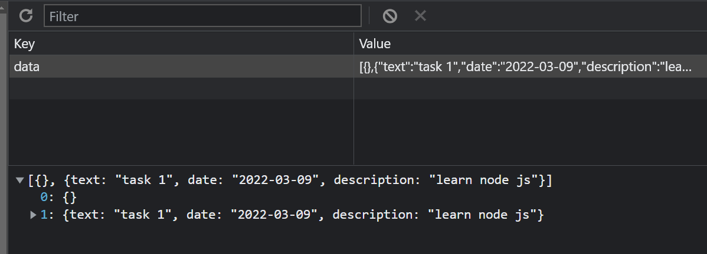

#### How to create new tasks

In order to create a new task, we need to create a function, use template literals to create the HTML elements, and use a map to push the data collected from the user inside the template. Follow along here:

```
let createTasks = () => {
  tasks.innerHTML = "";
  data.map((x, y) => {
    return (tasks.innerHTML += `
    <div id=${y}>
          <span class="fw-bold">${x.text}</span>
          <span class="small text-secondary">${x.date}</span>
          <p>${x.description}</p>
  
          <span class="options">
            <i onClick= "editTask(this)" data-bs-toggle="modal" data-bs-target="#form" class="fas fa-edit"></i>
            <i onClick ="deleteTask(this);createTasks()" class="fas fa-trash-alt"></i>
          </span>
        </div>
    `);
  });

  resetForm();
};
```

Also note that the function will never run unless you invoke it inside the `acceptData` function, like this:

```
let acceptData = () => {
  // Other codes are here

  createTasks();
};
```

Once we're done collecting and accepting data from the user, we need to clear the input fields. For that we create a function called `resetForm`. Follow along:

```
let resetForm = () => {
  textInput.value = "";
  dateInput.value = "";
  textarea.value = "";
};
```

The result so far:

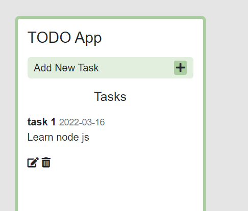

As you can see, there's no styles with the card. Let's add some styles:

```
#tasks {
  display: grid;
  grid-template-columns: 1fr;
  gap: 14px;
}

#tasks div {
  border: 3px solid #abcea1;
  background-color: #e2eede;
  border-radius: 6px;
  padding: 5px;
  display: grid;
  gap: 4px;
}
```

Style the edit and delete buttons with this code:

```
#tasks div .options {
  justify-self: center;
  display: flex;
  gap: 20px;
}

#tasks div .options i {
  cursor: pointer;
}
```

The result so far:

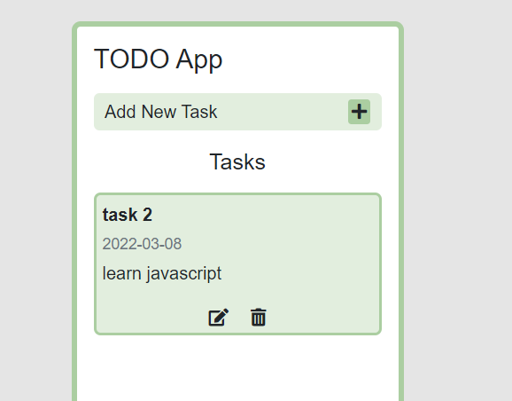

#### Function to delete a task

Look here carefully, I added 3 lines of code inside the function.

- The first line will delete the HTML element from the screen,
- the second line will remove the targetted Task from the data array,
- and the third line will update the local storage with the new data.

```
let deleteTask = (e) => {
  e.parentElement.parentElement.remove();

  data.splice(e.parentElement.parentElement.id, 1);

  localStorage.setItem("data", JSON.stringify(data));

  console.log(data);
};
```

Now create a dummy task and try to delete it. The result so far looks like this:

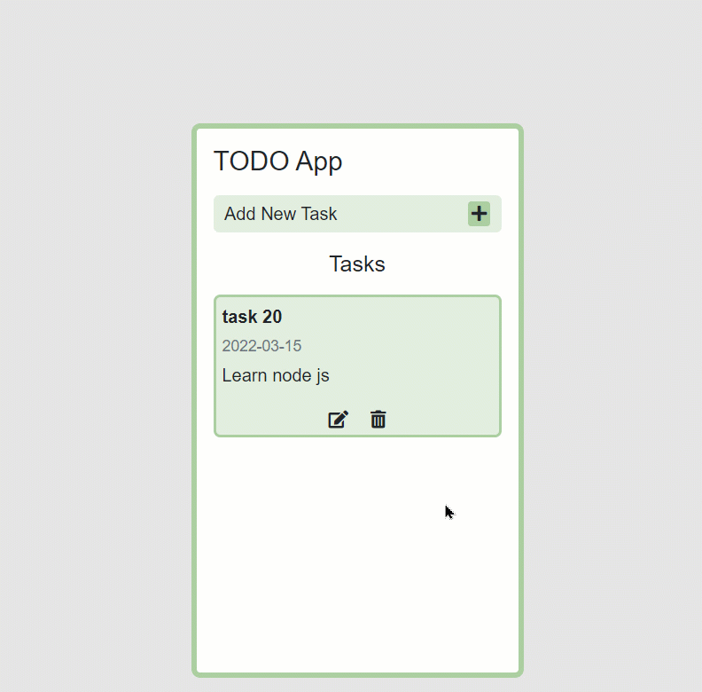

#### Function to edit tasks

Look here carefully, I added 5 lines of code inside the function.

- Line 1 is targetting the task that we selected to edit
- Lines 2, 3, and 4, are targetting the values [task, date, description] of the task that we selected to edit
- line 5 is running the delete function to remove the selected data both from the local storage, HTML element, and data array.

```
let editTask = (e) => {
  let selectedTask = e.parentElement.parentElement;

  textInput.value = selectedTask.children[0].innerHTML;
  dateInput.value = selectedTask.children[1].innerHTML;
  textarea.value = selectedTask.children[2].innerHTML;

  deleteTask(e);
};
```

Now, try to create a dummy task and edit it. The result so far:

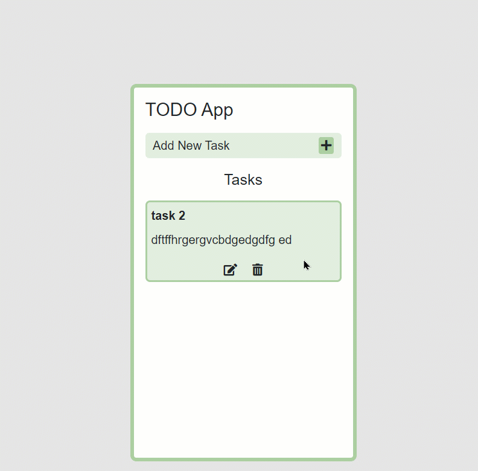

#### How to get data from local storage

If you refresh the page, you'll note that all of your data is gone. In order to solve that issue, we run a IIFE (Immediately invoked function expression) to retrieve the data from local storage. Follow along:

```
(() => {
  data = JSON.parse(localStorage.getItem("data")) || [];
  console.log(data);
  createTasks();
})();
```

Now the data will show up even if you refresh the page.

## Conclusion


Congratulations for successfully completing this tutorial. You've learned how to create a todo list application using CRUD operations. Now, you can create your own CRUD application using this tutorial.

Here's your medal for reading until the end. ❤️

## Suggestions & Criticisms Are Highly Appreciated ❤️


