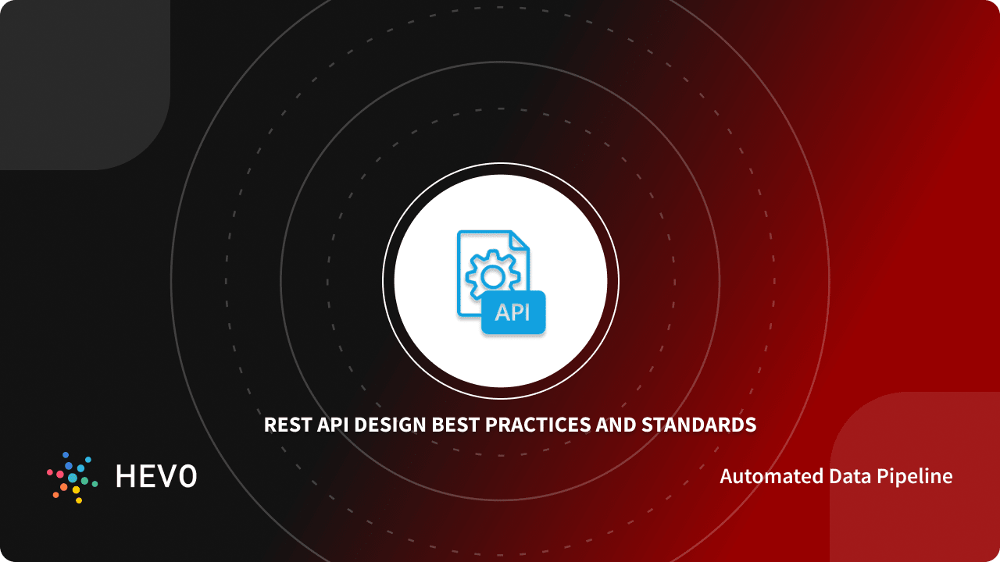

REST API Best Practices and Standards in 2022

<https://hevodata.com/learn/rest-api-best-practices/>

In this blog, you will be introduced to REST API along with its standards. The working and characteristics of REST API are elaborated. Ten REST API Best Practices with examples will be discussed.
