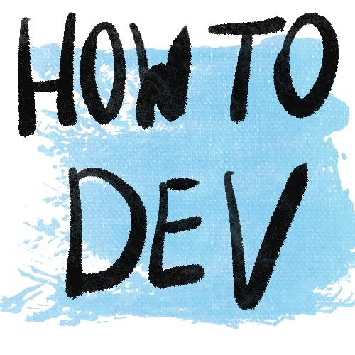

How to write unit tests

<https://how-to.dev/how-to-write-unit-tests>

As a beginner programmer, you often hear advice to test your code. It’s good advice—let’s look at how you can start doing it! What are unit tests Tests are a way to explicitly set expectations about code. You establish them to allow the machine to ch...
