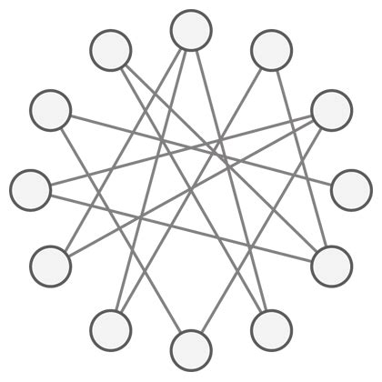

# Building robust distributed systems

Kislay Verma · March 5, 2022March 5, 2022

I have written before on this blog about [what distributed systems are](https://kislayverma.com/for-the-layman/for-the-layman-ep-1-what-is-a-distributed-system/) and how they can give us [tremendous scalability](https://kislayverma.com/software-architecture/on-scalable-software/) at the cost of having to deal with a more complicated system design. Let’s discuss how we can make a distributed system resilient to random failures which get more common as the system gets larger.

[Systems theory](https://kislayverma.com/books/book-review-thinking-in-systems-a-primer/) tells us that the more interconnected parts of a system are, the more the likelihood of large failures. So to build a resilient system, we need to reduce the number of connections. Where this cannot be done, we need to implement ways to “temporarily” sever connections to failing parts so that errors do not cascade to other parts.

Every component has to assume that every other component will fail at some point and decide what it will do when such failures happen.

Lastly, we need to build some buffers in the system – some ways to relax, if not remove the demands placed on it so that there is slack to handle unexpected conditions.

### Minimize inter-component dependencies

Components of a distributed system communicate with each other for data or functionality. In both cases, we can reduce the requirement of connectivity by pushing the data/functionality into the calling component instead of being accessed remotely.

Building a high scale distributed system forces us to abandon a lot of the “best practices” of standard software engineering. The key thing to remember is as we adopt the complexity of distributed systems to attain scalability, we also need to keep the “distribution” in check as much as we can.

#### Duplicate Data

If we access some data from another component frequently, we can duplicate it in our component to not have to retrieve it at run time. This can massively reduce runtime dependency and help improve latency on our component.

Data that is frequently accessed but changes with some regularity can be cached temporarily with periodic cache refreshes. Data that changes even less frequently or never (e.g. Name of a customer) can be stored in our component directly. We might have to do some extra work if/when this data does change, but this added small overhead is usually worth it for the increased resilience.

#### Denormalize Data

Denormalization is a special form of duplication that happens within a component. If we are using relational data stores, we can reduce the cost of looking across multiple entities by duplicating data in the main entity. The principle of localizing scattered data for better performance applies here as well.

#### Libraries

To mitigate functional dependency of another component, we can package the remote component as a library and embed it within our component. This is not always possible (it might be written in some other language or be too large to be a library) and comes with its own set of problems (change in functionality requires library upgrades across multiple components), but if the functionality is critical and frequently accessed at a high scale, this is a viable way of breaking the inter-component connection and making it local.

### Isolate errors

Error isolation is important for two reasons. One is that individual errors are more common in distributed systems (simple function of lots of moving parts). The other is that if we cannot prevent errors from cascading throughout the system, then we lose the very reason for building a complex in the first place.

The primary construct of error isolation is SLA. Every component declares some quality parameters it will honour in performing a function. these parameters can include latency, error rate, concurrency, and others.

Beyond this SLA, components invoking it assume it to have failed and need to take suitable action on their own. If the component itself detects that it is unable to maintain its SLA, it can preemptively tell its callers to back away and come back later.

To [maintain overall system health](https://kislayverma.com/software-architecture/distributed-systems-as-data-pipelines-throughput-capacity-and-backpressure/), it is better to fail fast rather than succeed with breached SLA. Both components (the one invoked and the one invoking) must put in mechanisms for this.

#### Protecting the caller

**Timeouts**: If the called component doesn’t respond within its SLA, the caller must timeout (give up) and use some fallback mechanism instead (even if it is throwing an error) to maintain its own SLA and prevent a cascade of SLA breaches.

**Retries**: Since the network is unreliable, many errors in a distributed system are just random. The caller can retry the operation if its own SLA permits it to do so. The prerequisite for retries is the idempotency of the operation. i.e. it should not change state or do it only once even if it is invoked twice.

**Circuit Breakers**: If calls to a component are failing continuously, the caller can sever the connection and stop calling it for some time by “opening the circuit”. Since the caller already has some backup behaviour for error scenarios, this saves the caller precious resources which would have been wasted. Stopping the calls also reduces the load on the called component and give it some breathing room to recover.

Circuit breaker libraries have mechanisms to poll the troubled component periodically and restart the call flow if its performance seems to have returned to normal.

#### Protecting the called

**Random Backoffs**: While retries reduce errors, a small performance blip in a heavily used component can cause all of its callers to retry at once. This “retry storm” can create spikes in load and prevent this component from recovering. To prevent this, retries should be done with a random time gap between them so that load is staggered.

**Backpressure**: If a component detects itself under too much load and about to breach its SLA, it can preemptively start dropping new requests till its performance comes under control. This is much better than accepting requests which it knows it can’t serve within SLA or without the risk of a complete crash.

### Build buffers in the system

#### Asynchronous communication

[Asynchronous communication](https://kislayverma.com/tag/asynchronous-programming/) channels like message buses allow remote components to be invoked without a very tight SLA dependency. By letting the messages be consumed when the called component is ready instead of right away, the system becomes a little more elastic to the demand of increased workload.

#### Elastic provisioning

Scalability eventually boils down to making the best use of available hardware. But a simple way of giving the system room to breathe can be to allocate more hardware if see the scale growing. While this is only feasible up to the extent of the cost we can bear, it gives us the last line of defence against unpredicted variations in load.

You can read about some low-level details of using these techniques in my articles on [code review](https://kislayverma.com/programming/code-review-checklist-for-distributed-systems/) and [design review](https://kislayverma.com/programming/design-review-checklist-for-distributed-systems/) for distributed systems.

*If you liked this, subscribe to my weekly newsletter [It Depends](https://kislayverma.com/newsletter-archive/) to read about software engineering and technical leadership*

Post Views:
3,978
