# Serverless Architecture Layers

## How and why I believe enterprise organisations should use domain-driven design with the five serverless architecture layers, inspired by the great work of Eric Evans. We will talk through a fictitious company using architecture layers, with visuals and descriptions.

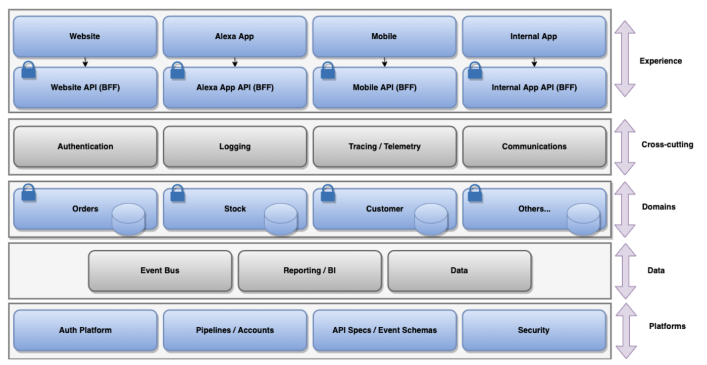

An example of the five architecture layers for Serverless

# Introduction

In enterprise architecture in the Serverless World it is imperative that we think conceptually and holistically about our overall solutions as a set of patterns, templates and guardrails to ensure that we don’t end up with an anaemic [lambda pinball architecture](https://www.thoughtworks.com/en-gb/radar/techniques/lambda-pinball), which over time becomes a big ball of mud, and most probably a distributed monolith with lots of duplication of business logic and wasted team effort. (*shown below*)

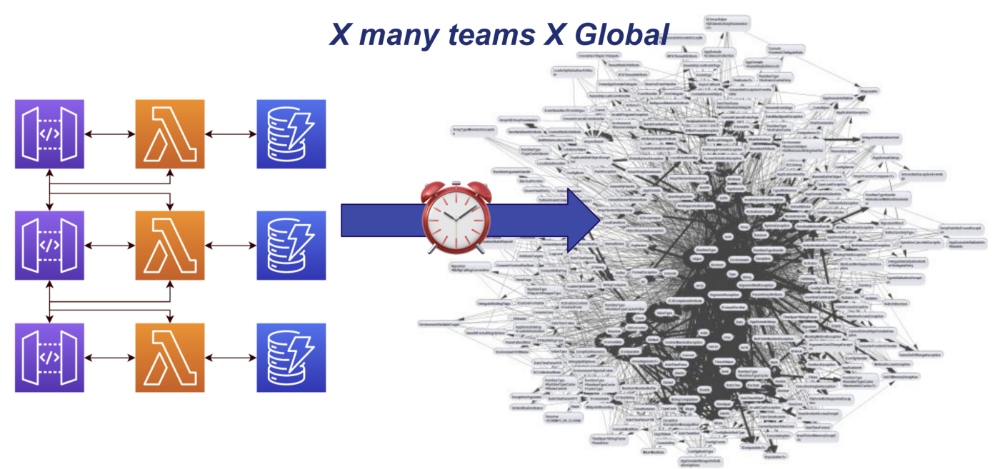

Serverless pinball architecture and big ball of mud during a serverless transformation project

> “Lambda pinball architectures characteristically lose sight of important domain logic in the tangled web of lambdas, buckets and queues as requests bounce around increasingly complex graphs of cloud services.” — Thoughtworks

This can easily happen as organisations start their Serverless transformations with many new teams spinning up new solutions in their own silos over time, extrapolating this out quickly as many organisations are also global and geographically distributed. Couple this with [Conways Law](https://www.thoughtworks.com/insights/articles/demystifying-conways-law) and we can very quickly have large issues and mass rework at scale.

This article discusses Layered Architecture, which was made prominent by Eric Evans in the book [Domain-driven Design](https://tinyurl.com/rs7jap5r). (*I encourage all architects and serverless developers to buy this book*), and what this means in the Serverless paradigm for enterprises.

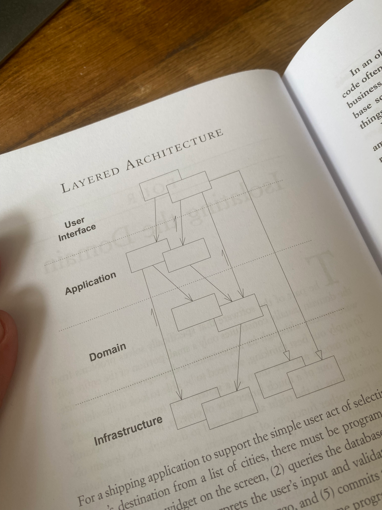

Domain-driven Design — Eric Evans: <https://tinyurl.com/rs7jap5r>

When it comes to the Serverless World in enterprise organisations I believe it looks more like the diagram below which shows the “**Five Serverless Architecture Layers**”:

An example of the five architecture layers for Serverless

The following layers have cross over from the old World and new Serverless World (*we will quote from the book as we go*):

**User Interface (Presentation) & Application → Experience**

**Domain → Domains**

**Infrastructure → Platforms**

During this article we are going to go into the five serverless architecture layers, whilst showing how a fictitious companies ‘(**Lee James Mountain Wear**’) Serverless architectures looks when using this approach or not.

Our fictitious company, Lee James Mountain Wear

We can also couple this approach with [Serverless TACTICAL DD(R)](https://levelup.gitconnected.com/serverless-tactical-dd-r-23d18d529fa1) and an enterprise wide [Tech Radar](https://www.thoughtworks.com/radar/byor) to ensure that we have the relevant guardrails, patterns and architectural governance in place as teams move to the Serverless World during an enterprise wide transformation; whilst also still allowing for innovation and evolutionary architectures at the same time:

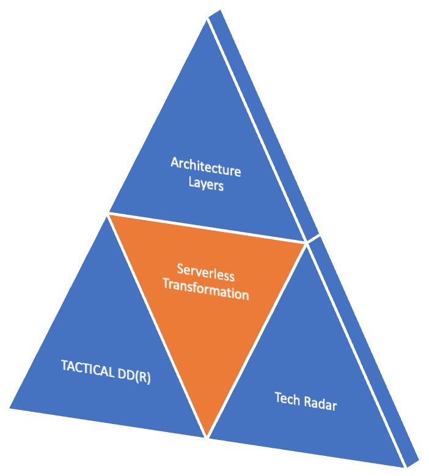

Architecture Layers + TACTICAL DD(R) + Tech Radar

[## Serverless TACTICAL DD(R)

### What is TACTICAL DD(R) as a tactical approach to nonfunctional requirements when it comes to Serverless solutions, and…

levelup.gitconnected.com](https://levelup.gitconnected.com/serverless-tactical-dd-r-23d18d529fa1)

[## Build your Own Radar | Thoughtworks

### Learn how to use our radar creation exercise to have a conversation across all organisational levels and review your…

www.thoughtworks.com](https://www.thoughtworks.com/radar/byor)

Let’s start by going through the various layers below in the next section.

# Experience Layer

In the book, the **User Interface** or **Presentation Layer** is described as “*Responsible for showing information to the user and interpreting the users commands*” and the **Application Layer** is described as “*Defines the jobs the software is supposed to do and directs the expressive domain objects to work out problems*”.

> “*Defines the jobs the software is supposed to do and directs the expressive domain objects to work out problems*” — Eric Evans (Domain-driven Design)

It goes on to say about the **Application Layer** “*This layer is kept thin. It does not contain business rules or knowledge, but only coordinates tasks and delegates work to collaborations of domain objects in the next layer down*”

> “*This layer is kept thin. It does not contain business rules or knowledge, but only coordinates tasks and delegates work to collaborations of domain objects in the next layer down*” — Eric Evans (Domain-driven Design)

We can see an example on the diagram below of the **Serverless** **Experience Layer** made up of both Presentation and Application Layers , which is typically made up of user experiences such as Micro-frontends, [Alexa Apps](https://developer.amazon.com/en-US/alexa), Websites (*Perhaps React app stored in Amazon S3*), Mobile apps etc; as well as specific [Backend for Frontend (*BFF*)](https://docs.microsoft.com/en-us/azure/architecture/patterns/backends-for-frontends) thin APIs, perhaps using [Amazon API Gateway](https://aws.amazon.com/api-gateway/) or [AWS AppSync](https://aws.amazon.com/appsync/).

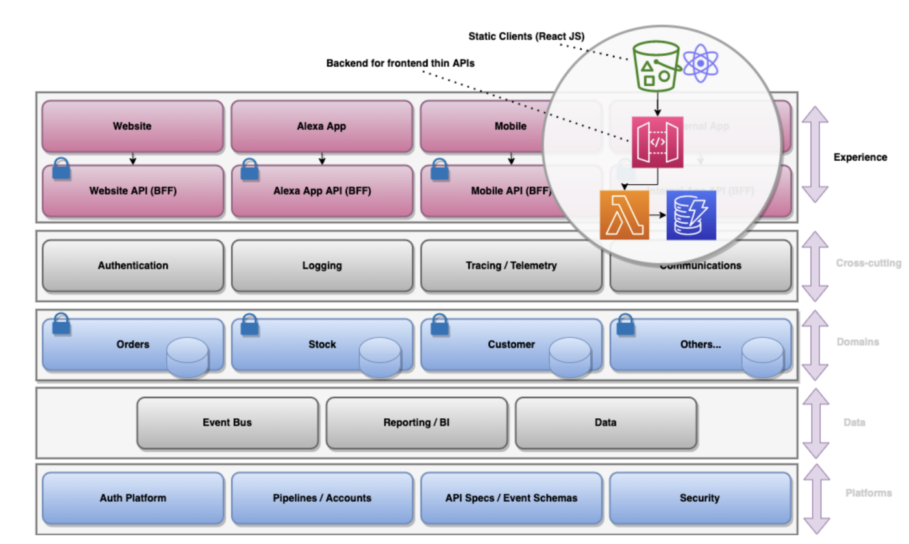

The experience layer

These thin APIs can have their own authentication needs, for example an internal application may use [SSO](https://en.wikipedia.org/wiki/Single_sign-on) federated with Azure AD, but the Mobile and Alexa Apps may use [Amazon Cognito](https://aws.amazon.com/cognito/) for external users of the systems.

There should be no business logic in these thin API’s (*we will go on to discuss why later*), but should only be concerned with the orchestration of business functionality required for the experience by utilising the **Domain Layer**.

**Let’s see an example for our company**

We can see from the diagram below that the Stock team who deals with the mountain wear stock has:

1. Allowed business logic to leak into the frontend code for the internal stock check system. This logic is not accessible to the rest of the systems.
2. An Alexa app needs to add functionality for ‘Check stock online’; however that logic has already been duplicated in the two backend for frontend APIs for the internal stock check system and the websites stock check functionality.

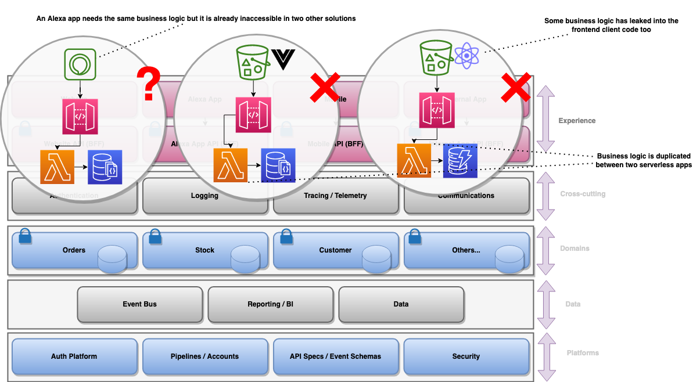

Example of where the teams went wrong straight away

## Summary

Ensures business logic is not leaked through an organisation. (*Lambda Pinball*)  
 Ensures that business logic is reusable across the organisation and experiences as it doesn’t sit in BFFs or frontend code.  
 Allows us to use different authentication requirements per experience.  
 The experience i.e. UI/Voice/UX should contain no shared business logic.  
 The backend APIs for the experience should be stateless.

# Cross-cutting Layer

There is no equivalent in the book for the **Cross-cutting Layer**, but this is something which in my opinion is imperative when architecting enterprise Serverless solutions.

Examples of cross-cutting concerns are component libraries for frontend development, the sending of communications such as emails and SMS, and aggregated logging and tracing, allowing us to correlate logs across a myriad of services and calls. Another would be authentication, as our customers should have an SSO experience regardless of using an Alexa app, a Chatbot or our Website

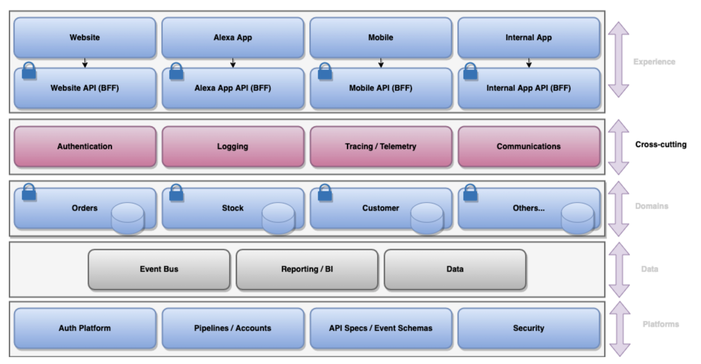

The Cross-cutting Layer

As architects if we don’t think about this early as a group as we start to architect our solutions, we find that individual teams start to tackle and solve the same issues over and over; for example more than one team looking at customer authentication. (*shown below*)

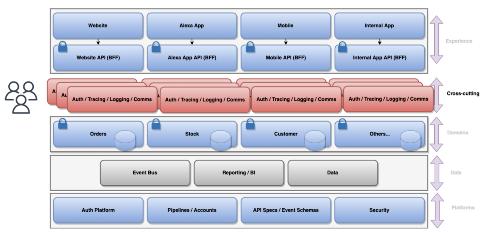

The Cross-cutting Layer

This leads to teams choosing different SasS products within their own silos for example, increasing cognitive load on new teams which are spun up (*solving the same problems again and again*), and reducing the chance of us gaining better contracts with suppliers at scale.

**Let’s see an example for our company**

In our example for *Lee James Mountain Wear*, we find that our Stock and Orders teams are both building out their own React Component Libraries in their own silos as there is a lack of communication, without thinking about this at an enterprise level.

At the same time, our Customer and Orders teams are both doing POC work around observability, and speaking to two different SaaS suppliers. Extrapolate this out as the number of teams grow, as well as the global aspect, and you have some serious issues at scale (*shown below*)

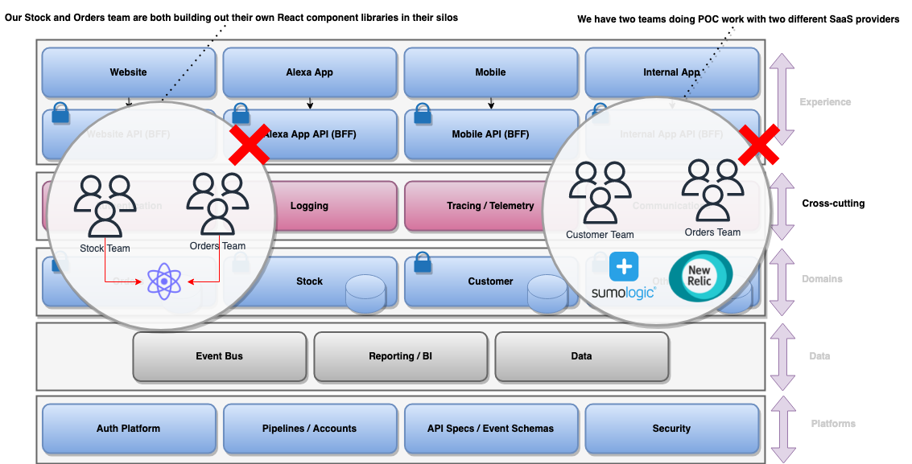

Issues when not thinking about cross-cutting concerns holistically

## Summary

Prevents complexity, duplication, and cognitive load in each team solving the same issues.  
 Allows people to move more easily between teams as we have standards.  
 Increases speed and agility in teams without re-inventing the wheel.  
 Allows us to gain better deals with suppliers on SasS products due to increased usage at an enterprise scale.

# Domain Layer ️

The Domain Layer in my opinion is the most important to get right and focus on. In the book Eric Evans describes this as “*Responsible for representing concepts for the business, information about the business situation, and business rules.*”.

> “Responsible for representing concepts for the business, information about the business situation, and business rules” — Eric Evans (Domain-driven Design)

In a Serverless World, this would be represented typically using Private API Gateways backed by [AWS Lambda](https://aws.amazon.com/lambda/) or [AWS Fargate](https://aws.amazon.com/fargate/), specifically with its own datastore such as [AWS DynamoDB](https://aws.amazon.com/dynamodb).

[## Serverless Private APIs

### How to allow private serverless platform APIs to communicate securely internally within your organisations without…

levelup.gitconnected.com](https://levelup.gitconnected.com/serverless-private-apis-60749934b161)

The API should be well defined and versioned using [Open API (*Swagger*)](https://swagger.io/specification/), and should become the aggregate root and main interface for the domain. In event-driven systems it is also imperative that we use well defined versioned events to interface with the domain, for example using [Amazon EventBridge](https://aws.amazon.com/eventbridge/) with the [Schema Registry](https://docs.aws.amazon.com/eventbridge/latest/userguide/eb-schema.html). This ensures that we can change the internals of our domain service without effecting consumers.

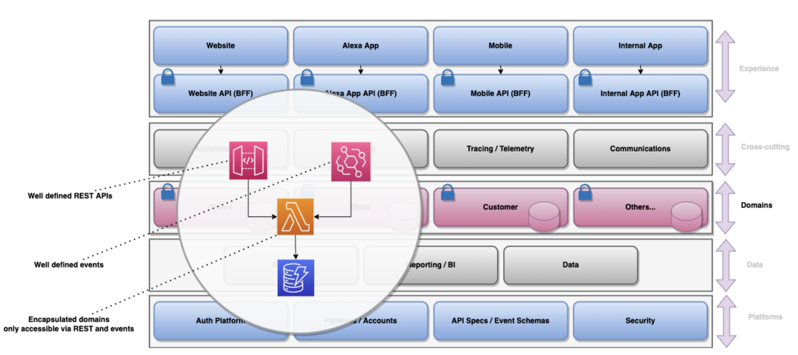

The Domains Layer — reusable business logic

The internals of the domain service should be incapsulated so we don’t have other domains and teams reaching out directly to our data stores for example, bypassing the governance of our business rules, logging and logic. (*as shown above*)

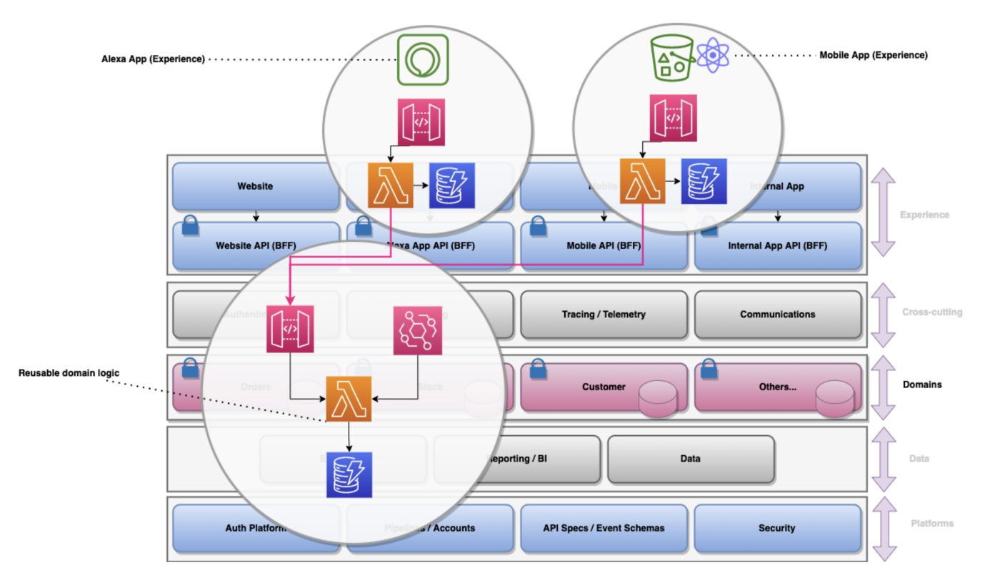

The Domains Layer — utilising shared business logic

This now means that we can reuse domain business logic across many experience layers and other domains, calling through from the thin backend for frontend APIs to our Domain APIs using a Client-credentials Grant Flow (*machine to machine*). (*as shown above*)

[## Serverless API to API authentication

### A practical guide to using Amazon Cognito to authenticate API to API integrations using an OAuth2 Client Credentials…

levelup.gitconnected.com](https://levelup.gitconnected.com/serverless-api-to-api-authentication-d4cb4472721e)

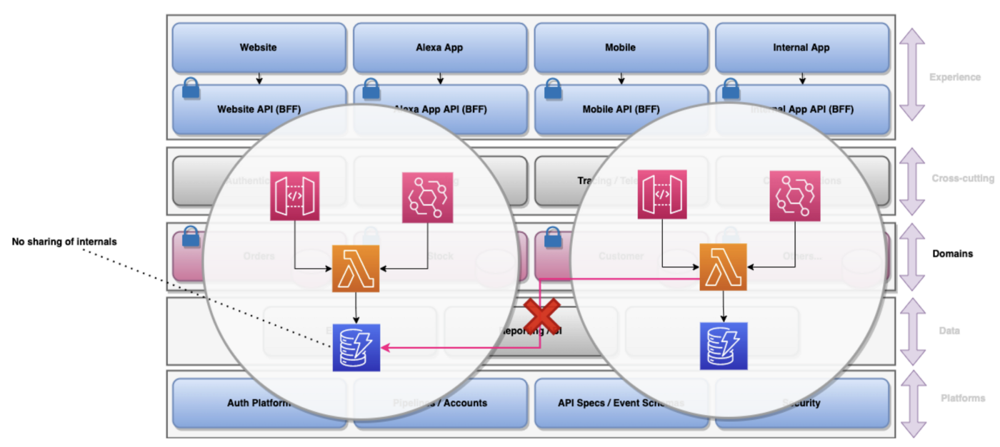

The Domains Layer

We need to ensure that the domains are well encapsulated and that domain services don’t start interacting with the internals of other domains, whether that be data stores or internal [AWS SNS](https://aws.amazon.com/sns/) topics or [Amazon SQS](https://aws.amazon.com/sqs/) queues (*as shown above*). This undoes all of the good work that we have done in defining the domains and creating our versioned interfaces.

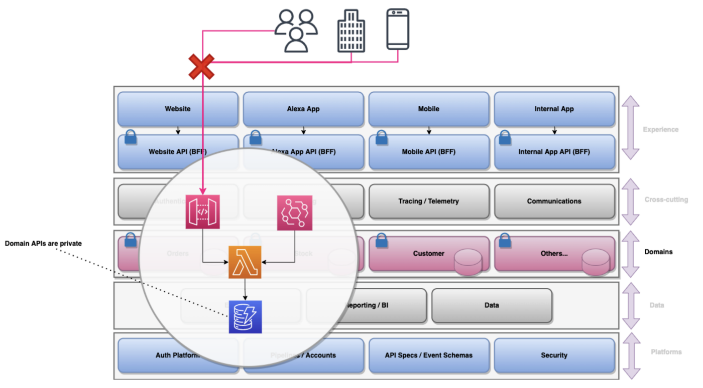

The Domains Layer

We should also ensure that our domain services are not accessible to the outside World, even when they are tied down using authentication. (*as shown above*).

As the APIs should be tied down using a machine to machine flow, there is no reason that they should be accessible via Postman, curl, mobile, webpages etc. They will never be called directly from a frontend for example, so for security reasons they should be tied down accordingly. (*See the article like above for Private APIs on AWS*)

## Summary

Well-defined versioned APIs and events ensure consumers understand how to interact with our domains.  
 Domain interfaces mean we can change the internals without affecting consumers.  
 Our domain services are not externally accessible to the World, and only accessed using machine to machine flows. (*i.e. using private API Gateways*).  
 We ensure that consumers don’t interact with the internals of our domains, only through our well defined APIs and events.  
 The domain logic can be utilised by other domain services or experiences, preventing anaemic domains being split across a distributed monolith.

# Data Layer

The next Serverless layer is the **Data Layer**, which is not represented in the book; however in todays data and event-driven World, we need to think about this from an enterprise level.

The data layer is typically made up of three key areas:

1. **Enterprise Service Bus**. This for example would typically be Amazon EventBridge or [Amazon MSK (*Kafka*)](https://aws.amazon.com/msk/).
2. **Reporting and BI**. This for example would typically be [Amazon QuickSite](https://aws.amazon.com/quicksight/) and [Amazon Athena](https://aws.amazon.com/athena/).
3. **Data**. This would typically be [Amazon Redshift](https://aws.amazon.com/redshift/) or [S3 data lakes](https://aws.amazon.com/products/storage/data-lake-storage/) for example.

We should govern this at an Enterprise Architecture level to ensure we have a way for our domain services to interact with each other in an event-driven manner across the organisation, and don’t have different teams using different technologies (*SNS, Kafka, EventBridge etc*). This is covered in the article below:

[## Serverless Event-Driven Systems

### How and why you should build your Serverless architectures to be event-driven first using Amazon EventBridge for…

levelup.gitconnected.com](https://levelup.gitconnected.com/serverless-event-driven-systems-9617c6406064)

Utilising an enterprise service bus such as Amazon EventBridge now means that domains can interact with each other using well defined versioned events, as well as backend for frontend APIs in the experience layer also raising events which other domains may be interested in:

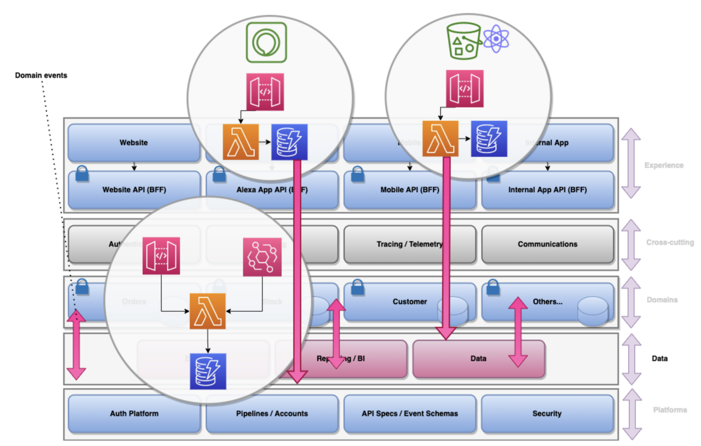

The Data Layer

This is shown below where domains may raise events such as ‘Order Created’, ‘Price Amended’ etc; and Experience Layers may raise events such as ‘User Logged In’.

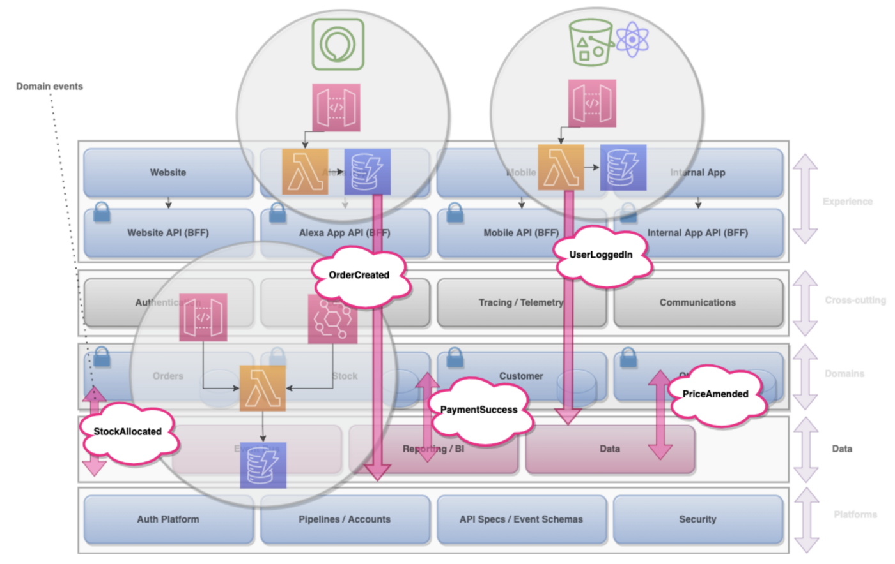

The Data Layer

This also allows us to build up our data lakes and aggregate these events to allow us to be more data driven, so there are intrinsic links between events, data and reporting/BI. The article below discusses how to utilised streams and events to work around the issues with two phase commits in a Serverless World:

[## Serverless Streamed Events

### How to stream domain events based on database changes in DynamoDB and DocumentDB with EventBridge, with visuals and…

levelup.gitconnected.com](https://levelup.gitconnected.com/serverless-streamed-events-ada6ed9a9ecf)

**Let’s see an example for our company**

In the enterprise organisation *Lee James Mountain Wear* we have three different teams utilising three different technologies (*SNS, EventBridge and MSK*), so this makes it very difficult for domain communication based on events. Standardising at an enterprise level from the outset would have made this much easier, reducing development time, reducing cognitive load on teams, and allowing for versioned event schemas and event discovery.

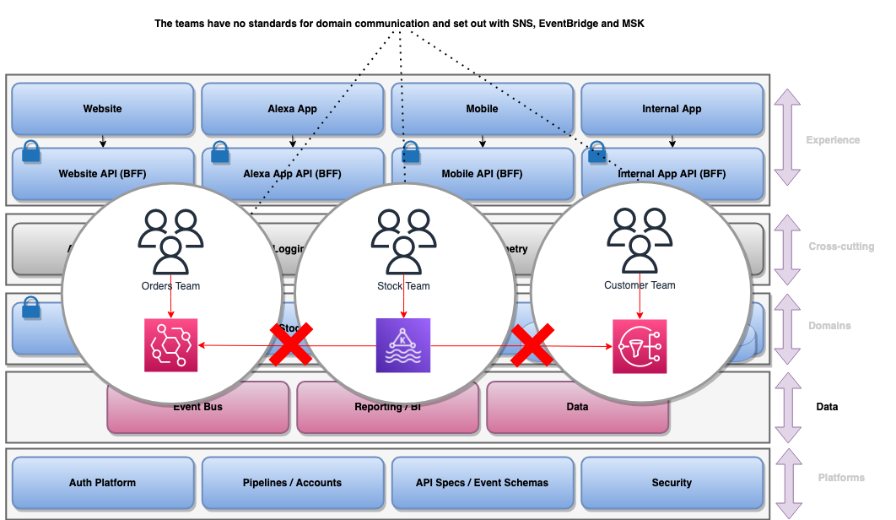

## Summary

An Enterprise Service Bus allows us to coordinate across teams in a business.  
 Amazon EventBridge Schema Registry allows other teams to view our versioned events and consume them (*easy to discover, reducing cognitive load and enhancing communication*)  
 We can report on the data and events by streaming them to data lakes or warehouses, and consuming using tools such as Athena and QuickSite.  
 We can use sentiment analysis and events to build up single customer views.  
 Reduces cognitive load on teams using an ESB and increases their speed and agility.

# Platforms Layer

The final layer in the book, the **Infrastructure Layer**, is the equivalent of the **Platforms layer**. In the Serverless World the teams will be managing their own architecture and services through IaC, rather than the traditional World of server management. The book describes the Infrastructure layer as “*Provides generic technical capabilities that support the higher layers*”.

> “*Provides generic technical capabilities that support the higher layers*” — Eric Evans (Domain-driven Design)

In the Serverless World for development teams this is typically made up of:

1. **Authentication Platforms**. This is a standard way of teams performing machine to machine flows.
2. **Pipelines/Accounts**. Serverless teams should not need to think about the heavy lifting such as spinning up pipelines or creating VPCs, networking, transit gateways etc. This should be templated and quick to spin up for new teams/domains.
3. **Security**. Security should be baked in as early as possible into our templates when new teams and solutions are spun up — shifting this left as quickly as possible.
4. **API Specs/Event Schemas**. These should be centralised and easy for teams to discover, increasing agility and speed.

This is shown in the diagram below:

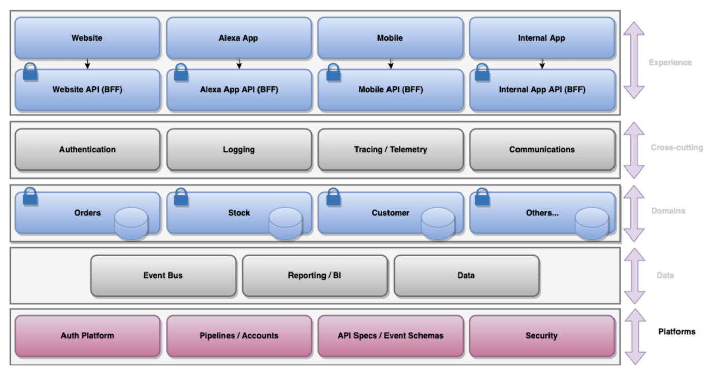

The Platforms Layer

The most important of these in my opinion is **Pipelines and Accounts**, as Serverless teams should have the ability to utilise templates and reference architectures, with the platform essentially removing the differentiated heavy lifting and reducing cognitive load. These templates should also have security baked in, shifting security left as early as possible.

There are many products such as [AWS Proton](https://aws.amazon.com/proton/) and [Backstage IO](https://backstage.io/) which perform this at an enterprise level.

## Summary

Developer portals and platforms should increase speed and agility for Serverless teams.  
 Differentiated heavy lifting such as networking, setting up VPCs, creating pipelines etc should be provided by the platform.  
 Developer portals should make it easy for teams to discover API and event definitions.

Please visit our sponsors [Sedai.io](https://www.sedai.io/)

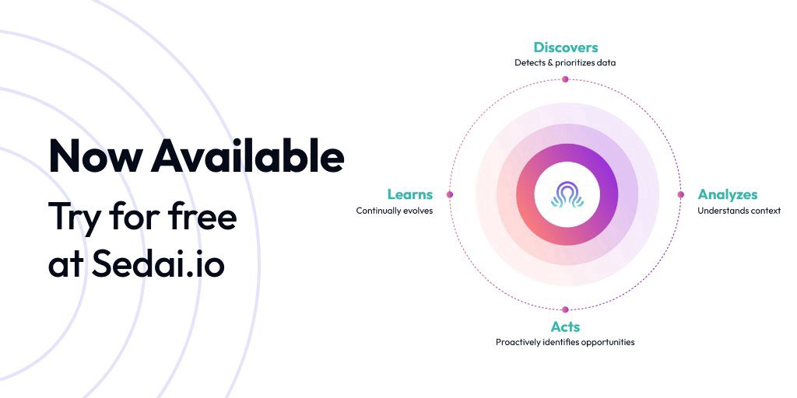

# Summary

I hope you found that useful as a way to conceptually think of our Serverless architectures at an Enterprise Architecture level.

Go and subscribe to my Enterprise Serverless Newsletter here for more of the same content:

[## Enterprise Serverless | LinkedIn

### Lee Gilmore | Serverless news and articles for AWS Developers, DevOps Engineers and Cloud Architects

www.linkedin.com](https://www.linkedin.com/newsletters/enterprise-serverless-%F0%9F%9A%80-6875837779876605952/)

# Wrapping up

Please [go and subscribe on my YouTube channel](https://www.youtube.com/channel/UC_Bi6eLsBXpLnNRNnxKQUsA) for similar content!

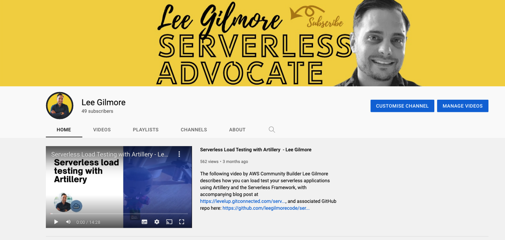

I would love to connect with you also on any of the following:

<https://www.linkedin.com/in/lee-james-gilmore/>  
<https://twitter.com/LeeJamesGilmore>

If you found the articles inspiring or useful please feel free to support me with a virtual coffee <https://www.buymeacoffee.com/leegilmore> and either way lets connect and chat! ☕️

If you enjoyed the posts please follow my profile [Lee James Gilmore](https://medium.com/u/2906c6def240?source=post_page-----39c4f4ae5aff----------------------) for further posts/series, and don’t forget to connect and say Hi

Please also use the ‘clap’ feature at the bottom of the post if you enjoyed it! (*You can clap more than once!!*)
