# Serverless Event-Driven Systems

## How and why you should build your Serverless architectures to be event-driven first using Amazon EventBridge for resilience, and some of the pitfalls to think about; including visuals and associated code repo using TypeScript and the Serverless Framework.

# Introduction

This article aims to cover why you should have an event-driven first mindset when building out your Serverless architectures, and why [Amazon EventBridge](https://aws.amazon.com/eventbridge/) should underpin them. We will also be covering some of the pitfalls that you can hit when working with eventually consistent event-driven systems. The basic code for this article can be found here: <https://github.com/leegilmorecode/serverless-event-bridge>

> This article aims to cover why you should have an event-driven first mindset when building out your Serverless architectures

We are going to continue from the previous article on ‘Serverless Threat Modelling’ where we were building out our fictitious ***LeeJames HR*** software

This is covered in the following article:

[## Serverless Threat Modelling

### How and why you should threat model your Serverless solutions on AWS, with visual examples of a real life walk through

leejamesgilmore.medium.com](https://leejamesgilmore.medium.com/serverless-threat-modelling-df8e4028ef6d)

If you already have a good grasp of using Amazon EventBridge with TypeScript then feel free to jump straight to the section: ***Gotchas & mitigations in the solution!***

## Index

1. What are we building?
2. Sync vs Async
3. What are the main benefits of event-driven systems?
4. Events and Commands
5. Event-driven systems using Amazon EventBridge
6. Deploying the solution
7. Testing the solution
8. Gotchas & mitigations in the solution!

Let’s get started!

## What are we building? ️

We are going to build out the part of the **LeeJames HR** system which is responsible for uploading customer payslips from our client app, and the separate domain service which generates the PDF versions and stores them in [Amazon S3](https://aws.amazon.com/s3/).

*Please note this is the minimal code and architecture to allow us to discuss key points in the article, so this is not production ready and does not adhere to coding best practices*. *(For example no authentication on end points). I have also tried not to split out the code too much so example files below are easy to view with all dependencies in one file.*

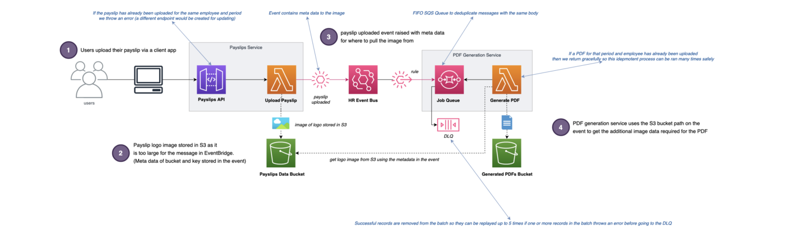

Example of what we will be building

# Sync vs Async

When starting out with Serverless it is fairly easy to start building out domain services using services like [Amazon API Gateway](https://aws.amazon.com/api-gateway/) and [AWS Lambda](https://aws.amazon.com/lambda/), and then building out larger enterprise architectures by calling between them synchronously using HTTPS requests. However this:

1. **Increases Latency**. Increases the latency of calls for the end user as they wait for all HTTPS requests to resolve in order.
2. **Very Brittle**. It makes the overall architecture hugely coupled — making it massively brittle to any failures.

This is shown in the diagram below:

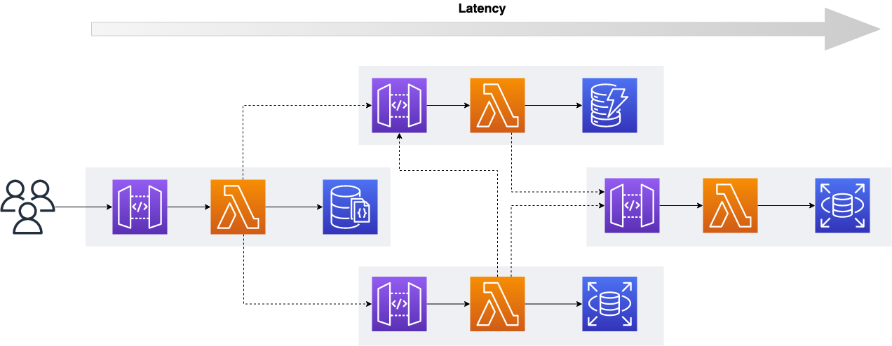

Many domain services calling each other synchronously

When there is an issue with one of the downstream services (f*or example a database having issues with CPU or memory*) we find that everything breaks as they are all totally coupled:

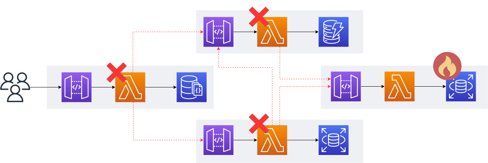

One domain service going down affects all of the others

The reason for this is that all of the domain services are aware of each other, and intrinsically linked — so you find you have a domino affect when one service has issues. **A better approach to domain driven development** is to have your services loosely coupled, only communicating through the use of events where possible (*as shown below*):

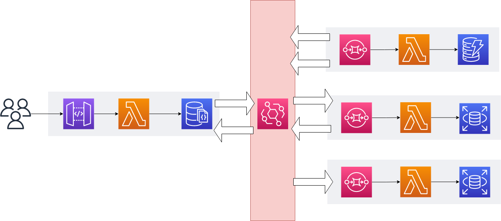

Loosely coupled domain services using an EventBridge

This ensures that if one system goes down or has trouble, that the events can be re-processed later when the service comes back only i.e. eventually consistent and asynchronous; and other domain services are not affected. This is typically done using Dead Letter Queues, where unprocessed records go following errors after a configurable number of retries. They can then be reprocessed safely when the domain service comes back online.

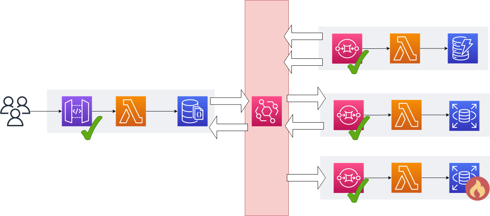

Failed events can be processed once a domain service is back online using dead-letter queues

You can see from the diagram above that all of the domain services remain online other than the one bottom right, but its failed records are safely kept for re-processing, so your customers are not aware of any issues.

# What are the main benefits of event-driven systems?

There are numerous benefits of event-driven systems which are discussed below:

1. **Domain services are individually testable**. You can test a domain service in isolation without co-ordinating with several other teams and with multiple dependencies.
2. **Domain services are individually deployable**. In the same vein as above, you can deploy your domain services in isolation without being dependant on other teams, as long as the event schemas have not changed.
3. **Shared versioned schemas for events**. Historically teams would share contracts through Nuget or NPM packages with actual code, whereas now teams can simply share versioned schemas so work can be developed, tested and deployed in a loosely coupled manner. This reduces the overall dependencies between teams.
4. **They have their own data stores**. Domain services should have their own data stores (*typically databases*) so they don’t have this dependency at a data layer level. If domain services have a shared database they become tightly coupled, risking cross contamination of bugs, deployment issues and security risks.
5. **Totally decoupled**. Domain services should not be aware of each other. A producer can produce events without caring about which consumers are using them. Consumers also don’t care who produced the events.
6. **They can scale independently**. Domain services can scale independently without the concern and co-ordination between other teams and domain services.

# Events and Commands

So we have talked above about having an ‘event-driven’ mindset, what the benefits are of event-driven architectures, and building out your architectures to be decoupled and eventually consistent through ‘events’— **but what is an event**?

> “By using Event Messages you can easily decouple senders and receivers both in terms of identity (you broadcast events without caring who responds to them) and time (events can be queued and forwarded when the receiver is ready to process them). Such architectures offer a great deal for scalability and modifiability due to this loose coupling.” — Martin Fowler

## Event

An **event** is a change of state within a domain (*something that has happened in the past and immutable*). An example is ‘*order created*’ or ‘*invoice generated*’. This typically means one or more consumers can react to that event.

## Command

A **command** is an intent aimed at another domain which results in some output (*something that will happen in the future*). An example is ‘*send email*’ or ‘*generate pdf*’. This is typically a one to one mapping, and the producer expects the consumer to deal with retries and failures.

This is shown in the diagram below:

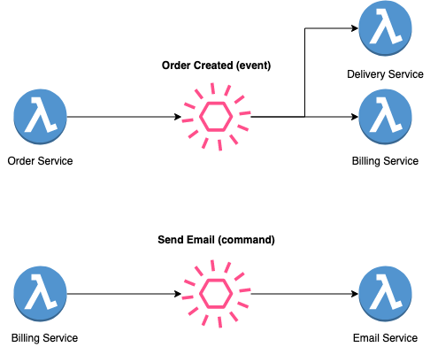

# Event Driven Systems using Amazon EventBridge

> “Amazon EventBridge is a serverless event bus that makes it easier to build event-driven applications at scale using events generated from your applications, integrated Software-as-a-Service (SaaS) applications, and AWS services” — AWS

So now we have covered high level why we want to design our serverless architecture to be event-driven, and have covered what events and commands are.

Now lets cover Amazon EventBridge as a serverless event bus on AWS, and why it is so important in the World of Serverless.

Amazon EventBridge should be your default for Serverless event-driven architectures for the following reasons:

1. **There are no servers to maintain or manage**. It is completely Serverless and allows us to decouple our domain services with the smallest of overheads.
2. **Schema discovery using the registry**. Sharing event schemas has been historically difficult, however the schema registry allows us to easily find and share schema structures between domains and teams in one place. <https://docs.aws.amazon.com/eventbridge/latest/userguide/eb-schema.html>
3. **Schema code generation**. EventBridge allows teams to view the versions of the event schemas that they need, and to automatically download code bindings to pull directly into their code. <https://docs.aws.amazon.com/eventbridge/latest/userguide/eb-schema-code-bindings.html>
4. **Content based filtering**. Content based filtering, even at the body level, allows us to only consume events that we are interested in.  
   <https://docs.aws.amazon.com/eventbridge/latest/userguide/eb-event-patterns-content-based-filtering.html>
5. **Input transformation**. Input transformations allows us to transpose the event structure to meet the requirements of our consumers without the need to write specific glue code.
6. **Archive and Replays**. EventBridge allows you to archive your events, and to replay them at a later date. This is fantastic for when you need to replay events following a bug fix, or to populate a new domain service’s read store. <https://docs.aws.amazon.com/eventbridge/latest/userguide/eb-archive.html>
7. **Encryption at Rest.** EventBridge encrypts event metadata and message data that it stores. By default, EventBridge encrypts data using 256-bit Advanced Encryption Standard (*AES-256*) under an [AWS owned key](https://docs.aws.amazon.com/kms/latest/developerguide/concepts.html#aws-owned-cmk), which helps secure your data from unauthorised access. There is no additional charge for encrypting your data by using the AWS owned key.  
   <https://docs.aws.amazon.com/eventbridge/latest/userguide/eb-data-protection.html>
8. **Encryption in Transit**. EventBridge encrypts data that passes between EventBridge and other services by using Transport layer Security (*TLS*).

# Deploying the solution! ‍

> ***Note****:* Running the following commands will incur charges on your AWS account.

Let’s deploy the code example which you can clone here: <https://github.com/leegilmorecode/serverless-event-bridge>

Once you have cloned the repository you can run `npm i` to install all dependencies, and then `npm run deploy:develop` to deploy the code to AWS.

# Testing the solution

Once you have deployed the solution you can use the postman file in `./postman/serverlerss-event-bridge.postman_collection.json`to invoke the POST API endpoint for uploading a fictitious payslip.

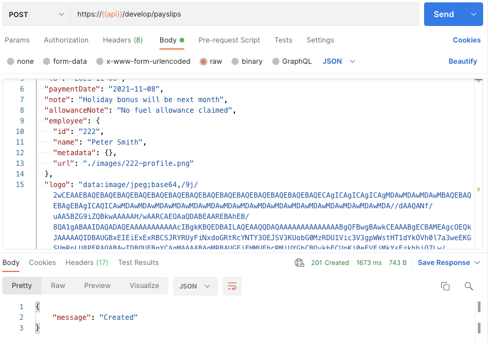

Example call in Postman to invoke our API

> ***Note***: You will need to update the API variable in Postman to be whatever the Serverless Framework returned for your endpoint in the deployment:

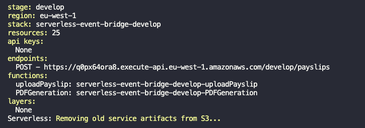

Example API response from the Service Framework for endpoints

Now when you invoke the API you will get a `‘Created’` message back (*201 status code*), and when you navigate to the S3 bucket where the PDFs are stored you should see the following for each payslip PDF:

**OK, OK.. not the greatest looking payslip PDF in the World ha… but enough to demonstrate the architecture I am sure you agree!**

Its also worth noting that the payslip schema itself for this demo is credited to the team at [**Staffology**](https://www.staffology.co.uk/) here: <https://app.staffology.co.uk/api/docs/models/payslip>

# Gotchas & mitigations in the solution!

When building out your new Serverless architectures or migrating away from monoliths, it is worth planning for the following sections below to ensure your solutions are ***resilient to failures***. The solution you have just deployed showcases these below:

## Consider idempotency

Build your services to be [idempotent](https://en.wikipedia.org/wiki/Idempotence), so if you get the same event input more than once you will always get the same result. For example, if you receive two payment events by mistake, you don’t want to bill your customer twice! Yikes..

EventBridge guarantees at-least-once delivery, but consumers can get the same message multiple times.

> Amazon EventBridge provides at-least-once event delivery to targets, including retry with exponential backoff for up to 24 hours. Events are stored durably across multiple Availability Zones (AZs), providing additional assurance your events will be delivered to their destination. Amazon EventBridge also provides a 99.99% availability service level agreement (SLA), ensuring your applications are able to access the service reliably.

There are several ways we can mitigate this (*or a combination of them*):

1. **Idempotency Keys**. You can allow consumers of your APIs to pass idempotency keys in the headers or data body which allows you to check within your domain services if that request has already been processed or not, and act accordingly without causing issues . This allows consumers to retry requests without the concerns of side effects.
2. **Using UUID v5**. You can use UUID version 5 with a namespace and unique properties in the payload (*whether that is event, message or API*), and you will always get the same UUID generated. For exactly once processing this is a great approach in my opinion, and we use this approach in our repo.
3. **Control Databases**. You can use a control database such as DynamoDB to store successful requests (*using idempotency keys or UUIDs generated with V5 for example*), and if you get the same request twice you can simply swallow the request and return the previous success payload response. The same goes for error responses.

In our example code repo we use the employee ID and payslip period alongside a UUID namespace (*to prevent UUID clashes)*, and then use this ‘Payslip ID’ to check through code if we have already created the payslip PDF before or not. This allows us to ensure that you can only upload a payslip once with guaranteed only once generation. I would typically do this using a data store such as DynamoDB, but for this simple demo we just check if the file already exists or not in S3.

## Deduplication of event messages using FIFO queues gotcha

In our example we have the events flowing from EventBridge directly to an SQS FIFO queue, and have `Content-based deduplication` turned on, as well as the `Deduplication scope` being set at `Queue` level; meaning that in a five minute period if we get the same SQS message with the same payload in the queue it will be ignored. That being said, note in this scenario the Message Duplication ID is ‘**optional**’. (*see below*)

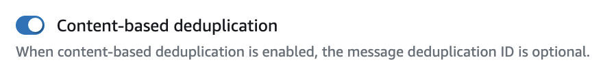

> Enable content-based deduplication for the queue (each of your messages has a unique body). The producer can omit the message deduplication ID — <https://docs.aws.amazon.com/AWSSimpleQueueService/latest/SQSDeveloperGuide/using-messagededuplicationid-property.html>

One gotcha here is assuming that our events from EventBridge rules targeting our FIFO SQS queue would mean that SQS would de-duplicate our events by default in a five minute period based on the same event body.

As it happens Amazon EventBridge rules send the *MessageDeduplicationId* **by default** in this rule integration, so if we add the same entries to the entries array in the `putEvents` command with the exact same bodies, each will get its own *MessageDeduplicationId*, **and they will not be de-duplicated as you would have maybe expected in the FIFO queue**.

This is because EventBridge automatically sets the `EventID` property of the `PutEventsRequestEntry` to a random UUID which ends up in the SQS message body, so when the MessageDeduplicationID is generated as a SHA256 hash of the body it is different each time!

> After you call PutEvents, EventBridge assigns each event a unique ID — <https://docs.aws.amazon.com/eventbridge/latest/userguide/eb-putevents.html>

**How do we work around this**? We can use Input Transformations to omit the `Event ID` from the event like so, which means that all of our events are now de-duplicated in the FIFO queue:

## SQS and failed messages

When you use Amazon SQS and batching your messages which were events coming through from EventBridge, you need to consider that if one or more records in the batch fail (*i.e. through your Lambda code throwing an error*), then the full batch will go back on the queue to be re-processed. This means that:

1. Your code needs to be idempotent to ensure the same batch of records can be processed multiple times without causing issues. (*For example taking the same payment from a customer multiple times*).
2. You ideally need a way of ignoring the records in the batch which have already been processed successfully.

For the second point, you can use the [Middy ‘SQS Partial Batch Failure’](https://www.npmjs.com/package/@middy/sqs-partial-batch-failure) middleware to successfully remove records that have been processed from the batch before it goes onto the DLQ. This means that when the Lambda picks up the batch for reprocessing, only the failed records remain.

## Version events with the Schema Registry

Use the Schema Registry auto discovery mode in development only, as this can be costly if left on in production!

You can also add your own OpenAPI 3.0 schemas to the Schema Registry manually so you can share them between domain services and teams. This is the approach that I take.

## Event-carried state transfer

The maximum message size for EventBridge is 256kb which is typically fine for most applications, but bear this in mind for messages bigger than this, AWS recommend putting the event payload into Amazon S3 and include a link or meta data to it in the event.

> This pattern shows up when you want to update clients of a system in such a way that they don’t need to contact the source system in order to do further work. A customer management system might fire off events whenever a customer changes their details (such as an address) with events that contain details of the data that changed. A recipient can then update it’s own copy of customer data with the changes, so that it never needs to talk to the main customer system in order to do its work in the future.
>
> An obvious down-side of this pattern is that there’s lots of data schlepped around and lots of copies. But that’s less of a problem in an age of abundant storage. What we gain is greater resilience, since the recipient systems can function if the customer system is becomes unavailable. — Martin Fowler

In our example we are doing this when two separate domain services need the payslip logo (*image*) which is uploaded via API Gateway (*shown below*), but the logo body would not fit into the event itself.

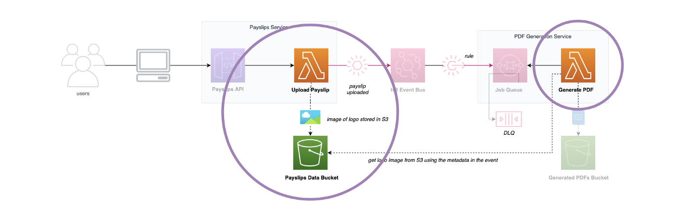

In our scenario we store the image in an S3 bucket, and add the bucket and key as data within the `payslip.uploaded` event itself (*as the image itself could not fit within the 256kb event*), so when the event is consumed by the PDF Generation lambda it can reach out and get the logo required for the PDF from the S3 bucket.

## Issues routing events

Sometimes Amazon EventBridge may not be able to route events to targets due to issues with IAM for example if a bug is introduced, so you are able to use standard SQS queues as Dead Letter Queues to store your failed events until you have resolved your issues:

[## Event retry policy and using dead-letter queues

### Sometimes an event isn't successfully delivered to the target specified in a rule . This can happen when, for example…

docs.aws.amazon.com](https://docs.aws.amazon.com/eventbridge/latest/userguide/eb-rule-dlq.html)

If we had implemented this on our solution then it would have been here, adding a DLQ in case EventBridge can’t route the events to our PDF Generation SQS FIFO queue:

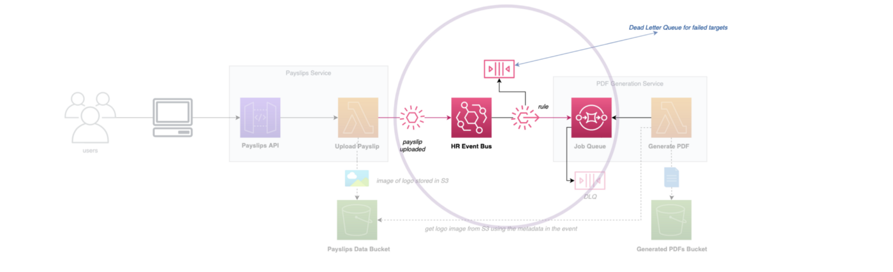

The following video goes into this further:

## Potentially use Amazon SNS for low latency/high frequency messages

For architectures which need low latency and high frequency of messages then it may be worth looking at Amazon SNS over Amazon EventBridge, but this is in exceptional circumstances. Amazon EventBridge typically has latency of about half a second.

> Amazon SNS is recommended when you want to build an application that reacts to high throughput or low latency messages published by other applications or microservices (as Amazon SNS provides nearly unlimited throughput), or for applications that need very high fan-out (thousands or millions of endpoints). Messages are unstructured and can be in any format. Amazon SNS supports forwarding messages to six different types of targets, including AWS Lambda, Amazon SQS, HTTP/S endpoints, SMS, mobile push, and email. Amazon SNS typical latency is under 30 msec. — <https://aws.amazon.com/eventbridge/faqs/>

## Understand async vs sync Lambda invocations with EventBridge

Depending on the event source mapping and services involved, Lambda may be invoked synchronously ***or*** asynchronously, which therefore determines in an event-driven system how failed processing is managed.

For example, with our SQS FIFO queue integration with Lambda, the Lambda is invoked `synchronously`, therefore we don’t use Lambda Destinations, and instead use the Dead Letter Queue associated with the FIFO queue itself.

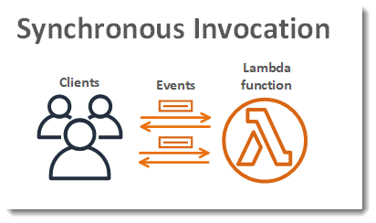

<https://docs.aws.amazon.com/lambda/latest/dg/invocation-sync.html>

For a Lambda target from EventBridge, this is invoked `asynchronously`, so you need to explicitly define how errors are handled. By default there will be two retry attempts and then the event is gone i.e. it by default does not go to a DLQ!

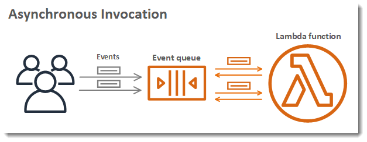

<https://docs.aws.amazon.com/lambda/latest/dg/invocation-async.html>

You should use Lambda Destinations in this scenario so the failed execution is sent to another service such as an SQS DLQ:

[## Serverless Lambda Destinations

### Getting the most out of lambda destinations glue code..

levelup.gitconnected.com](https://levelup.gitconnected.com/serverless-lambda-destinations-146f8b3c3456)

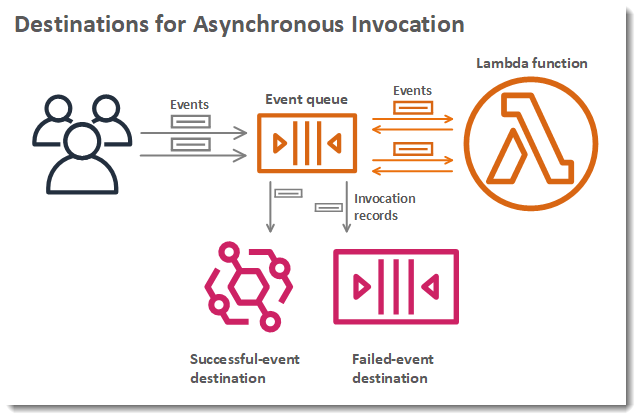

<https://docs.aws.amazon.com/lambda/latest/dg/invocation-async.html>

You can alternatively set the Asynchronous invocation configuration for the Lambda where you can setup an SNS Topic or Queue for further processing on error.

Also make sure you don’t setup both at the same time as the messages will be doubled in the queue!

# Wrapping up

I hope you found that useful as to why you should have an event-driven mindset and use Amazon EventBridge as your default to any Serverless architectures!

Please [**go and subscribe on my YouTube channel**](https://www.youtube.com/channel/UC_Bi6eLsBXpLnNRNnxKQUsA) for similar content!

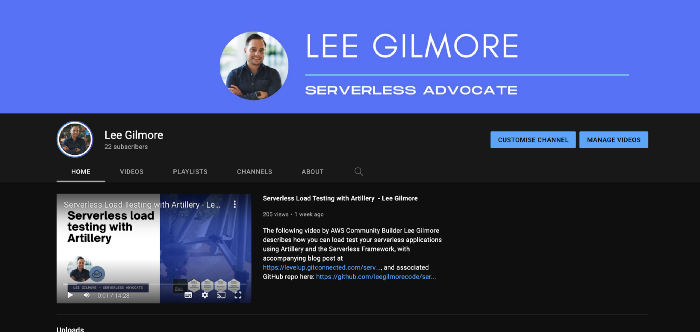

I would love to connect with you also on any of the following:

<https://www.linkedin.com/in/lee-james-gilmore/>  
<https://twitter.com/LeeJamesGilmore>

If you found the articles inspiring or useful please feel free to support me with a virtual coffee <https://www.buymeacoffee.com/leegilmore> and either way lets connect and chat! ☕️

If you enjoyed the posts please follow my profile [Lee James Gilmore](https://medium.com/u/2906c6def240?source=post_page-----39c4f4ae5aff----------------------) for further posts/series, and don’t forget to connect and say Hi

Please also use the ‘clap’ feature at the bottom of the post if you enjoyed it! (*You can clap more than once!!*)

**This article is sponsored by** [**Sedai.io**](https://www.sedai.io/)

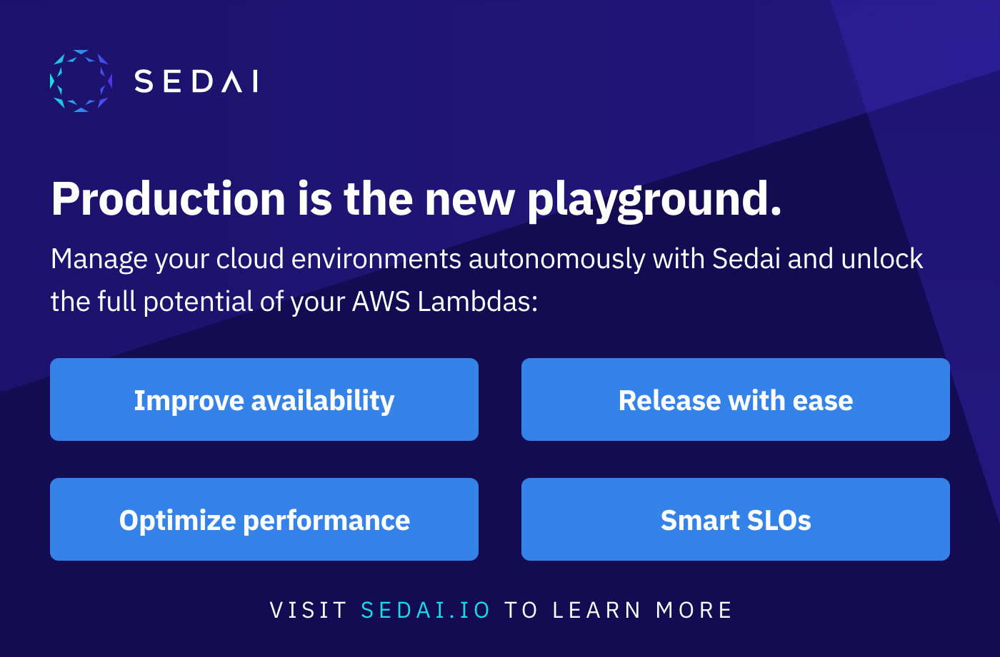

# About me

“*Hi, I’m Lee, an AWS Community Builder, Blogger, AWS certified cloud architect and Principal Software Engineer based in the UK; currently working as a Technical Cloud Architect and Principal Serverless Developer, having worked primarily in full-stack JavaScript on AWS for the past 5 years.*

*I consider myself a serverless evangelist with a love of all things AWS, innovation, software architecture and technology.*”

**\* The information provided are my own personal views and I accept no responsibility on the use of the information. \*\*\***

[## Serverless Threat Modelling

### How and why you should threat model your Serverless solutions on AWS, with visual examples of a real life walk through

leejamesgilmore.medium.com](https://leejamesgilmore.medium.com/serverless-threat-modelling-df8e4028ef6d)

[## Serverless Content

### An index of all of my Serverless content to easily browse in one place, including videos, blog posts and more..

leejamesgilmore.medium.com](https://leejamesgilmore.medium.com/serverless-content-46ef5b562d8e)

[## Serverless Synthetic Canaries

### Practical example of using CloudWatch Synthetic Canaries to monitor your serverless applications, with visuals and…

leejamesgilmore.medium.com](https://leejamesgilmore.medium.com/serverless-synthetic-canaries-7946dc5216ba)

[## Serverless S3 Object Lambda

### A practical example of using AWS S3 Object Lambda to watermark an image with meta data on the fly using Amazon…

levelup.gitconnected.com](https://levelup.gitconnected.com/serverless-s3-object-lambda-88c923a8a771)

[## Documenting your Serverless Solutions

### An example of generating and hosting your Serverless documentation, such as OpenAPI/Swagger, ADRs and code…

levelup.gitconnected.com](https://levelup.gitconnected.com/documenting-your-serverless-solutions-509f1928564b)

[## Serverless API to API authentication

### A practical guide to using Amazon Cognito to authenticate API to API integrations using an OAuth2 Client Credentials…

levelup.gitconnected.com](https://levelup.gitconnected.com/serverless-api-to-api-authentication-d4cb4472721e)
