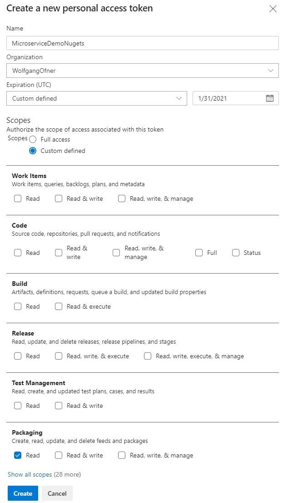

Restore NuGet Packages from a Private Feed when building Docker Containers | Programming With Wolfgang

<https://www.programmingwithwolfgang.com/restore-nuget-inside-docker/>

This post will show you how to create an access token for your private Azure DevOps NuGet feed and how to pass it to your Dockerfile to build Docker images.
