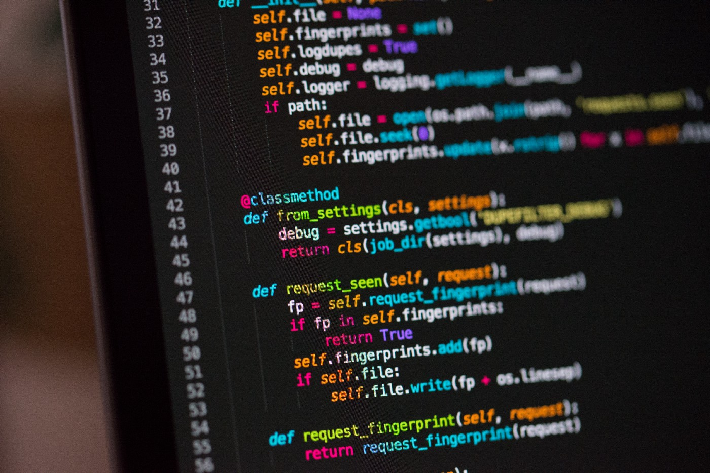

# How to Write Programs Without Bugs

## How Test-Driven Development can help you avoid bugs

Photo by [Chris Ried](https://unsplash.com/@cdr6934?utm_source=medium&utm_medium=referral) on [Unsplash](https://unsplash.com/?utm_source=medium&utm_medium=referral)

When developing a large program, it is inevitable that some bugs will come up. You probably already know that the best way to decrease the number of bugs is to write tests for your project. In this article, I will show you how to take this to the next level using a principle called *Test-Driven Development.*

As the name says, Test-Driven Development is the process of developing a program only after having some tests written down. Before understanding why this is better than writing tests at the end of the developing process, let’s see how it works.

# How TDD Works

When following the TDD principles, the main idea is to develop each new feature separately, one at a time. You can divide your work for creating a single feature into 5 different phases:

1. **Write the tests:** The first thing to do is to write the tests that will check the functionality that you are going to create.
2. **Run all tests**: The new tests should fail since the feature has not been implemented yet. This step is used to check that the new code is needed. Also, you make sure that the rest of the code (if you have some other tests created previously) works as expected.
3. **Implement the feature**: In this phase, it is not required to write elegant code. You should only be concerned with implementing the functionality by writing as few lines of code as possible.
4. **Test the code**: Now all the tests should pass. You can also check that previous tests still work (so the new code has not introduced bugs).
5. **Refactor**: Finally, you can rewrite your code to be more efficient and elegant. Remember to check that your tests still pass after each modification.

Once a feature has been completely developed, you can start from step 1 again for the next. You should still run the tests that you have written previously every time you implement a new part of your program. In this way, you make sure that you are not breaking the old code.

Now we have seen how TDD works, why should you adopt it? Here are the main advantages (and disadvantages) of using Test Driven Development.

# Pro

## 1. Write only the code you need

Photo by [Scott Blake](https://unsplash.com/@sunburned_surveyor?utm_source=medium&utm_medium=referral) on [Unsplash](https://unsplash.com/?utm_source=medium&utm_medium=referral)

When developing a program, it is easy to be caught by the enthusiasm and to start over complicating your code. However, this is something that will most likely introduce many bugs in your program. Furthermore, you will probably not need this code at all. This idea can be summarized in the principle “You Ain’t Gonna Need It”.

Now, consider what happens if you write the tests before starting the development phase: as soon as the tests pass, you know that your code is complete. So, you are less likely to add useless functionalities to your program (and therefore you will have fewer bugs).

## 2. Test every feature in-depth

Photo by [Robert Bye](https://unsplash.com/@robertbye?utm_source=medium&utm_medium=referral) on [Unsplash](https://unsplash.com/?utm_source=medium&utm_medium=referral)

One of the problems of writing tests after developing the code is that you will be influenced by how the code was written. This implies that your tests will try to check that the code works as expected, instead of looking for unexpected bugs. So more errors will remain undetected.

On the other hand, when creating tests before writing the code, you will not have any preconceptions about how the feature will be implemented. This means that the code will be checked more thoroughly.

## 3. Refactor more Easily

Photo by [Sven Mieke](https://unsplash.com/@sxoxm?utm_source=medium&utm_medium=referral) on [Unsplash](https://unsplash.com/?utm_source=medium&utm_medium=referral)

When using TDD, you know that the code is completely covered by test cases. This means that if a refactor introduces a bug, it will be detected by your tests.

In normal program development, on the other hand, your refactored code may have some bugs that you did not think were possible in the original code (and therefore you did not write any test for it).

So, by using TDD you will not have to rethink your tests after every refactor: you can just run the ones that you wrote originally.

# Cons

## 1. Time-consuming

Photo by [Agê Barros](https://unsplash.com/@agebarros?utm_source=medium&utm_medium=referral) on [Unsplash](https://unsplash.com/?utm_source=medium&utm_medium=referral)

Using Test-Driven Development may not be the best choice if you do not have a lot of time. In fact, writing tests without having the code in front of you is more difficult than you might expect.

However, the time you spend writing these tests will be compensated by the time that you will not need to waste looking for well-hidden bugs.

## 2. Learning Curve

Photo by [Element5 Digital](https://unsplash.com/@element5digital?utm_source=medium&utm_medium=referral) on [Unsplash](https://unsplash.com/?utm_source=medium&utm_medium=referral)

It may be difficult to get used to writing tests before developing the code. It will take some time to learn how to write tests efficiently, but after a while, I can assure you that it will be worth it.

Also, in Test Driven Development it is important that your tests cover all aspects of the code. Otherwise, it is just a waste of time. So you will have to learn to write the right amount of tests.

# Conclusion

As you can see, the benefits of using TDD outweigh the disadvantages, and this is why you should start adopting it right now.

If you want to learn more about Test Driven Development, check out these resources:

- [TDD on Wikipedia](https://en.wikipedia.org/wiki/Test-driven_development)
- Test-Driven Development: By Example — Kent Beck
- [Benefits of TDD](https://fortegrp.com/test-driven-development-benefits/)

*More content at* [***PlainEnglish.io***](https://plainenglish.io/)*. Sign up for our* [***free weekly newsletter***](http://newsletter.plainenglish.io/)*. Follow us on* [***Twitter***](https://twitter.com/inPlainEngHQ) *and* [***LinkedIn***](https://www.linkedin.com/company/inplainenglish/)*. Join our* [***community Discord***](https://discord.gg/GtDtUAvyhW)*.*
