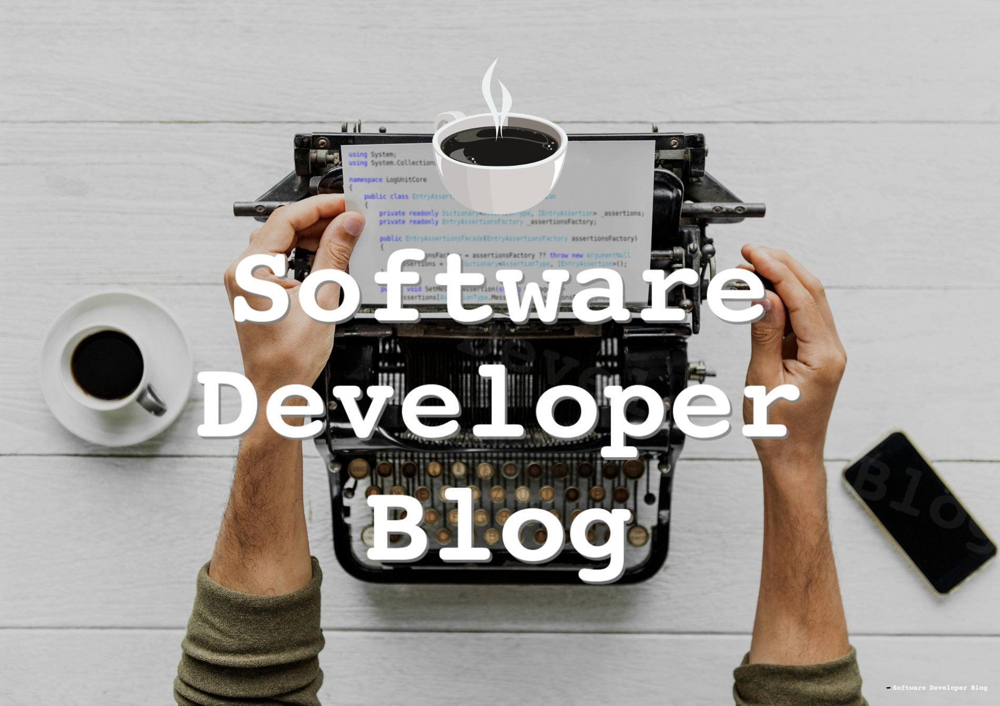

Private Nuget feed in Docker .Net Core application

<https://www.softwaredeveloper.blog/private-nuget-feed-in-docker>

Using public Nuget from Nuget.org is always easy, you just need internet connection. But when you need private Nuget feed it sometimes doesn’t want to work, especially in isolated Docker container.
