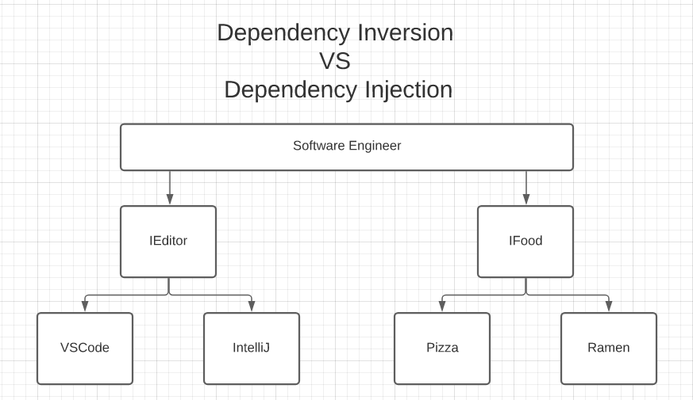

# Dependency Inversion vs. Dependency Injection

## Straightforward and simple

Photo by [Pete Nowicki](https://unsplash.com/@shadypete?utm_source=medium&utm_medium=referral) on [Unsplash](https://unsplash.com/?utm_source=medium&utm_medium=referral)

I’ve been a software engineer for a few years now, yet every now and then I like to return to the fundamentals. We all “know” that we should follow the [SOLID principles by good ol’ Uncle Bob](https://en.wikipedia.org/wiki/SOLID), but common knowledge is not always common practice.

Recently, it dawned on me that I don’t really know the difference between dependency inversion and dependency injection. I know what they mean, roughly, but I wasn’t sure what’s the difference between the two, and moreover, why is it called dependency inversion, what exactly is inverted?  
It turns out, like all good things, there’s a story behind it.  
But first things first, let’s discuss the difference between the two concepts.

# Dependency Inversion

Dependency inversion is a design principle. In simple terms, it means we should not depend on low-level implementations, but rather rely on high-level abstractions. And that makes sense, as it allows us to be agnostic towards the implementation details. Whether we want to change a specific implementation or support other implementations, the code will stay intact, as it’s decoupled from the low-level implementation details.

To illustrate this concept, let’s assume you’re a software engineer. You have two dependencies, your code editor and your food. You don’t want to be stuck with VSCode for everything, nor do you want to eat pizza all day. Also, what happens if they change the pizza’s implementation details and it’s now terrible?

The solution to this frightening problem is to depend on high-level abstractions. You need *some* editor, and you need *some* food, but you rather keep your options open. If the pizza starts to suck, you can always use another food implementation and go for ramen, or even a burger.

# Dependency Injection

Dependency injection is a design pattern that allows us to separate creation from use. It allows us to “inject” the required objects at run-time, without worrying about constructing them ourselves. It also tends to work hand in hand with the dependency inversion principle.

For example, we can depend on high-level abstract classes and inject a specific implementation at run-time, based on the required use case. This allows us to write more configurable and dynamic code. It even improves our ability to test our code, since it allows us to easily mock injected classes, so we can focus on testing our core logic.

To illustrate this concept, let’s assume that yet again you’re a software engineer, with the same dependencies — a code editor and food.  
You sure as hell don’t want to prepare the pizza yourself, nor build the code editor yourself. You’re a busy software engineer, you don’t have time for that.

Luckily for you, you’ve got dependency injection by your side!  
You don’t need to prepare the pizza or build the code editor — you can assume it is already created for you and injected exactly where you need it.  
Also, you’re not stuck with pizza and VSCode for eternity. You can be food agnostic and let the configuration decide whether you’re going to eat (or be injected with, YIKES) pizza or ramen today.

So essentially dependency injection enables us to use dependency inversion and rely on high-level abstractions.

However, I still didn’t cover why it’s called “inversion”, what exactly is inverted here? Well, I did promise you a story! (don’t worry it’s short)

# Why do we call it Dependency “Inversion”?

Well, it appears that in traditional software development, the best practice was to build software in a layered architecture, which enabled the construction of increasingly complex systems.

In this architecture, higher-level components depended directly upon lower-level components in order to achieve a complex task.

# Preparing Pizza — The old way VS the “Inverted” way

To illustrate the “inversion”, take a look at the `preparePizza` function below:

The high-level function is relying on two specific implementations to complete its task.

Now let’s take a look at an example using dependency injection and dependency inversion:

In this example, we rely on high-level abstractions, in order to complete our task. So we can make Pizza with a recipe we found online and prepare the pizza ourselves, giving grandma some much-needed rest.

# What we’ve learned today

We covered the difference between dependency injection and dependency inversion, and how they work together to produce great software. We also discussed why we use the term “Inversion”, and learned some software history along the way.

I hope you found this article useful, and until next time, keep it straightforward and simple!
