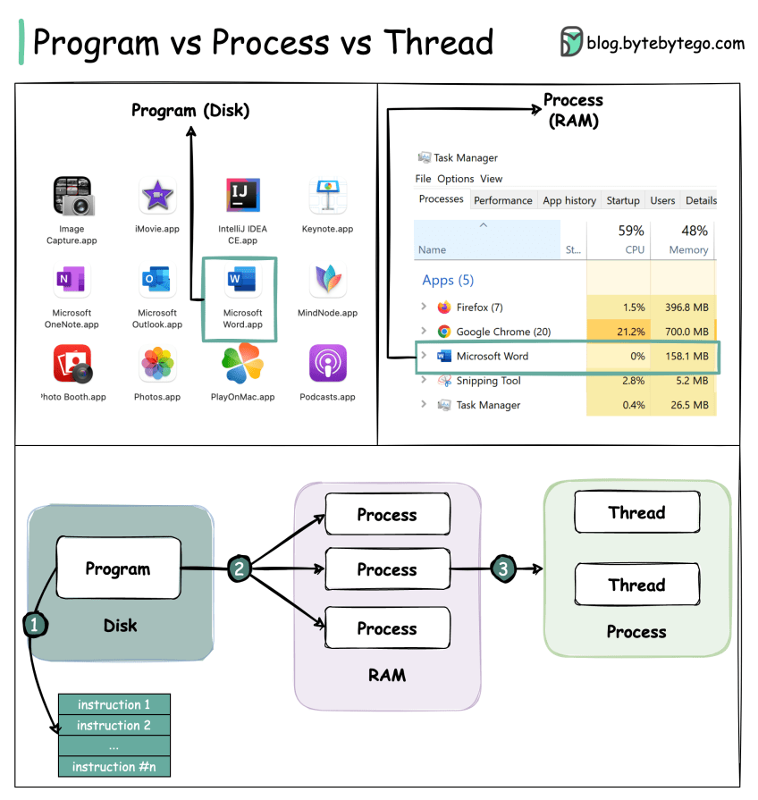
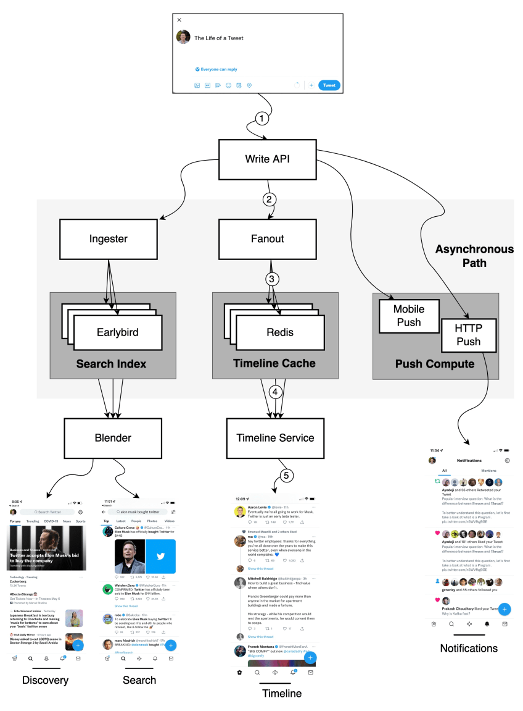
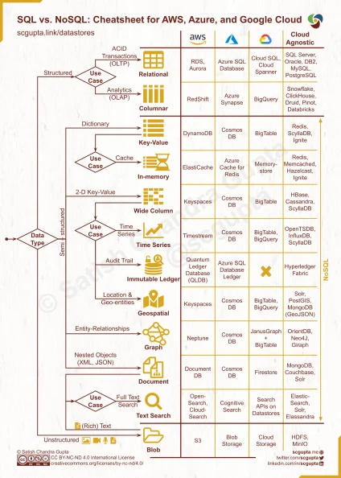
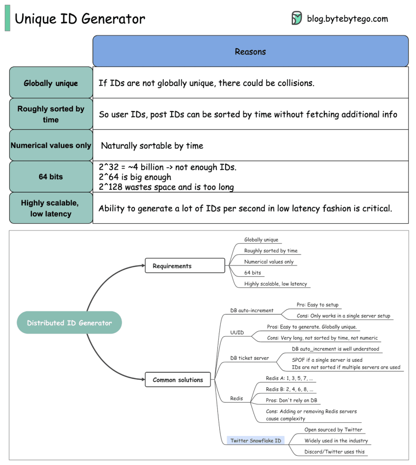

# Interview question: Design Twitter (Episode 5)

In this newsletter, we will talk about the following:

- Process vs Thread
- Interview Question: Design Twitter
- A visual guide on how to choose the right Database.
- Unique ID Generator

## Popular interview question: What is the difference between **Process** and **Thread**?

To better understand this question, let’s first take a look at what is a Program. A **Program** is an executable file containing a set of instructions and passively stored on disk. One program can have multiple processes. For example, the Chrome browser creates a different process for every single tab.

A **Process** means a program is in execution. When a program is loaded into the memory and becomes active, the program becomes a process. The process requires some essential resources such as registers, program counter, and stack.

A **Thread** is the smallest unit of execution within a process.

The following process explains the relationship between program, process, and thread.

1. The program contains a set of instructions.

2. The program is loaded into memory. It becomes one or more running processes.

3. When a process starts, it is assigned memory and resources. A process can have one or more threads. For example, in the Microsoft Word app, a thread might be responsible for spelling checking and the other thread for inserting text into the doc.

Main differences between process and thread:

Processes are usually independent, while threads exist as subsets of a process.

Each process has its own memory space. Threads that belong to the same process share the same memory.

A process is a heavyweight operation. It takes more time to create and terminate.

Context switching is more expensive between processes.

Inter-thread communication is faster for threads.

Over to you:

1). Some programming languages support coroutine. What is the difference between coroutine and thread?

2). How to list running processes in Linux?

## Interview Question: Design Twitter

This post is a summary of a tech talk given by Twitter in 2013. Let’s take a look.

**The life of a Tweet**

1️⃣ A tweet comes in through the Write API.

2️⃣ The Write API routes the request to the Fanout service.

3️⃣ The Fanout service does a lot of processing and stores them in the Redis cache.

4️⃣ The Timeline service is used to find the Redis server that has the home timeline on it.

5️⃣ A user pulls their home timeline through the Timeline service.

**Search & Discovery**

Ingester: annotates and tokenizes Tweets so the data can be indexed.

Earlybird: stores search index.

Blender: creates the search and discovery timelines.

**Push Compute**

HTTP push

Mobile push

Disclaimer: This article is based on the tech talk given by Twitter in 2013 (https://bit.ly/3vNfjRp). Even though many years have passed, it’s still quite relevant. I redraw the diagram as the original diagram is difficult to read.

Over to you: Do you use Twitter? What are some of the biggest differences between LinkedIn and Twitter that might shape their system architectures?

## A visual guide on how to choose the right Database.

Picking a database is a long-term commitment so the decision shouldn’t be made lightly. The important thing to keep in mind is to choose the right database for the right job.

Data can be structured (SQL table schema), semi-structured (JSON, XML, etc.), and unstructured (Blob).

Common database categories include:

Relational

Columnar

Key-value

In-memory

Wide column

Time Series

Immutable ledger

Geospatial

Graph

Document

Text search

Blob

Thanks, [Satish Chandra Gupta](https://www.linkedin.com/feed/#)

Over to you - Which database have you used for which workload?

## Unique ID Generator

IDs are very important for the backend. Do you know how to generate globally unique IDs?

In this post, we will explore common requirements for IDs that are used in social media such as Facebook, Twitter, and LinkedIn.

Requirements:

Globally unique

Roughly sorted by time

Numerical values only

64 bits

Highly scalable, low latency

The implementation details of the algorithms can be found online so we will not go into detail here.

Over to you: What kind of ID generators have you used?

