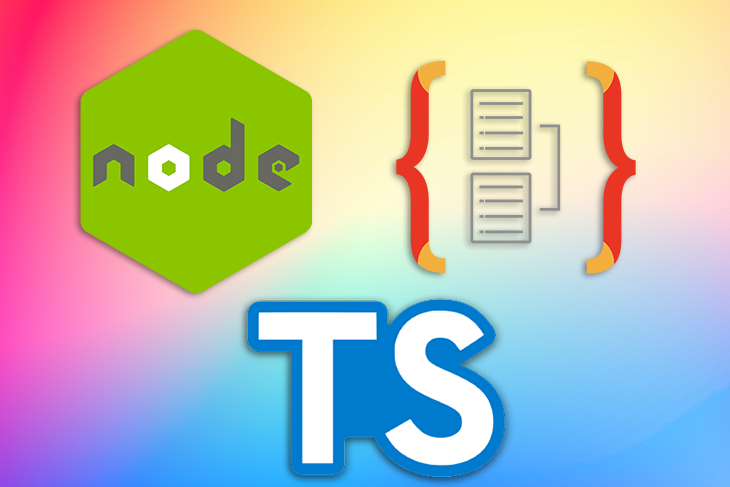

# TypeORM: Object-relational mapping with Node.js

May 17, 2022 
4 min read



If you’re a backend developer, you may be fazed by data-driven API development. In this article, you’ll learn about [TypeORM, one of the most popular JavaScript object-relational mappers](https://blog.logrocket.com/best-typescript-orms/#best-typescript-orms-typeorm), by creating a Node.js application with TypeORM and TypeScript. TypeORM aims to optimize and simplify writing long and complex SQL queries, making the task less stressful. Let’s get started!

## What is a JavaScript ORM?

ORM, which stands for object-relational mapping, is a programming technique that provides a means of interacting with a database using an object-oriented programming language. Essentially, an ORM converts data between relational databases and object-oriented programming languages.

An ORM generates objects that virtually map to tables in the database. As a result, you can easily retrieve, manipulate, or delete any field in the table, making it possible to write long and complex SQL queries in a more simple, optimized way.

An object-relational mapper is a code library that encapsulates the code needed to manipulate the data, so you don’t need to use SQL anymore. You can write an object-relational mapper in the language of your choice and directly interact with an object in the same language you’re using.

By hiding and encapsulating the change in the data source, whenever a data source or its API changes, only the ORM needs to change, not the applications that use the ORM.

## Benefits of using an ORM

An ORM is a useful solution for facilitating data-driven API development. For one, an ORM automatically generates all the data access code based on the data model that has been defined, thereby reducing the overall development time and resulting in higher productivity for all the developers involved.

A good ORM would most likely be designed by top-level software architects. Therefore, using an ORM results in a clean software architecture with effective and consistent design patterns.

An ORM enables code reusability by ensuring separation of concerns within the codebase. With effective design patterns, there isn’t much ambiguity in the codebase, so an ORM can reduce the overall time it takes for testing.

With an ORM, developers have the privilege of focusing primarily on the logical design of the system while the ORM takes care of the rest. An ORM library is written in your preferred language, and it encapsulates the code needed to manipulate the data. Therefore, you can interact directly with an object in the same language you’re using without needing to use SQL anymore.

Finally, an ORM will help to protect your applications against SQL injection attacks since the library filters data for you. Now that we know the basics behind ORMs, let’s take a closer look at TypeORM.

## What is TypeORM?

TypeORM is an open source tool with over [28k GitHub stars](https://github.com/typeorm/typeorm) and more than [one million weekly downloads on npm](https://www.npmjs.com/package/typeorm) at the time of writing. Launched on Feb 21, 2016, TypeORM has grown to become one of the most popular JavaScript ORMs and one of the most popular ORM libraries built for TypeScript projects.

TypeORM supports the latest features of JavaScript, ES5, ES6, ES7, and ES8 and can run on many platforms, including Node.js, Cordova, PhoneGap, Ionic, React Native, NativeScript, Expo, and Electron. TypeORM provides additional features that make it possible for developers to build many different kinds of applications that use databases, ranging from small applications with a few tables to large-scale applications with multiple databases.

## Why is TypeORM the best ORM for JavaScript?

With TypeORM, developers are provided with type support, the latest JavaScript features, and additional features needed to develop any kind of application that uses databases and runs in multiple platforms.

Unlike all other JavaScript ORMs, TypeORM also supports the main ORM architecture patterns, Data Mapper and Active Record, meaning developers can write high quality, scalable, loosely coupled, maintainable applications in the most productive way.

TypeORM provides developers with the flexibility to choose whichever pattern they prefer. As the most popular TypeScript ORM, development with TypeORM is less challenging because it’s easy to find tutorials on the topic and a helpful community for troubleshooting and resources.

TypeORM uses TypeScript decorators extremely effectively, resulting in entity classes that are expressive and very easy to read. With the presence of the TypeScript syntax, TypeORM also integrates nicely with Angular projects.

TypeORM’s documentation is readily available and written in a clear and easy-to-understand manner, [including essential topics like migrations, relations, and ORM architecture patterns](https://typeorm.io/).

## ORM in JavaScript using TypeORM

To get started with TypeORM in a JavaScript project, we’ll need to install a few TypeScript packages and database adapters.

### Installing TypeORM packages

To install the required packages, run the following command in your terminal:

```
npm install --save typeorm reflect-metadata pg
```

Next, we can install the additional packages, which are development dependencies for TypeScript, by running the following code:

```
npm install --save-dev typescript @types/node ts-node
```

Finally, configure the following settings in the `tsconfig.json` file, as shown below:

```
"emitDecoratorMetadata":true,"experimentalDecorators":true,
```

## Initiating a project

To scaffold a new TypeORM project, run the following command in your terminal:

```
typeorm init --name <project-name>--database <database-name>
```

I’m using `MyTypeormProject` as my project name and `database pg`, PostgreSQL, as the database, but you can use whatever database you want:

```
typeorm init --name MyTypeormProject--database pg
```

The command above will generate a new project in the `MyTypeormProject` directory, which uses a PostgreSQL database with the following files:

```
MyTypeormProject├── src                  // The houses your TypeScript code│├── entity           // Here, your entities (database models) are stored││└──User.ts      // This is a sample entity│├── migration        // Here, your migrations are stored│├── data-source.ts   // This is the data source and to configure connections│└── index.ts         // This is starting point of your appl├──.gitignore           // The gitignore file of your project├── package.json         // This file holds all node module dependencies├── README.md            // A readme file for └── tsconfig.json        // This holds the TypeScript compiler options
```

Next, install new project dependencies:

```
cd MyTypeormProject
npm install
```

## Configuring the TypeORM project

`data-source.ts` is the most important file in the TypeORM project, where you can specify the database configuration of your application, as shown below:

```
import"reflect-metadata"import{DataSource}from"typeorm"import{User}from"./entity/User"exportconstAppDataSource=newDataSource({
    type:"pg",
    host:"localhost",
    port:3306,
    username:"test",
    password:"test",
    database:"testdb",
    synchronize:true,
    logging:false,
    entities:[User],
    migrations:[],
    subscribers:[],})
```

You can also choose to modify the default configurations provided. Within the `data-source.ts` file, `entities` refers to the location of your `entity` classes, `migrations` refers to the location of your `migration` classes, `subscribers` refers to the location of your `subscriber` classes, and CLI refers to the option used by TypeORM CLI to auto-generate the code.

The database can be re-configured using the configuration below:

```
{"type":"pg","host":"localhost","port":3306,"username":"db_uname","password":"db_pw","database":"db_test"}
```

## Running the application

Before running the application, start your database server and make sure that it’s running properly. Then, you can run the app using the command below:

```
npm start
```

With the application started, the app inserts a new user into the database, reverse loads it from the database, then shows the loaded user in the console.

If the user table already exists in the database by default, you need to change the name. You can create multiple connections by changing the configuration file to suit your project needs.

At this point, you’ve successfully created, configured, and run a new TypeORM application from scratch.

## Conclusion

ORMs are a powerful tool. In this article, we’ve explored creating ORMs in JavaScript. We also learned about TypeORM and why it is an important JavaScript ORM. Finally, we successfully built a Node.js and TypeScript application using TypeORM.

It will be exciting to see how TypeORM develops over time. In this article, we didn’t cover advanced topics like migration, indices, transactions, listeners, or subscribers. However, you can review them in the [official documentation](https://typeorm.io/).

I’d love to hear your thoughts about TypeORM, where it fits into the Node.js ecosystem, and real-world use cases. Be sure to leave a comment below. Thanks for reading!

## 200’s only d89746888da2d9510b64a9f031eaecd5.gif Monitor failed and slow network requests in production

Deploying a Node-based web app or website is the easy part. Making sure your Node instance continues to serve resources to your app is where things get tougher. If you’re interested in ensuring requests to the backend or third party services are successful, [try LogRocket](https://logrocket.com/signup/). [](https://logrocket.com/signup/)<https://logrocket.com/signup/>

[LogRocket](https://logrocket.com/signup/) is like a DVR for web and mobile apps, recording literally everything that happens while a user interacts with your app. Instead of guessing why problems happen, you can aggregate and report on problematic network requests to quickly understand the root cause.

LogRocket instruments your app to record baseline performance timings such as page load time, time to first byte, slow network requests, and also logs Redux, NgRx, and Vuex actions/state. [Start monitoring for free](https://logrocket.com/signup/).
